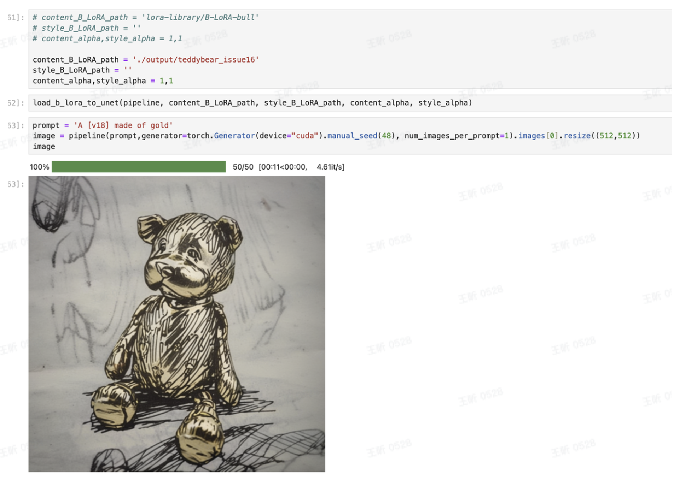
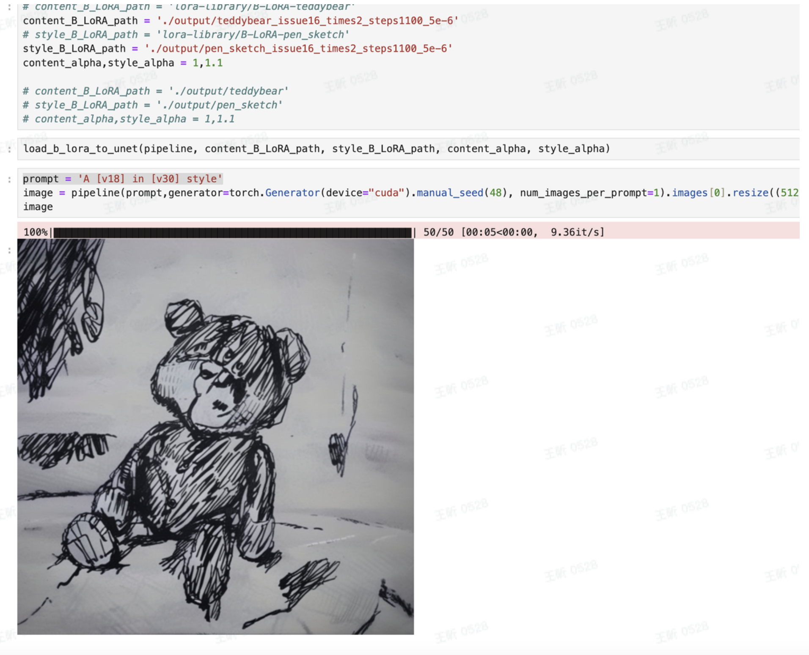
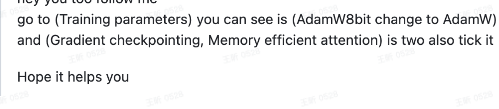

### 1. 用官方提供的推理

### 2. 训练出现nan

需要调节学习率**heckpoint=1100, lr=5e-6**

#### 其他问题：

训练过程中每次都会有**bug report**

**Welcome to bitsandbytes. For bug reports, please submit your error trace to:** **https://github.com/TimDettmers/bitsandbytes/issues**

**For effortless bug reporting copy-paste your error into this form:**

https://docs.google.com/forms/d/e/1FAIpQLScPB8emS3Thkp66nvqwmjTEgxp8Y9ufuWTzFyr9kJ5AoI47dQ/viewform?usp=sf_link

找到一个**issue** **https://github.com/bitsandbytes-foundation/bitsandbytes/issues/168**

