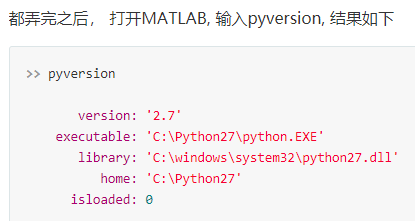
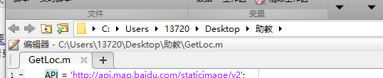
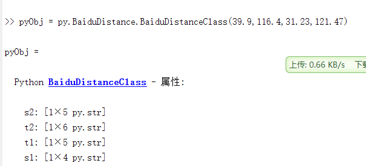
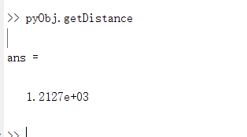

# matlab调用百度API获取两地运输距离

1、 首先你要去百度地图API注册一个ak,相当于钥匙，你在程序里会有个地方写这个ak，相当于钥匙，有这个ak百度地图才会跟你返回消息。

2、 获取距离的函数用python写的，[python版本获取距离](https://blog.csdn.net/weixin_40450867/article/details/81098724)。我把它封装成了一个python类方便你从matlab里面传入参数。类输入就是两地的经度纬度。（注意先纬度再经度），注意19行ak要改为你自己申请的ak.

```
import json
from urllib.request import urlopen
import urllib


class BaiduDistanceClass():
    def __init__ (self,s1,s2,t1,t2):
        self.s1 = str(s1)
        self.s2 = str(s2)
        self.t1 = str(t1)
        self.t2 = str(t2)
        
    def getDistance(self):
        a1=r"http://api.map.baidu.com/routematrix/v2/driving?output=json"
        a2=r"&origins="+self.s1+","+self.s2
        a3=r"&destinations="+self.t1+","+self.t2
        a4=r"&coord_type=wgs84"
        a5=r"&tactics=11"
        a6=r"&ak=your_key"
        url=a1+a2+a3+a4+a5+a6
        
        b = urlopen(url)
        c=b.read()
        result = json.loads(c)
        return result["result"][0]["distance"]["value"]/1000
```

3、总体思路用python获取结果然后在matlab获取python的返回结果。所以要电脑要同时有matlab和python的环境。弄完后在matlab命令行输入pyversion可以看到python的信息，就可以用了。[相关配置参考链接](https://www.ctolib.com/topics-125876.html)。



4、把获取距离的python文件和matlab当前运行文件放在同一个目录下。比如下图中我的获取距离的python文件也放在这个"助教"目录下。



接下来你就可以在matlab里面调用python函数了。创建一个python类：



调用函数得到距离。这里s1,s2是源地点的纬度，经度；t1,t2是目标地点的纬度，经度。我这里测试用的上海和北京并在高德地图上面验证符合。



注意这里得到的是公里，因为程序除了1000，API直接返回的是米，如果要以米为单位可以不除。
