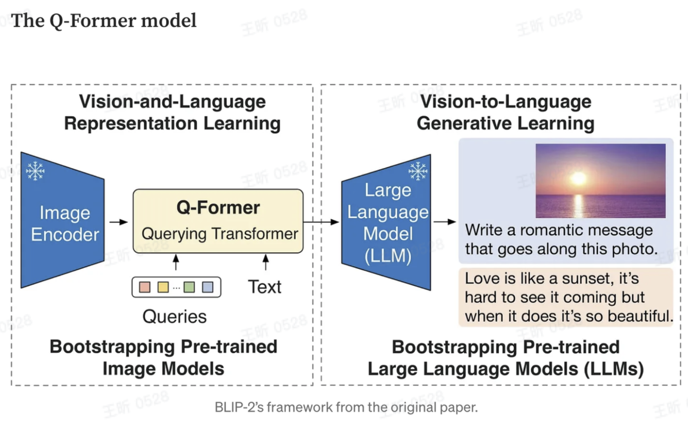

### 背景：

**Vision-language pre-training,**将视觉和语言的只是结合起来。但是模型通常高**cost**，因为需要端到端训练**vison**和**language**模型**(**通常用**transformers)**。因此需要一种更不复杂的**vision-language**模型，不需要端到端的训练，于是**BLIP-2**就产生了。

### **BLIP-2: Bootstrapping Language-Image Pre-training with Frozen Image Encoders and Large Language Models**

作者采用了一个轻量级的**querying transfomer**结构作为**frozen image**和**text encoders**的**bottleneck.**首先用**image encoder**提取图像特征，然后送给语言模型去理解。但是语言模型没有在**image**上面训练过，因此它无法直接理解这些视觉表示。为了解决这个问题，**Q-Former**采用一些可学习的**querying vectors**，在两个阶段进行预训练；

（1）vision-language representation learning with a frozen image encoder

(2) vision-to-language generative learning stage with a frozen text encoder

Q-Former包括两个子模块：

a.一个image transformer和frozen image encoder交互。

b.一个
