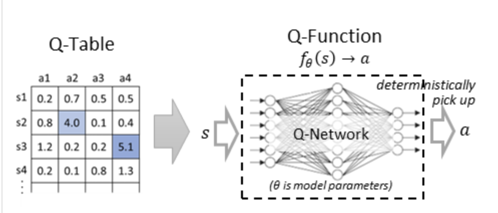
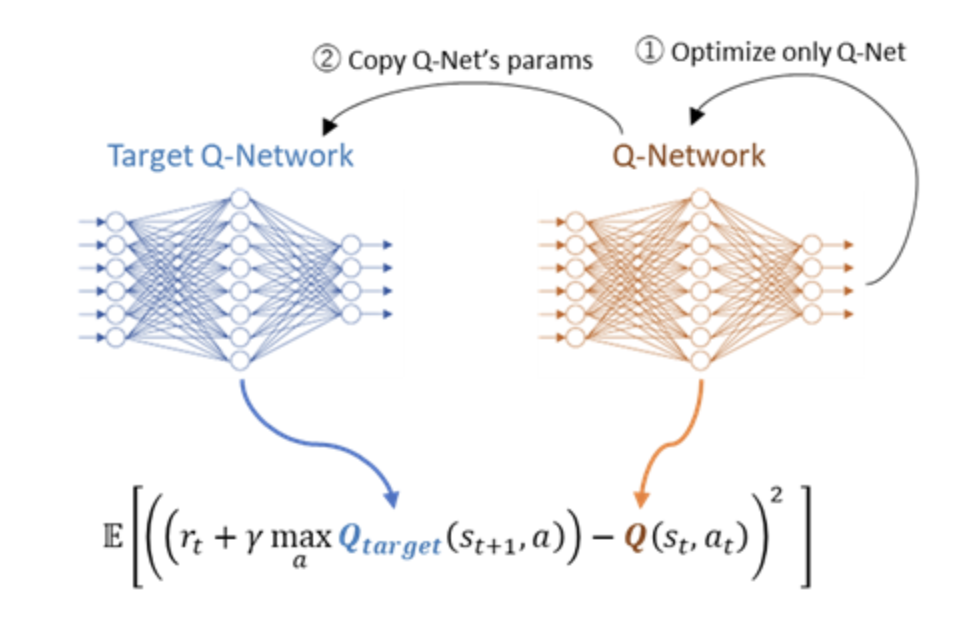

Q-learning算法中，Q-table的state是离散化的，计算上并不有优势。为了解决这个问题，在deep Q-learning算法中，我们用Q-function而不是Q-table去得到当前状态的最优action.并且通过神经网络去实现这个function,叫做Q-Network.



我们优化这个Q-network而不是Q-table.


首先，我们以在Q-learning中讨论的Bellman equation开始：

Q^*(s_{t},a_{t}) = r_{t} + \gamma\max_aQ(s_{t+1},a)

Q^*表示最优的Q值。

和之前的例子一样，我们优化这个Q-function通过最小化r_{t}+\gamma\max_aQ(s_{t+1},a)和Q(s_{t},a_{t})的差值，通过epsilon-greedy sampling.



然而，在DQN,我们隔开一个网络用来产生targetmax_{a}Q(s_{t+1},a)从原来的Q-network当中Q(s_{t},a_{t})。记住我们之前更新了在状态s_{t}的value而不是下一个状态s_{t+1}的值。如果target网络和Q-Network是一样的，在优化过程中，target的权重也发生了改变，因此会失去训练的稳定性。这个算法隔开了一个target网络在优化过程中去保持更新过程中没有更新（/训练）的权重。

笔记：一般，尤其是有一个明确的目标，首先是goal state附近的states被优化，其他状态会从goal到start的顺序逐步被优化。最后通过优化可以找到达到目标的trajectory.

当是个明显失败的state的时候，也是一样的。（没失败的trajectory会被优化过程找到）

在这个场景中，s_{t+1}的value值会在s_{t}优化之前被优化。（因为s_{t}强依赖于s_{t+1}）.

每C轮更新，就克隆Q-network去得到一个新的target newrork,如图所示：

因此我们构建2个网络，Q-Network和target-network.

上面的这个network输出2个值，每个value对应每个action的预估Q-value.

在CarPole的例子中，我们有2个actions（left or right），然后会输出对应的2个值。

```
class QNet(nn.Module):
    def __init__(self, hidden_dim=64):
        super().__init__()

        self.hidden = nn.Linear(4, hidden_dim)
        self.output = nn.Linear(hidden_dim, 2)

    def forward(self, s):
        outs = self.hidden(s)
        outs = F.relu(outs)
        outs = self.output(outs)
        return outs

q_model = QNet().to(device)
q_target_model = QNet().to(device)
q_target_model.load_state_dict(q_model.state_dict())
_ = q_target_model.requires_grad_(False)
```

在之前原始的Q-learning学习算法中，我们将sequential samples(trajectory)每次训练更新q-table.

在DQN当中，为了避免只从最近的经验中学习和提高训练稳定性，我们用replay memory(也叫experience replay)。算法存储最近N次的experience tuples,进行更新的时候随机在N次中采样。


在DQN算法中，通过最小化MSE loss来进行优化。

L = E[((r_t+\gamma\max_aQ(s_{t+1},a_t))-Q(s_t,a_t))^2]

note: 用E表示expected value因为神经网络为batch中所有可能的samples优化minimize loss，不是为一个单一的loss

然而，如果在一次episode达到terminal state，下一个状态就不存在因此损失也就变成

(r_t-Q(s_t,a_t))^2,因此最终的损失就会成为：

L = E[((r_t+\gamma(1-d_t)\max_aQ(s_{t+1},a_t))-Q(s_t,a_t))^2]

如果episode is done那么d_t = 1否则就是0.

在CarPole中，returns 'done'有两种情况，一种termination终止，一种truncation。当任务失败或者结束，在termination flag中返回true.当达到最大的500次actions次数的限制，truncation flag返回true.因此，我们设置dt=1只有termination是true.（如果我们在truncation中设置dt=1,这个状态下的q-value会underestimated,尽管任务成功了）

```
gamma = 0.99

opt = torch.optim.Adam(q_model.parameters(), lr=0.0005)

def optimize(states, actions, rewards, next_states, dones):
    #
    # Compute target
    #

    with torch.no_grad():
        # compute Q(s_{t+1})                               : size=[batch_size, 2]
        target_vals_for_all_actions = q_target_model(next_states)
        # compute argmax_a Q(s_{t+1})                      : size=[batch_size]
        target_actions = torch.argmax(target_vals_for_all_actions, 1)
        # compute max Q(s_{t+1})                           : size=[batch_size]
        target_actions_one_hot = F.one_hot(target_actions, env.action_space.n).float()
        target_vals = torch.sum(target_vals_for_all_actions * target_actions_one_hot, 1)
        # compute r_t + gamma * (1 - d_t) * max Q(s_{t+1}) : size=[batch_size]
        target_vals_masked = (1.0 - dones) * target_vals
        q_vals1 = rewards + gamma * target_vals_masked

    opt.zero_grad()

    #
    # Compute q-value
    #
    actions_one_hot = F.one_hot(actions, env.action_space.n).float()
    q_vals2 = torch.sum(q_model(states) * actions_one_hot, 1)

    #
    # Get MSE loss and optimize
    #
    loss = F.mse_loss(
        q_vals1.detach(),
        q_vals2,
        reduction="mean")
    loss.backward()
    opt.step()
```

#### **epsilon-greedy strategy:**

如果只是random picks up actions，agent不会收敛到optimal behavious；如果总是选择最优的action,就不会探索新的actions,也不会收敛到最优。

epsilon-greedy strategy,在早期阶段探索新动作，逐渐选择最优的动作去训练。（实现exploration和exploitation的一个平衡）


区分rl learning里的sampling size和batch size
