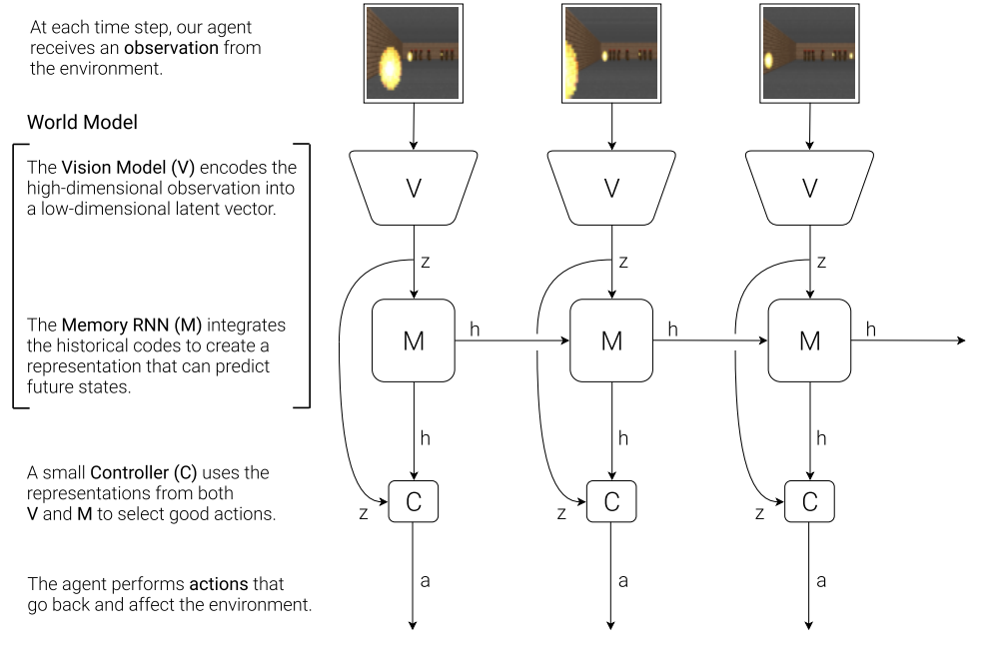

这篇论文是第一篇关于世界模型的畅想。发表于NIPs2018,由David Ha和人工智能四大奠基人之一的Jürgen Schmidhuber 共同撰写。

### problem

是否能构建一个智能体学习了环境的压缩信息，然后让训练在“梦境”中学习而不是在现实中学习。这篇论文给出了一个肯定的答案。

### motivation

人预测一个球的运动轨迹从而进行成功的拦截。

### methods

- **Visual “V” Model (VAE) 视觉“V”模型（VAE）**
- **内存“M”模型（MDN-RNN）**
- **Controller “C” Model (Linear Model)**: 论文中是一个线性模型

### limits

1.**无监督学习可能会编码无关信息。VAE** 不知道哪些信息与任务相关

2.灾难性遗忘

3.没有层级规划，在当前时间点预测未来。

### 关于神经科学的一些问题

1.最直接的神经科学联系是**预测编码理论** ，该理论认为大脑不是被动地接收感觉信息，而是主动地预测感觉信息，并且只处理预测与现实之间的*误差* 。体现在论文里就是世界模型给出预测，vae捕获实际信息。根据差值激活神经元。

2.快速反应动作。control并不显式的plan，而是直接从rnn的隐藏状态中查询。（此时已经对未来做了预测）

​	有点类似于kv cache,真的有memory吗？其实只是推理加速。

3.海马体重放

在世界模型架构中，我们可以看到类似的机制：回放缓冲区相当于快速情景记忆存储；训练好的 MDN-RNN 权重相当于缓慢统计记忆存储。

4.任务相关特征的学习

真实的生物感觉系统通过奖赏门控可塑性来避免这种情况：多巴胺信号（以及相关的调节系统）选择性地增强感觉区域中与奖赏结果相关的突触。

​	类似于MOE

