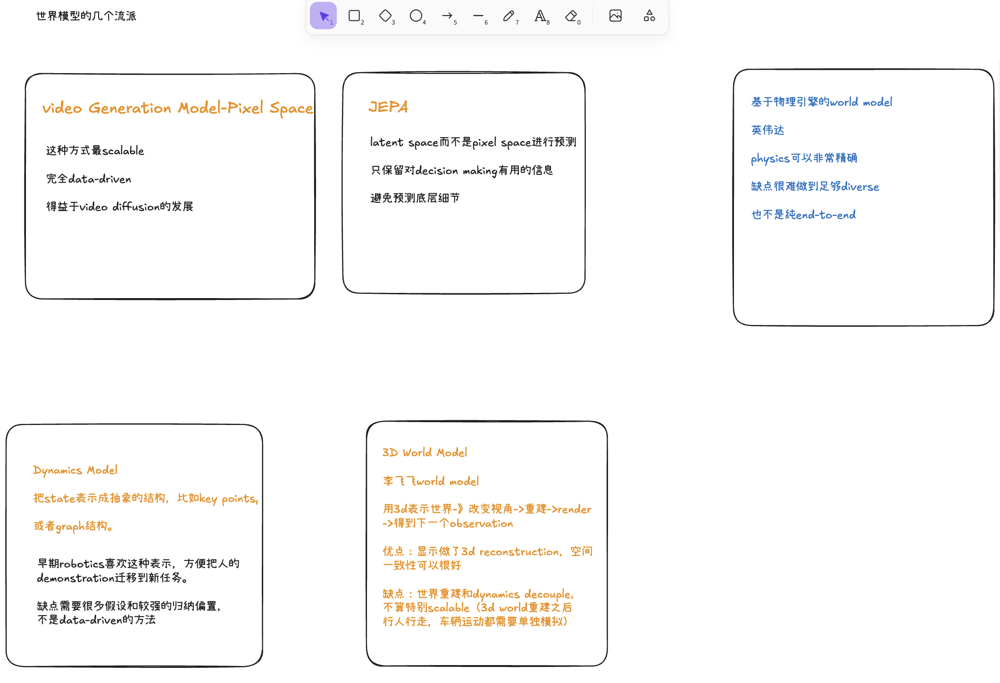
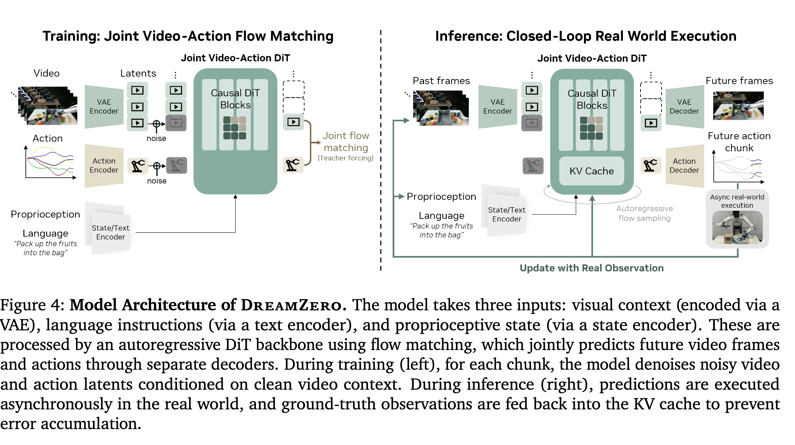

#### world model路线概览

World model定义：一个transition model, 输入action + state， 输出next state.(action-conditioned状态转移方程)

- Video Generation Model-Pixel Space
- JEPA
- Dynamics Model
- 3D Word Model
- 基于物理引擎的World Model

### dreamzero

##### URL:

https://dreamzero0.github.io/

##### 结论：

- 应对世界模型推理慢的问题：通过工程（量化，并行，cache），推理加速30倍，7hz
- 

##### methods:

### dreamdojo

