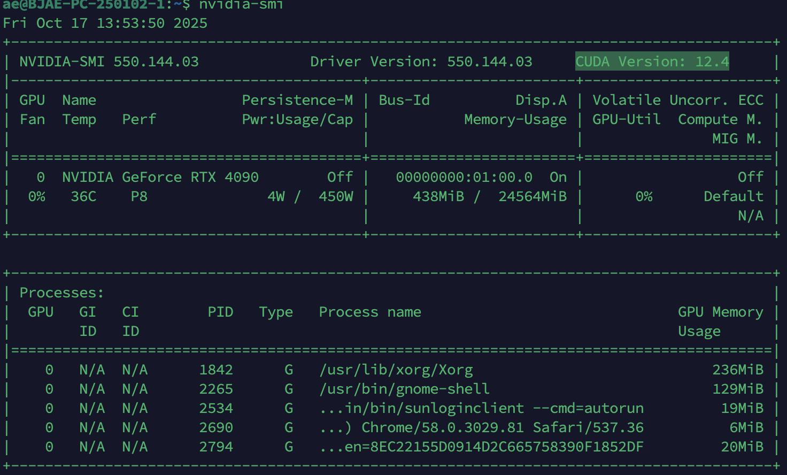

[TOC]


# 一、hil-serl环境配置

```
GPU:4090显卡
ubuntu: 22.04
Driver Version: 550.144.03
CUDA Version: 12.4  （nvidia-smi是驱动支持的最高版本，nvcc --version是跟随cuda toolkit安装的版本，是实际使用的版本，可以安装多个）
cudnn(不用关注，pytorch需要关注cuda对应的cudnn的关系，但是jaxlib自动带了cudnn所以不用安装)
jax 0.5.3
```



```conda_env.yaml
name: hilserl
channels:
  - https://mirrors.tuna.tsinghua.edu.cn/anaconda/cloud/conda-forge
  - defaults
  - https://mirrors.tuna.tsinghua.edu.cn/anaconda/cloud/bioconda/
  - https://mirrors.tuna.tsinghua.edu.cn/anaconda/cloud/msys2/
  - https://mirrors.tuna.tsinghua.edu.cn/anaconda/cloud/conda-forge/
  - https://mirrors.tuna.tsinghua.edu.cn/anaconda/pkgs/main/
  - https://mirrors.tuna.tsinghua.edu.cn/anaconda/pkgs/free/
  - https://repo.anaconda.com/pkgs/main
  - https://repo.anaconda.com/pkgs/r
dependencies:
  - _libgcc_mutex=0.1=main
  - _openmp_mutex=5.1=1_gnu
  - bzip2=1.0.8=h5eee18b_6
  - ca-certificates=2025.8.3=hbd8a1cb_0
  - ld_impl_linux-64=2.40=h12ee557_0
  - libblas=3.9.0=34_h59b9bed_openblas
  - libcblas=3.9.0=34_he106b2a_openblas
  - libffi=3.4.4=h6a678d5_1
  - libgcc=15.1.0=h767d61c_4
  - libgcc-ng=15.1.0=h69a702a_4
  - libgfortran=15.1.0=h69a702a_4
  - libgfortran5=15.1.0=hcea5267_4
  - libgomp=15.1.0=h767d61c_4
  - liblapack=3.9.0=34_h7ac8fdf_openblas
  - libopenblas=0.3.30=pthreads_h94d23a6_2
  - libstdcxx=15.1.0=h8f9b012_4
  - libstdcxx-ng=12.3.0=hc0a3c3a_7
  - libuuid=1.41.5=h5eee18b_0
  - ncurses=6.4=h6a678d5_0
  - numpy=2.2.6=py310hefbff90_0
  - openssl=3.5.2=h26f9b46_0
  - pip=25.1=pyhc872135_2
  - python=3.10.16=he870216_1
  - python_abi=3.10=2_cp310
  - readline=8.2=h5eee18b_0
  - setuptools=78.1.1=py310h06a4308_0
  - sqlite=3.45.3=h5eee18b_0
  - tk=8.6.14=h39e8969_0
  - tzdata=2025b=h04d1e81_0
  - wheel=0.45.1=py310h06a4308_0
  - xz=5.6.4=h5eee18b_1
  - zlib=1.2.13=h5eee18b_1
  - pip:
      - absl-py==2.3.1
      - agentlace==0.1.3
      - astunparse==1.6.3
      - attrs==25.3.0
      - catkin-pkg==1.0.0
      - certifi==2025.4.26
      - cffi==1.17.1
      - cfgv==3.4.0
      - charset-normalizer==3.4.2
      - chex==0.1.89
      - cloudpickle==3.1.1
      - contourpy==1.3.2
      - cycler==0.12.1
      - decorator==5.2.1
      - defusedxml==0.7.1
      - distlib==0.3.9
      - distrax==0.1.5
      - distro==1.9.0
      - dm-tree==0.1.9
      - docker-pycreds==0.4.0
      - docutils==0.21.2
      - easyhid==0.0.10
      - etils==1.13.0
      - farama-notifications==0.0.4
      - flatbuffers==25.2.10
      - flax==0.10.6
      - fonttools==4.58.0
      - gast==0.6.0
      - gitdb==4.0.12
      - gitpython==3.1.44
      - google-pasta==0.2.0
      - gymnasium==0.29.1
      - humanize==4.12.3
      - identify==2.6.10
      - idna==3.10
      - imageio==2.37.0
      - importlib-resources==6.5.2
      - jax==0.5.3
      - jax-cuda12-pjrt==0.5.3
      - jax-cuda12-plugin==0.5.3
      - jax-jumpy==1.0.0
      - jaxlib==0.5.3
      - keras==3.9.2
      - kiwisolver==1.4.8
      - libclang==18.1.1
      - line-profiler==5.0.0
      - lz4==4.4.4
      - matplotlib==3.10.3
      - ml-collections==1.1.0
      - ml-dtypes==0.5.1
      - msgpack==1.1.0
      - namex==0.0.9
      - natsort==8.4.0
      - nodeenv==1.9.1
      - nvidia-cuda-nvcc-cu12==12.9.41
      - opt-einsum==3.4.0
      - optax==0.2.4
      - optree==0.15.0
      - orbax-checkpoint==0.11.13
      - pillow==11.3.0
      - platformdirs==4.4.0
      - pre-commit==3.3.3
      - protobuf==6.32.1
      - psutil==7.0.0
      - pycparser==2.22
      - pydantic==2.11.7
      - pydantic-core==2.33.2
      - pygments==2.19.2
      - pymodbus==2.5.3
      - pyparsing==3.2.3
      - pyrealsense2==2.55.1.6486
      - pyserial==3.5
      - pyspacemouse==1.1.4
      - pytz==2025.2
      - pyyaml==6.0.2
      - requests==2.32.3
      - rich==14.1.0
      - rospkg==1.6.0
      - scipy==1.15.3
      - sentry-sdk==2.27.0
      - setproctitle==1.3.6
      - simplejson==3.20.1
      - six==1.17.0
      - smmap==5.0.2
      - snakeviz==2.2.2
      - tensorboard==2.19.0
      - tensorflow==2.19.0
      - tensorflow-io-gcs-filesystem==0.37.1
      - tensorflow-probability==0.25.0
      - tensorstore==0.1.74
      - tf-keras==2.19.0
      - toolz==1.0.0
      - tornado==6.5.2
      - treescope==0.1.9
      - typing-extensions==4.15.0
      - typing-inspection==0.4.1
      - urllib3==2.4.0
      - virtualenv==20.31.2
      - wandb==0.19.11
      - wrapt==1.17.3
      - zipp==3.21.0
prefix: /home/ae/anaconda3/envs/hilserl
```

```requirements.txt
(hilserl) ae@BJAE-PC-250102-1:~/Project/wangxin$ cat requirements.txt 
absl-py==2.3.1
action-msgs==1.2.1
action-tutorials-interfaces==0.20.5
action-tutorials-py==0.20.5
actionlib-msgs==4.8.0
addict==2.4.0
agentlace @ git+https://github.com/youliangtan/agentlace.git@cf2c337c5e3694cdbfc14831b239bd657bc4894d
aim==3.27.0
aim-ui==3.27.0
aimrecords==0.0.7
aimrocks==0.5.2
aiofiles==24.1.0
alembic==1.14.0
ament-cmake-test==1.3.11
ament-copyright==0.12.12
ament-cppcheck==0.12.12
ament-cpplint==0.12.12
ament-flake8==0.12.12
ament-index-python==1.4.0
ament-lint==0.12.12
ament-lint-cmake==0.12.12
ament-package==0.14.0
ament-pep257==0.12.12
ament-uncrustify==0.12.12
ament-xmllint==0.12.12
angles==1.15.0
annotated-types==0.7.0
antlr4-python3-runtime==4.9.3
anyio==4.8.0
asttokens==3.0.0
astunparse==1.6.3
attrs==25.3.0
base58==2.0.1
black==24.10.0
blinker==1.9.0
boto3==1.35.92
botocore==1.35.92
builtin-interfaces==1.2.1
cachetools==5.5.0
catkin-pkg==1.0.0
certifi==2025.4.26
cffi==1.17.1
cfgv==3.4.0
charset-normalizer==3.4.2
chex==0.1.89
click==8.1.8
cloudpickle==3.1.1
coacd==1.0.5
comm==0.2.2
composition-interfaces==1.2.1
ConfigArgParse==1.7
contourpy==1.3.2
control-msgs==4.8.0
controller-manager==2.50.0
controller-manager-msgs==2.50.0
conveyor-control==0.1.0
cv-bridge==3.2.1
cycler==0.12.1
dash==2.18.2
dash-core-components==2.0.0
dash-html-components==2.0.0
dash-table==5.0.0
dataclasses-json==0.6.7
decorator==5.2.1
defusedxml==0.7.1
demo-nodes-py==0.20.5
Deprecated==1.2.15
dh-gripper-msgs==0.0.0
diagnostic-msgs==4.8.0
diffusers==0.32.1
dill==0.3.9
distlib==0.3.9
distrax==0.1.5
distro==1.9.0
dm-tree==0.1.9
docker-pycreds==0.4.0
docutils==0.21.2
domain-coordinator==0.10.0
easyhid==0.0.10
egl-probe==1.0.2
einops==0.8.0
etils==1.13.0
evdev==1.6.1
example-interfaces==0.9.3
examples-rclpy-executors==0.15.3
examples-rclpy-minimal-action-client==0.15.3
examples-rclpy-minimal-action-server==0.15.3
examples-rclpy-minimal-client==0.15.3
examples-rclpy-minimal-publisher==0.15.3
examples-rclpy-minimal-service==0.15.3
examples-rclpy-minimal-subscriber==0.15.3
exceptiongroup==1.2.2
executing==2.1.0
Farama-Notifications==0.0.4
fastapi==0.115.6
fastjsonschema==2.21.1
filelock==3.13.1
Flask==3.0.3
flatbuffers==25.2.10
flax==0.10.6
fonttools==4.58.0
freetype-py==2.5.1
fsspec==2024.2.0
gast==0.6.0
generate-parameter-library-py==0.4.0
-e git+https://github.com/Genesis-Embodied-AI/Genesis.git@35a2fe8febc45d1fd318f3fcb7dd34f61a20abfc#egg=genesis_world
geometry-msgs==4.8.0
gitdb==4.0.12
GitPython==3.1.44
google-pasta==0.2.0
greenlet==3.1.1
grpcio==1.68.1
gym==0.26.2
gym-notices==0.0.8
gymnasium==0.28.1
h11==0.14.0
h5py==3.12.1
hidapi==0.14.0.post4
huggingface-hub==0.27.0
humanize==4.12.3
hydra-core==1.3.2
identify==2.6.10
idna==3.10
image-geometry==3.2.1
imageio==2.37.0
imageio-ffmpeg==0.5.1
importlib_resources==6.5.2
interactive-markers==2.3.2
ipython==8.31.0
ipywidgets==8.1.5
itsdangerous==2.2.0
jax==0.5.3
jax-cuda12-pjrt==0.5.3
jax-cuda12-plugin==0.5.3
jax-jumpy==1.0.0
jaxlib==0.5.3
jedi==0.19.2
Jinja2==3.1.3
jmespath==1.0.1
joblib==1.4.2
joint-state-publisher==2.4.0
joint-state-publisher-gui==2.4.0
jsonschema==4.23.0
jsonschema-specifications==2024.10.1
jupyter_core==5.7.2
jupyterlab_widgets==3.0.13
keras==3.9.2
kiwisolver==1.4.8
kornia==0.7.4
kornia_rs==0.1.8
laser-geometry==2.4.0
launch==1.0.8
launch-ros==0.19.9
launch-testing==1.0.8
launch-testing-ros==0.19.9
launch-xml==1.0.8
launch-yaml==1.0.8
lazy_loader==0.4
libclang==18.1.1
libigl==2.5.1
lifecycle-msgs==1.2.1
line_profiler==5.0.0
llvmlite==0.43.0
logging-demo==0.20.5
lz4==4.4.4
map-msgs==2.1.0
Markdown==3.7
markdown-it-py==3.0.0
MarkupSafe==3.0.2
marshmallow==3.23.2
matplotlib==3.10.3
matplotlib-inline==0.1.7
mdurl==0.1.2
message-filters==4.3.7
mink==0.0.5
ml_collections==1.1.0
ml_dtypes==0.5.1
moviepy==2.1.1
mplib==0.2.1
mpmath==1.3.0
msgpack==1.1.0
# Editable install with no version control (myenv==0.0.0)
-e /home/ae/Project/my_proj/myEnv
mypy-extensions==1.0.0
# Editable install with no version control (myrl==0.0.0)
-e /home/ae/Project/my_proj/myRL
namex==0.0.9
natsort==8.4.0
nav-msgs==4.8.0
nbformat==5.10.4
nest-asyncio==1.6.0
networkx==3.2.1
ninja==1.11.1.3
nodeenv==1.9.1
numba==0.60.0
numpy==2.2.6
nvidia-cuda-nvcc-cu12==12.9.41
nvidia-cuda-nvrtc-cu12==12.1.105
nvidia-curand-cu12==10.3.2.106
nvidia-nvtx-cu12==12.1.105
omegaconf==2.3.0
omni-msgs==0.0.0
open3d==0.18.0
opencv-python==4.10.0.84
OpenEXR==3.3.2
opt_einsum==3.4.0
optax==0.2.4
optree==0.15.0
orbax-checkpoint==0.11.13
osrf-pycommon==2.1.6
packaging==24.2
pandas==2.2.3
parso==0.8.4
pathspec==0.12.1
pcl-msgs==1.0.0
pendulum-msgs==0.20.5
pillow==11.3.0
platformdirs==4.4.0
plotly==5.24.1
pooch==1.8.2
pre-commit==3.3.3
prettytable==3.12.0
proglog==0.1.10
prompt_toolkit==3.0.48
protobuf==6.32.1
psutil==7.0.0
pure_eval==0.2.3
pybind11==2.13.6
pybind11_global==2.13.6
pycollada==0.8
pycparser==2.22
pydantic==2.11.7
pydantic_core==2.33.2
pygame==2.6.1
PyGEL3D==0.5.2
pyglet==2.0.20
pygltflib==1.16.0
Pygments==2.19.2
pymeshlab==2023.12.post2
pymodbus==2.5.3
pynput==1.7.7
PyOpenGL-accelerate==3.1.7
pyparsing==3.2.3
pyquaternion==0.9.9
pyrealsense2==2.55.1.6486
pyserial==3.5
pyspacemouse==1.1.4
python-dateutil==2.9.0.post0
python-dotenv==1.0.1
python-qt-binding==1.1.2
python-xlib==0.33
pytz==2025.2
pyvista==0.44.2
PyYAML==6.0.2
pyzmq==26.2.0
qpsolvers==4.4.0
qt-dotgraph==2.2.4
qt-gui==2.2.4
qt-gui-cpp==2.2.4
qt-gui-py-common==2.2.4
quadprog==0.1.13
quality-of-service-demo-py==0.20.5
rcl-interfaces==1.2.1
rclpy==3.3.16
rcutils==5.1.6
referencing==0.35.1
regex==2024.11.6
requests==2.32.3
resource-retriever==3.1.3
RestrictedPython==7.4
retrying==1.3.4
rich==14.1.0
rlrob-arcs==0.1.0
rlrob-controllers==0.0.0
rlrob-driver-msgs==1.0.0
rmw-dds-common==1.6.0
# Editable install with no version control (robocasa==0.2.0)
-e /home/ae/Project/robocasa
robomimic==0.3.0
robosuite==1.5.0
robot-api-python==2.7.1.241207
ros2action==0.18.12
ros2bag==0.15.14
ros2cli==0.18.12
ros2component==0.18.12
ros2controlcli==2.50.0
ros2doctor==0.18.12
ros2interface==0.18.12
ros2launch==0.19.9
ros2lifecycle==0.18.12
ros2multicast==0.18.12
ros2node==0.18.12
ros2param==0.18.12
ros2pkg==0.18.12
ros2run==0.18.12
ros2service==0.18.12
ros2topic==0.18.12
rosapi-msgs==2.0.0
rosbag2-interfaces==0.15.14
rosbag2-py==0.15.14
rosbridge-msgs==2.0.0
rosgraph-msgs==1.2.1
rosidl-adapter==3.1.6
rosidl-cli==3.1.6
rosidl-cmake==3.1.6
rosidl-generator-c==3.1.6
rosidl-generator-cpp==3.1.6
rosidl-generator-py==0.14.4
rosidl-parser==3.1.6
rosidl-runtime-py==0.9.3
rosidl-typesupport-c==2.0.2
rosidl-typesupport-cpp==2.0.2
rosidl-typesupport-fastrtps-c==2.2.2
rosidl-typesupport-fastrtps-cpp==2.2.2
rosidl-typesupport-introspection-c==3.1.6
rosidl-typesupport-introspection-cpp==3.1.6
rospkg==1.6.0
rpds-py==0.22.3
rpyutils==0.2.1
rqt-action==2.0.1
rqt-bag==1.1.5
rqt-bag-plugins==1.1.5
rqt-console==2.0.3
rqt-graph==1.3.1
rqt-gui==1.1.7
rqt-gui-py==1.1.7
rqt-msg==1.2.0
rqt-plot==1.1.4
rqt-publisher==1.5.0
rqt-py-common==1.1.7
rqt-py-console==1.0.2
rqt-reconfigure==1.1.2
rqt-service-caller==1.0.5
rqt-shell==1.0.2
rqt-srv==1.0.3
rqt-topic==1.5.0
s3transfer==0.10.4
safetensors==0.4.5
scikit-image==0.25.0
scikit-learn==1.6.0
scipy==1.15.3
scooby==0.10.0
screeninfo==0.8.1
seaborn==0.13.2
sensor-msgs==4.8.0
sensor-msgs-py==4.8.0
sentry-sdk==2.27.0
-e git+ssh://git@gitee.com/wenyudu/hil-serl-ae.git@4290f716c8917789594f443e152f72867645fc12#egg=serl_robot_infra&subdirectory=serl_robot_infra
-e git+ssh://git@gitee.com/wenyudu/hil-serl-ae.git@4290f716c8917789594f443e152f72867645fc12#egg=serl_launcher&subdirectory=serl_launcher
setproctitle==1.3.6
shape-msgs==4.8.0
simplejson==3.20.1
six==1.17.0
smmap==5.0.2
snakeviz==2.2.2
sniffio==1.3.1
SQLAlchemy==2.0.36
sros2==0.10.6
stack-data==0.6.3
starlette==0.41.3
statistics-msgs==1.2.1
std-msgs==4.8.0
std-srvs==4.8.0
stereo-msgs==4.8.0
sympy==1.13.1
taichi==1.7.2
teleop-twist-keyboard==2.4.0
tenacity==9.0.0
tensorboard==2.19.0
tensorboard-data-server==0.7.2
tensorboardX==2.6.2.2
tensorflow==2.19.0
tensorflow-io-gcs-filesystem==0.37.1
tensorflow-probability==0.25.0
tensorstore==0.1.74
termcolor==2.5.0
tetgen==0.6.4
tf2-geometry-msgs==0.25.12
tf2-kdl==0.25.12
tf2-msgs==0.25.12
tf2-py==0.25.12
tf2-ros-py==0.25.12
tf2-tools==0.25.12
tf_keras==2.19.0
threadpoolctl==3.5.0
tianshou==0.4.10
tifffile==2024.12.12
tokenizers==0.21.0
tomli==2.2.1
toolz==1.0.0
topic-monitor==0.20.5
toppra==0.6.0
torch==2.4.0
torchaudio==2.4.0
torchvision==0.19.0
tornado==6.5.2
tqdm==4.67.1
traitlets==5.14.3
trajectory-msgs==4.8.0
transformers==4.47.1
transforms3d==0.4.2
treescope==0.1.9
trimesh==4.5.3
triton==3.0.0
turtlesim==1.4.2
typing==3.7.4.3
typing-inspect==0.9.0
typing-inspection==0.4.1
typing_extensions==4.15.0
tzdata==2024.2
unique-identifier-msgs==2.2.1
urllib3==2.4.0
uv==0.9.2
uvicorn==0.34.0
virtualenv==20.31.2
visualization-msgs==4.8.0
vtk==9.3.1
wandb==0.19.11
wcwidth==0.2.13
websockets==14.1
Werkzeug==3.0.6
widgetsnbextension==4.0.13
wrapt==1.17.3
xacro==2.0.13
zipp==3.21.0
zmq==0.0.0
```


# 二、迁移到机器人上

官方给了一个在franka机器人上运行的readme文档。https://github.com/rail-berkeley/hil-serl/blob/main/docs/franka_walkthrough.md

