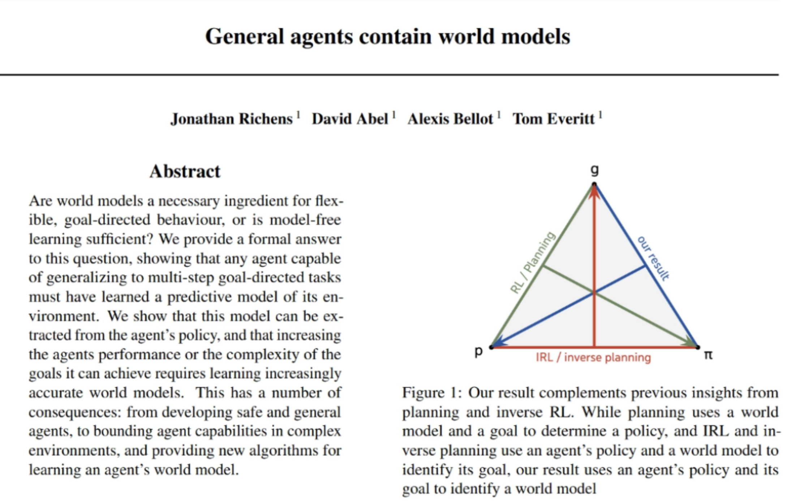
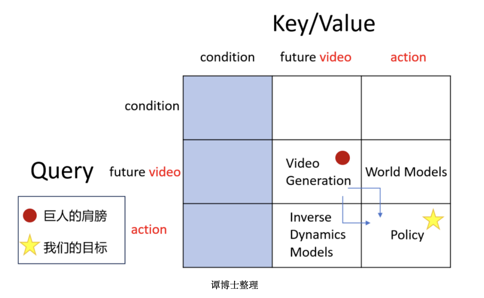
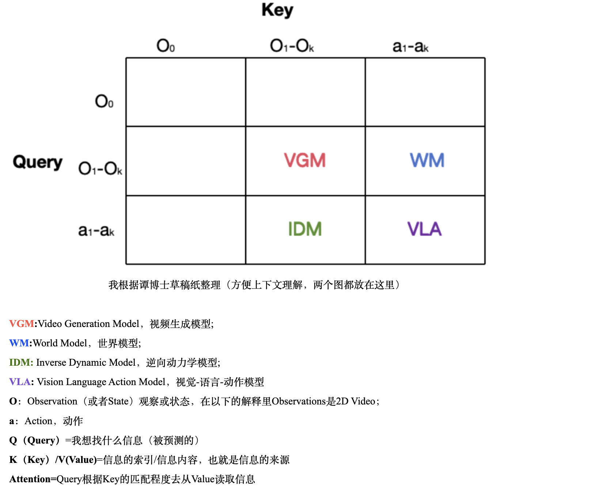
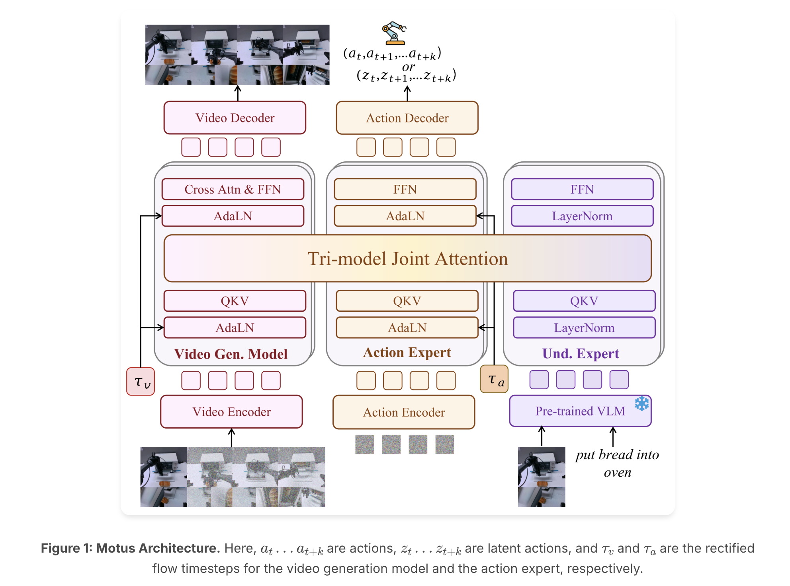
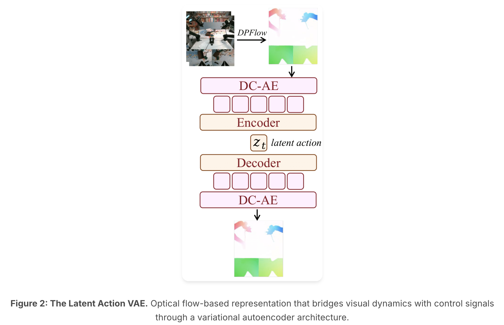
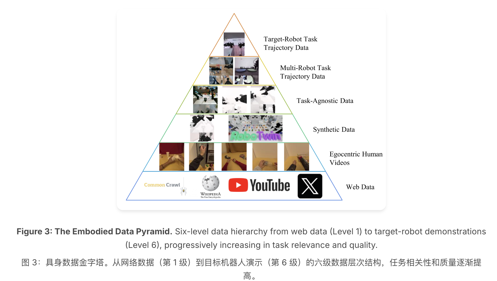
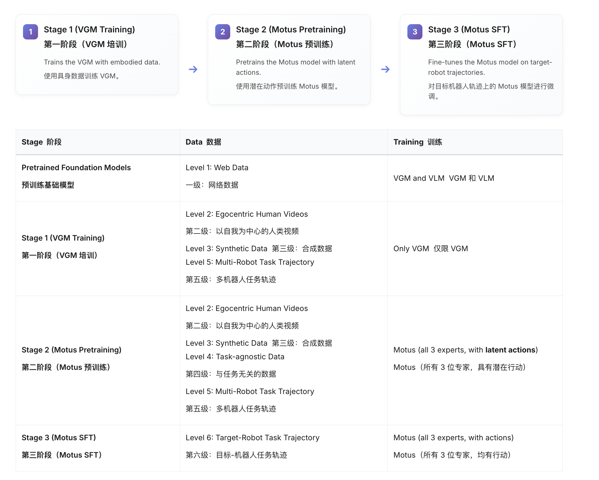
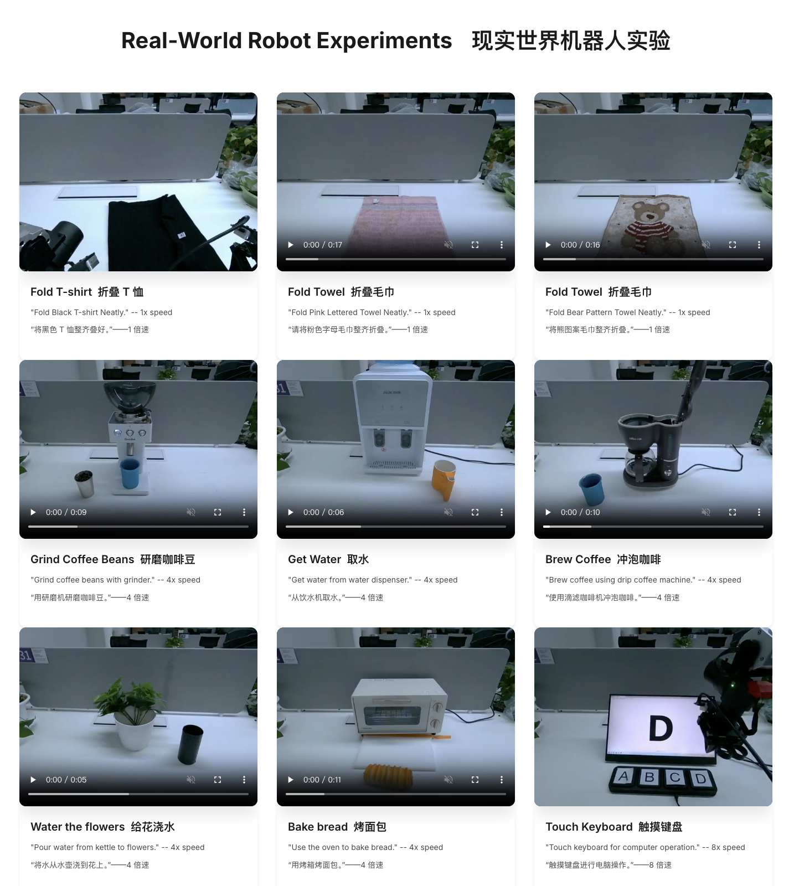

## Title & URL

- **Title**: Motus: A Unified Latent Action World Model
- **URL**:
  - Arrive: https://arxiv.org/abs/2512.13030
  - Motus：https://motus-robotics.github.io/motus

- **Author**:1 清华大学 2 圣书大学 3 北京大学 4 地平线机器人公司
- **Time**: 2025年12月

## TL;DR

​	训练了一个统一的latent action world model，旨在利用尽可能多的所有数据训练一个统一的模型。

## Key Insights

1. unified model + latent action的想法。Google Deepmind在25年6月份发了一篇General agents contain world models的论文，证明了通用agent内部必然包括一个世界模型。

   目标、dynamics model(世界模型)、policy三者有任意两者都可以推出另外一个，因此给定目标的情况下，建模世界模型和建模policy之间是互通的，可以用更统一的视角来看待这两者，也就是unified world models。

   

2. Motus, VLM.WM

   

## Methods

##### 1.architecture:

##### 2.latent actions:

##### 3.利用的数据：数据金字塔

##### 4.Trainig 三阶段逐渐联合

发现直接放在一起训练效果不好。先单独训再联合起来。

## Results

pi05随着任务增多单个任务performance下降（说明任务之间彼此有矛盾），但是motus随着多个任务训练能力增强。

## Reflections

​	关注training方法和整合的方法。

## Other Links

微信公众号对作者的采访：https://mp.weixin.qq.com/s/hAlnB--SjURS7ukY4gO_Kw

