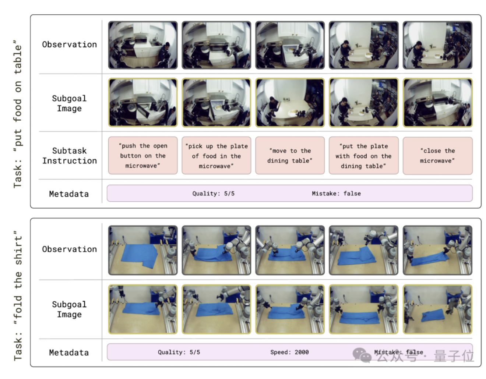
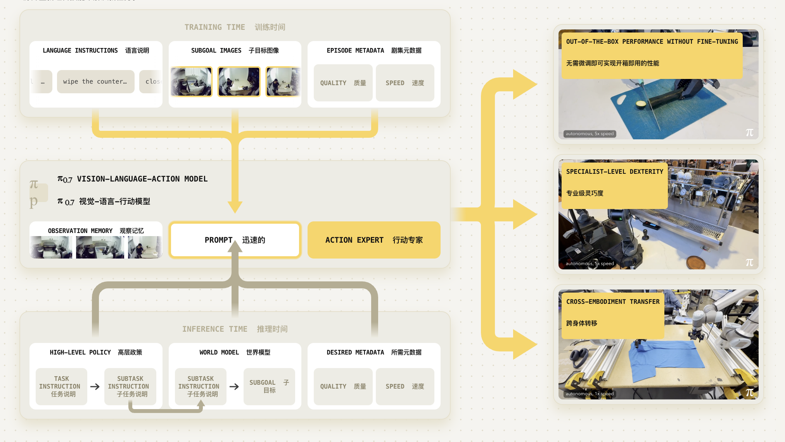
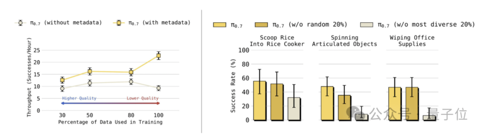
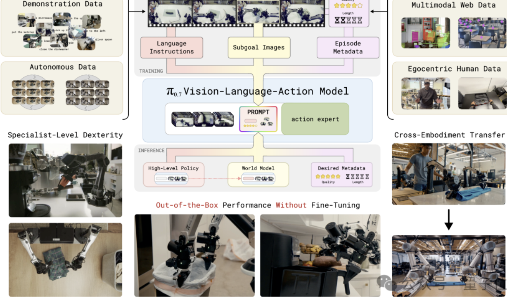

### pi07: 具有涌现能力的可控模型

##### URL:

https://www.pi.website/blog/pi07

量子位总结：https://mp.weixin.qq.com/s/Z7JpjZbEk59wqAKCLLbKtg

##### 架构：

π0.7把prompt展开成四层：任务指令（清理厨房）+子任务指令（打开冰箱）+子目标图像（下一秒画面应该长什么样）+episode元数据（这条数据质量几分、有没有出错、速度多快）。

##### 几个重点发现

- 开箱即用no finetune:π0.7没做任何专项训练，就能在**做咖啡、叠衣服、装箱**三个复杂任务上，追平π0.6经过微调的的专家模型。
  - vla开始展现出组合泛化的能力，不一定强于world model？

- Cross-embodiment：让UR5e双臂完成没有采集过的叠衣服任务

- 通过metadata告诉“数据好坏”可以提升模型效果

  - 这点和机器学习很像，在判别模型里我们的“坏数据”可能有比好数据更高的价值

  

- pi07的世界模型只预测**把任务指令翻译成成功那一帧应该长啥样**。不预测动作后果，不模拟物理，不参与决策链路。

##### 技术实现：vlm + action expert + flow matching

**π0.7是一个5B参数的模型，分三块。**

- VLM骨干：4B参数的Gemma3，负责理解视觉和语言。
- Action expert：860M参数的transformer，用flow matching生成连续动作chunk，50Hz高频控制。
- World model：从14B的BAGEL图像生成模型初始化，负责给π0.7画出未来几秒应该是什么样子。

在推理中，**模型输入**包括：4路摄像头（前视+两个腕部+可选后视）、每路6帧历史画面、机器人关节状态、再加上任务指令、子任务指令、元数据、以及world model实时画出的次目标图像。

**输出**是一段50步的action chunk，实际执行15到25步，然后再推下一段。
