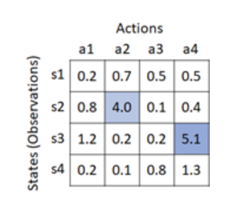

Q-learning是强化学习最基础的算法。

> [!NOTE]
>
> reward和expected reward的区别

为了弄清楚它是如何工作的，让我们先考虑一个exptected reward如下：

R = \sum_{t=0}^{\infty} {\gamma^t r_t}

r_t是t时刻的reward而\gamma^t是折损因子。

举个例子，如：

- action #1: 伸开arm(t=0)-> 得到reward=0
- action #2: 打开hand(t=1)-> 得到reward=0
- action #3: 抓取物体(t=2)->得到reward=10

我们只在动作3的时候得到了reward值，但是显然action 1的动作对最终的rewards是有贡献的。因此我们考虑下面的累积reward.假如 

$$ \gamma=0.99 $$
$$
R_{t=0}=0+0.99\times0+0.99^2\times10=9.801
$$
同上，R_{t=1}=9.9,R_{t=2}=10

Q-value就是基于这种expected cumulative reward.

在上面的例子中，如果你能看到一个object在你面前(state of "you see an object"), the action "伸开arm"就会有一个高的expected reward.反之，如果你哪儿都看不到object,“伸开arm”就会有低的expected reward.

Q-value就描述的是对应的state和action的值Q(s,a)，假如s和a都是一维的离散值，Q(s,a)就是一个table。如图所示：



在状态s2的时候最优的action是选择a2,s3是a4.

实际中，action space和observation space可能都有超过1维。举例子，在CarPole中，state(observation)是4维的浮点数。Q-table就是1维的action space和4维的observation space的组合。在Q-learning中，我们通过下面的更新迭代优化这个table.（t=0,1,2,...）

Q_{t}(s_{t},a_{t})是当前的Q值，Q_{t+1}(s_{t},a_{t})是更新后的Q值。
$$
Q_{t+1}(s_t,a_t) = Q_t(s_t,a_t) + \alpha \left( r_t + \gamma \max_a{Q_t(s_{t+1},a)} - Q_t(s_t,a_t) \right)
$$
\alpha是learning rate

上面的公式可以这样理解：

- 你期望在s_{t}采取动作a_{t},得到了reward是r_{t},状态转移到s_{t+1 }

- 下一个最优的动作会满足a_{t+1}=max_{a}Q(s_{t+1},a).采取了最优动作后，会得到期望的reward是：_
  $$
  r_{t}+\gamma max_{a}Q(s_{t+1},a)
  $$

- 将这个最优的q-value与当前的q-value值Q(s_{t},a_{t})对比，然后用学习率\alpha更新当前的q值就会得到上面的公式。


### **实现细节：**

q_table开始是zero初始化

```
q_table = np.zeros(new_observation_shape + (env.action_space.n,))
q_table.shape
```

开始训练的时候总会选择wrong actions（agent还没学到什么东西），之后随着学习逐渐选择q-table里面最优的action.用一个参数epsilon去控制这个行为。（这种exploration算法叫做Epsilon-Greedy）

```
gamma = 0.99
alpha = 0.1
epsilon = 1
epsilon_decay = epsilon / 4000

# pick up action from q-table with greedy exploration
def pick_sample(s, epsilon):
    # get optimal action,
    # but with greedy exploration (to prevent picking up same values in the first stage)
    if np.random.random() > epsilon:
        a = np.argmax(q_table[tuple(s)])
    else:
        a = np.random.randint(0, env.action_space.n)
    return a

env = gym.make("CartPole-v1")
reward_records = []
for i in range(6000):
    # Run episode till done
    done = False
    total_reward = 0
    s, _ = env.reset()
    s_dis = get_discrete_state(s)
    while not done:
        a = pick_sample(s_dis, epsilon)
        s, r, term, trunc, _ = env.step(a)
        done = term or trunc
        s_dis_next = get_discrete_state(s)

        # Update Q-Table
        maxQ = np.max(q_table[tuple(s_dis_next)])
        q_table[tuple(s_dis)][a] += alpha * (r + gamma * maxQ - q_table[tuple(s_dis)][a])

        s_dis = s_dis_next
        total_reward += r

    # Update epsilon for each episode
    if epsilon - epsilon_decay >= 0:
        epsilon -= epsilon_decay

    # Record total rewards in episode (max 500)
    print("Run episode{} with rewards {}".format(i, total_reward), end="\r")
    reward_records.append(total_reward)

print("\nDone")
env.close()
```
