> Goal: 了解一下关于RL, VLA, VLM的basic concetps

# 什么是RL

> [!NOTE]
>
> agent的终极目标是优化在环境中的行为。开始时刻，agent在环境中可能表现糟糕；随着时间推移，和环境交互试错可以不断的提高自己的表现。
>
> RL最大的美妙之处在于可以通过同一套算法让agent适应不同的未知的复杂环境。

### **应用场景**

- 游戏：chess and go
- 机器人:在家里移动、搬运、完成复杂的日常任务
- 自动驾驶：自动驾驶汽车、控制直升机或无人机。

> [!WARNING]
>
> - 经典books:http://incompleteideas.net/book/RLbook2020.pdfrepo:https://github.com/LyWangPX/Reinforcement-Learning-2nd-Edition-by-Sutton-Exercise-Solutions

# **RL framework**

- **Agent**: 目标是学习策略来优化某个process
- **Environment**: Agent所在的环境，由一系列状态组成。
- 在每个时间步，agent选择一个action,会改变环境的state到新一个。agent因此会收到一个feedback评估这次choice的好坏。这个feedback叫做**reward**，会表示为数值形式。
- 根据reward,agent随时间逐渐学习到优化的策略去最大化总的reward值。

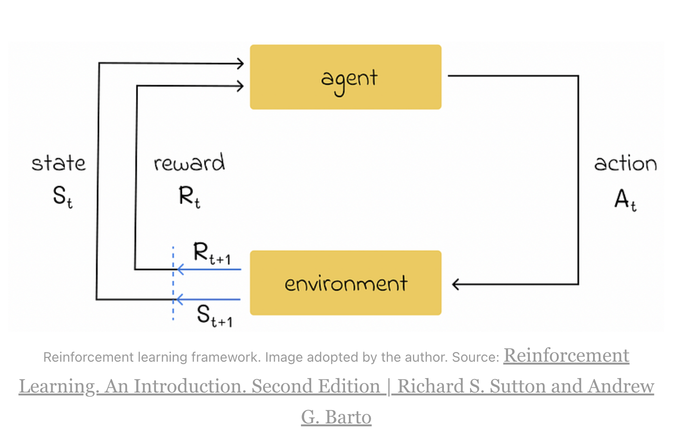

当前环境的state和当前agent的action可能导致不同的prob让new state会有不同的reward,对应相应的概率。

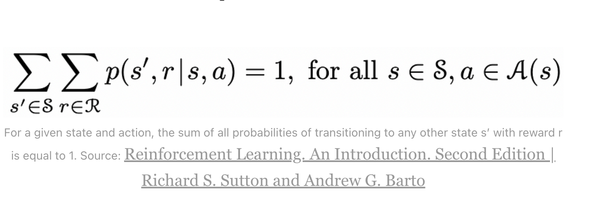

# **Reward种类**

为了定义一个长过程中总的reward(也叫做return),有几种形式。

## **简化版本：**

Ri表示i时间戳agent收到的reward,

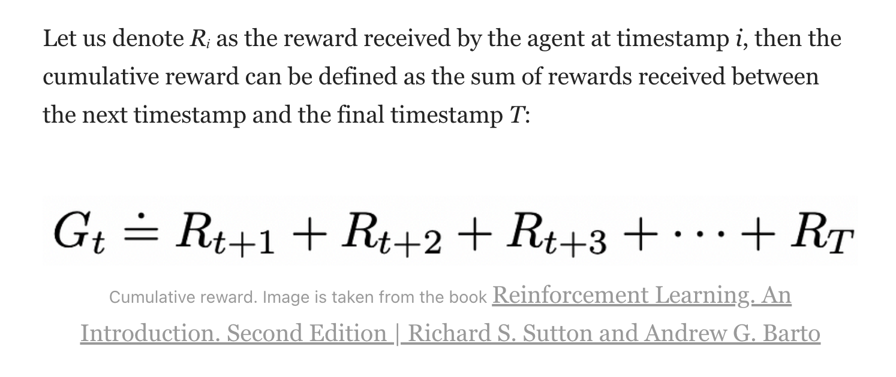

## **Discounted累计reward:**

大多数时候会在reward前面乘以一个削减系数（0～1）。

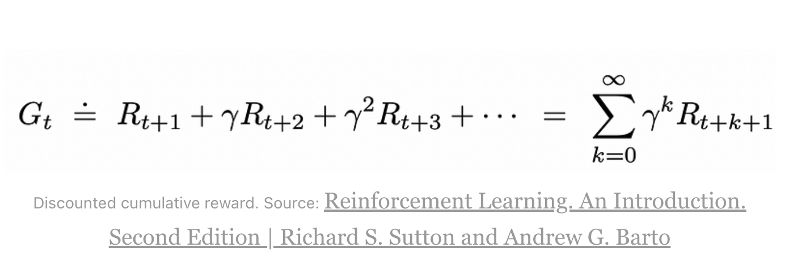

根本原因是agent的优化行为是更考虑短期的rewards。最终可以表示为一种递归的公式形式。

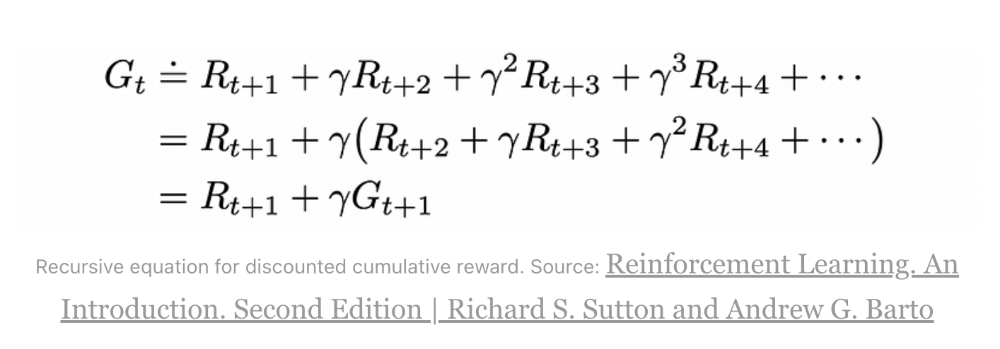

# **任务的类型**

## **episodic tasks**

agent和environment的交互可以包含一系列独立的episodes.这些偶然事件独立于其他并且起始状态从状态分布中采样。

举个例子，我们想让agent玩一个游戏。为了达到那个目的，我们会让robot玩很多独立的游戏，或输或赢。收到的rewards会逐渐影响robot接下来在游戏中的策略。

episodes也叫trials.

## **continuing tasks**

不是所有的tasks都是episodic，一些任务可以是连续性的，意味着没有一个最终的状态。比如（win or lose）。这种情况下，timestamp是无限的，因此计算cummulative return可能不可行。

# **策略(policies和value functions)**

在强化学习中，**Policy（策略）**和**Value Function（价值函数）**是两个最核心的概念，它们共同指导智能体的决策，但侧重点不同。它们的关系可以通过**“导航”**的类比直观理解：

## **policy**

### **Policy（策略）—— ‘怎么做’**

- **直观理解**：策略是智能体的**行为准则**，直接决定它在每个状态下应该采取什么动作。
  - **比如**：
    - 自动驾驶的Policy可能是：“看到红灯→刹车；绿灯→加速”。
    - 游戏AI的Policy可能是：“敌人靠近→攻击；血量低→逃跑”。
  - **数学表示**：
    - **确定性策略**：π(s)=a*π*(*s*)=*a* （状态 s*s* 下固定选择动作 a*a*）。
    - **随机性策略**：π(a∣s)*π*(*a*∣*s*) （状态 s*s* 下选择动作 a*a* 的概率）。

策略π是从状态s ∈ S 采取各种可能的action到达概率p的mapping.

如果一个agent遵从策略π，那么agent从状态s采取一个action的概率p(a|s)=π(s).

任何policy可以表示成一个表大小为|s|x|A|

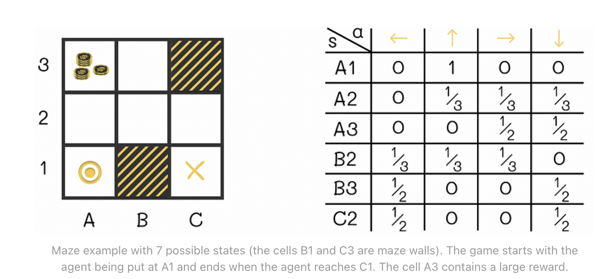

最简单的策略就是random:机器人走每一步的概率是一样的，对应上面右边的表格。

展示的表格也可以是episode task的一个例子，到达终止状态后会收获一个reward。一个新独立的game可以被初始化。

除了policy之外，也会用value functions描述agent从一个当前state采取某种action或者在给定的state的expected reward(选择的好坏).

## **Value Function（价值函数）—— ‘有多好’**

- **直观理解**：价值函数是**对状态的长期收益评估**，回答“当前状态/动作对未来有多有利”。
  - **比如**：
    - 下棋时，某个棋盘状态的价值函数值高，说明胜率大。
    - 股票市场中，当前持仓的价值函数值低，说明未来可能亏损。
  - **两种类型**：

1. **状态价值函数** **Vπ(s)****V****π****(****s****)**：
   - 表示在状态 s*s* 下，**遵循策略** **π****π** 能获得的期望回报。
     - 公式：Vπ(s)=Eπ[Gt∣St=s]*V**π*(*s*)=E*π*[*G**t*∣*S**t*=*s*]。
   - **动作价值函数** **Qπ(s,a)****Q****π****(****s****,****a****)**：
     - 表示在状态 s*s* 下**执行动作** **a****a**，之后遵循策略 π*π* 的期望回报。
     - 公式：Qπ(s,a)=Eπ[Gt∣St=s,At=a]*Q**π*(*s*,*a*)=E*π*[*G**t*∣*S**t*=*s*,*A**t*=*a*]。

- **Policy**是“行动派”，**Value Function**是“预言家”。
- Policy告诉智能体“该做什么”，Value Function告诉它“这么做有多好”。
- 两者协同工作：Value Function评估和改进Policy，而Policy的变动又会影响Value Function的估计。
- 结合两者的方法（如Actor-Critic）通常能更高效地解决复杂问题。

### **state-value function:**

state-value function v(s)或者简单点说叫v-function建立了映射，从环境的某种state,根据agent采取的策略*π*，到预期会收到的累积的expected reward.

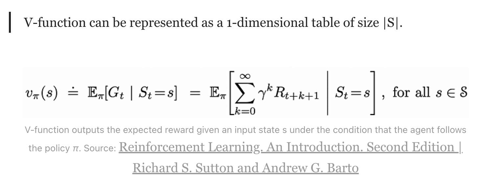

举个例子：

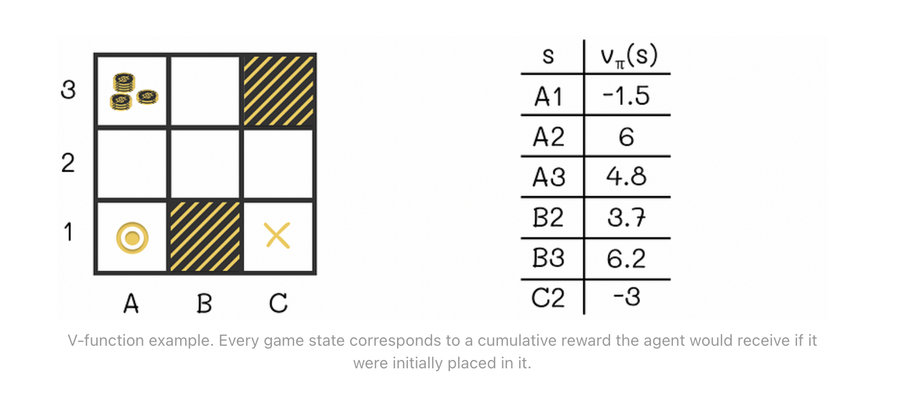

终止状态的v-value是0.

### **action-value function**

与V-function类似，也考虑agent在某个policy下考虑某个可能的action.

Action-value function q(s,a),或者可以说是Q-function是建立一种映射，从环境的一种状态s ∈ S 和可能的action a ∈ A,遵循某种策略*π* 收到的expected reward.

Q-function可以表示为|S|x|A|的表格。

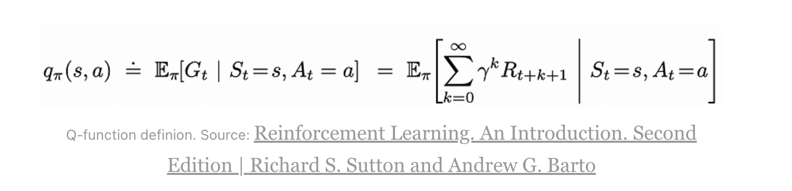

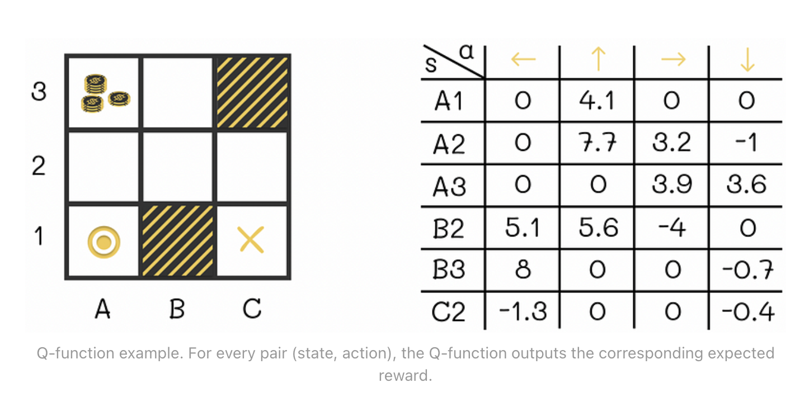

state和action functions的不同点在于action-value function采用了在当前state agent要采用的action的信息，state function只考虑了当前的state并没有考虑到agent的下一步action.

V-和Q-functions都是从agent经验中学到的。

#### **V- and Q-的subtility之处**

为什么q(s,a)不等于v(s')。i.e.为什么agent在state s采取了action a去到了下一个state s'的expected reward不等于agent在s'的expected reward?

答案是虽然在一个当前状态s采取一个action a会确定性leads to一个新状态s',agent收到的reward是Q-function考虑的而不是V-function.q(s,a)计算是*Rₜ + αRₜ₊₁* … . ,v(s')是*Rₜ₊₁ + αRₜ₊₂ + …* .不包括Rt的。

另外一个值得注意的是，在某些状态s采取行为a可能导致多个可能的下一个状态。比如迷宫游戏agent往右走可能有20%随机遇到障碍被自动移到别的位置。因此，agent收到的rewards即使是同样的action和state也可能不一样。这是另一个导致两者不对等的原因。

## **Bellman equation**

Bellman equation是RL领域的一个基础equation.简单地来说，它递归建立起state/act ion的function values在当前和下个timestamp.

### **V-function**

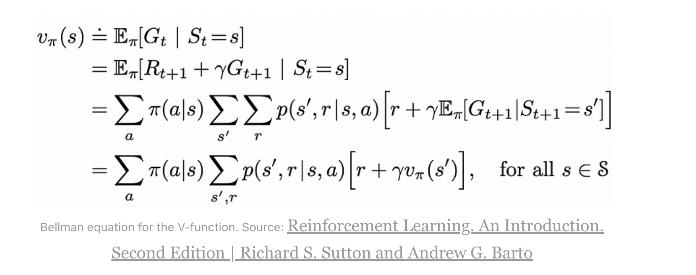

### **Q-function**

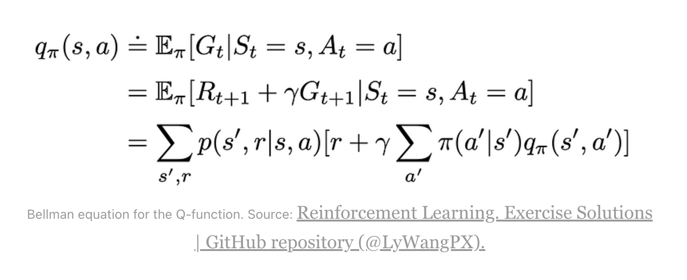

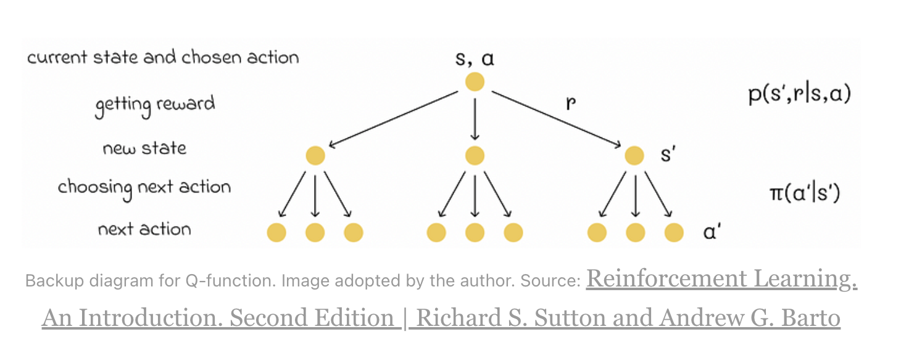

# **Optimal policy**

定义不同策略的比较

π₁>π2 当对于所有状态s ∈ S.π₁的reward都不小于π₂的reward

policy π⁎是最优的，当不小于其他所有策略

## **Bellman optimality equation**

解Bellman quations的优化问题，求max

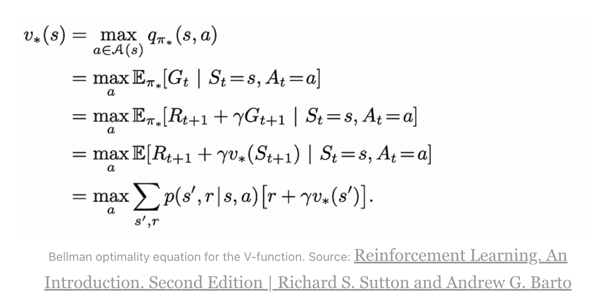

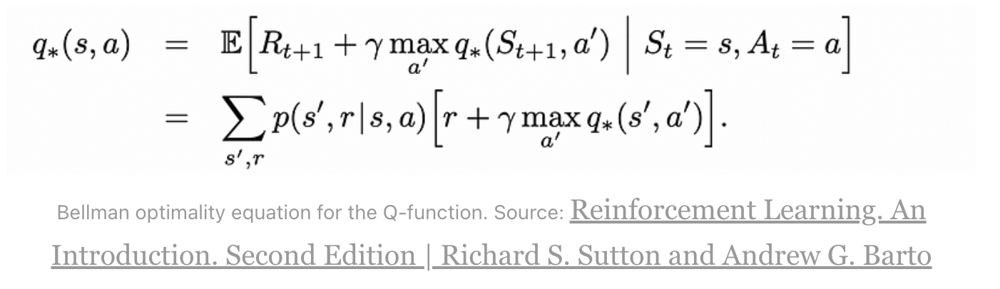

求解了V-* function或者Q*-function，最优策略*π⁎ 就可以很容易被计算。*

实际运用时，states的数量非常庞大，因此数学求解这个问题非常困难。因此，RL learning要用计算量和memory更低的近似的策略替代。

# **参考文献：**

https://readmedium.com/reinforcement-learning-introduction-and-main-concepts-48ea997c850c

books and repo:

http://incompleteideas.net/book/RLbook2020.pdf

https://github.com/LyWangPX/Reinforcement-Learning-2nd-Edition-by-Sutton-Exercise-Solutions
