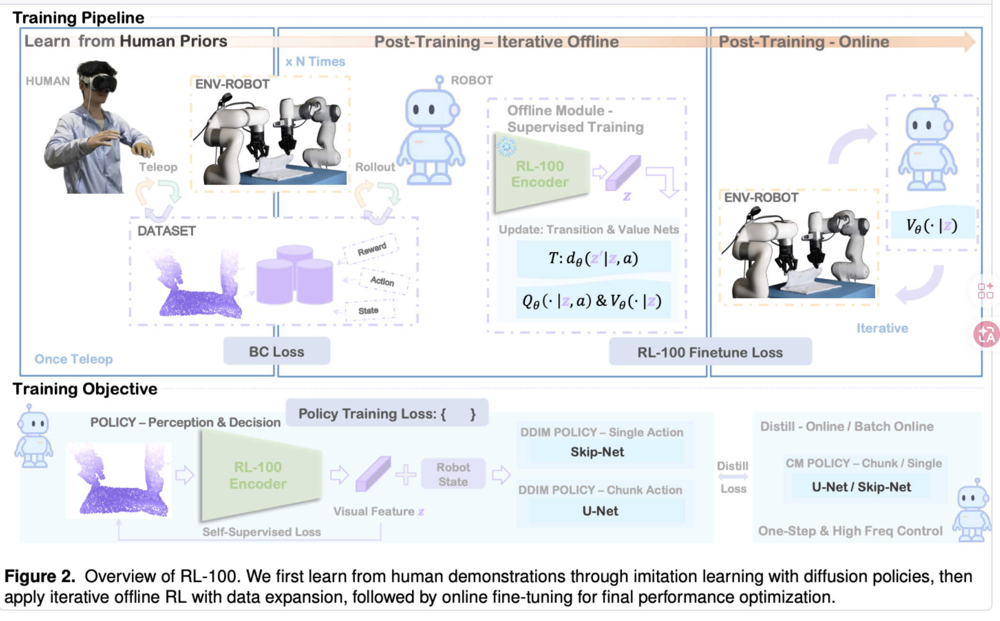

## Title & URL

- **Title**:Performant Robotic Manipulation with Real-World Reinforcement Learning
- **URL**:
  - https://arxiv.org/abs/2510.14830
  -  https://github.com/lucidrains/RL-100/tree/main （截止2026.4暂未开源）

- **Author**:
- **Time**:2025年10月

## TL;DR

把“示教 + 离线 RL + 少量在线 RL”这条路线组织成了一套清晰的训练流程，并在真实机器人任务中进行了系统验证。

## Key Insights

1.清晰地组织了**示教 → 离线迭代 → 少量**在线微调的训练路径。效果和hil-serl是两个能在真机99%的算法。

2.蒸馏解决扩散策略在实际控制中“推理慢”的工程问题

## Methods

## Results

## Reflections

## Other Links

