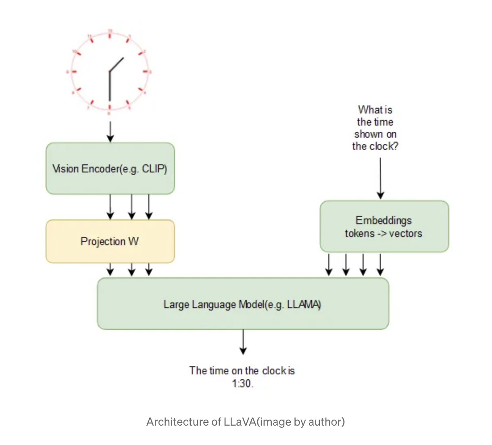
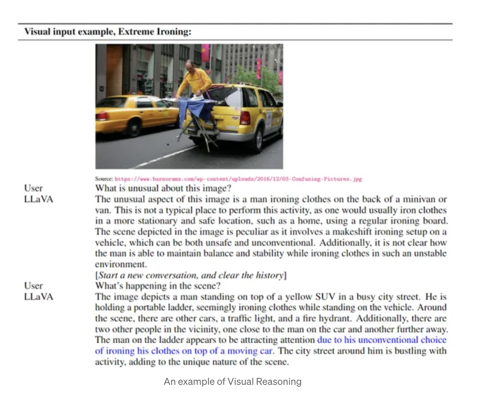
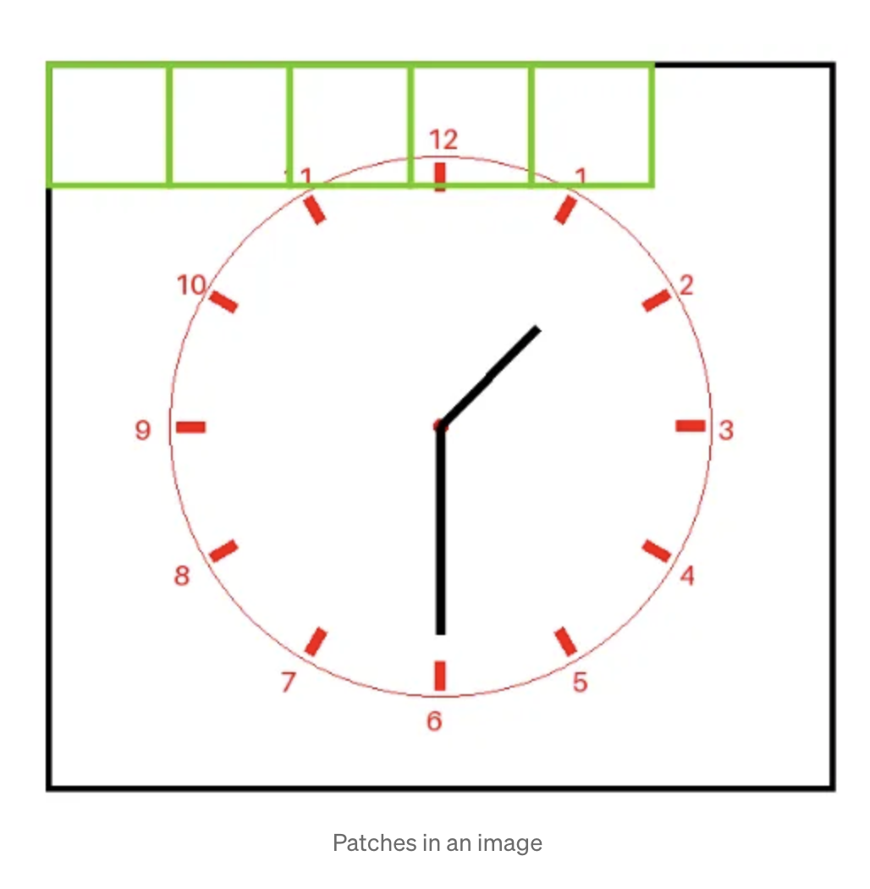
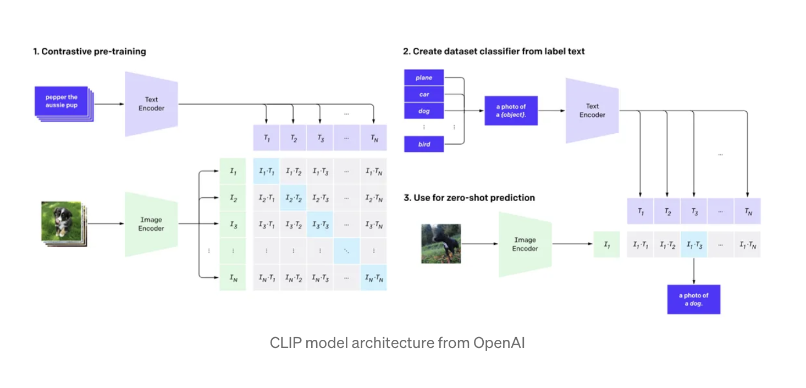
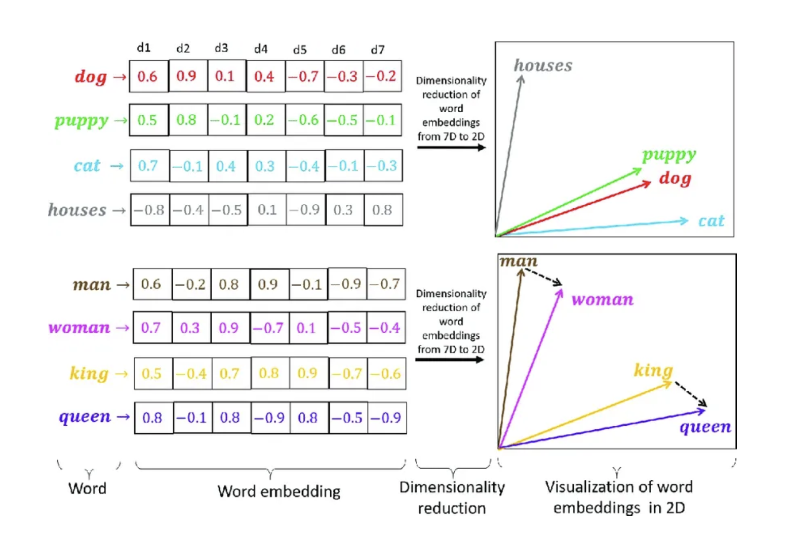
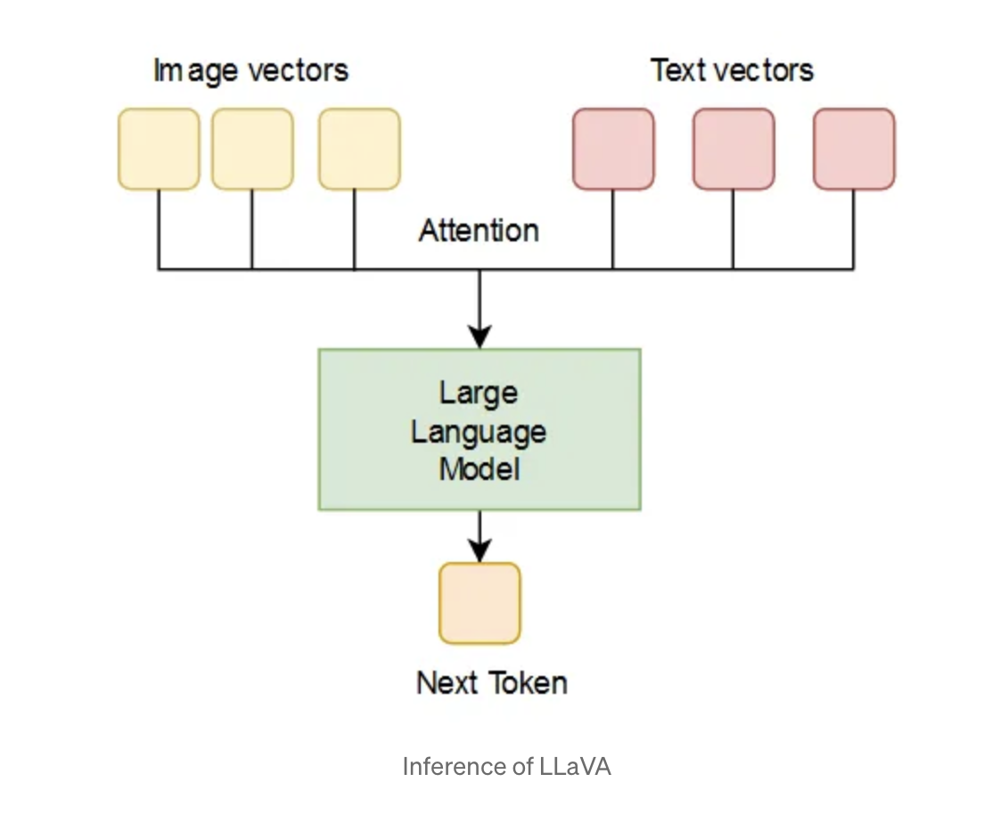
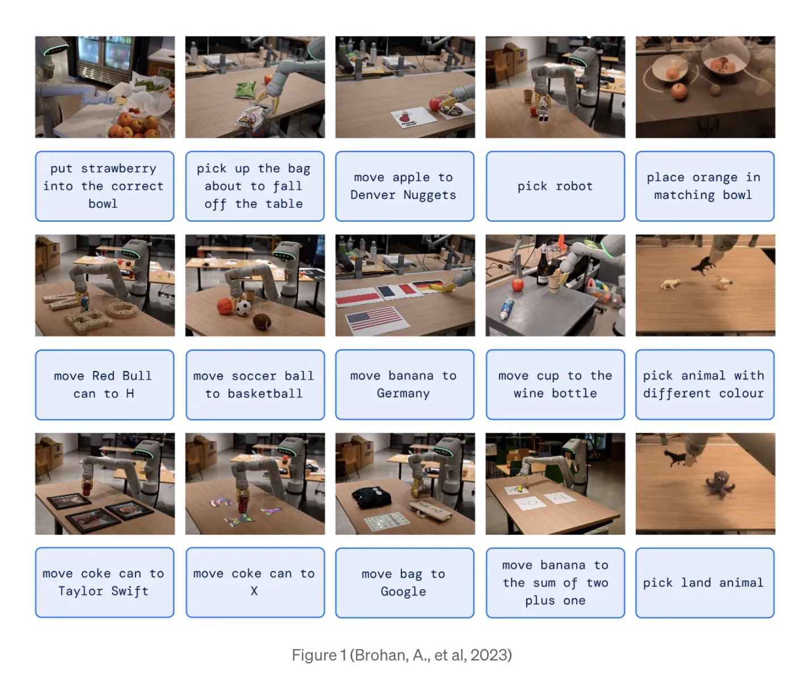

大致回顾了一下VLM的concept和结构，大概就是对image和text进行向量空间表示，通过contrastive learning让同一个事物的二者特征在embedding空间里相近。

just like 哲学就是哲学家的历史，从paper publication history看一下vla/vlm的区别和发展。don't be fooled by 高大上的名词。

# **VLM**

# **VLM的定义**

多模态模型处理一种类型以上的输入，比如vision+text models。下面说的大概是研究多模态的一种，比如vision language models.需要理解和处理image和text的信息。相关的任务比如image captioning(e.g.CLIP), visual question answering(GPT-4-vision)，text-to-image(e.g.DALL-E)，或者text-to-video generation(sora).

# **VLM的结构**

VLM的结构在于如何融合视觉和文本模态，不同的架构会在早期阶段、中间阶段或者最后阶段进行信息的融合或者对齐。有很多种，可以看看几种最常见的：

## **LLaVA(Large Language and Vision Assistant)**

图像经过clip并投影到embedding vectors，文本通过文本模型产生相应的embedding vectors。处在相同的维度空间里，可以进一步无缝集成。

在训练LLaVA模型中有两个阶段：

1.pre-training for feature alignment. 只有投影矩阵在数据集CC3M上进行更新。

1. Fine-tuning End-to-End. 投影矩阵和LLM会在两个不同的场景进行更新：
   1. visual chat:LLaVA 根据我们生成的多模式指令跟踪数据进行了微调，以适应日常面向用户的应用。
   2. Science QA:LLaVA 针对科学领域的多模态推理数据集进行了微调。

### **LLaVA model的组成**

#### **Vision Encoder**

visual encoder将image划分为小的patches，比如16x16像素这样。每个patch被处理转换成数值形式，在送给image encoder;

image enconder由多个blocks组成，主要目的是加强图像的视觉表示。包括feedforward layers,用来提取高层特征；attention layers关注图像的相关性.

vision encoders的training目标是尽量减少images的向量表示和text描述的差异度。在训练期间，目标是开发一个模型，该模型能够将图像的嵌入转换为与文本紧密一致的表示。

#### **Embedding Models**

Embeddings认为是tokens的密集数学表示(compact numerical representations).根源来自分布假设，相似位置的词语有相近的meanings.

### **LLaVA的推理**

image和text都转换为embeddings之后，由attention决定关注哪一部分。

# **VLA**

以RT-2为例

## **VLA model和VLM model**

VLM模型是一种能处理visual和自然语言的机器学习模型，VLM 是在互联网规模的图像和文本数据上进行训练的。比如RT-2中用到的base VLA model:PaLI-X PaLM-E

RT-2提出了一种方法将预训练的VLA model用在机器人轨迹数据上，其中机器人轨迹数据用文本形式进行编码。

## **RT-2 model**

将机器人的轨迹数据编码为text tokens，对vla模型进行fine tune.

## **效果**

### **泛化性**

这项研究的一项重要发现是 RT-2 模型令人印象深刻的泛化能力。该模型在处理新物体、背景和环境时展现出显著提升的性能。它可以解读机器人训练数据中未曾出现的命令，并根据用户指令进行基本的推理。这种推理能力源于底层语言模型运用思维链推理的能力。该模型的推理能力示例包括：判断哪个物体（石头）可以用来做临时锤子，或者哪种饮料最适合疲惫的人（能量饮料）。这种程度的泛化能力是机器人控制领域的一大进步。

### **新兴能力**

RT-2 模型的另一个令人兴奋的方面是它展现出的涌现能力。通过利用从互联网规模预训练中获得的知识，该模型可以执行训练期间未明确传授的任务。例如，它可以重新利用已学技能，将物体放置在语义指示的位置附近，或解释物体之间的关系，以确定拾取哪个物体以及将其放置在何处。例如，诸如“捡起即将从桌子上掉下来的袋子”或“将香蕉移动到二加一的和”（均如图 1 所示）之类的命令——要求机器人对机器人数据中从未见过的物体或场景执行操作任务——需要从基于网络的数据中转化而来的知识才能运行。这些涌现能力展示了 VLA 模型在将知识从网络规模数据迁移到现实世界机器人控制方面的强大能力。

### **消融实验**

该研究论文还将 RT-2 模型的性能与多个基线模型进行了比较。结果表明，RT-2 在泛化能力和涌现能力方面均优于基线模型。此外，论文还探讨了模型规模和训练策略对泛化性能的影响。结果发现，更大的模型以及与网络数据协同微调可以带来更好的泛化性能。

### **缺点**

虽然 RT-2 模型展现出巨大的潜力，但仍存在一些局限性。实时运行大型 VLA 模型的计算成本很高，需要开展更多研究来优化其推理速度。此外，目前可用于微调的开源 VLM 模型数量有限。未来的研究应侧重于开发实现更高频率控制的技术，并使更多 VLM 模型可用于训练 VLA 模型。

# **参考文献：**

https://medium.com/@aydinKerem/what-are-visual-language-models-and-how-do-they-work-41fad9139d07

https://alinlab.kaist.ac.kr/ai602_2024_fall.html

https://alinlab.kaist.ac.kr/ai602_2025_spring.html

https://medium.com/black-coffee-robotics/vision-language-action-vla-models-llms-for-robots-f60ba0b79579

https://medium.com/@LawrencewleKnight/how-vision-language-action-models-are-revolutionizing-robotic-control-a627bbc0c249
