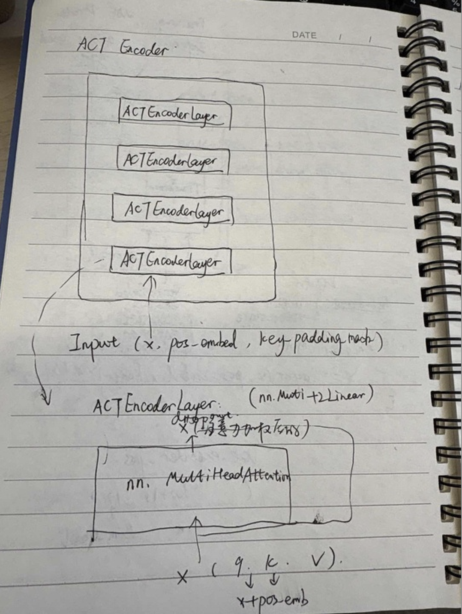
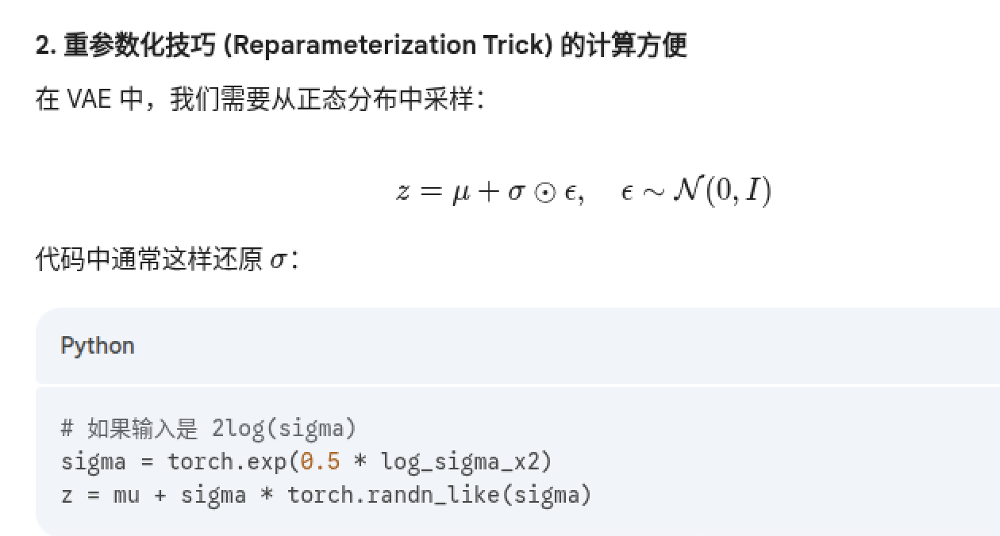
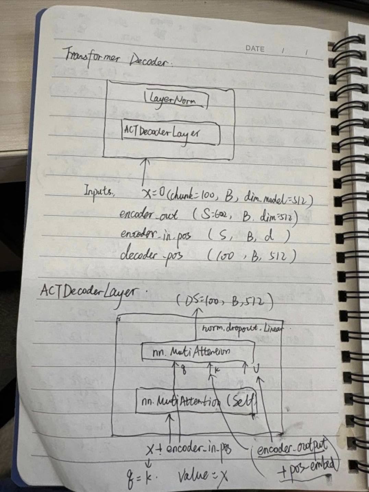

### act network的整体结构

 

> [!NOTE]
>
> lerobot/src/lerobot/policies/act/modeling_act.py

### act的整体结构

1. vae encoder inputs:
   - action: (Batch, chunk_size=100, action_dim)
   - Robot_state(Batch, state_dim)
2. Transformer encoder:
   - 接收来自vae encoder的输入
   - Robot state:
   - Env_state: (Batch, env_dim)
   - image:(Batch, n_cameras, C, H, W)
3. Vae encoder只在train阶段参与。

### vae encoder

- Dim_model = 512: 编码空间的维度大小

- 对输入进行处理

  - 动作：(Batch, chunk_size=100, action_dim=6) ->nn.Linear()->(B,100, dim_model=512)
  - Robot_state:（Batch, robot_state=6）->nn.Linear()->(Batch,512)->unsqueezed->(B,1,512)
  - Cls_embed: (Batch,1,512)

- Inputs_concate: [cls_embed, robot_state, action_embed] ->(B,1+1+100,512)

- 准备Inputs_concate_feature对应的位置编码pos_embed=(102,512) 采用固定的sin编码

  ------

- 最终输入表示为X=layer(x, pos_embed, key_padding_mask)

  - 注意这里为什么有key_padding_mask, 因为chunk_size=100, 100个动作为一组，但是不一定都是全的，比如末尾动作不足100个有0 padding.

- 看一下网络结构：

  - Vae encoder由多个ACTEncoderLayer组成，每个ACTEncoderLayer是由nn.MultiHeadAttention+dropout+Linear层组成
  - 

------

- 最终输出：是经过注意力加权之后的tensor。（由对应的clas_token的位置取出）
  - Att_output_tensor:(Batch, dim_model=512)

### latent apace处理（from vae encoder）

- Latent_dim=32 定义隐空间的维度

- (Batch, dim_model=512) -> nn.Linear() -> (Batch, 32x2), 第一个32的维度对应高斯分布的均值u,第二个32的维度对应方差
  $$
  2log(\sigma)
  $$
  

- 根据重参数化的采样技巧：

  - 

​	可以得到采样后的latent sample: (Batch, 32)

------

> [!NOTE]
>
> 从上面可以知道，vae encoder只作用于训练的时候。vae encoder输出包含有机器人观测和动作信息的tensor:(batch, 32)会用在act decoder里面。那么在推理的时候不用vae encoder,采用的做法是zero latent,为什么？（比如为什么不用正态分布）

> [!IMPORTANT]
>
> vae中，隐空间被约束为标准正态分布，均值0表示最普遍最平均的状态。这里跟SD中不一样，注意为什么？ LEAVE A QUESTION

## ACT Decoder

### ACT Decoder - transformer encoder

> [!IMPORTANT]
>
> Transformer encoder和 vae encoder的网络结构几乎是一样的。（transformer结构就是vae的一种实现）

所以这里act decoder中transformer encoder的网络结构和上面一样，不赘述。

（即由多个ActEncoderLayer组成，每个ACTEncoderLayer由一个nn.MultiheadAttention + skip connection + dropout + Linear层组成，将输入的数据互相attention之后输出一个包含加权了之后的tensor）

- 输入：
  - Encoder_in_tokens(即vae_encoder_output/transformer encoder input/ 隐空间采样的样本latent sample):(Batch,lantent_dim=32) -> nn.Linear() -> (Batch, model_dim=512)
  - Robot_state: (B, robot_state_dim) ->nn.Linear() ->(Batch,512)
  - Cls:
  - Encoder_pos_emb
  - image_features: (Batch, n_cameras, C, H,W)->
    - 对于每张图片，经过image backbone, nn.Conv2d(fc.in_channels->512) -> (Batch,512, h,w)
    - 对应的pos_embed就是(1,512,h,w)
    - ->transpose->((h,w), batch, dim=512), pos_embed:((h,w)=300,batch,512)
    - ->list(cam_features) 看成300个(batch, 512)
- 输入特征inputs:
  - [encoder_in_tokens(batch,512), robot_state(batch,512),image_feature:(batch,512)...(两个相机一共300x2个cameras特征点)]
  - stack一下是:(sequence_length, batch, dim) s=1+1+300x2=1+1+600
  - 输入的pos_embed:(1+1+600，batch, dim_model=512)
    - 1表示encoder_in_tokens,即从vae encoder拿到的先验tensor,在vae eoncder结构里对应cls;
    - 第二个1表示robot_state
    - 600表示camera的特征长度。
  - 没有key_padding_mask
- 经过transformer encoder的attention一通计算，输出att_out(sequence_len, batch, dim_model)
  - 附：注意经过attention输出的维度和输入都是一样的，在vae_encoder里面输出也是这个维度，只是我们取出了第0位的cls向量作为最终tensor结果。
  - 所以就transformer encoder的输入输出来说，输入是(S=sequence_len, B=batch, D=dim_model),输出是经过注意力加权之后的tensor(S,B,D)

### vae decoder- transformer decoder

- 输入

  - Decoder_in:(chunk_size=100, batch_size, dim_model=512)
  - Decoder_pos_embed:(chunk_size=10-0,512)->unsqueezed(1)->(100,1,512)
  - Encoder_out:(S=602,Batch,D=512)
  - Encoder_embed: 就是前面transfromer encoder的pos_embed, 因为经过attention输入输出都是(S,B,D),维度位置没有变

- 对于transfromer的decoder的网络结构：

  - transformerDecoder由一个actDecoderLayer组成，其中一个ACTDecoderLayer由2个MultiA
  - 对于第一个multiattention块的q, k, v是相对于decoder_in进行self_attention的。

  - 第二个q是decoder_in+decoder_in_pos,k来自于encoder_output+encoder_output_pos,v=encoder_output
  - 最终经过attention后输出的特征tensor是(chunk_size=100,batch,512)
  - ->transpose ->(Batch,chunk_len=100,512)->nn.Linear(512,action_dim=6)->(batch,100,6)

### 损失函数

$$
reconstruction loss + kl_weight*kld_loss
$$

- 这里的reconstruction_loss是L1_loss(predict_action_chunk=b,s,d,  ground_truth_action=b,s,d)

- Kld_loss是vae的dkl(latent_pdf || stand_normal) 均值和方差的维度是(batch, latent_dim=32)

- 上面的损失函数就是vae的损失，其来源来自于：

  

### act推理

- 用queue_size=100存储动作快，如果不采用时间集成的方法，参考原来的论文（https://www.alphaxiv.org/zh/overview/2304.13705），则直接pop_left即可。
- 如果用时间集成，权重wᵢ = exp(-temporal_ensemble_coeff * i)，归一化之后乘以各自的值。
  - coefficient works:
    - Setting it to 0 uniformly weighs all actions.
    - Setting it positive gives more weight to older actions.
    - Setting it negative gives more weight to newer actions.
    - 论文设置0.01，更关注old action
