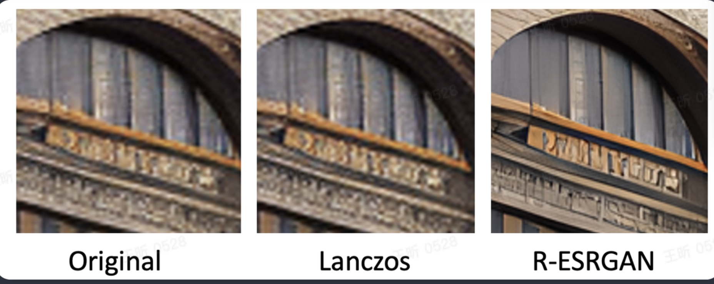

## 为什么需要ai upscaler

为了展现图片在屏幕上，图片一般需要被放大，从而看起来质量就会很低。

## 为什么不用传统的upscaler

传统的resize的算法，比如最近邻插值或者Lanczos插值，只用到了图像的像素。图像容易corrupted或者扭曲。没有很好的算法能准确弥补这些缺失的信息。

## AI upscaler怎么工作

AI upscaler是神经网络训练了大量数据得到的，在图像放大时可以填充细节信息。

