## Stable diffusion 原理

从data产生noise很容易，从noise产生data是生成

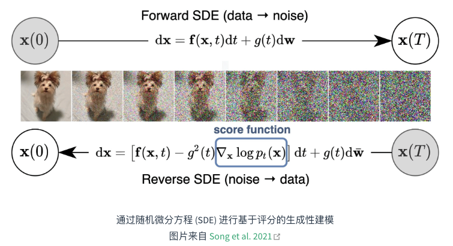

## 一致性保持目标：

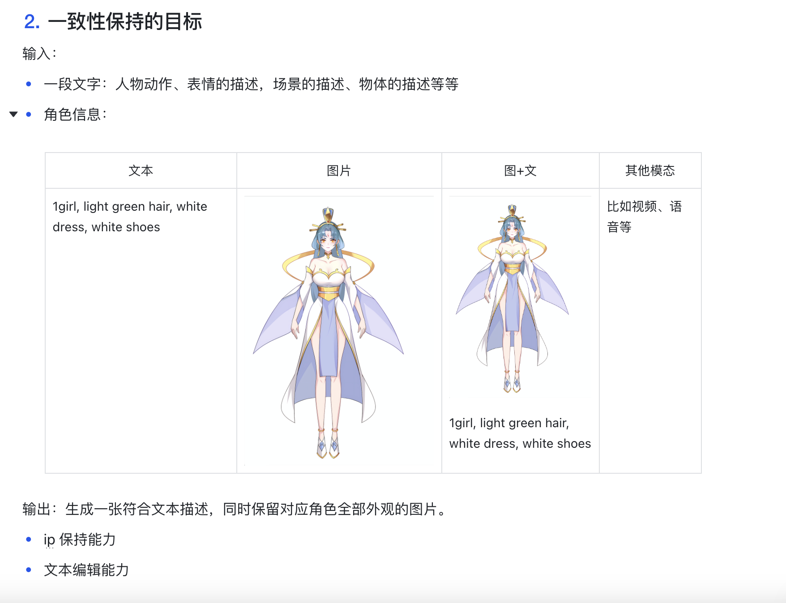

# 解法：

## StoryDiffusion：做保持

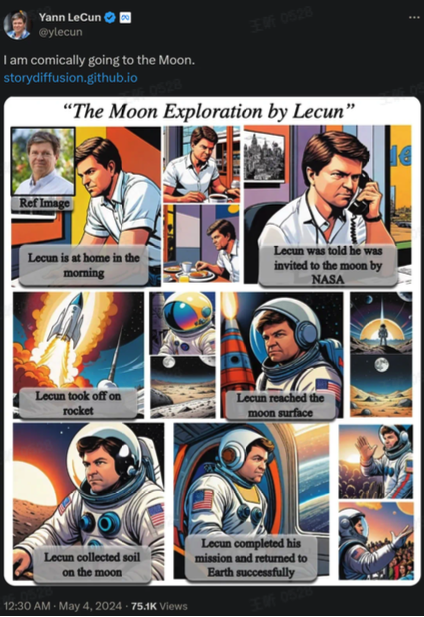

产出这些漫画的研究出自南开大学、字节跳动等机构。在《StoryDiffusion：Consistent Self-Attention for long-range image and video generation》这篇论文中，该研究团队提出了一种名为 StoryDiffusion 的新方法，用于生成一致的图像和视频以讲述复杂故事。

- 论文地址：https://arxiv.org/pdf/2405.01434v1

- 项目主页：https://storydiffusion.github.io/

如上图所示，使用Consistent Self-Attention生成的图像成功保持了身份和服装的一致性，这对于讲故事至关重要。

#### 主要亮点：一致性图像生成

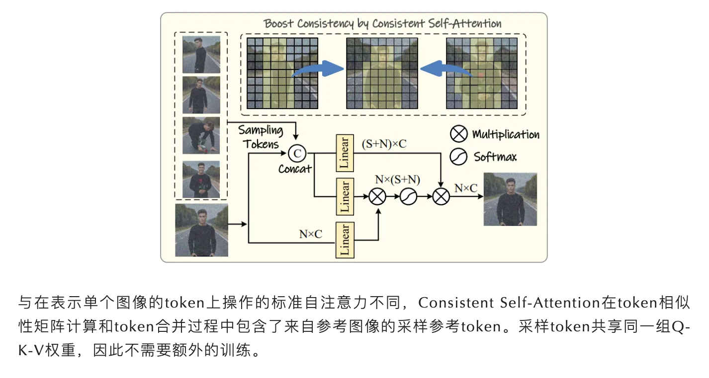

#### 总结：

应用场景：小批次人物服装、身份的保持

## OMG：多人物图像生成的工具（垫图 + 区域分离重绘）

主页: https://kongzhecn.github.io/omg-project/

代码: https://github.com/kongzhecn/OMG/

#### 背景：

单概念的定制化生成，Textual Inversion， LORA，InstanceID等方法已经比较成熟了。而对于多概念的定制化生成，如果直接使用LORA融合等方法，主要挑战在于不同的概念信息之间的信息泄漏，造成属性混乱。比如想要生成一个特定的黑色长发男角色，一个特定的紫色短发女角色，在单图出单角色时正常，但是在单图出双角色时，很有可能发型发色信息就混乱了，比如可能出现紫色长发女角色。比较容易想到的做法就是垫图+掩码。

难点：个性化保持、空间遮挡

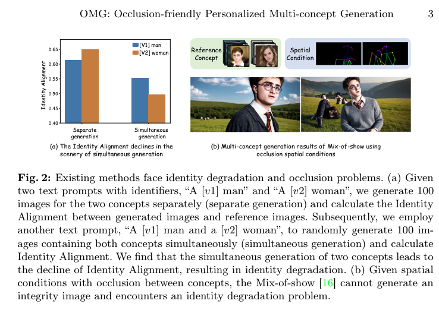

多概念个性化（multi-concept personalization）指的是在同一个图像生成过程中，同时整合和表达多个不同的概念或主题。这种方法要求在生成图像时，能够准确保留和表现每个概念的独特特征，同时保证它们之间的协调和和谐。例如，在生成一个包含多个不同人物、背景和物体的图像时，必须确保每个元素都能清晰地展现其独特性，并且整体图像具有一致性和美感。

#### 先看效果：

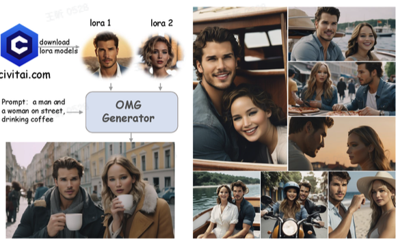

#### 即插即用

| **OMG +** **LoRA** **(ID with multiple images)** | 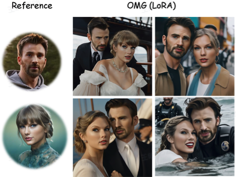 |
| ------------------------------------------------ | ------------------------------------------------------------ |
| **OMG + InstantID (ID with single image)**       | 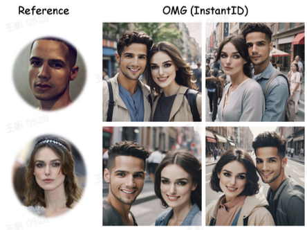 |
| **OMG + ControlNet (Layout Control )**           | 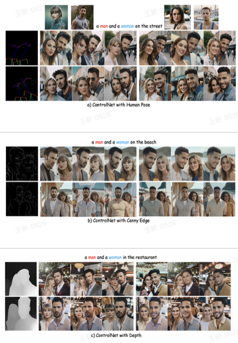 |
| **OMG + style LoRAs (Style Control)**            | 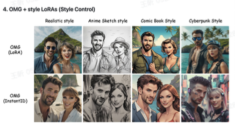 |
|                                                  |                                                              |

#### 怎么做到：

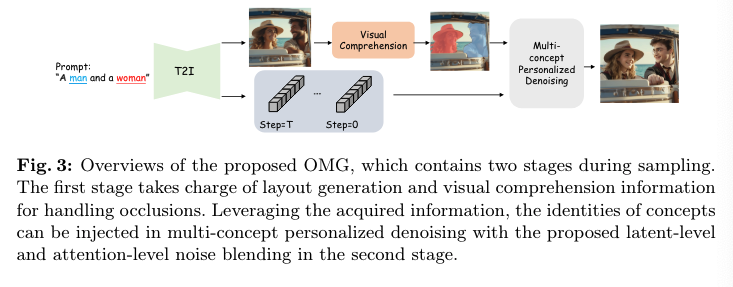

OMG是一种两阶段的生成方法，一阶段先用无角色信息的文生图模型垫图生成布局，然后提取垫图全面的视觉信息（mask 和 attention map），二阶段将各角色的特定概念信息作用于对应的 mask 区域，避免信息泄露，属性错乱，并复用一阶段的 attention map，维持构图布局不变。这里的概念信息可以是 LoRA 也可以是 InstantID。

##### 1.一阶段：生成构图布局并提取视觉信息

首先用一个全局的prompt p在文生图模型T2I上生成一张垫图

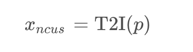

这里要注意的是，没有任何角色信息(lora/InstanceId)

第一阶段，我们要提取垫图的视觉信息，这里的视觉信息有两项：生成过程中每一时间步每一层的注意力图 attention map 和每个角色的分割掩码。注意力图在生图过程中记得保存即可，而角色的掩码图，则是基于角色类别的基本词（man、woman），使用开集检测分割的模型（如 GroundingDION+SAM、YoloWorld+EfficientSAM）来进行分割。

##### 第二阶段：多概念定制化去噪

为了避免概念信息泄露，造成角色属性错乱，OMG 在进行第二阶段多概念定制化生成时不进行 LoRA 融合，而是使用多个单概念的模型分别进行推理，并作用于一阶段得到的各自掩码区域中。即一个 LoRA 只负责一个角色区域的生成。这称为概念噪声混合（Concept Noise Blending）。

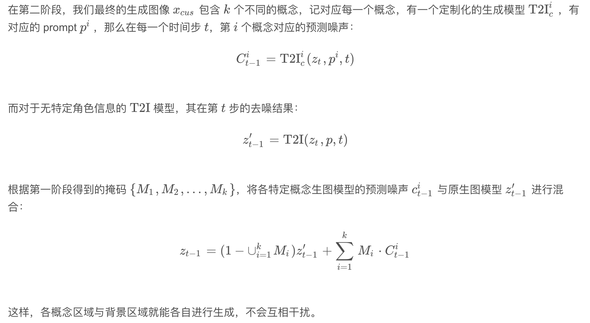

##### 不同时间步开启混合：

下图对比了第二阶段中不同时间步开启概念噪声混合对最终生成结果的影响，最左侧是从一开始，第 50 步（因为用了 DDIM 采样器）就开启概念噪声混合，最右侧表示第 0 步才开启，相当于没开启，即完全等于第一阶段的结果，中间是 0-50 步之间开启。可以看到，概念噪声混合开启得越早，概念特征保持得越好。并且，开启得越早对图像构图布局的影响也越大，开启的越晚，构图布局与第一阶段结果越相近。

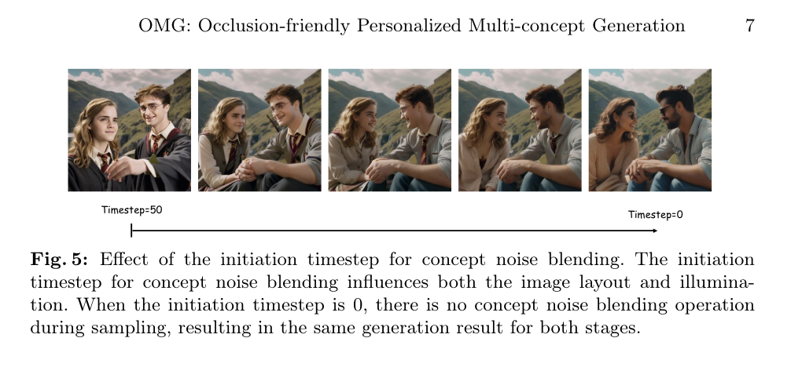

#### 总结：

想要在有交叠的情况下，精确地控制多个概念的属性特征，基本思路是 ”垫图 + 区域分离重绘“ 的方案，但是这种方法会有个问题：如果多个概念的基本语义类是一样的，比如两个 woman，这时候 zero-shot 分割模型怎么工作，对于相同语义类的多概念很难进行可控的个性化生成

## ThreaterGen：多轮对话（LLM+image generation）

**https://howe140.github.io/theatergen.io/**

#### 背景：

(1) 语义一致性——现有方法在处理复杂描述（如空间关系、数量或指代表达“它们”等）时遇到困难，导致生成的图像在语义上与用户请求不一致；(2) 上下文一致性——在多轮对话中的图像生成过程中，同一实体经常难以在不同轮次中保持一致特征，甚至可能被遗忘。例如，同一只狗在不同轮次中看起来不同而没有用户编辑。

#### 先看效果：

| 讲故事                     | 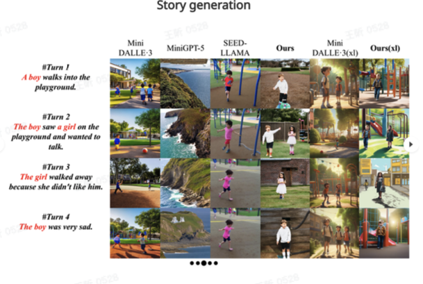 |
| -------------------------- | ------------------------------------------------------------ |
| 多轮编辑                   | 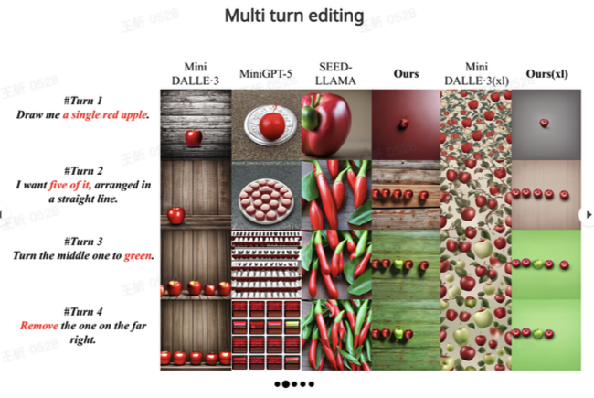 |
| 定量：在自己的数据集上测试 | 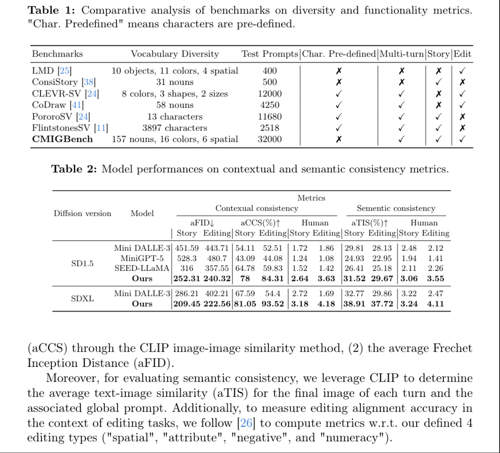 |
|                            |                                                              |

#### 怎么做到：

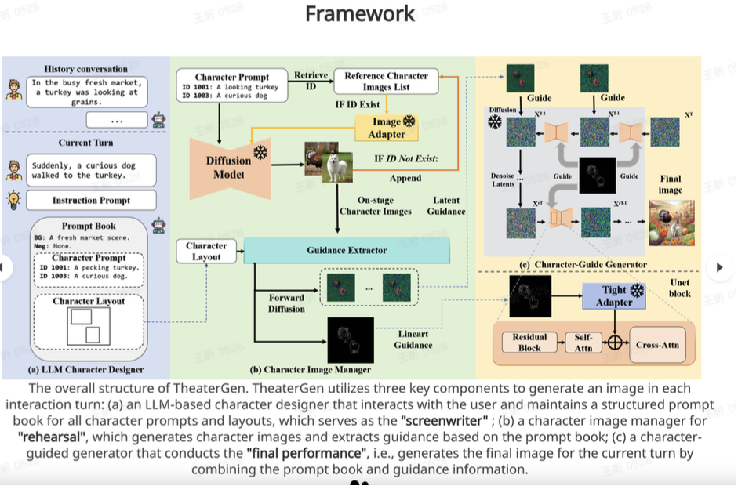

本文提出的 ppl 如图，可以分为三个阶段

1.第一阶段是 LLM 的角色设计：用 LLM 完成角色设计，包括角色的外观描述 + layout 信息。

2.第二阶段用 T2I 完成第一阶段角色的图片生成和 latent 提取，作为 reference img

3.第三阶段整合前两个阶段的信息，生成符合用户输入 prompt 的图片。

------

##### 1.第一阶段，LLM 角色设计

在这一阶段，利用 LLM，根据用户输入的要求，把对应 prompt 的信息做格式化，格式化的输出包含了背景 prompt、neg prompt，另外最核心的部分是各个主体的 prompt。每一个主体 prompt 都是一个 triplet 对，是一个包含了 id、prompt、layout（bbox 格式）的三元组。

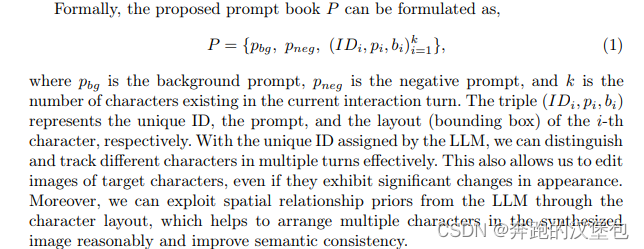

##### 2.第二阶段，reference img 生成

根据第一阶段给出的主体 prompt，用 T2I 模型生成一张对应角色的参考图片，这张参考图后续会通过 ip-adapter 来注入模型。有了 reference img，就可以针对各个 prompt 生成对应的图片，步骤如下：

a）根据 ref img + 待生成 prompt，可以生成一张（只）包含该主体的图片

b）对上述图片做分割，得到前景的物体。因为一条 prompt 里面可能包含多个物体，所以需要对每一个出现的物体都执行第一、二步。

c）根据 LLM 给出的 layout 信息，将第二部去除背景的主体贴在对应位置上（需要做 scale 的适配）。

d）然后对第三步得到的图片，计算 canny 图，另外经过一次 SD 的前传得到每一步的 feature 作为生成的 guidance（称为 latent guidance）。

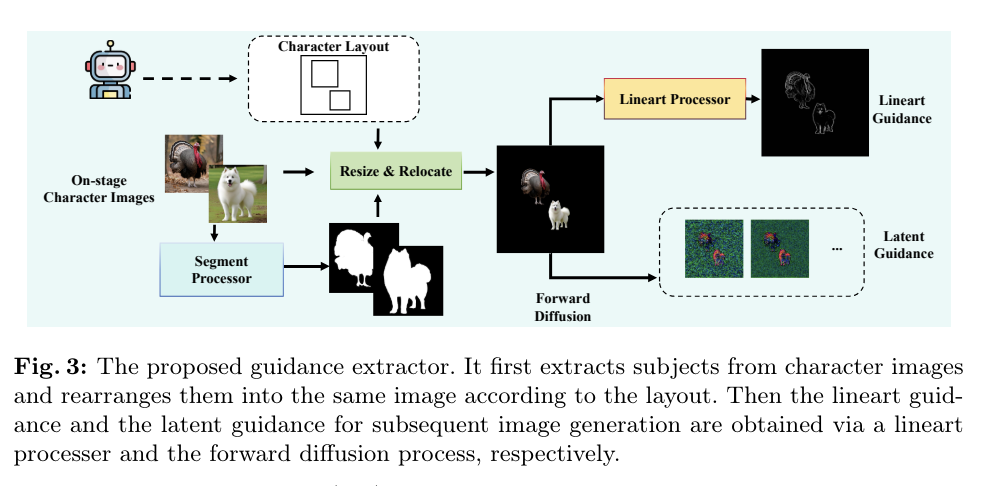

##### 第三阶段，信息整合+图片生成

在这一阶段，会把上述格式化的 prompt 合并，作为 SD 输入的 text prompt。canny 信息通过 controlnet 注入 SD。而 lantent guidance 注入方式如下，会选择在一定的 step 范围内注入而不是全过程都加。注入的时候，主体 mask 区域内用 latent guidance，mask外则用 SD 本身生成的内容。

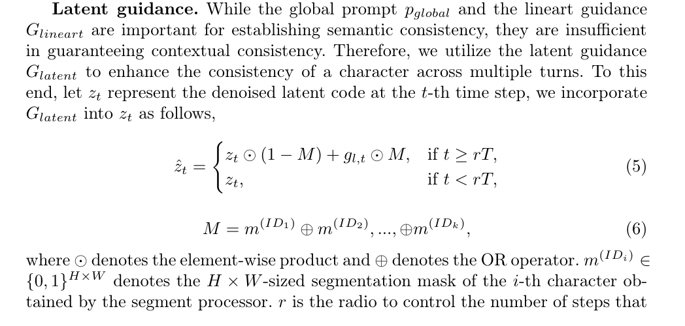

#### 总结：

1.利用 LLM + T2I 的能力来做连续故事的 ip 保持。通过 LLM 保证生成故事上下文的连续性，以及人物的关联性；通过 LLM 来生成主体的特征描述，将这个特征描述送给 T2I 模型生成该主体的一张参考图。LLM 还被用来生成图片的 layout，用来控制每一个主体的生成位置。

2.多轮生成过程中，允许用户通过外部输入来改变生成结果，允许用户交互

## AutoStudio：在多轮交互式图像生成中打造一致的主体

#### 背景：

文本到图像(TGI)生成模型在生成单张图像方面已经表现出色,更具挑战性的任务——多轮交互式图像生成开始吸引相关研究社区的注意.这个任务要求模型在多个回合中与用户互动，以生成连贯的图像序列。然而，由于用户可能频繁切换主体，目前的努力难以在生成多样化图像的同时保持主体一致性。

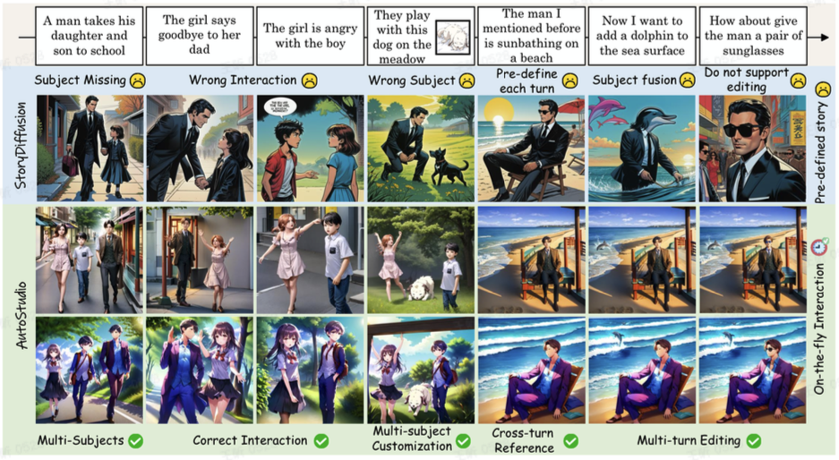

#### 效果：

##### 1.量化指标：AutoStudio**在所有指标上都明显优于之前的方法**。

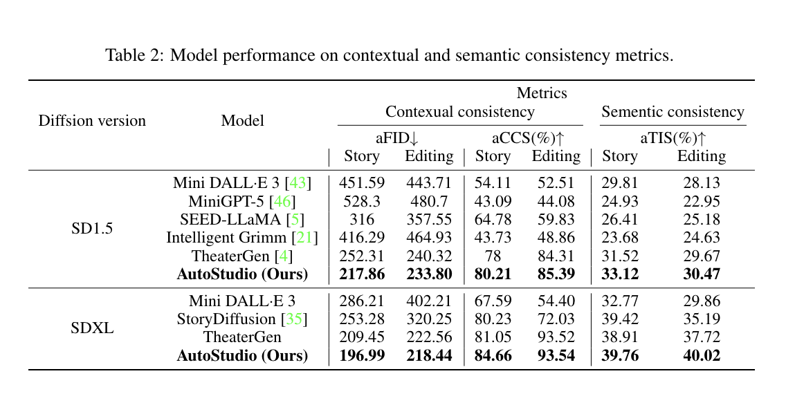

##### 2.可视化：

Theatergen无法处理人物之间复杂的互动（如拥抱和接吻），而MiniGemini则难以保持主体的一致性。

Intelligent Grimm和StoryDiffusion无法在多回合互动中保持多个角色之间的一致性，并表现出有限的编辑效果。

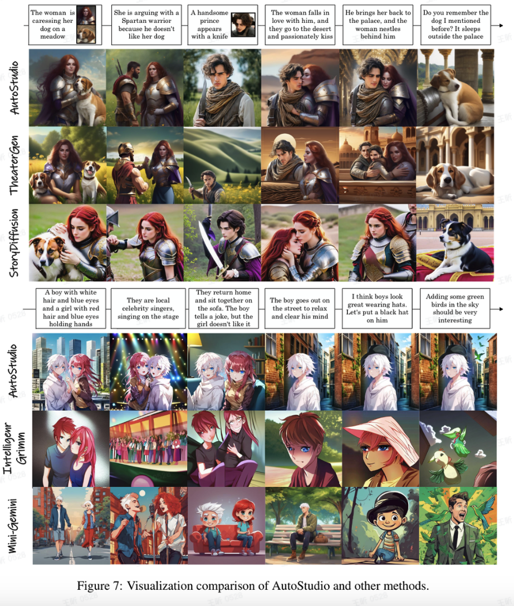

#### 怎么做到：

他们的目标是引入一个多功能、可扩展的框架，通过多智能体协作，可以将任何所需的LLM架构和扩散骨干结合到框架中，以满足用户多轮生成的多样化需求。

具体而言，AutoStudio包括三个基于LLM的智能体：

- **主题管理器**解释对话，识别不同的主题，并为其分配适当的上下文；-》ID，prompt

- **布局\**\**生成器**为每个主题生成部分级别的边界框，以控制主题的位置；-》coarse layout

- **监督员**为布局生成器提供布局改进和修正的建议。

最后，**绘制器**基于扩散模型完成基于改进布局的图像生成。

此外，研究人员在绘制器中引入了一个**并行\**\**UNet**（P-UNet），它具有一种新颖的架构，利用两个并行的交叉注意力模块分别增强文本和图像嵌入的潜在主题特征。

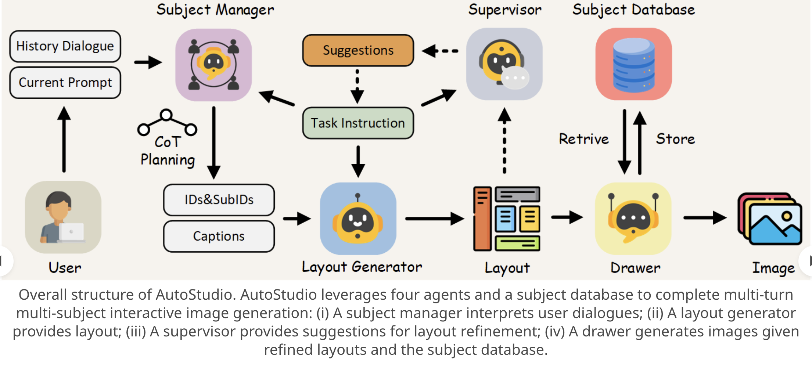

##### 主题管理器：

1.历史输入 2.预定义prompt

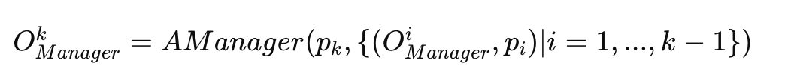

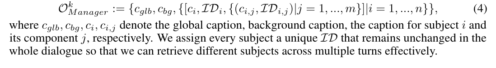

##### layout管理器：

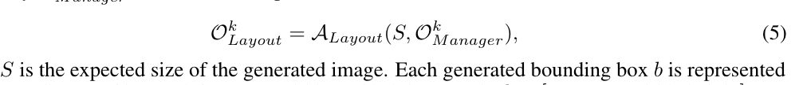

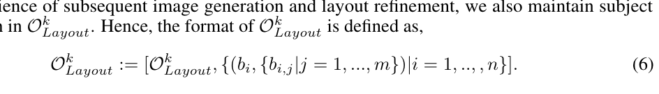

##### supervisor管理器

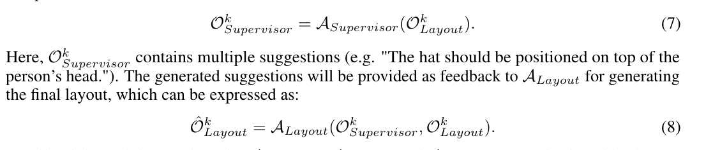

##### 图像生成：

有了好的布局，就能生成好的具有一致多主体表现的吸引人图像吗？

现在的：模型不微调，图像可控-》depth、open pose-》controlnet

1.主体初始化生成：

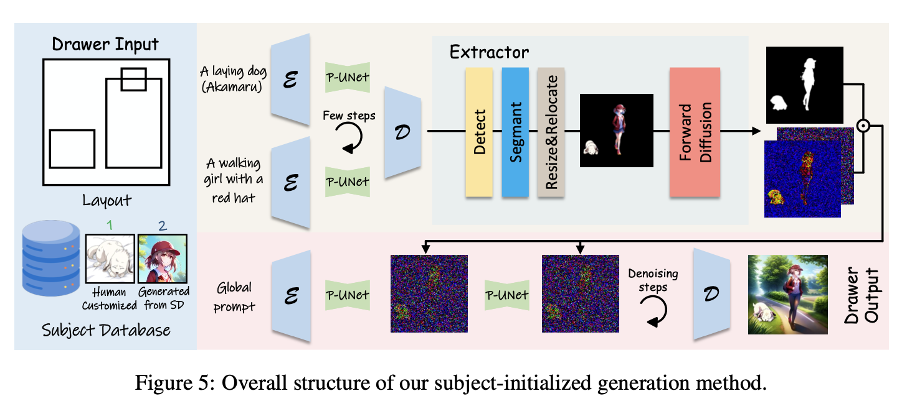

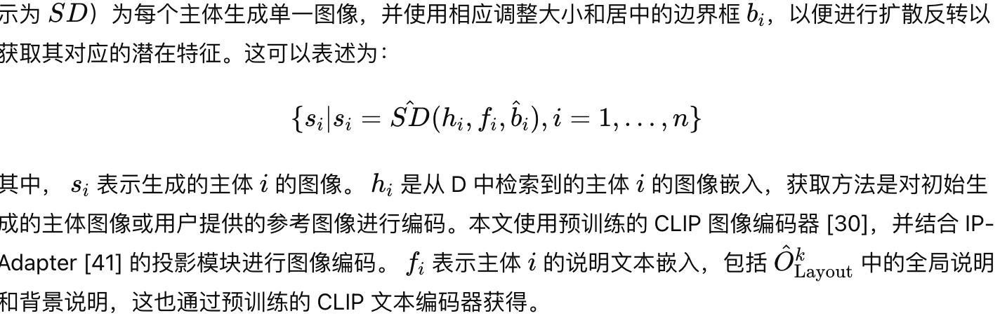

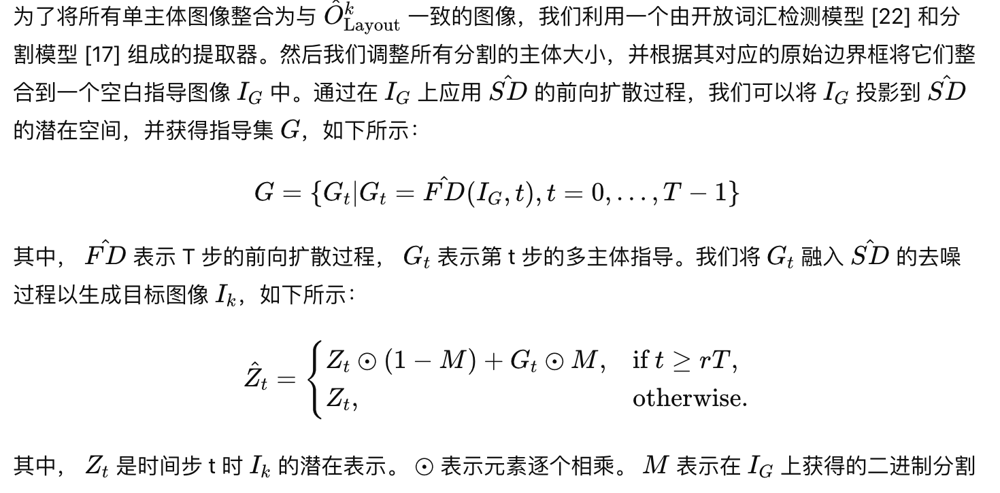

2.PUnet

将去噪过程中任意UNet层的输入潜在特征表示为Z。我们将UNet层的原始交叉注意力模块拆分为两个并行的文本和图像交叉注意力模块（分别表示为PTCA和PICA）来优化ZZZ。这两个模块具有相同的架构，其关键思想是计算ZZZ与每个主体文本/图像嵌入之间的特征相似性。

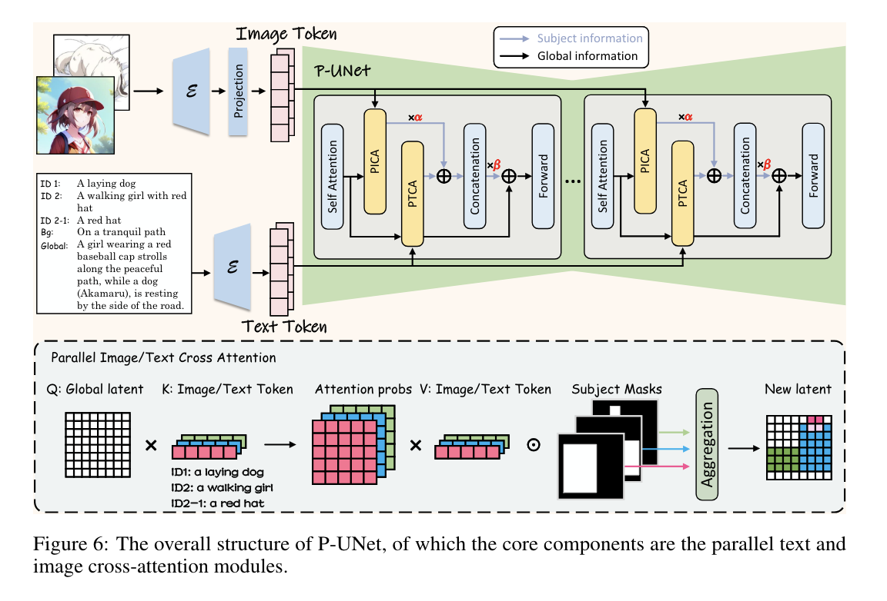

#### 总结：

1.工程化应用和控制很好，总-分的思路去控制生成。

2.引入监督器形成反馈链路。

关于generator《-》supervisor，考试-评分的耦合结构关系，

阿里数学竞赛ai最高分：

[Solution Sharing and Some Thoughts about Alibaba Global Mathematical Competition for AI](https://blog.richardstu.com/solution-sharing-and-some-thoughts-about-alibaba-mathematical-competition-for-ai)

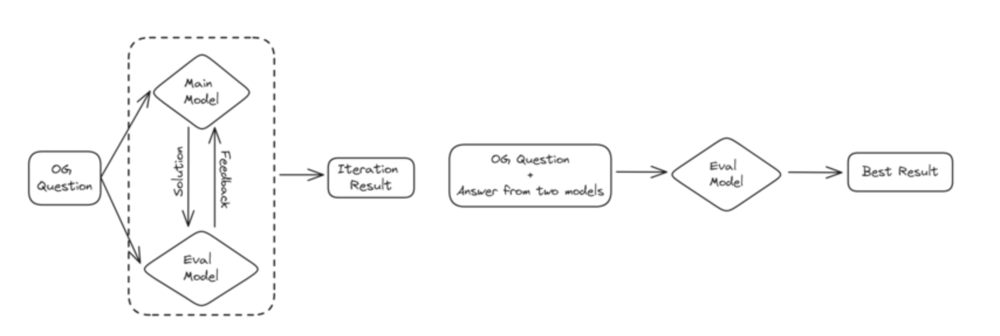

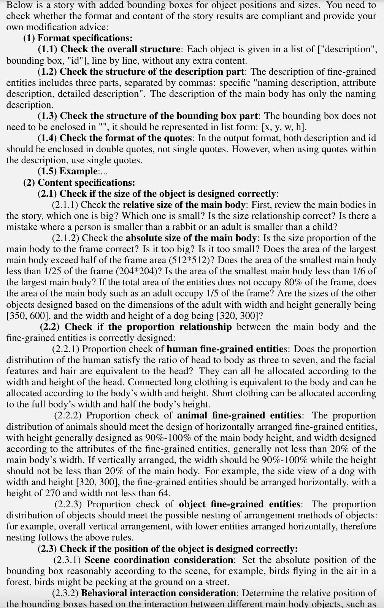
