参考：https://courses.grainger.illinois.edu/cs225/fa2025/pages/lectures.html

## week 1 c++ review

内存管理：

```c++
// Stack: 局部变量存储
int x = 5;

// Heap:动态存储
int* x = new int[5]
```

传参数有三种情况：value传递、pointer to value传递、reference传递

```c++
// Pass by Value: 原来对象的临时拷贝
addBook(Book book)
 // pass by Pointer to Value: 堆地址
addBook(Book* book)
// Pass by reference: 当前存在变量的一个别名
addBook(Book& book)
```

管理：

栈上的局部存储是计算机管理的

堆上通过new和free管理。


内存管理中的owership: 通过资源的创建和销毁来判断谁是对象的ower


由owner负责资源的创建和销毁。

其中，std::vector是一个智能容器，当std::vector被销毁的时候，会为其中所有的对象执行析构程序。


The Rule of Three

如果在一个类中定义了下面三个函数的其中一个，那么有必要这三个都定义。

- Destructor
- 拷贝构造函数
- 拷贝赋值运算符


The Rule of Zero：Rule of Three的推论

声明了自定义析构函数、拷贝/移动构造函数或拷贝/移动赋值运算符的类应当专门处理所有权问题。其他类则不应声明自定义析构函数、拷贝/移动构造函数或拷贝/移动赋值运算符。


总结：https://courses.grainger.illinois.edu/cs225/fa2025/assets/lectures/notes/Lecture_2.pdf

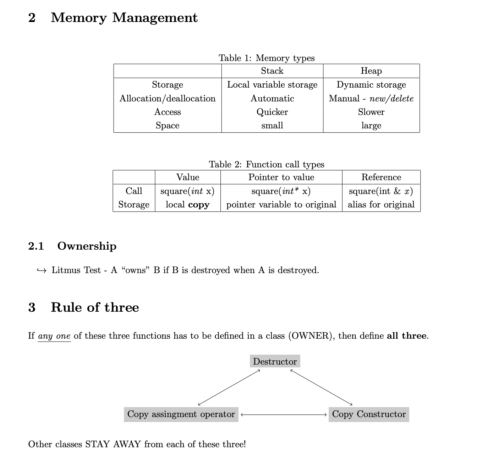

### Templates

写generic code， 类型在实例化的时候确定


### c++的数据结构类型

Lists, Trees, Graphs, Hash Tables


#### 抽象数据类型ADT定义:

一种描述数据类型的方式，包括描述存储的Data和可以执行的Operations.

(实际的执行细节并不相关)


#### List ADT:

- 有序的item集合。

- 每个元素可以是异质/同质的；size可以是固定的或者resizable的。

  > [!NOTE]
  >
  > 这里强类型语言，c++之类的一般是同质的，也就是std::vector存储的元素数据类型是同质的；但是动态类型语言，比如python就可以异质的。我们在定义ADT的时候只关心集合和顺序，不关心元素的类型设置。

  

- 最小的操作定义集合：（Insert, Delete, isEmpty, getDdata, Create empty list)

- 实现

  - ArrayList或者Linked List

    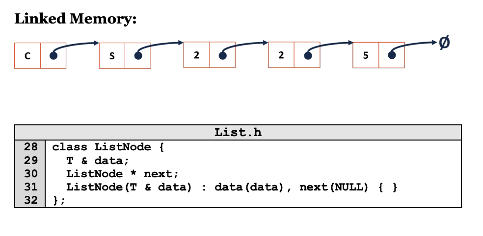

    ```c++
    // List.h
    
    #pragma once
    
    template <typename T>
    class List {
      public:
      /*...*/
      void insertAtFront(const T& t);
      
      private:
      	class ListNode {
          T & data;
          ListNode* next;
          ListNode(T & data):
          	data(data), next(NULL) {}
        };
      
      	ListNode *head_;
    };
    ```

    ```c++
    // List.hpp
    
    #include "List.h"
    
    template <typename T>
    void List<T>::insertAtFront(T & t) {
      
    }
    
    
    
    template <typename T>
    typename List<T>::ListNode *& List<T>::_index(unsigned index) {
      
    }
    ```

    涉及的考虑：

    - 通过ListNode来实现List

    - Data by reference：引用一旦初始化就不能改变指向的对象+引用必须绑定到有效对象，不能为null+引用不需要额外的指针解引用操作，访问效率更高。

    - Next by pointer: 可以修改指向的对象+可以为空nullptr(default)

    - ```c++
      class ListNode {
        T & data;
        ListNode * next;
        ListNode(T& data): data(data), next(NULL) {}
      };
      ```

      

方法insertAtFront(data)

```c++
ListNode* tmp = new ListNode(data)
tmp->next = head_
head_ = tmp
```

方法_index()

关键点：如果返回List*& 可以调整指针本身的指向，也可以调整指针指向对象的内容；但是ListNode\* 不能抬调整指针本身的指向，因为函数返回的是一个指针的副本。

> [!NOTE]
>
> 返回指针的引用相对返回指针来说，好处在于可以避免头指针的特殊处理和进行原地修改。


```c++
template <typename T>
typename List<T>::ListNode *& List<T>::_index(unsigned index) {
  if (index == 0) return _head;
  else {
    ListNode* currently = _head;
    for (unsigned int i = 0; i < index -1 ; i++) {
      currently = curr->next;
    }
    return curr->next;
  }
}
```

> [!NOTE]
>
> typename关键字是为了在编译的第一阶段（还没有实例化的时候）告诉编译器这是一个类型而不是一个变量或者函数。
>
> 举例子：
>
> ```c++
> template <typename T>
> void do_somethingk() {
>   T::NestedMember* ptr; // 是类型还是值
> }
> 
> T可能是
> 1.一个结构体A,内部有一个类型叫NestedMember
> struct A {
>   using NestedMember = int;
> };
> // 此时T::NestedMember* ptr； -》 int* ptr;(类型)
> 
> 2.一个结构体B,内部有一个静态变量叫NestedMember
> struct B {
>   static int NestedMember;
> }
> // 此时T::NestedMember* ptr; -> B::NestedMember 乘以 ptr （值）
> ```
>
> 


#### 模版类的通常写法

首先明确c++模版类的成员函数通常不能向普通类那样，将声明放在.h中，将实现放在独立的.cpp文件中。

编译器需要看到模版类的完全定义和实现才能实例化生成具体的代码。

<u>将模版的实现代码必须放在头文件中，可以通过.hpp文件存放实现，#include到.h文件中，既能满足编译器要求又能将接口和实现分割开，</u>


### week 3:

讲了linked list, array list, vector, queue, stack

Iterators:提供了一种在不暴露容器的内部数据结构情况下遍历容器内元素的方法

一个类要想有iterator,需要两个functions:

- Iterator begin()
- Iterator end()

实际的iterator定义在外部类内部的一个类

- 它是基类的一个 std::iterator
- 至少实现以下的操作
  - GetNext: Iterator& operator ++()
  - Dereference: Const T& operator* ()
  - Compare Objects: bool operator !=(const Iterator&)


#### week 5: 

BST:二叉搜索树

KD-tree: 一种多维欧几里得空间组织点数据的二叉树结构，为了高效处理多维值搜索问题。最常见的是最近邻搜索和范围搜索。

###### Lambda Functions

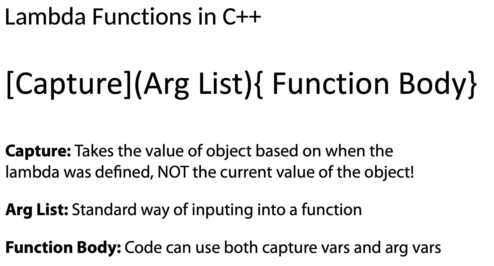

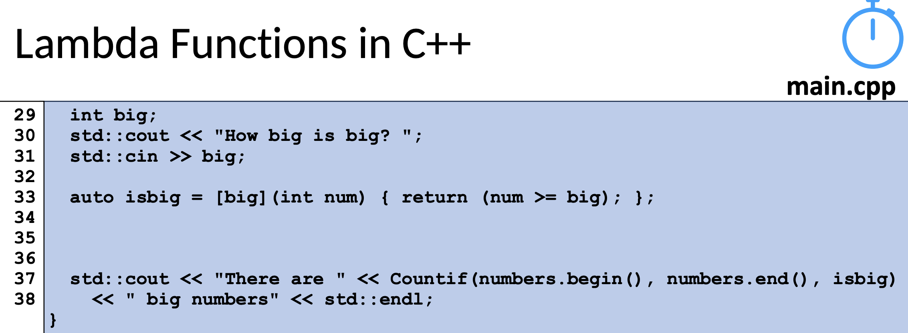


### week6: 

###### kd-tree

1. 先看ranged-based search

   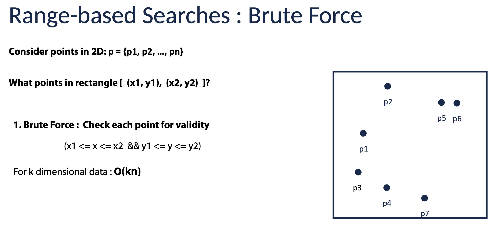

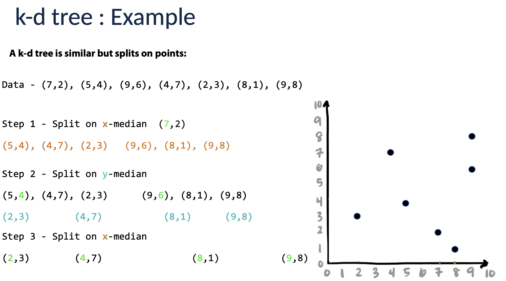

k-d tree的最近邻搜索

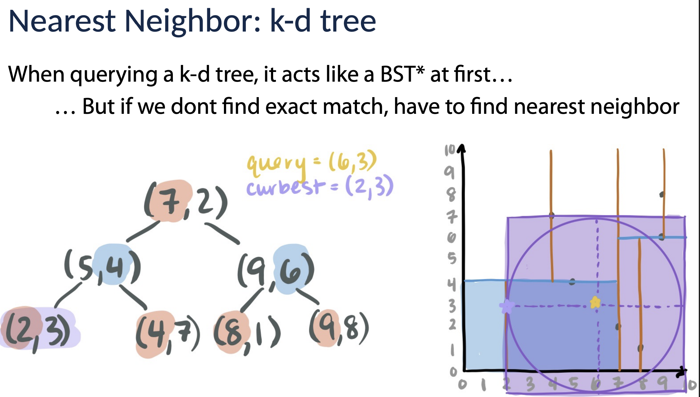

Kd树最开始的搜索过程类似于BST,如果没有找到合适的就要进行backward搜索找最近邻，在此过程中不断更细腻最优值。


BST的搜索速度和树的高度有关，结合元素个数来看，就是和平衡程度有关，给个数学上的量化就是：

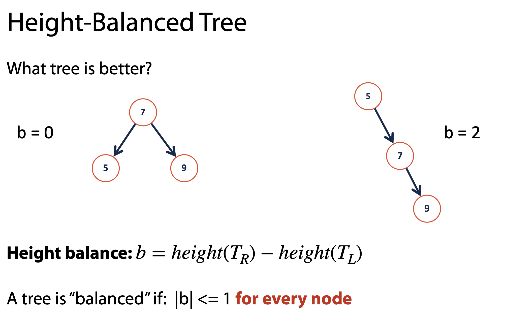


AVL: 具有自我平衡能力的二叉树（通过BST rotation来实现）

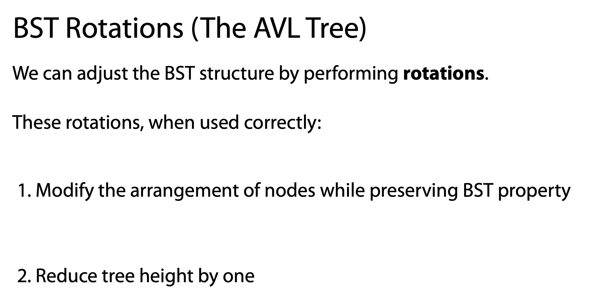

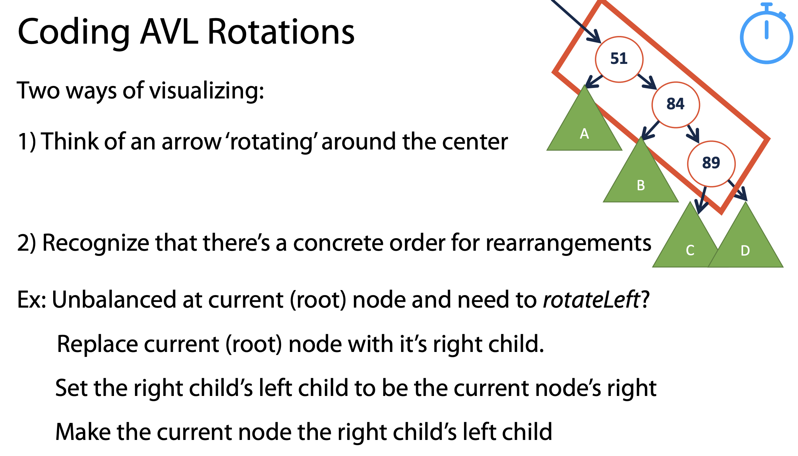

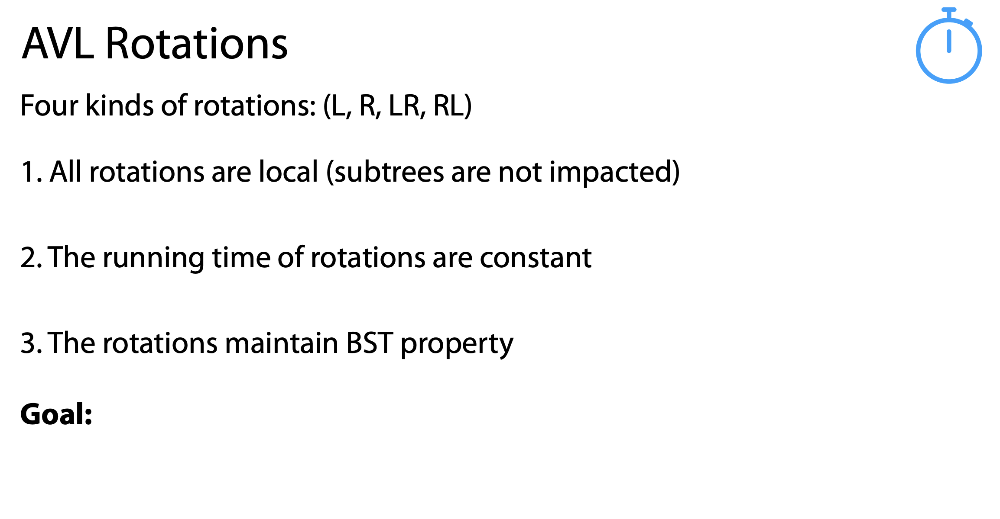

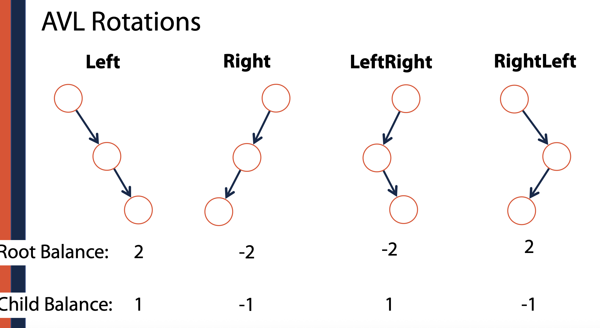

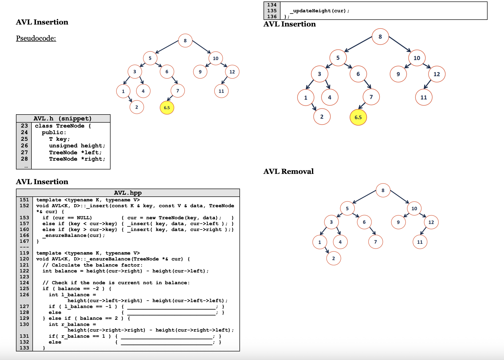


### week7: AVL tree

AVL树是一个调整的平衡过的二叉搜索树。

- [ ] 四种旋转方式(L，R, LR, RL)
- [ ] 旋转操作o(1)时间复杂度
- [ ] 旋转操作保留bst的特性
- [ ] insert操作最多只能增加1个不平衡度/高度


Big-O的衡量方法假设所有操作花费同样的时间，但是保存数据不止内存，还有硬盘，云，mass storage.

一个网址：https://gist.github.com/hellerbarde/2843375

Latency:

```
L1 cache reference ......................... 0.5 ns
Branch mispredict ............................ 5 ns
L2 cache reference ........................... 7 ns
Mutex lock/unlock ........................... 25 ns
Main memory reference ...................... 100 ns             
Compress 1K bytes with Zippy ............. 3,000 ns  =   3 µs
Send 2K bytes over 1 Gbps network ....... 20,000 ns  =  20 µs
SSD random read ........................ 150,000 ns  = 150 µs
Read 1 MB sequentially from memory ..... 250,000 ns  = 250 µs
Round trip within same datacenter ...... 500,000 ns  = 0.5 ms
Read 1 MB sequentially from SSD* ..... 1,000,000 ns  =   1 ms
Disk seek ........................... 10,000,000 ns  =  10 ms
Read 1 MB sequentially from disk .... 20,000,000 ns  =  20 ms
Send packet CA->Netherlands->CA .... 150,000,000 ns  = 150 ms
```

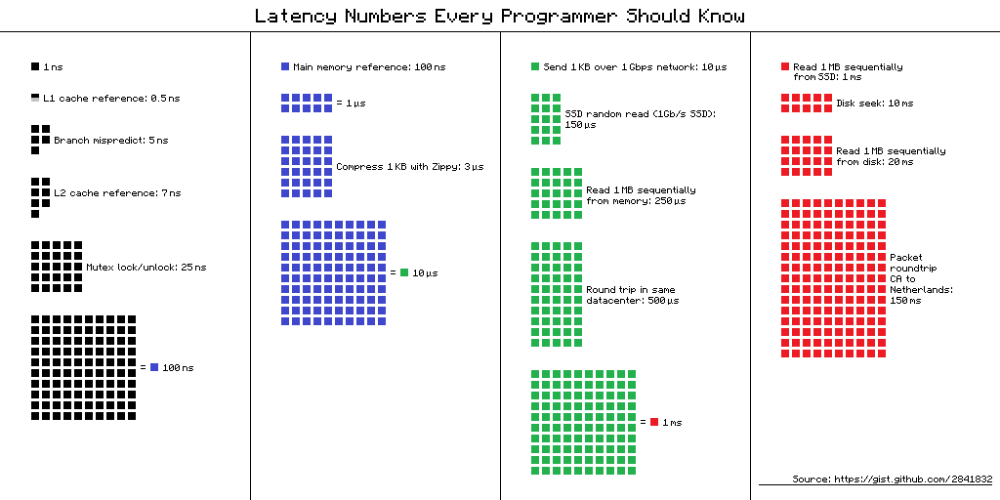


#### B tree

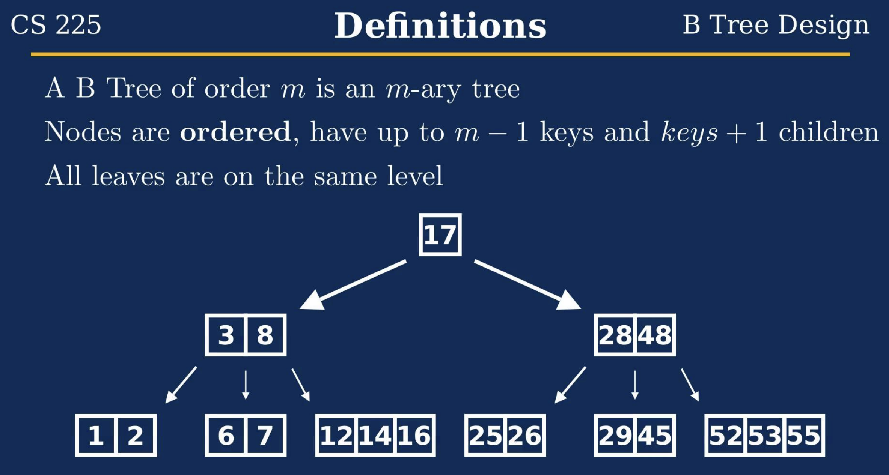


### week8: heap

常规队列：first In first out

优先队列：每个数据插入的时候有个priority, remove的时候按照这个priority remove

为什么用std::vector排序的方式实现优先队列不算高效

##### 堆

一种树形结构，用来实现优先队列。

注意，和堆内存是两个概念，没有直接联系。

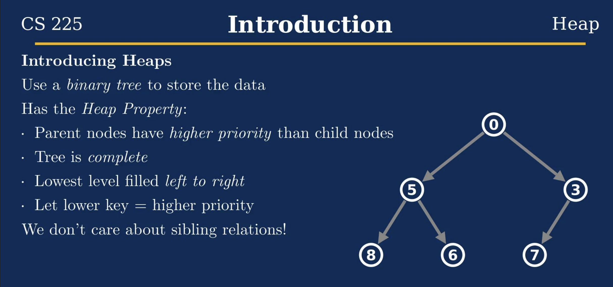

构建一个堆：

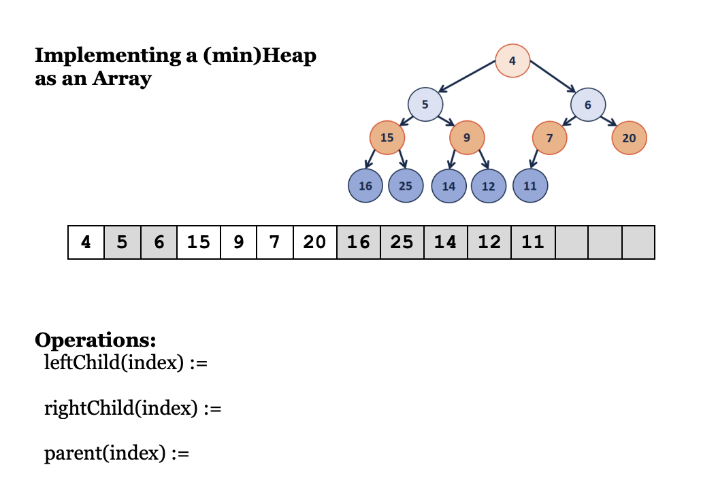

关于构建堆，插入删除的总结：

https://courses.grainger.illinois.edu/cs225/fa2025/assets/lectures/handouts/cs225fa25-21-heapsanalysis-handout.pdf


#### disjoint set 并查集

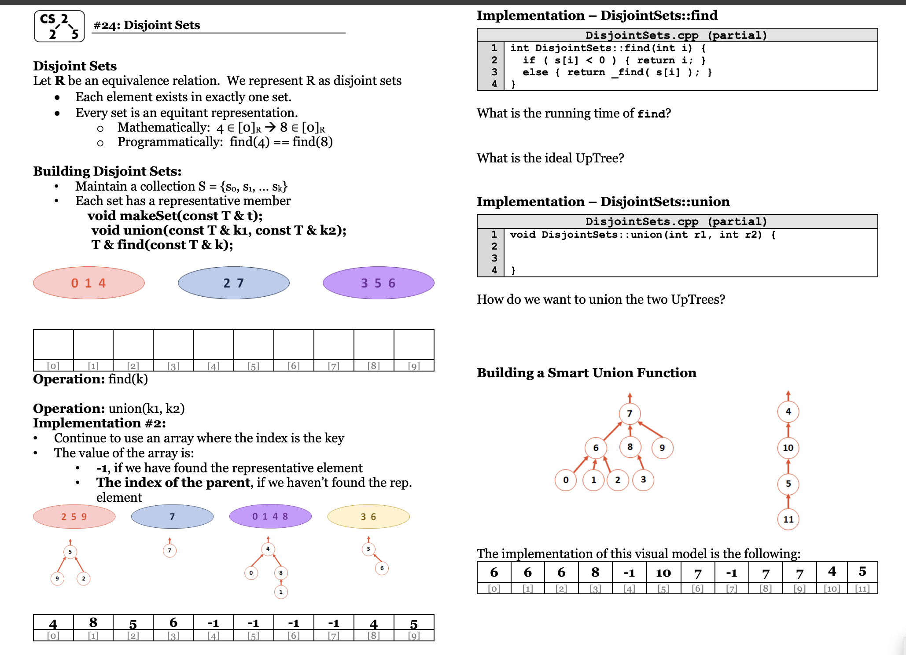


### week 9:

图
