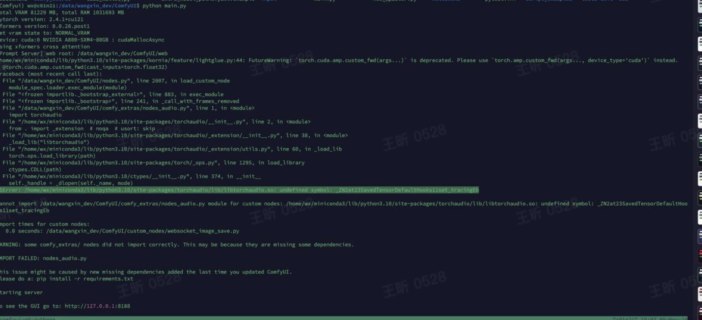
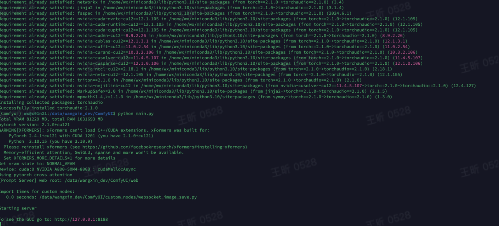
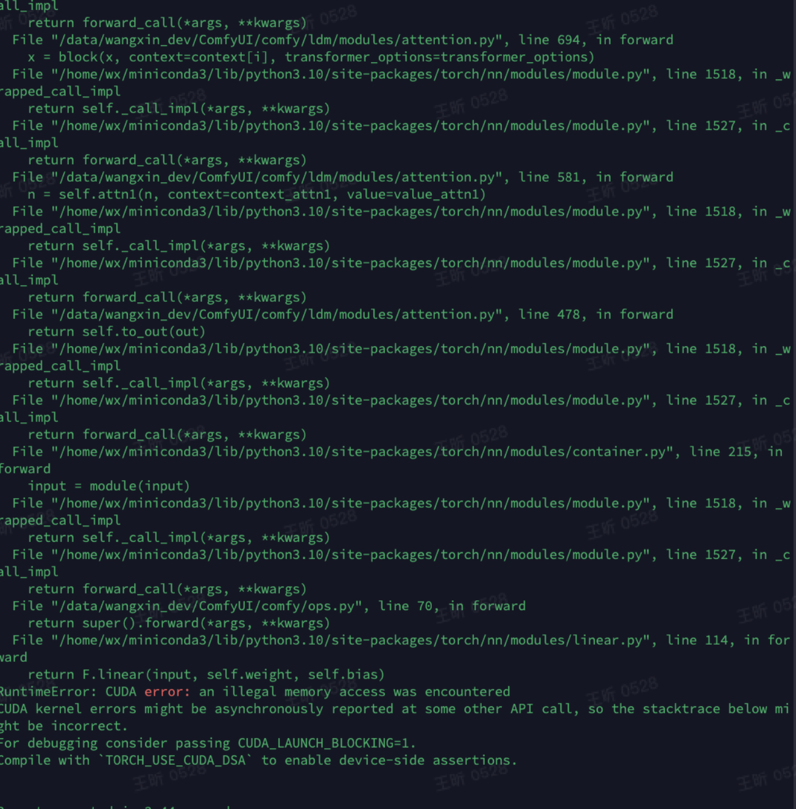
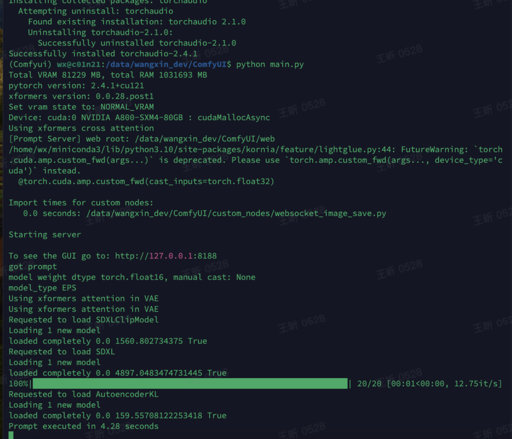
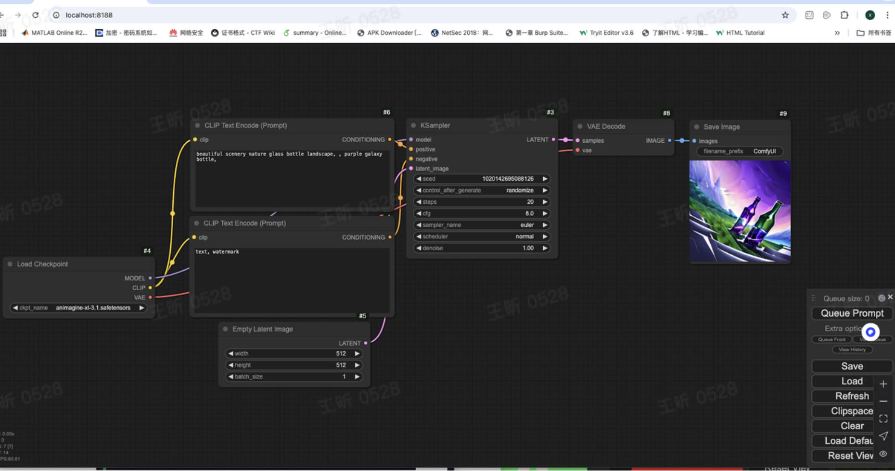
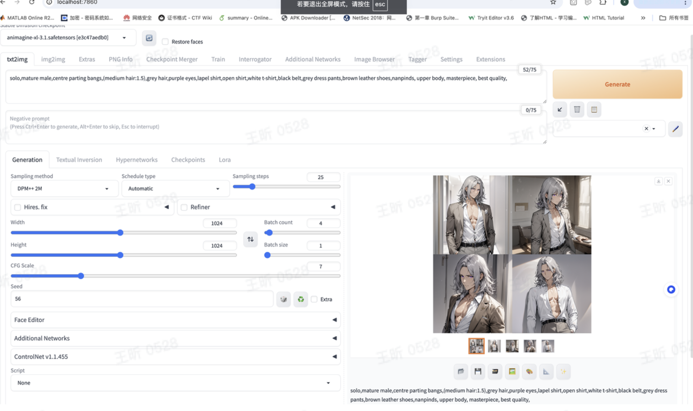
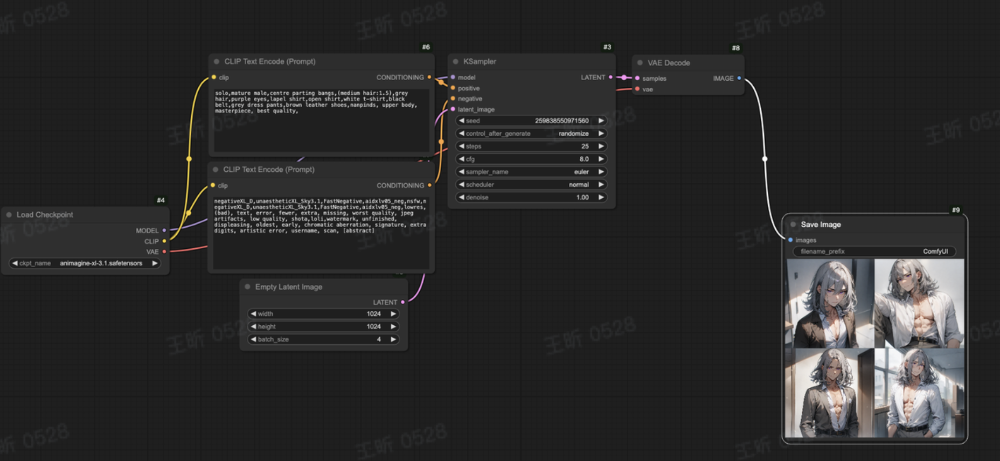

### 环境安装

1. import torchaudio的时候报错“undefined symbol”

   

推测还是版本不兼容，按照下面这个博客的版本进行安装

**pip install torch==2.1.0**

**pip install torchvision==****0.16.0**

**pip install torchaudio==****2.1.0**

**https://blog.csdn.net/qq_45599476/article/details/140207176**

再次启动就好了

2. 在点击Queue Prompt出图的时候报错

   

现这个工程中**xformers**也没有成功运行。

**https://github.com/comfyanonymous/ComfyUI/issues/4870**

**The torch repo has a release wheel of xformers that works with torch 2.4.1**

**pip3 install -U xformers --index-url** **https://download.pytorch.org/whl/cu124** **should pull**

***0.0.28.post1\***

**https://pytorch.org/get-started/previous-versions/**

解决还是变包：

**pip install torch==2.4.1**

**Pip install torchvision==0.19.1**

**Pip install torchaudio==2.4.1**

**pip3 install -U xformers --index-url** **https://download.pytorch.org/whl/cu124** **should pull**

***0.0.28.post1\***

成功出图

### 测试：

安装和sd跑同一个prompt

