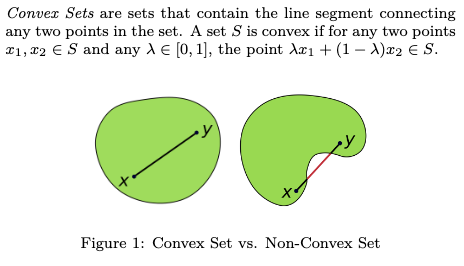
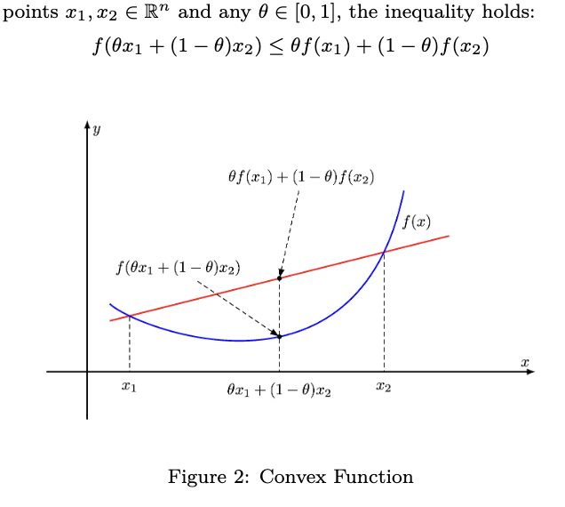
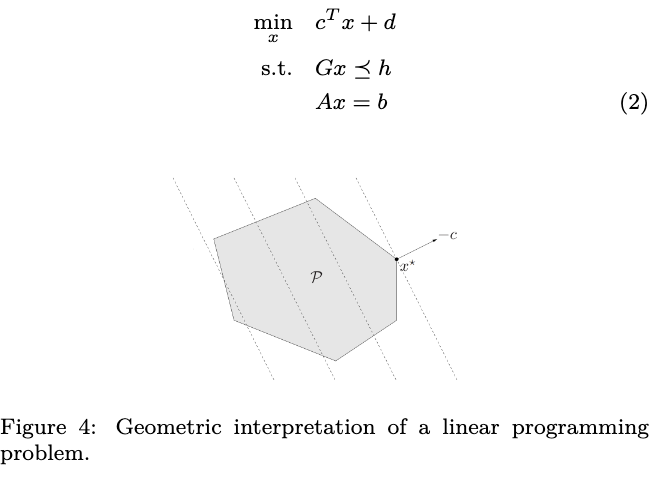
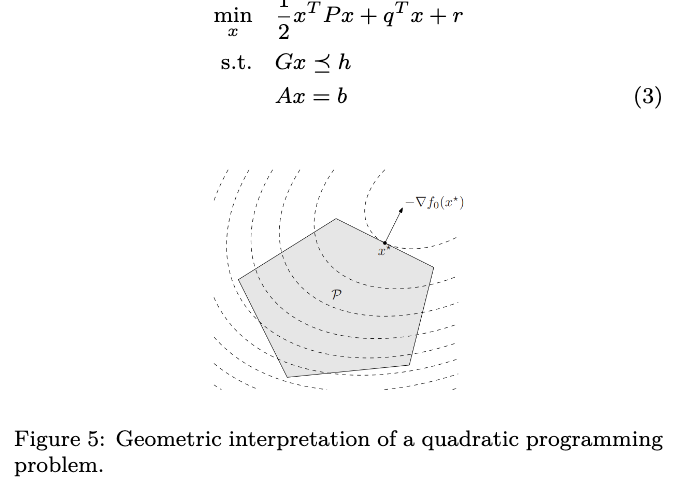
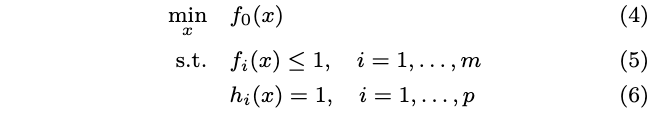
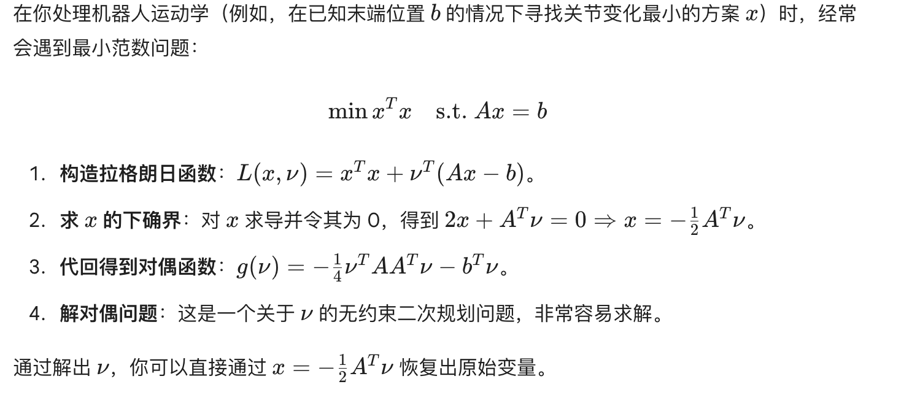
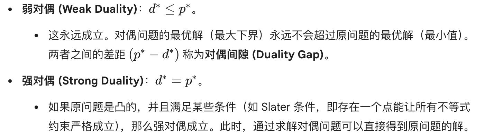
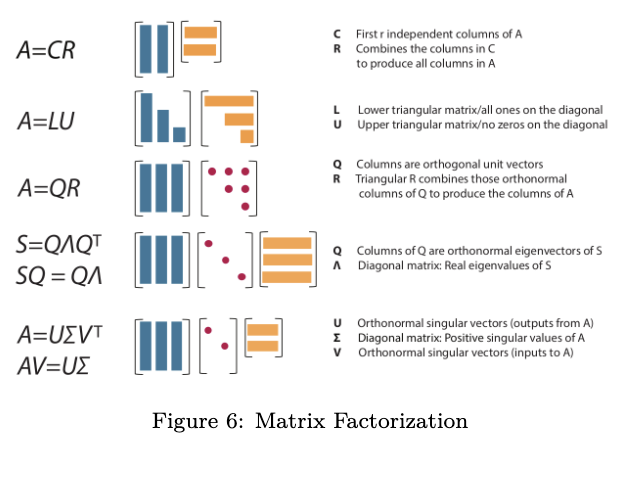
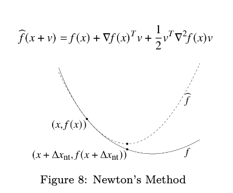
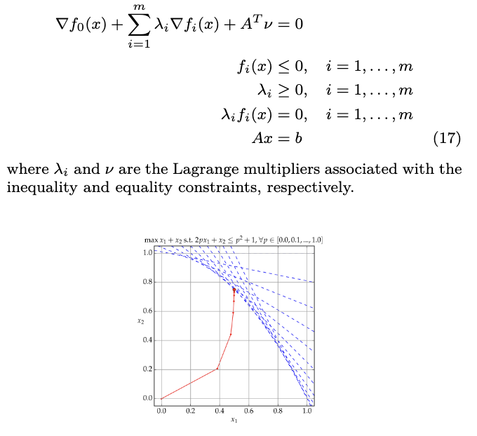

### convex opitimization

在convex set寻找convex function的最小值。

### convex sets

1. 定义：线性组合仍然在set里。
2. 代表例子：
   1. 空集是convex
   2. hyperplane
   3. halfspace
   4. euclidean ball and ellipsoids
   5. norm balls/norm cones
   6. Polyhedra 
   7. 正定锥：所有特征值非负的对称矩阵组成
3. 保凸算子：
   1. 交集
   2. 仿射函数（旋转，平移，缩放）
   3. 线性变换
   4. 透视函数

### convex functions

1. 代表例子：
   1. 仿射函数
   2. 二次函数: 半正定的
   3. 范数函数
   4. 指数函数
   5. 对数函数 -log(x)
   6. 熵函数：xlog(x)
2. jensen不等式——凸性精髓
   1. “函数的平均值大于等于 平均值的函数值”
3. 凸函数的判定
   1. 方法一：一阶条件：凸函数的图像始终位于任何一点切线的上方
   2. 方法二：
      1. 二阶条件：海森矩阵半正定
4. 保凸算子
   1. 非负加权和
   2. 与仿射函数复合
   3. 逐点最大值f(x) = max{f1(x), f2(x),...,}

### 凸优化问题

1. 数学定义：
   $$
   \min\limits_{x} f(x) \\
   s.t. g_{i}(x) \le 0 (不等式约束必须是凸函数) \\
   h_{i}(x) = 0 (等式约束必须是仿射函数，即Ax=b)
   $$
   
2. 特性：凸优化问题局部最优即全局最优，即：

   1. 神经网络不用尝试各种随机初始化方式，从哪儿算结果都一样
   2. 凸优化说无解数学就是无解，机器人可以直接触发安全保护，不用怀疑算法问题。

#### 局部最优的判定条件

1. 一阶最优：如果x是局部最优，梯度为0
2. 二阶最优条件：如果x局部最优，该点的海森矩阵半正定

#### LP线性规划问题

#### QP二次规划问题

#### 几何规划问题GP

### duality 对偶性

对偶性是优化理论里非常深刻的一个概念。

原问题关注如何在约束范围内找到最小的目标值

对偶问题关注如何通过寻找目标值的“下界”来逼近最优解

1. 标准形式：
   $$
   \min\limits_{x} f_{0}(x) \\
   s.t. f_{i}(x) \le 0, i=1,...,m \\
   h_{i}(x)=0, i=1,...,p
   $$

2. 拉格朗日函数：核心思想是将硬约束（必须满足）转换为软惩罚（加到目标函数）

   1. 形式：
      $$
      L(x,\lambda, \nu) = f(x) + \sum_{i=1}^{m}\lambda_{i}g_{i}(x)+\sum_{i=1}^{p}\lambda_{i}h_{i}(x)
      $$
      

      1. 前面的系数叫朗格朗日乘子
      2. 你可以把\lambda想像成约束的“价格”或者“敏感度”，如果某个约束难以满足的时候\lambda就会很大.

   2. 对偶函数定义为：
      $$
      g(\lambda, \nu)=\inf_{x}L(x,\lambda,\nu) \\
      对偶函数是朗格朗日函数关于x的下确界 \\
      无论原问题是否凸，对偶函数永远是凹函数。意味着更好求解。\\
      下界属性：对于任何\lambda>0,对偶函数的值永远不会超过原问题的最优值p^*，即g(\lambda,\mu)\le p^*
      $$
      对偶问题就是尝试找到哪个最好的下界：
      $$
      \max g(\lambda,\nu)  \\s.t. \lambda >= 0
      $$

   3. 举例子：

      最小范数问题：

      

   4. 弱对偶和强对偶:

      

#### KKT条件: 最优解的充分判定标准

如果一个问题是凸优化问题，只要满足kkt条件，这个点就一定是全剧最优解。
$$
1.定常性：\nabla f_0(x^*) + \sum_{i=1}^{m} \lambda_i^* \nabla f_i(x^*) + \sum_{j=1}^{p} \nu_j^* \nabla h_j(x^*) = 0 \\
2.原问题可行性：f_i(x^*) \le 0, \quad i=1, \dots, m \\ h_j(x^*) = 0, \quad j=1, \dots, p \\
3.对偶可行性：不等式约束的朗格朗日乘子非负：\\
\lambda_i^* \ge 0, \quad i=1, \dots, m \\
4.互补松弛性：\lambda_i^* f_i(x^*) = 0, \quad i=1, \dots, m\\
最精华的一条：如果f_{i}(x)<0,\lambda_{i}=0，已经满足了，没有贡献；如果\lambda_{i}>0,
\\这个约束在起作用，那么f_{i}(x)=0，最优解就在边界上。
$$

#### 数值线性代数

将抽象的线性代数理论转化为计算机可执行算法的学科。在机器人算法（如位姿估计、动力学模拟）中，我们几乎从不直接求矩阵的逆 $A^{-1}$，而是通过**矩阵分解（Matrix Factorization）** 来高效、稳定地求解方程。

1. LU分解

   1. $A = LU$
   2. 将矩阵拆分为一个**下三角矩阵 $L$**（对角线下方有值）和一个**上三角矩阵 $U$**（对角线上方有值）。
   3. 需要解多次 $Ax = b$（$A$ 不变，$b$ 在变），先做一次 LU 分解会大幅节省计算量。

2. QR 分解

   1. $A = QR$
   2. $Q$ 是**正交矩阵**（旋转/镜像），$R$ 是**上三角矩阵**。
   3. 是处理**最小二乘法**的最稳健工具。
   4. 在你的 SfM（运动恢复结构）或点云配准中，当观测数据带噪声且方程组超定时，QR 分解比直接用正规方程更不容易产生数值误差。

3. Cholesky 分解

   1. $A = LL^T$
   2. $A$ 必须是**对称正定矩阵**。
   3. 在 **卡尔曼滤波 (EKF/UKF)** 或 **二次规划 (QP)** 中，协方差矩阵和 Hessian 矩阵通常是对称正定的，Cholesky 是最优的选择。

4. 奇异值分解 (SVD - Singular Value Decomposition)

   1. $A = U\Sigma V^T$

   2. 将矩阵看作一种线性变换，拆解为：**旋转 ($V^T$) $\rightarrow$ 拉伸 ($\Sigma$) $\rightarrow$ 旋转 ($U$)**。

   3. 是线性代数中的“瑞士军刀”。$\Sigma$ 对角线上的**奇异值**告诉你矩阵在各个方向上的强度。

   4. **求解本质矩阵 $E$ 和基础矩阵 $F$**：你之前提到的 8 点算法，核心步骤就是对矩阵进行 SVD 并将最小奇异值设为 0（强制 Rank-2 约束）。

      **主成分分析 (PCA)**：提取机器人视觉特征的主要特征。

      **求伪逆**：处理病态矩阵（Condition number 极差）时最可靠的方法。

### unconstrained optimization

没有约束条件，只找函数本身最值。
$$
\min\limits_{x} f(x) \\
我们假定f是convex function和二阶连续可微（即梯度和海森矩阵都存在且连续）
$$

1. 梯度下降法
   $$
   x^{(k+1)} = x^{(k)} - \alpha \nabla f(x^{(k)})
   $$
   
2. 牛顿法

   如果说梯度下降是“只看脚下”，那么牛顿法就是“利用地图建模”。

   **核心思想**：在当前点 $x$ 处，利用**二阶泰勒展开**对函数进行局部近似，将其看作一个二次函数（抛物面）。
   $$
   f(x + \Delta x) \approx f(x) + \nabla f(x)^T \Delta x + \frac{1}{2} \Delta x^T \nabla^2 f(x) \Delta x
   $$
   

​	**更新公式**：
$$
$$x^{(k+1)} = x^{(k)} - (\nabla^2 f(x^{(k)}))^{-1} \nabla f(x^{(k)})$$
$$

​	**几何解释**：牛顿法每一轮迭代实际上是跳到了这个局部二次近似函数的最低点。

### 等式约束优化equality constrained optimization

问题定义：
$$
\begin{aligned}
\min_{x} \quad & f(x) \\
\text{s.t.} \quad & Ax = b
\end{aligned}  
f(x) 是凸函数，而约束 Ax = b 是一组线性等式（在几何上代表一个超平面）。
$$
KKT条件简化为：
$$
1.梯度平衡\nabla f(x^*) + A^T \nu^* = 0 \\
2.原问题可行性Ax^ = b
$$

### 不等式优化inequality constrained optimization

问题定义：我们考虑内点法来解决不等式约束的凸优化问题
$$
\min\limits_{x} f(x) \\
s.t. f_{i}(x) \le 0, i=1,...,m \\
Ax=b
$$
注意：

- 拉格朗日乘子怎么把约束塞进目标函数
- KKT怎么确定这个点就是最优解
- 内点法：实际计算

#### 法一：障碍法

- 一种通过解无数个障碍子问题来逼近原优化问题的方法。

  - 它的本质是将一个“带不等式约束”的难题，通过数学变换，转化成一系列“只有等式约束”的易题来求解。

- Barrier 子问题定义为：

  - $$
    \min \quad f_0(x) + \mu \phi(x) \quad \text{s.t. } Ax = b
    $$

    

#### 法二：内点法

- 是现代优化算法的基石，尤其在处理大规模、复杂的凸优化问题时表现卓越。
- “与其在边界上跌跌撞撞，不如在内部平滑前行。”

KKT 条件：内点法的“导航地图”

内点法的目标就是找到一组 $(x, \lambda, \nu)$，使得这五个条件同时成立：

