# **URL:**https://web.stanford.edu/class/cs45/lectures/


## **Lec2: shell tools**


shell是os的外置曾，让用户可以跑userspace programs.

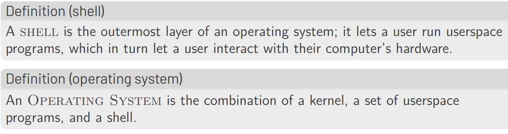

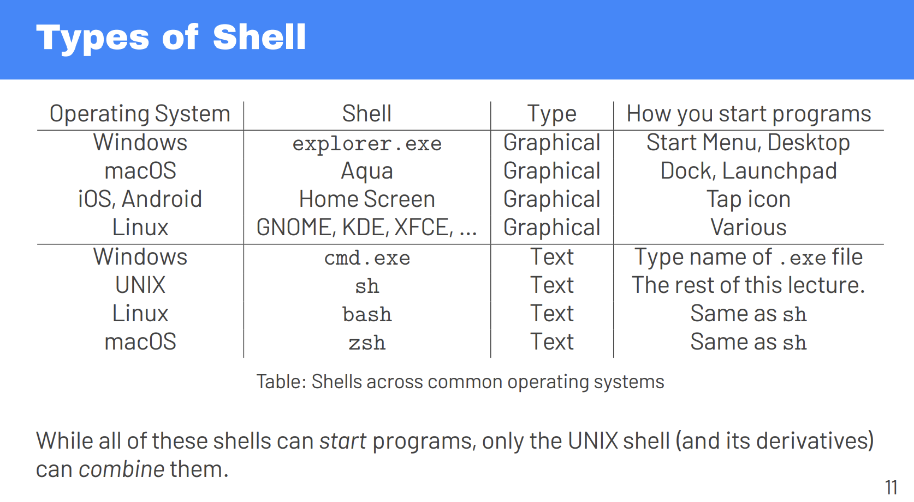


everything都是file,包括我们command的输出。

默认叫做standard output, 并且输出到我们的终端。

shell允许我们重定位standard output到文件中。

standard input同理。

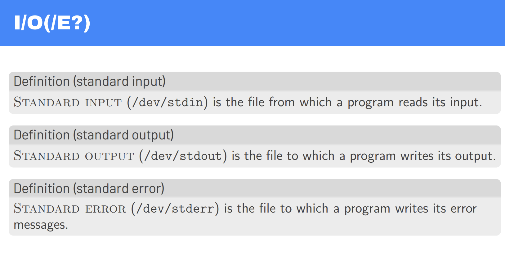


环境变量：

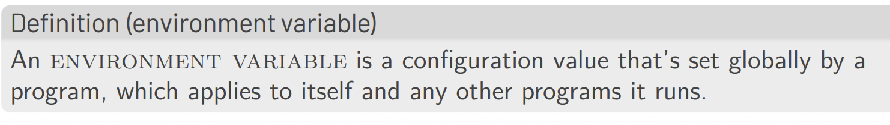

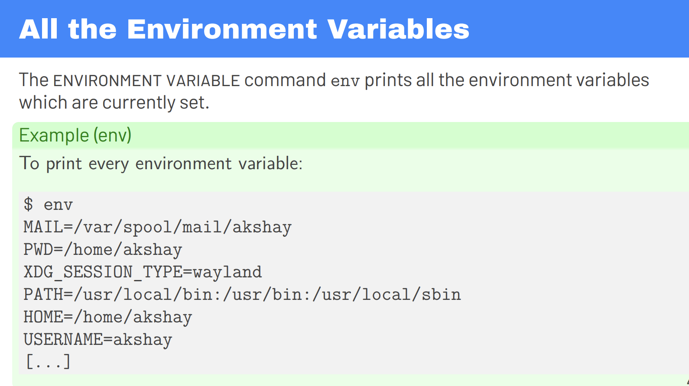


wc 统计words个数 -l 统计行

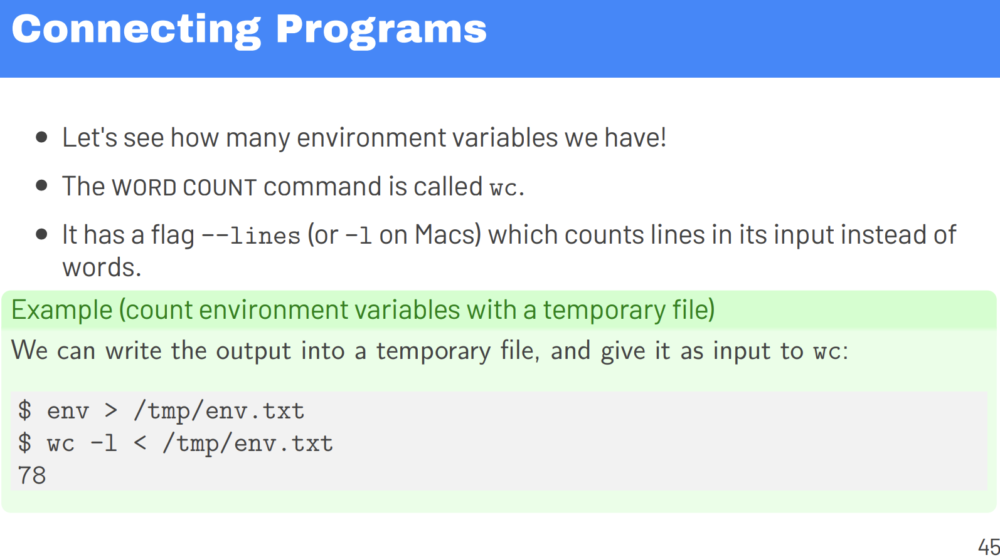


pipes:

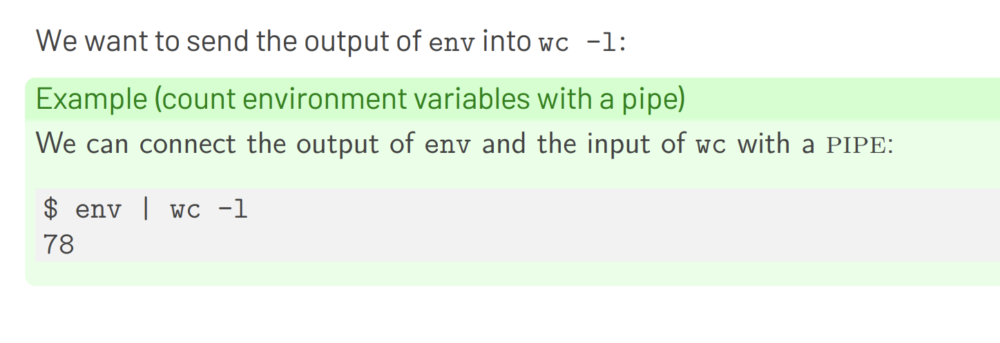


### **pipe:**

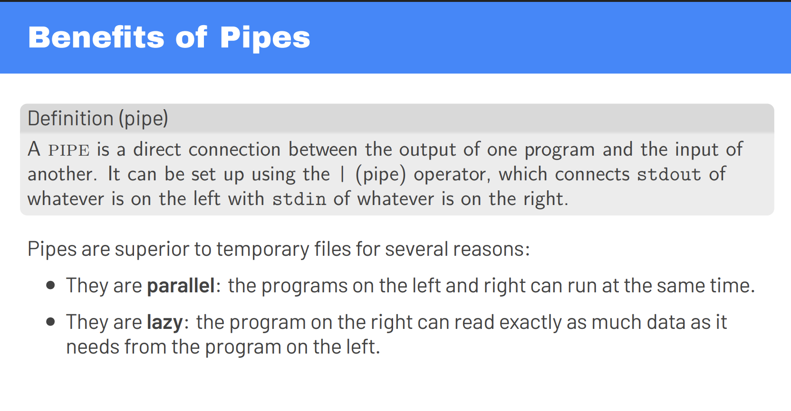

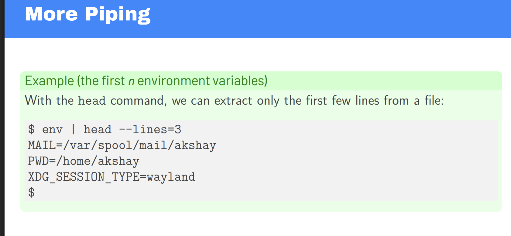

手册查询

man wc

https://cheat.sh/

https://devhints.io/bash


##### **notes:**

unix系统设计里，everything is a file. 比如一个设备就是/dev/tty*;我们的输出是standard output, 输入是standard input.

```
echo "xxx" > hello.txt    standard output重定向
cat < hello.txt  重定向standard input使得来自于一个file
```

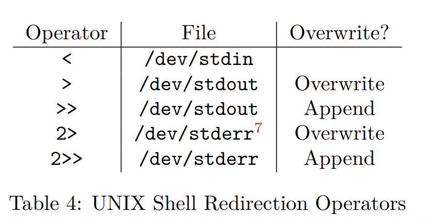


pipes:

```
env > /tmp/env.txt    env命令可以看到环境变量
wc -l < /tmp/env.txt
```

pipes的特点：

- parallel
- lazy. 比如 env | head --lines=3


# **lec3-data wrangling**

这一chapter主要关注数据的操纵。先说了一些数据类型，比如csv, html, xml等等，然后介绍了主要的操作数据的命令。

grep和sed, grep用于筛选数据，sed用于修改数据，可以用正则表达式对应相应的数据。

unique 筛选重复的行 unique -c将重复的合为一行并在最前面标出数字

sort 排序，默认是字母序。 sort -n 按照数值排序。

```
ssh adrazen@192 .9.152.85 journalctl
2 | grep sshd
3 | grep " Disconnected from "
4 | sed -E ’s /.* Disconnected from ( invalid | authenticating ) ? user
(.*) \[0 -9.\]+ port [0 -9]+( \[ preauth \]) ?$ /\2/ ’
5 | sort
6 | uniq -c
7 | sort -n
```

head和tail -n10

xargs把一个输出给另一个输入。

```
cat filename.txt | xargs touch
```

其他工具：awk，R, perl(文本manupulation)

### **grep**

电脑里有很多系统日志：

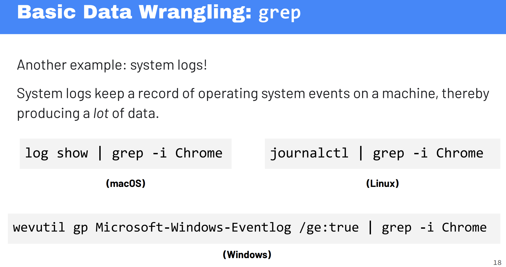

查询远程服务器的ssh连接

```
ssh adrazen@192.9.152.85 journalctl | grep sshd
```

查询掉线的时间

```
ssh adrazen@192.9.152.85 journalctl | grep sshd ｜ grep "Disconnected from"
```

加单引号单引号的作用是确保**远程机器**执行完整的管道命令。如果不加引号，管道符`|`可能会被本地Shell优先解析，导致命令在本地执行而非远程机器。

```
ssh adrazen@192.9.152.85 'journalctl | grep sshd | grep
"Disconnected from"'
```


### **sed**

sed是unix内置的stream editor.可以用来搜索/增加/删除file中的内容。

文本替换

```
s/REGEX/SUBSTITUTION
// eg: sed 's/AY21-22/AY22-23' file.txt
```

sed每行只匹配一次，如果想重复匹配加上-g：

sed 's/xxx/xxx/g' file.txt

如果想在sed中使用regex, 加上-E flag


### **sort**

### **uniq**

过滤文件中重复的lines

### **tail**

打印files的最后几行

### **xargs**

让一个命令的输出作为另一个命令的输入


数据处理的其他工具和软件

- awk:操作数据产生reports
- R：数据分析和画图
- perl:text操作的编程语言


进行正则表达式检查的好工具：https://regex101.com/


------

# **lec4:**shell scripting

1. shebang的写法：#!/usr/bin/env bash和#!/bin/bash的异同

#### **bash script的写法：**

- 定义变量：x=foo
- 原样输出字符串$x 用echo '$x', 要输出实际内容得用双引号echo "$x"
- 控制流

```
#！/usr/bin/env bash

if [ CONDITION ]
then
  xxx
fi

数字的比较大小用-gt， 字符串比较ascii码用 >
[] 相当于test command
num =101
 if [ $num - gt 100 ] && [ $num - lt 1000 ]
 then
 echo " That ’s a big ( but not a too big) number !"
 fi

if [ CONDITION ]
then 
   xxx
elif [ CONDITION ]
then
   xxx
else
   xxx
fi


#！/usr/bin/env bash
while [ CONDITION ]
do
   xxx
done

做数学运算一定要用(())的写法
 num =0
 while [ $num - lt 100 ]
 do
 echo $num
 num =$(( num +1) )
 done

#！/usr/bin/env bash
for VARIABLE in 1 2 3 .. N
do 
  xxx
done

for i in {0..99}
```

- 参数
  - bash脚本传入的参数$0是脚本的名字，$1是第一个参数，以此类推
  - bash是根据位置去判断传入的参数，因此定义func时make_and_enter(directory_name)是无效的，不会将directory_name看作一个变量。

```
#无效的
 make_and_enter ( directory_name ) {
   mkdir -p directory_name
   cd directory_name
 }

#有效的传入参数
 make_and_enter (  ) {
   mkdir -p "$1"
   cd "$1"
 }

make_and_enter "$1"
```

- 
- exit code
- exit code也就是return value，如果一切ok返回0，不是0的其他值表示有error
- 可以用$?取上一条命令的返回值
- 如果需要一个placeholder的命令表示成功或者fail可以用true（返回0）或者false（返回1）

```
 result =$(( $RANDOM % 2) )
 if [ $result -eq 0 ]
 then
 true
 echo "$?"
 else
 false
 echo "$?"
 fi
```

- 


看当前用的哪个shell

```
ps -p $$
```


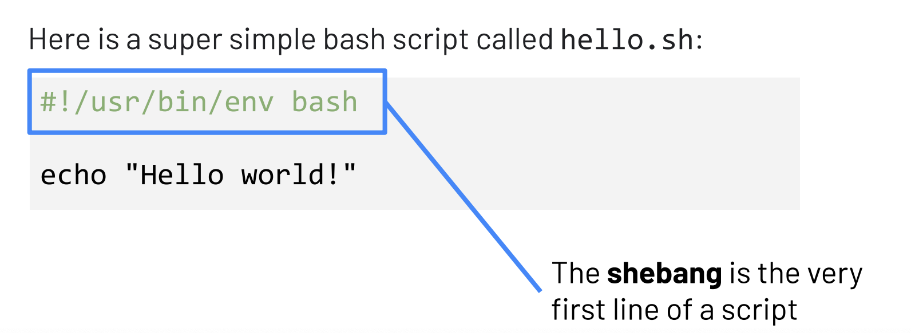

shebang:

有很多种不同的方式去写shebang，比如#!/usr/bin/env bash或者#!/bin/bash，一般推荐前者

`env` 会从系统的 `PATH` 环境变量中查找 `bash` 命令。

某些系统（如 macOS、BSD）的 Bash 可能不在 `/bin/bash`，而是 `/usr/local/bin/bash`。`env` 能自动找到正确的路径，避免脚本因路径问题无法运行。


运行方式：

1. shell解释器运行，如sh hello.sh, bash hello.sh, zsh hello.sh
2. 转换成可执行程序再运行 chmod +x hello.sh 然后./hello.sh


bash的输入参数

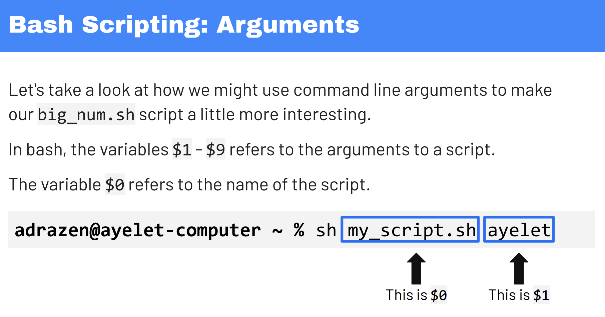


# **lec6: Command line environment**

https://web.stanford.edu/class/cs45/lectures/6-command-line-environment.notes.pdf

- 多任务job control
  - 三种状态：前台，后台，suspend
  - 当我们从shell启动一个program之后，我们就是在开启一个新的foreground job。job被绑定到这个controlling terminal，如果terminal关闭程序也会退出。
  - control-z可以挂起一个job
  - bg %1 从suspend job里面后台运行%1,不写number默认运行最近的
  - 运行一个job在后台：sleep 5 &
  - 可以把一个suspend/background任务放到前台 fg %1
  - 退出： kill %1 这个是给进程发送一个SIGTERM信号告诉他退出，但是一些程序不会对这个信号相应。此时可以用kill -s KILL %1或者kill -9 %1强行退出。（SIGKILL）
- tmux 
  - https://tmuxcheatsheet.com/
  - https://quickref.me/tmux
- 


------


#### **环境变量：**

command not found 在$PATH没有找到对应的路径

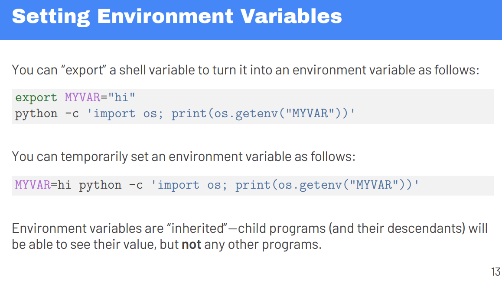


#### **权限**

每个文件都有"owner""group"

每个文件有三套权限，ower, group,和everyone else

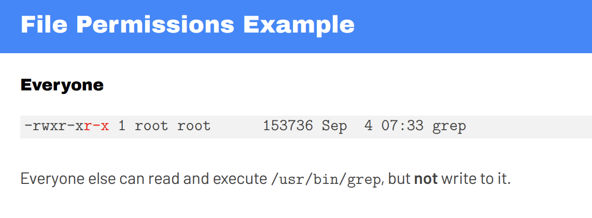

更改文件的owner和group分别可以用chown和chgrp

```
chown akshay hello.txt
chgrp staff hello.txt
```

更改文件的permissions

```
// 默认更改所有人的权限
chmod -w my_safe_file.txt
chmod -r my_secret.txt

// 指定用户修改权限
chmod u+x my_script.sh
chmod g+rw group_plan.txt
chmod o-r my_secret.txt
chmod 777 open_permissions.txt
```

通过ls-l 显示的第一个字母会显示文件的类型

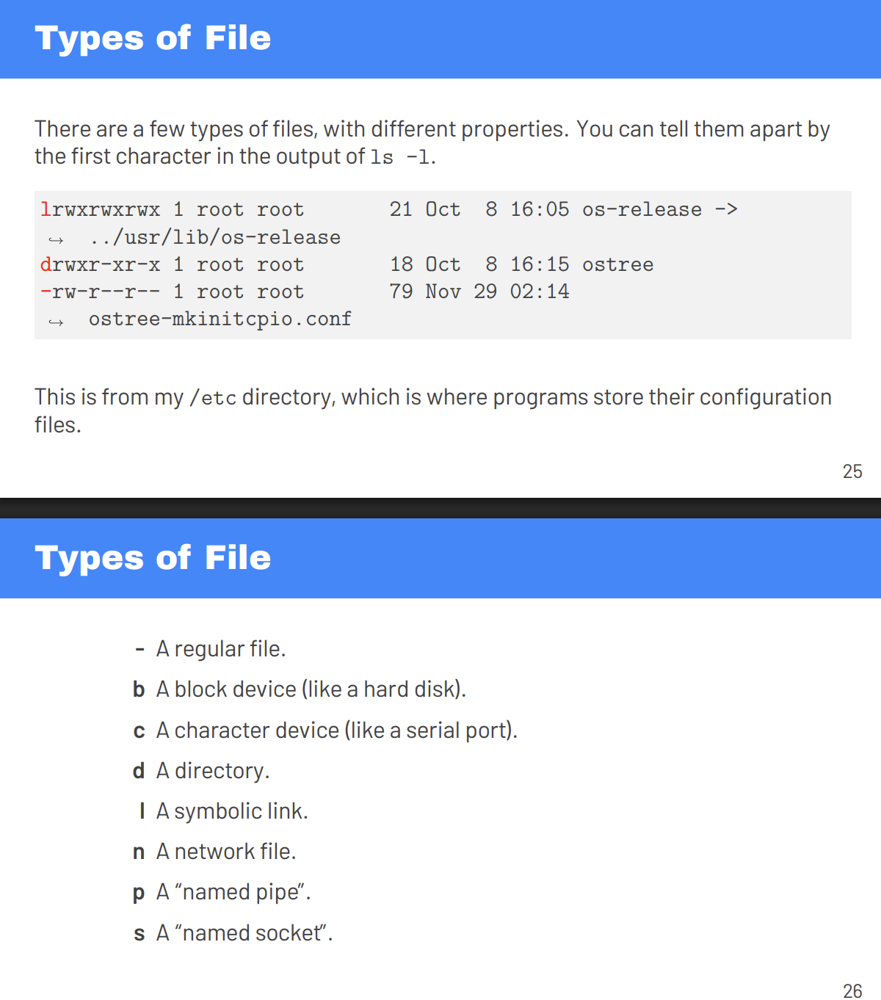


alias

```
alias hi="echo 'hello'"
//然后可以运行hi
```


find

```
find . -name "hello"
find . -executable
find . -type f,d,l
find . -type f -name "hello" -executable
```


## **多任务**

job: 在终端运行的程序。分为前台的job,后台的jog,还有很多suspended jobs，frozen比如当前没有运行。

control-z可以suspend a job

可以把一个suspended job通过运行bg放到后台。如果是将vim这样的程序bg,它会立即suspend itself，因为它需要连接终端。但是如果是long-running command比如下载任务，可以没有任何问题的放到后台。如果有多个jobs suspended, bg会运行最近的那一个。你可以通过指定job号指定不同的。

bg %1

将新的运行在后台：sleep 5 &

可以把后台（唤醒并接管终端）或者suspended的程序通过fg放到前台。

可以通过ctrol-c杀死前台的job,可以杀死后台的通过kill. kill %1(需要一些时间退出，同时对vim类似的程序可能没效)

kill会通过发送SIGTERM命令来让程序退出，但是一些程序会忽略；可以用SIGKILL强行退出

kill -s KILL %1

或者等价的 kill -9 %1


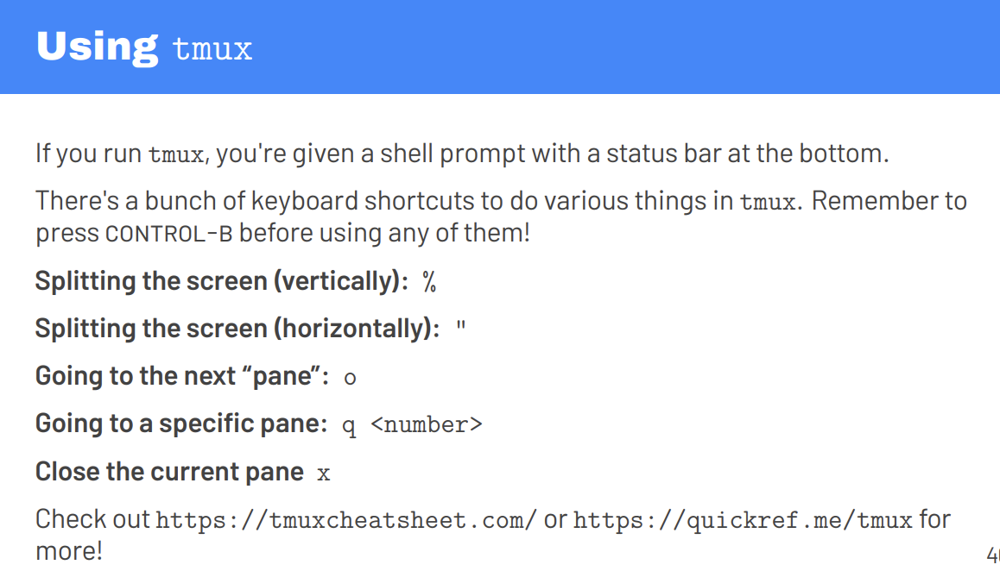


# **lec7:compilers**


C语言的编译：

- 编译成汇编： cc -S hello.c -o hello.s
  - 在macos上面，cc指向LLVM C编译器，clang; Linux指向GNU C编译器 gcc，这是各自os默认的C编译器。可以在linux上面用clang,但是在macos上面用gcc有点困难。
- 二进制：as -c hello.s -o hello.o
  - Assembler读入汇编代码，输出机器码，叫做object files
  - 但是此时object files可能是不完整的，比如源程序没有printf对应的实现。
- 链接：cc hello.o -o hello
  - 读入不完整的object files
  - 我们可以用ld让其关联printf的可运行文件，但是非常复杂，替代的，我们可以让cc去做这件事情 cc he llo.o hello


### **shared object files**

- 我们可以将C编译成shared object,是任何程序都可以使用的库。
- linux以.so结尾，macos以.dylib结尾，windows则是.dll
- cc -shared test.c -o test.so 构造一个shared object file包含了test.c中的所有函数。
- 这些“shared objects” 会在runtime的时候被dynamic linker 链接，这个是os的一部分。
  - 这些so files一般在/usr/lib/里

- 通常在/usr/lib/
- 环境变量$LD_LIBRARY_PATH可以添加更多的locations
- ldd可以告诉你一个程序需要哪个shared libraries.如果没有安装，程序会error并退出。


### **package managers**

- 有一些基础的printf或者file IO的function功能跟随os带来，但是一些复杂的功能需要更复杂的实现。
- C和os紧密相关，我们通过package manager安装C libraries
- 在linux里package managers在os里，比如apt, dnf, rpm,pacman;
  - 事实上，LINux的各种发行比如ubuntu, debian, fedora通常指的是用的哪种package manager
- macos里是brew
- dependency management
  - 一个程序/libraries可能依赖于其他的程序或者库，比如firefox依赖ffmpeg
  - 两种解决方法
    - program涉及到的所有dependency都被编译进该program的二进制文件里，比如ios, android app stores里用这种方法
    - 另外一种是packaging programs，列举出所有的依赖项，自动下载。这种更广泛，unix默认使用这个，还有一些编程工具比如pip
- package manager是一种安装programs或者libraries的工具，并且会自动注意解决依赖。
- package manager可以是全局的，比如apt或者brew，其他程序也可以用。
- global package managers的缺点是可能有版本冲突，不同的程序可能需要不同版本的shared libraries
- package managers可以是local的比如npm,它们将依赖安装在一个project下面
- local package managers的缺点是可能有冗余，不同的project有关于同一个库的重复拷贝。


比如apt, brew

python类似于bash是解释性的

```
#！/usr/bin/env python3
print("Hello, World!")
```

python一般是python2, pathon3 一般是python3


虚拟环境：

python -m venv myenv

./myenv/bin/activate

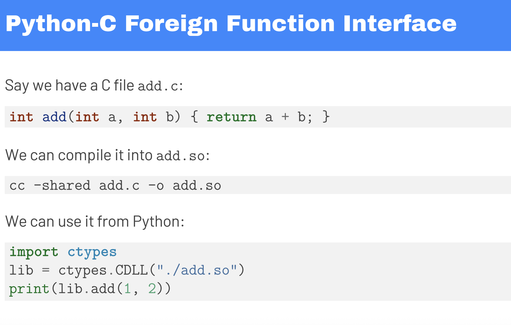


# **lec8:**


在家里用的LAN

互联网叫WAN

在LAN和Internet之间叫Network Address Translation(NAT)


CIDR notation: 

定义子网：比如192.168.1.0/16

家中路由器经常用到的IPv4 address: 192.168.1.0/24

每个网络有两个特别的address:

- 192.168.1.0 是未使用的，用来定义网络
- 192.168.1.255 是广播地址，发送到广播地址的messages会被该网络的所有computers接收到。


子网10.0.0.0/8中所有的ip地址在lans中都被保留

一个/32位的ip address是一个单ip address.除非你在运行一个isp或者相当大的business，你会从DHCP server中被分配一个ip address.


公共ip地址被政府/公司拥有，私人的ip地址是重复并且动态分配的，我们需要一种方式去辨别具体的电脑以发送信息。--mac地址

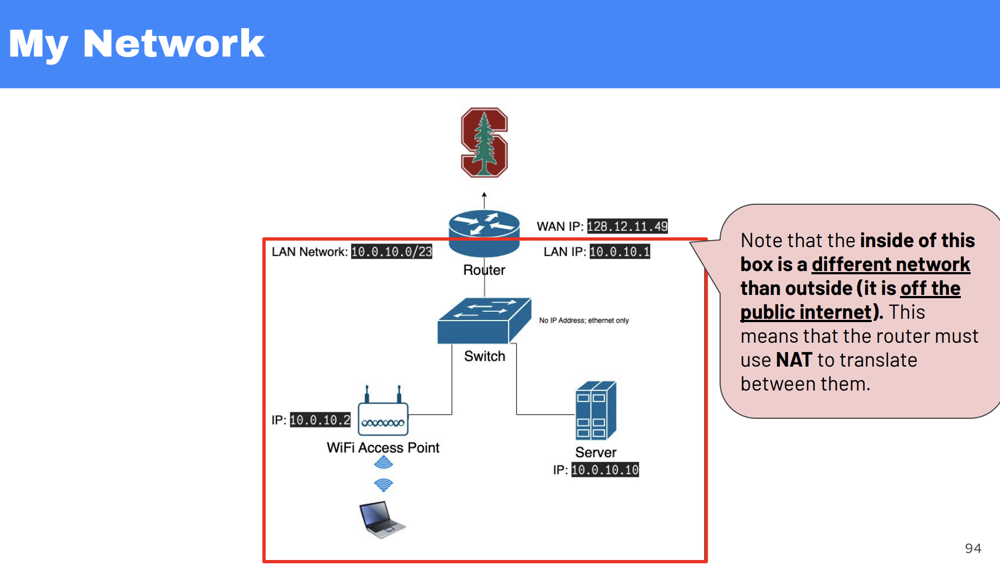

ip地址动态转换：


# **lec11:**

## **makefile**

看一遍ppt快速恢复记忆就行


## **debugging and profiling**

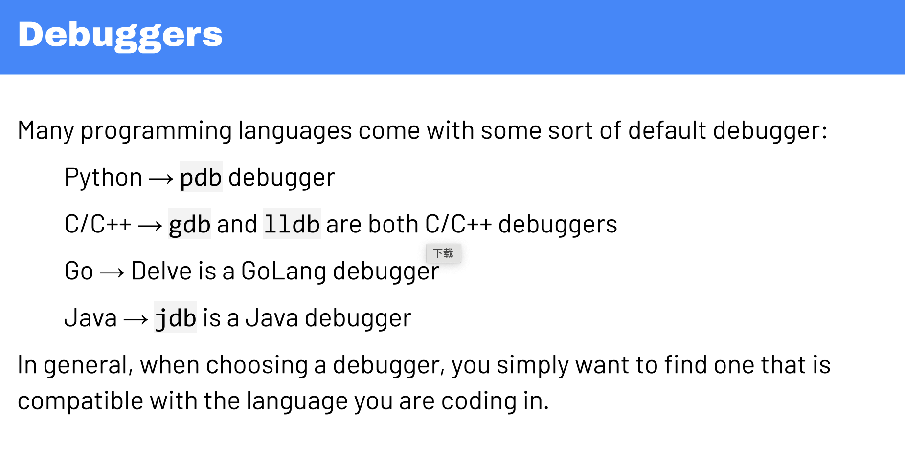

## **code profiling**

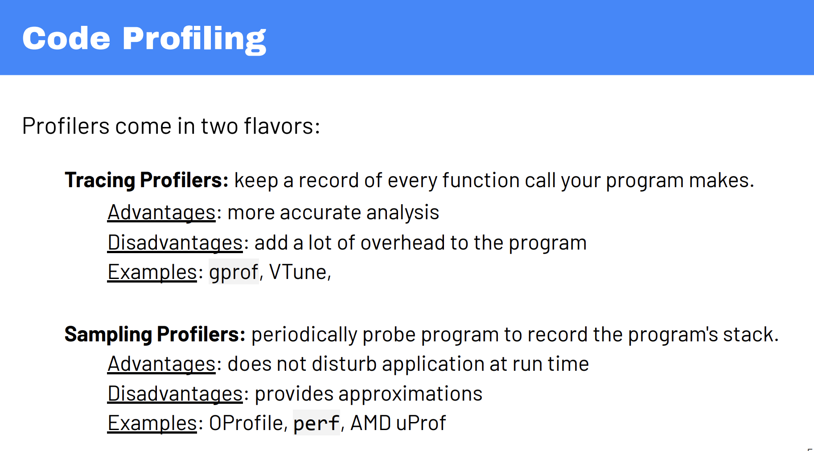


linux 用time命令衡量程序的运行时间。

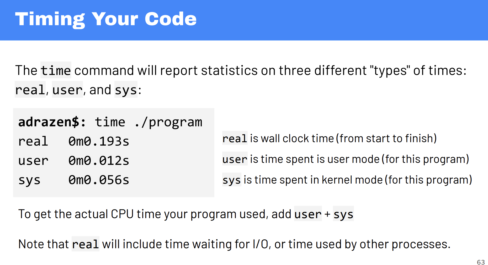


## **memory access tools**

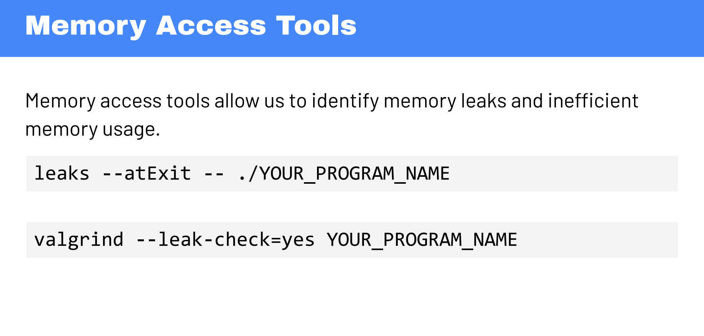


# **lec15:vms**

# **vms的使用场景：**

- 隔离&沙盒
- 资源分配（比如租用部分算力）
- 系统管理（备份恢复）
- 跨平台测试（在其他操作系统测试应用）
- 原型设计（用多个虚拟机和模拟路由器虚拟化网络，构建网络原型）
- 模拟（模拟不同的cpu架构，比如在老旧的游戏机上运行视频游戏）


## **containers**

- 轻量级的
  - 易于分发
  - 无需虚拟整个os而是继续使用主机的内核/os为基础提供服务
- 一般比VMs快
  - 也可以在VMs里面跑
- 临时性设计
  - 长期数据应该存储在“卷”里。


## **容器化技术**

您可以将应用程序封装在容器中，从而确保**一致的运行环境**。

- os
- cpu架构（如果和主机不同可以用虚拟机）
- 其他的依赖和软件
- 存储结构定制
- 还能和其他应用隔离


## **docker**

创建和管理containers的工具。

- container：基于镜像创建的临时性对象，代表程序的一个运行实例
- Image: 通过Dockerfile构建的静态包，包含应用程序和依赖
- dockerfile：构建镜像的脚本文件
- volume:数据卷用于存储持久化数据，其生命周期独立于容器，即使容器被销毁数据依然保留。


## **demo:创建一个镜像**

```
docker run -it ubuntu:latest bash
```


## **dockerfile**

```
FROM ubuntu:latest    // 声明要build的基础镜像

// 这些命令会生成中间容器，每个命令都基于前一个命令的容器继续构建。
RUN apt-get -y update
RUN apt-get -y upgrade
RUN apt-get install -y build-essential  // install一些工具比如make


WORKDIR /calculator_app
ADD ./calculator/ ./
RUN make clean; make
ENTRYPOINT ["./calculator"]  //声明会发生什么当我们运行镜像的时候
```


## **orchestration（编排）**

当系统中运行大量容器时，你可能需要引入一个更高层级的**元系统**来统一管理和调度这些容器，这种机制就被称为**容器编排**。

### **Kubernetes(k8s)**


# **附录：**

## **linux安装docker：**

https://medium.com/devops-technical-notes-and-manuals/how-to-install-docker-on-ubuntu-22-04-b771fe57f3d2

按照命令行安装就行

注意的是：

run docker必须sudo，否则会permissions denied。

这是因为 Docker 守护进程（docker daemon）绑定的是一个 Unix 套接字（Unix socket），而不是 TCP 端口。默认情况下，该 Unix 套接字由 `root` 用户拥有，其他用户只能通过 `sudo` 来访问它。Docker 守护进程始终以 `root` 用户身份运行。


### **docker配置国内镜像：**

设置了一些网上的方法，编辑/etc/docker/daemon.json没生效。按照https://github.com/dongyubin/DockerHub 操作pass.

```
sudo mkdir -p /etc/docker
sudo tee /etc/docker/daemon.json <<EOF
{
  "registry-mirrors": [
    "https://docker.1panel.live",
    "https://docker.1ms.run",
    "https://dytt.online",
    "https://docker-0.unsee.tech",
    "https://lispy.org",
    "https://docker.xiaogenban1993.com",
    "https://666860.xyz",
    "https://hub.rat.dev",
    "https://docker.m.daocloud.io",
    "https://demo.52013120.xyz",
    "https://proxy.vvvv.ee"
  ]
}
EOF
sudo systemctl daemon-reload
sudo systemctl restart docker
```


# Lec16: Cloud and serveless

## **server vs. Serverless**

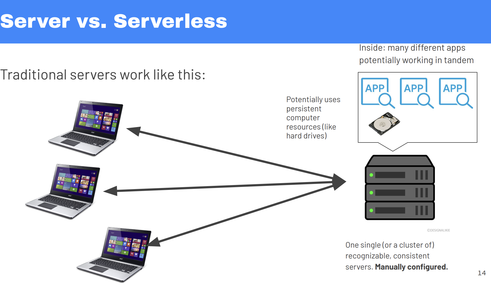

这种方式容易过载或者出现单点故障

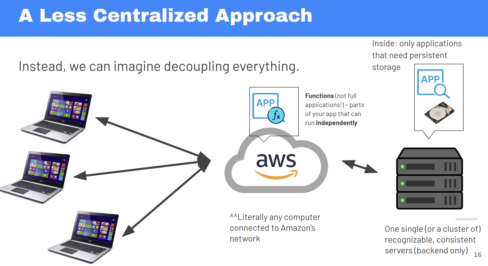


## **serverless的场景：**

- 提供静态网页服务
  - 网页已经嵌入代码，不需要持久化存储。
- 基于用户cookie生成网页
  - 请求中已包含cookie信息，不需要额外存储
- 从外部数据库检索并返回信息
  - 数据库位于外部系统，不需要本地持久化

### **不适合serverless的场景（可能需要一个server）**

- 阶段性地do something
  - serverless只runs on request
- 运行数据库
  - serverless functions不会持久化数据；需要server来持久化存储。

### **取决于：**

- 接受用户上传
  - 无服务器（Serverless）可以接收上传，但随后需将文件**重新上传至外部存储服务**（如AWS S3）


## **servers + serverless的组合**

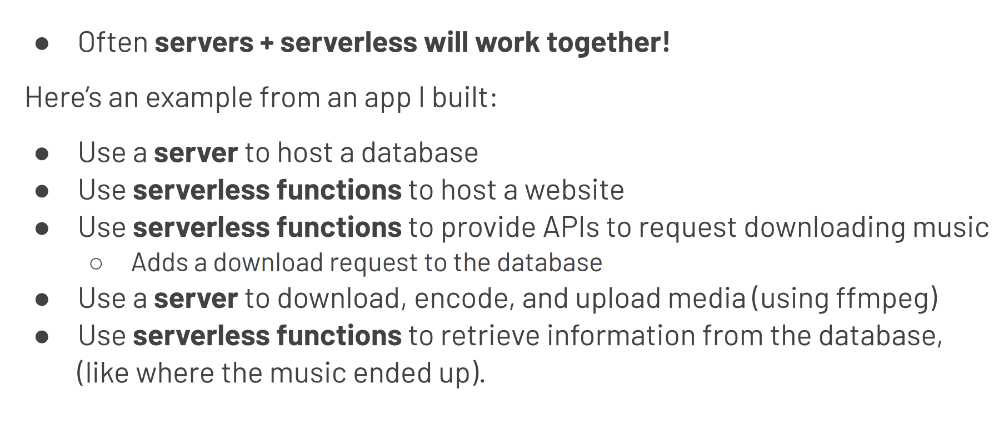


