### NLP basic concepts

#### 1. 两个NLP的主要问题

表示和建模：

a.Representation:将语言表示为机器语言：如BERT,Openai embedding

b. Modeling:用统计方法建模，GPT, chatGPT

1. 怎么表示words

   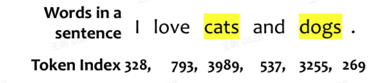

将单词分散到向量空间：将token映射到向量空间，向量空间(vector space) 是用来表示文本数据的一种高纬空间。在这个空间中，每个token或文本单元都被表示为一个向量。这些向量捕捉了文本单元的语义信息，并使得数学计算（如距离计算、相似度计算）成为可能。

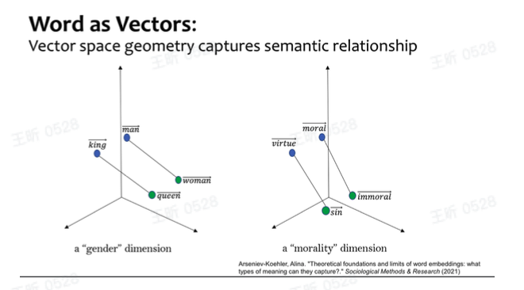

2. 建模

   语言模型LLM: 语言模型预测任何单词序列在给定语言语料库中的可能性

   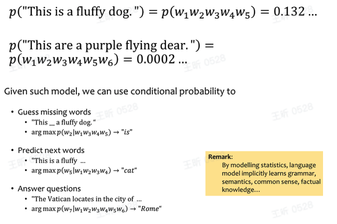

- 怎么学习语言模型

  - 自回归模型Autogressive LM:

    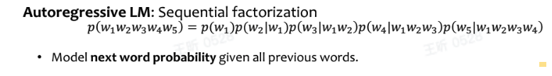

  - Bi-gram/N-gram model:

    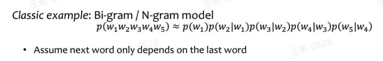

  - Marked LM:

    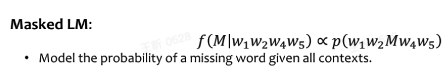

  - 几种语言模型的学习方式

    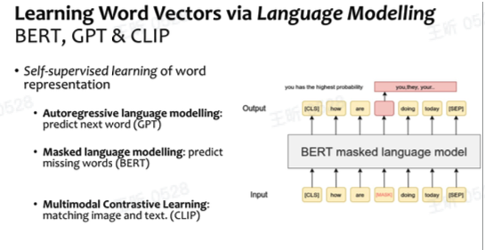

  - 为什么语言模型有比较好的表示

    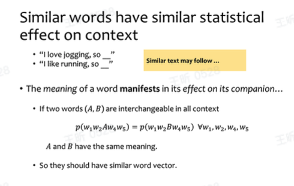

  - 总结

    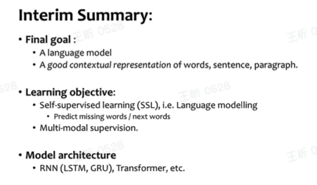

### attention机制和transformer

#### 1. attention来源：翻译任务seq2seq

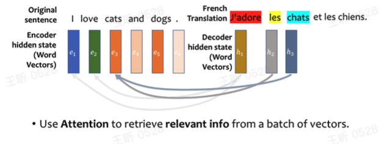

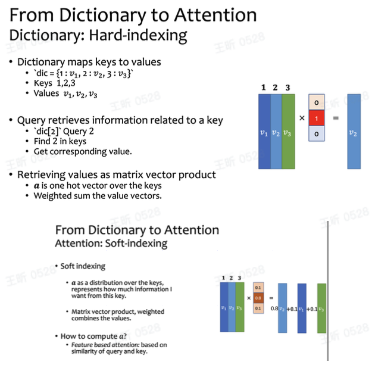

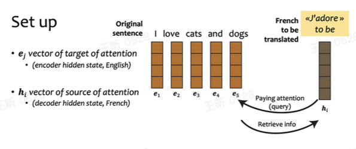

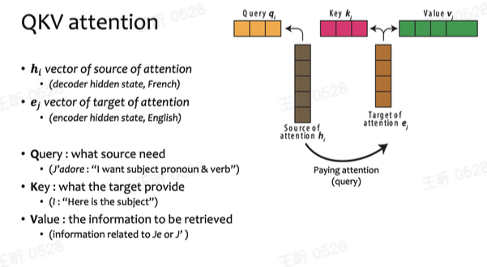

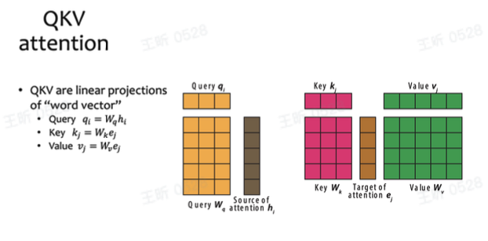

#### 2. 结构

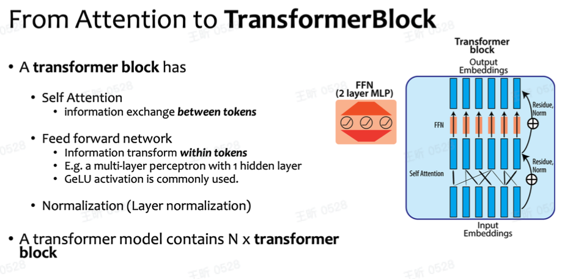

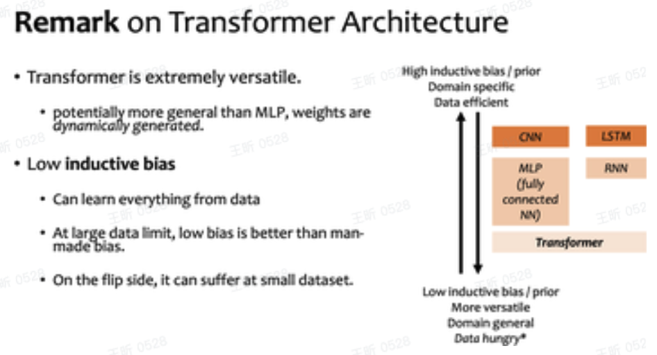

### 训练LM

### Pretrained model用法（微调和prompt）

### transformer除语言外其他应用

