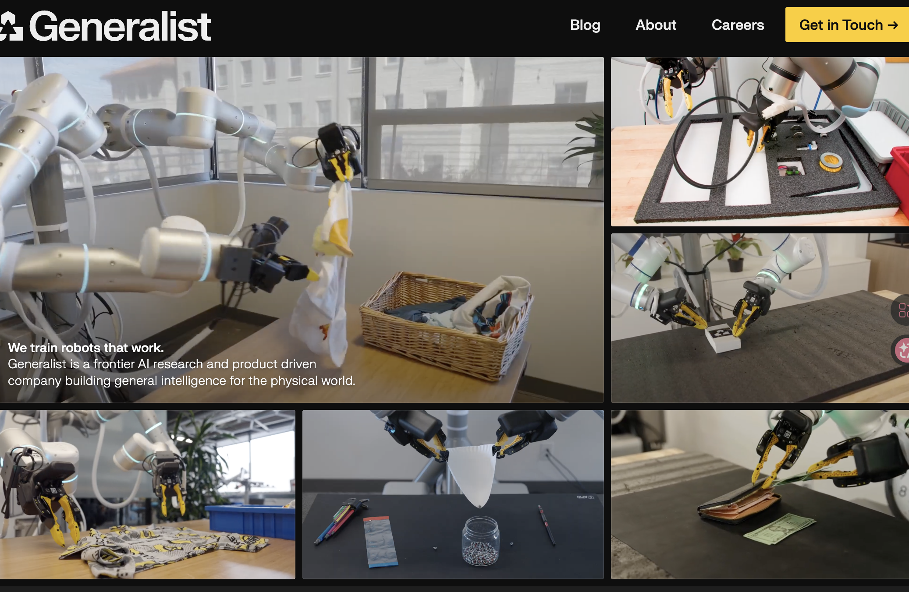
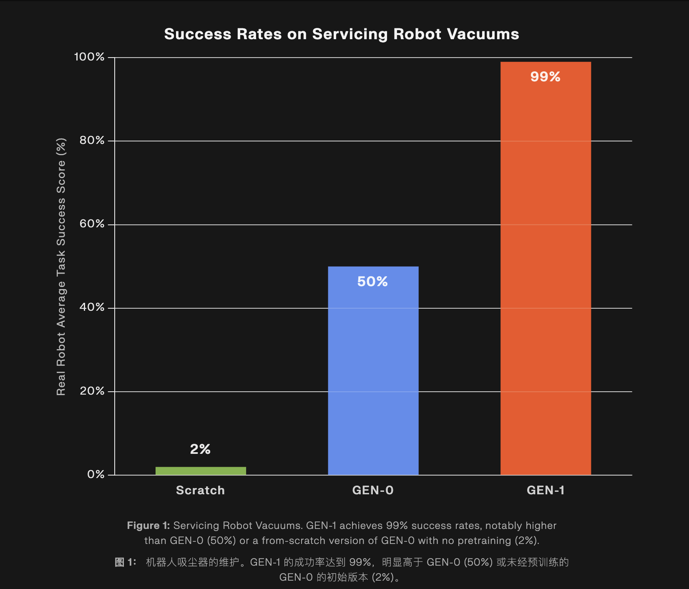
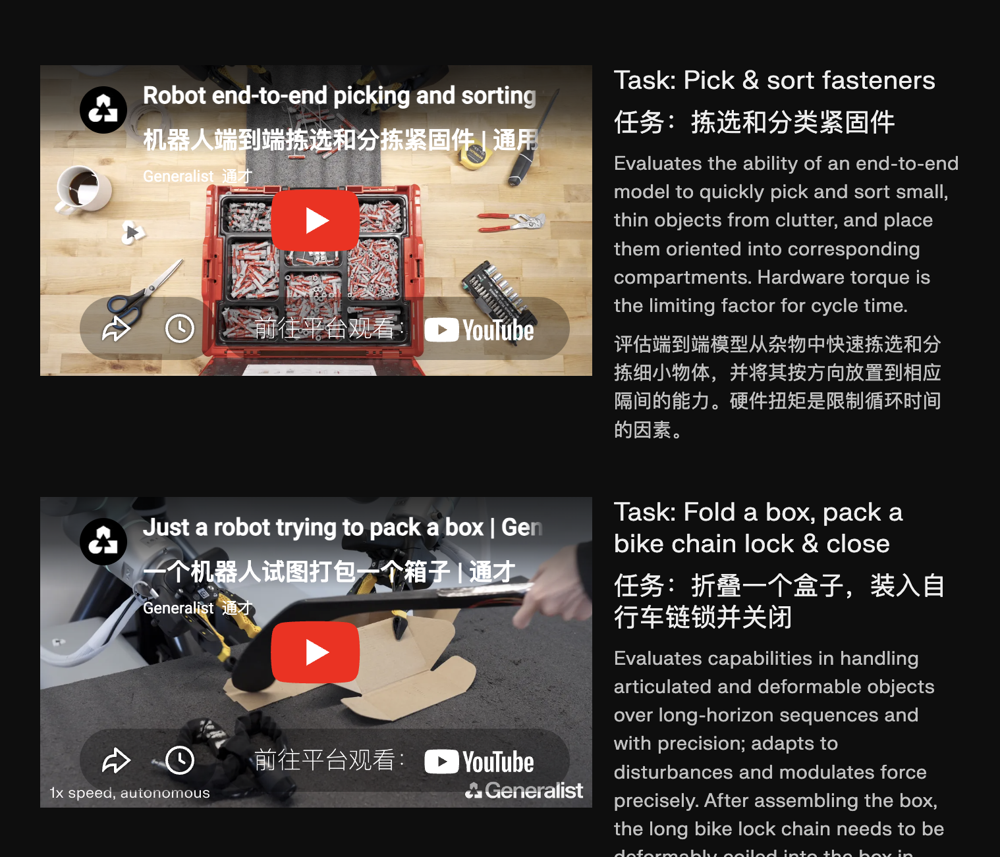

#### TL;DR

设计了一套手持装备，100hz高频无感摇操，从0开始训练，100hz高频控制。

#### 关于公司

Generalist ai的人来自open,波士顿动力，google deepmind等公司；demo很惊艳，技术很少披露。

公司的目标是构建AGI.

#### website:

https://generalistai.com/

#### Timeline:

将generalistai官方博客披露的文章用一句话概括。

从新到旧：

###### 1.2026.4.7 不是vla/wm

Going Beyond World Models & VLAs

（https://generalistai.com/blog/apr-07-2026-beyond-world-models）：我们的模型不定义为vla或者wm，强调以目标为主从0开始训练。认为“只要数据够”（50万小时），就能训练强大的模型。具体的，从AGI的最终目标出发(zero-shot do task),先完成x小时的微调可以完成99%的工作，优化过程将x逐渐减小。

参考：

- https://x.com/giffmana/status/1995634504321687979 learning from scratch always wins
- 在vla的历史探索RT-2:https://robotics-transformer2.github.io/
- 关于vlm的探索：https://video-language-planning.github.io/
- 最早的多模态模型：https://palm-e.github.io/

###### 2.2026.4.2 Gen-1达到99%商业可用凸显

《Introducing GEN-1》

（https://generalistai.com/blog/apr-02-2026-GEN-1）:

- 模型成功率从64%到99%，达到商业化部署水平。1小时机器人数据，推理速度比现有快3倍
- 在Gen-0上改进，万小时真实世界数据的数据集*从零开始*训练。
- Gen-1是一个系统：涵盖预训练、后训练、经验学习 (RL)、多模态人工指导以及全新的推理时技术。
- 

###### 3.2026.3.24  GTC演示Gen-0

《The Real Breakthrough Behind Our GTC Demo》

https://generalistai.com/blog/mar-24-2026-gtc-demo

- 在GTC上演示Gen-0

###### 4.2026.1.29  强调物理常识

《The **Dark Matter** of Robotics: Physical Commonsense》

https://generalistai.com/blog/jan-29-2026-physical-commonsense

- 人在拿东西过程中反应式的、闭环式的智能：一种对力、摩擦、顺应性和不确定性的直觉——物理常识
- 对机器人来说难以学习，互联网训练模型没有物理常识；物体常识根据身体经验习得。
- 遥操由于延迟、有限的触觉反馈以及不自然的界面无法达到systems1 thinking，唯一的可能性是数据收集做到无缝衔接仿佛无感。generalist ai在这方面设计了手持式人体工学设备帮忙做到这一点。

###### 5.2025.11 GEN-0观察到scaling-law

GEN-0 / Embodied Foundation Models That Scale with Physical Interaction

https://generalistai.com/blog/nov-04-2025-GEN-0

- GEN-0 模型必须足够大才能吸收大量的物理交互数据。1B太小，6B开始展现多任务处理，7B+几千步训练可以迁移到下游任务。
- 27万小时真实交互数据，每周10000小时速度增加。

###### 6. 2025.9.24 100hz装积木

The Robots Build Now, Too

https://generalistai.com/blog/sep-24-2025-the-robots-build-now-too

###### 7.2025年6月17 展现100hz端到端任务

Research Preview

https://generalistai.com/blog/jun-17-2025-research-preview

