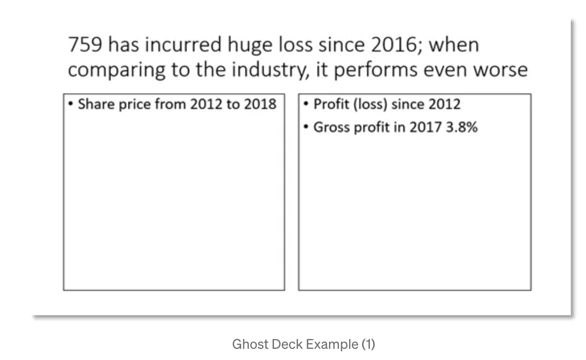
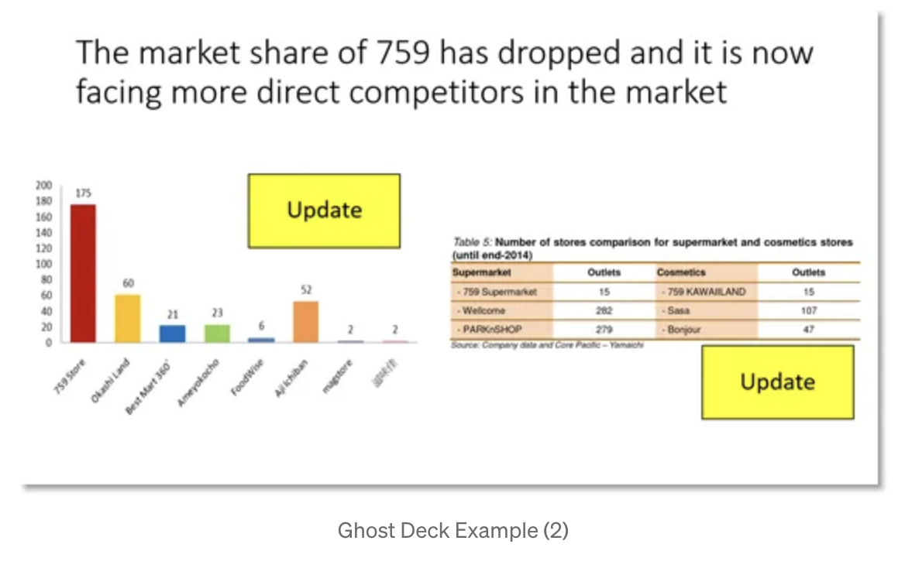
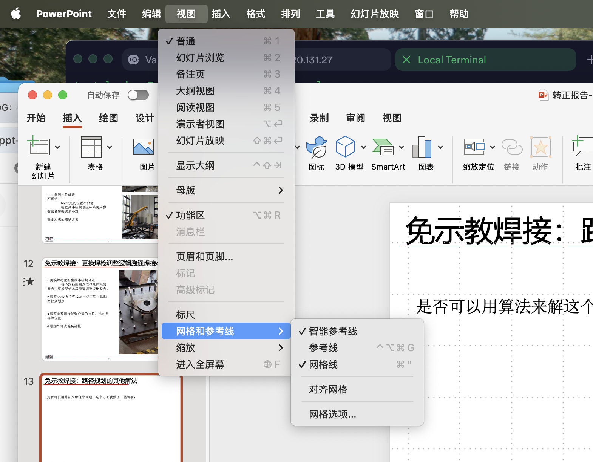
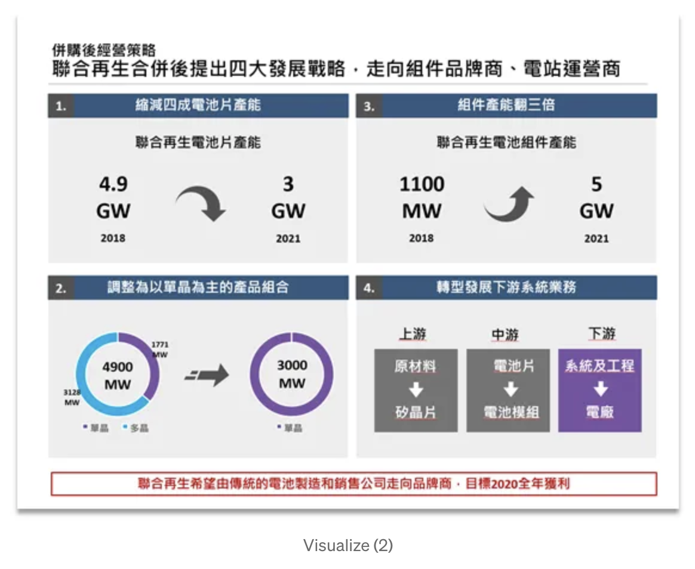
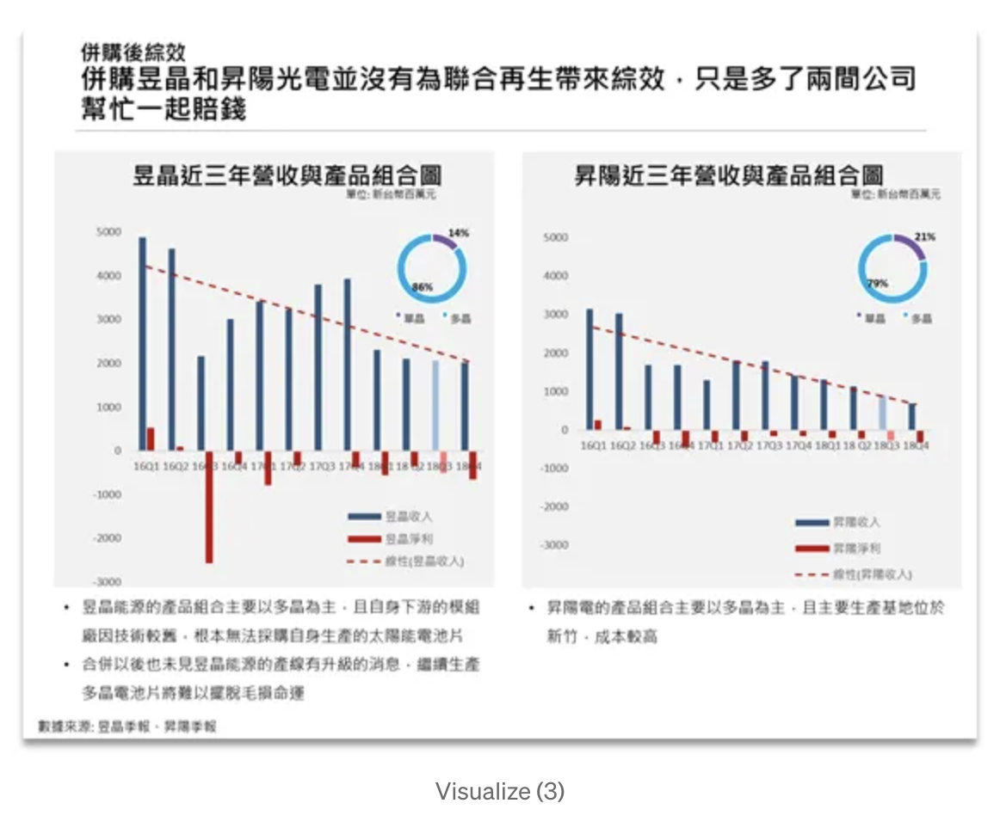

正好最近要做转正的presentation，在medium上面看到了一篇不错的文章。

[参考内容来自该链接](https://medium.com/諮詢民工的求職散策/如何畫好ppt-846161cc9d4d)

1. **想清楚之前，不要着急画slide.** 
   1. ppt推销or传达自己的目的
   2. 听众想看到什么
2. **梳理的方法：Ghost desk。**先写storyline(heading)再找证据support thinking，也是一个hypothesis testing的过程。

**何谓Storyline?就是具有Implication/So-what的heading**

- 过去的方式太generic：
  - “xxx销量下跌”“台湾可再生能源情况”（适用于appendix,图表标题）
  - 一个好的storyline，就是拿到简报从头到尾只用看到storyline就知道要说什么。！
- 检验方法：问sowhat
  - 修改：中国汽车销量连续3季下跌-》中国汽车销量连续3季下跌，导致国内车厂加大出海扩张速度
  - 修改：台湾可再生能源政策转弯，使得80%业者考虑退出竞争
  - **数据+insight+****action**才是一个对读者有用的message

**整齐、格式一致只是基本，把数据、概念视觉化，让使用者容易理解才是关键。**

为什么很多简报看起来不专业，没有对齐、固定行距、明显的key message、配色凌乱、整张都是字。

解决方法：

- 善用ppt对齐功能，上下左右对齐
- **打开ppt的格线，每一页的内容都落在相同的范围。**
- 使用同一色系，在office里面有好几个预设的类别。
- 如果有好几段话要说，可以用项目符号，尽量减少整段的叙述。
- **最后可以用方框来排版。（就是新增方块，把背景改成透明而已）。把一页ppt当成几个模块在用。**
- 其他：比如根据不同的数据特性用不同类型的图表等等。
- 需要特别注意的时候，可以用红色的方框，粗体字强调。

**至于页面设计、很fancy的图表可以通过工具来完成。**

- islide
- 搜索icon ppt
