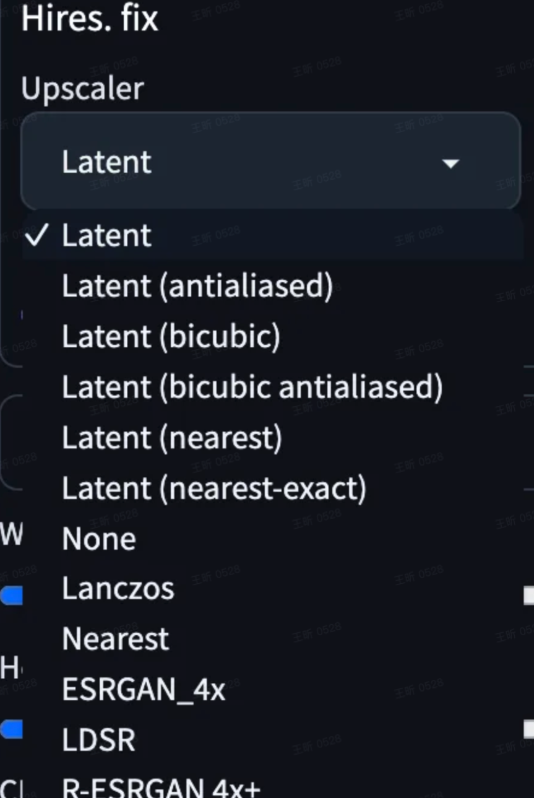
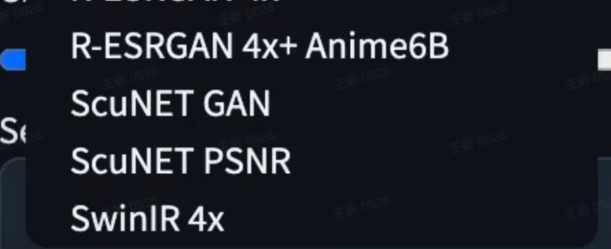
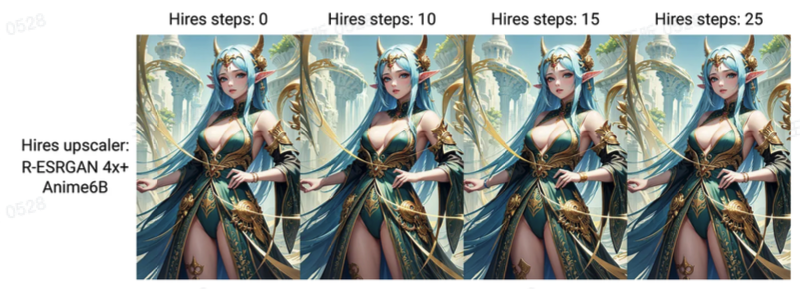
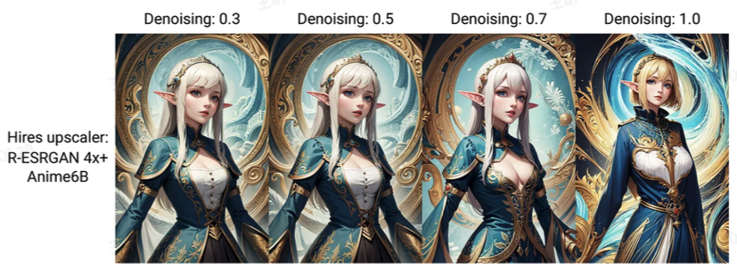
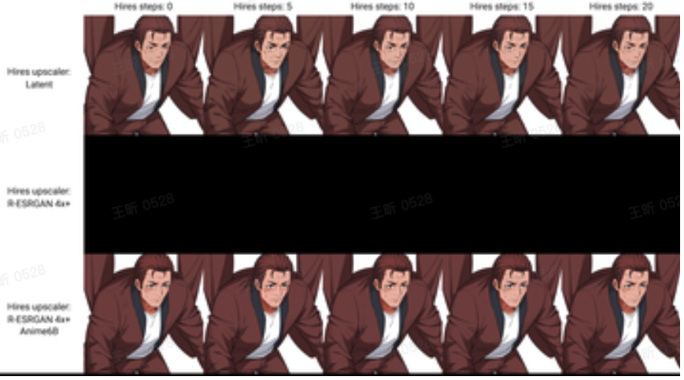

https://medium.com/rendernet/using-hires-fix-to-upscale-your-stable-diffusion-images-8d8e2826593e

https://medium.com/@realfabianw/taking-a-closer-look-at-the-highres-fix-function-of-automatic1111-to-optimize-image-quality-d9bbf369e3f

放大图片除了使用A1111's的图生图/extras选项，还可以使用Hires.Fix。后者可以在generate过程中增大分辨率，得到更好的效果。

### Upscaler

Latent, R-ESRGAN 4x+ and R-ESRGAN 4x+ Anime6B都可以尝试一下。

### Hires steps:

Hires steps在初试采样后refine图片质量，他们发生在每一步采样步之后的上采样过程，总的steps是sampling steps + Hires steps.

Hires steps的值是0-150，0的时候Hires steps = sampling steps.所以如果你的sampling steps是20，hires steps是0，那么总步数是40.选择合适的数值很重要，过低或者过高都会使得图片质量变差。一般10-15根据经验会得到更好的选择。但是如果采样步数大于50，hires steps可以设置为sampling steps的一半。

### Denoising strength

对图片质量有很大的影响，也会改变图片内容。

设置为0对图片没有影响，设置成1会很大改变图片内容。

webui设置的默认值是0.7，但是在大多数case里这个设置都太强了，初始建议设置到0.3到0.5然后从上往下调整。

用webui的xyz工具进行测试选出合适的scaler

