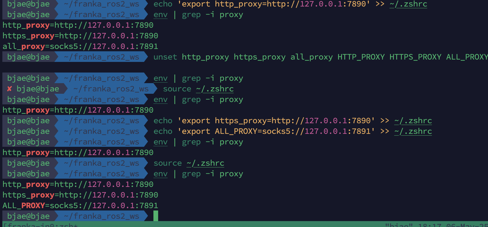

# 代理软件测试链路畅通但是终端/浏览器始终无法访问外网

测试：在终端临时设置http_proxy,https_proxy,all_proxy之后可以访问google

```
env | grep -i proxy //发现输出为空，设置的proxy没有在终端生效
curl https://www.google.com //卡顿，不出意外也是无法访问的

export http_proxy=http://127.0.0.1:7890 
export https_proxy=http://127.0.0.1:7890
export all_proxy=socks5://127.0.0.1:7891
// 终端生效

curl https://www.google.com //success，返回html页面

unset http_proxy https_proxy all_proxy HTTP_PROXY HTTPS_PROXY ALL_PROXY //取消proxy设置重新访问google无法访问
```


验证猜想之后修改配置文件让一直生效

```
unset... //防止是终端设置一次生效
env xxx // 确认没有了
echo xxx ~/.zshrc //修改配置文件
source xxx

env xxx // 确认proxy生效
```


