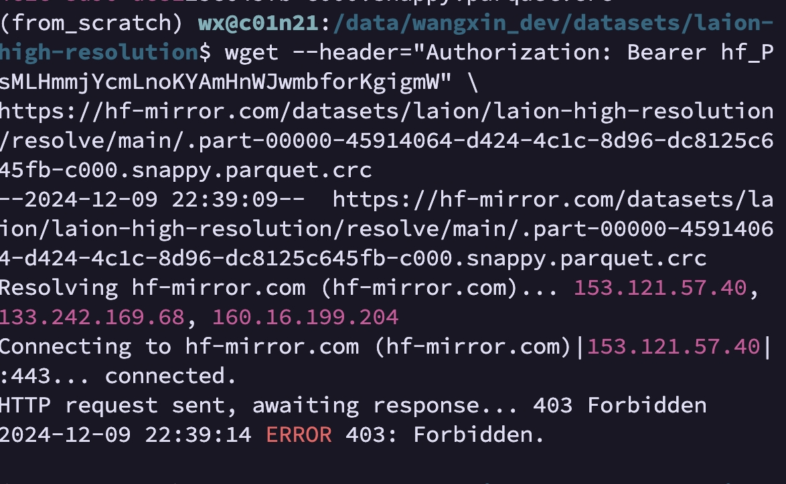
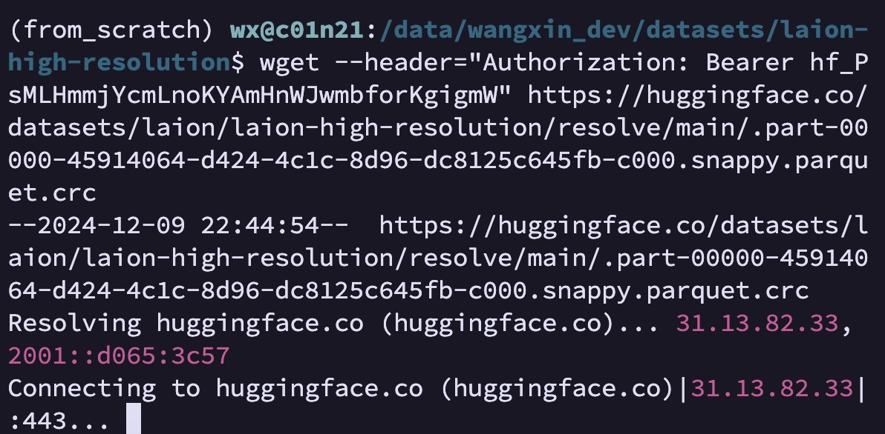
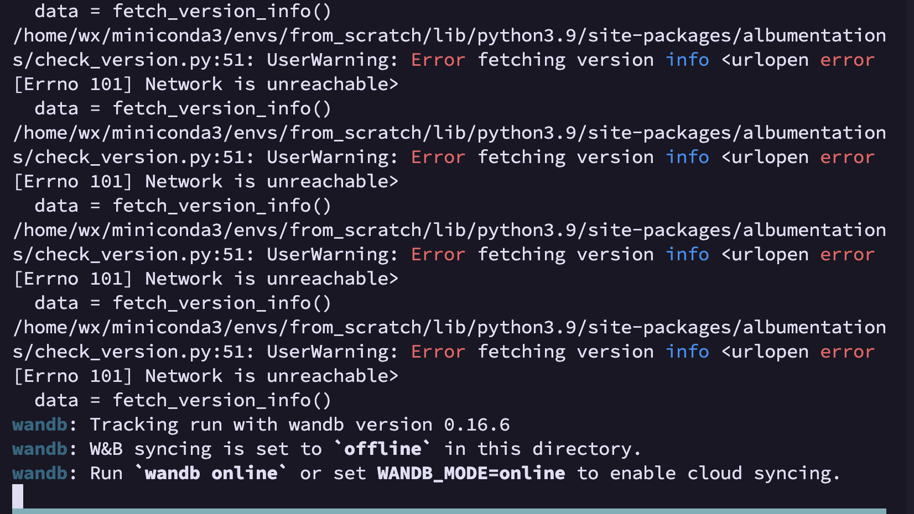
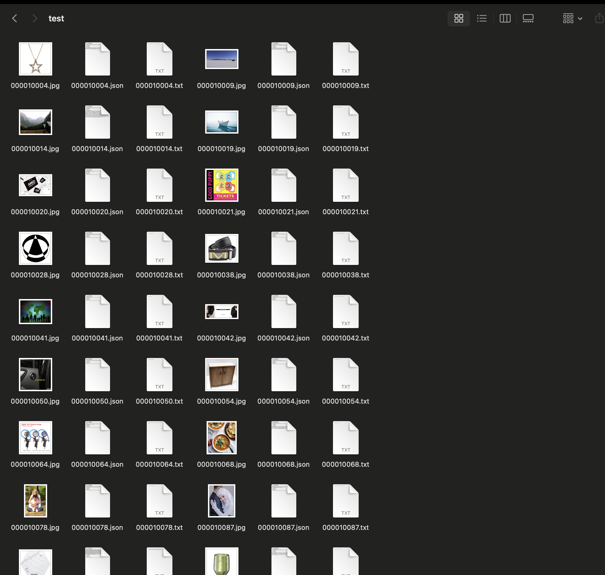

### 1.Hugging face登录方式

huggingface废弃用户名和密码的登录方式，用token

wget --header="Authorization: Bearer hf_xxx" \

https://huggingface.co/runwayml/stable-diffusion-inpainting/resolve/main/sd-v1-5-inpainting.ckpt


### 2.可以下载sd1.5,下载数据集却403 forbidden

1. 403 forbidden（将token权限增加write,我全打开了）
2. 

https://discuss.huggingface.co/t/error-403-what-to-do-about-it/12983


### 3.国内机器访问huggingface网络不好，无法下载

用镜像网站hf-mirror.com



wget --header="Authorization: Bearer hf_xxx" https://hf-mirror.com/datasets/laion/laion-high-resolution/resolve/main/.part-00000-45914064-d424-4c1c-8d96-dc8125c645fb-c000.snappy.parquet.crc


### 4. 下载laion数据集用img2dataset工具

注意huggingface的laion high-resolution文件里有两种文件类型，crc是parquet的校验文件，下了没用，要下载parquet文件是数据集的metadata

### wandb超时

export WANDB_MODE=offline


## 步骤：

1. 下载metadata

   ```shell
   for i in {0..127}; do 
   
     wget --header="Authorization: Bearer hf_xxx" https://hf-mirror.com/datasets/laion/laion-high-resolution/resolve/main/part-$(printf "%05d" $i)-45914064-d424-4c1c-8d96-dc8125c645fb-c000.snappy.parquet
   
   done
   ```


2.下载原数据

```shell
export WANDB_MODE=offline

img2dataset --url_list laion-high-resolution --input_format "parquet"\

​     --url_col "URL" --caption_col "TEXT" --output_format webdataset\

​      --output_folder laion-high-resolution-output --processes_count 16 --thread_count 64 --image_size 1024\

​      --resize_only_if_bigger=True --resize_mode="keep_ratio" --skip_reencode=True \

​       --save_additional_columns '["similarity","hash","punsafe","pwatermark","LANGUAGE"]' --enable_wandb True
```

应该已经开始下载了




## 下载数据集结果


