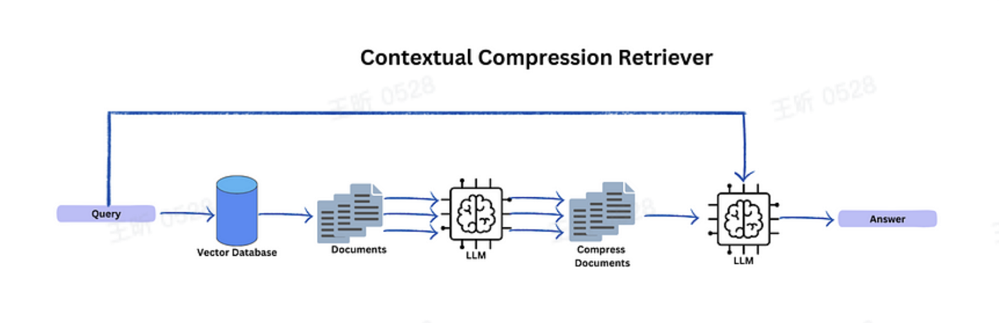

https://readmedium.com/these-are-the-3-langchain-functions-i-used-to-improve-my-rag-00413ccb7094

1. Multi Query Retriever
2. Long Context Recorder
3. Contextual Compression

### Long-Context Reorder

https://python.langchain.com/v0.1/docs/modules/data_connection/retrievers/long_context_reorder/

无论你的模型架构如何，当包含超过 **10** 个检索到的文档时，性能都会显著下降。简而言之：当模型必须在长上下文中访问相关信息时，它们往往会忽略提供的文档。

策略：

将不太相关的文档放在列表的中间，而更相关的文档放在开头和结尾。
