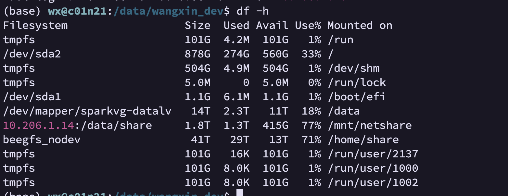

## LAION-5B

LAION-5B 是目前规模最大的开放多模态数据集之一，包含 58.5 亿个 [CLIP](https://so.csdn.net/so/search?q=CLIP&spm=1001.2101.3001.7020) [5]过滤的图像-文本对的数据集，比 LAION-400M 大 14 倍，是世界第一大规模、多模态的文本图像数据集，**共80T数据**，并提供了色情图片过滤、水印图片过滤、高分辨率图片、美学图片等子集和模型，供不同方向研究。

LAION-5B中包括23.2亿的英语，22.6亿的100+语言及12.7亿的未知语言，我们将子集分别标记为：

**●** laion2B-en (应该是我们要的2B数据集)

**●** **laion2B-multi**

**●** **laion1B-nolang**

LAION训练了一个基于CLIP嵌入的色情内容识别模型NSFW，可以过滤3%的不适图片，NSFW准确率约96%，过滤后有子集：

laion2B-en-safety

laion2B-multi-safety

laion1B-nolang-safety

LAION训练了一个水印识别模型，过滤后有子集：

laion2B-en-watermark

laion2B-multi-watermark

laion1B-nolang-watermark

一个170M的超分辨率子集：

laion-high-resolution

一个120M的美学图片子集，可以用来做图片生成：

laion-aesthetic

### 子集

LAION-5B 提供了多种子集，以满足不同的研究需求：

- **LAION-400M**：规模较小，约 400 万个图像-文本对，方便快速实验。

- **LAION-2B**：包含 20 亿对，适合中等规模实验。

- **LAION-5B**：完整数据集。

  

### LAION-2B-HD 子集

- **图像-文本对总数**：约 **1.2 亿对**。

- **图像分辨率**：

- 大多数图像的分辨率在 **1024×1024 像素**或更高。

- **数据来源**：

- 从 LAION-2B 数据集中过滤生成，确保图像清晰度高，文本描述相关性强。

#### 特点

- 高质量图像，适合图像生成、超级分辨率等任务。

- 文本描述更贴近高质量图像语义。

**LAION-2B-HD** 是从 LAION 数据集中筛选出的高质量、高分辨率图像子集，适合需要高分辨率图像和精确文本描述的任务。

## 下载方法：

https://github.com/rom1504/img2dataset/blob/main/dataset_examples/laion-high-resolution.md
