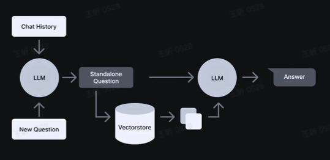
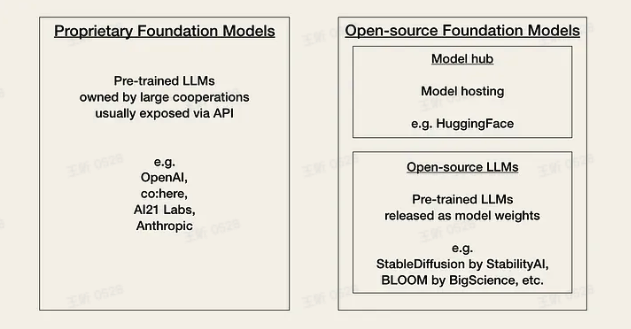
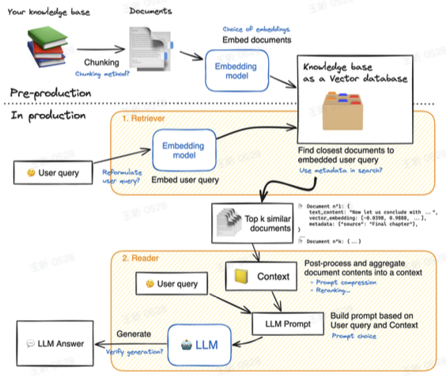
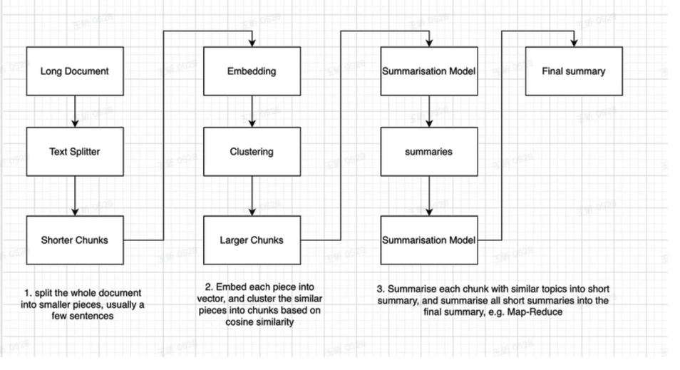
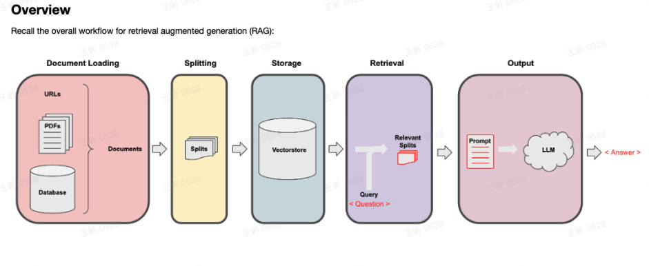

### 什么是langchin



langchain是一个支持大语言模型相关应用开发的框架。

使得建设与ai相关的应用会更容易。

- 集成：将外部数据，比如文件、api、应用集成进来

- 代理：和环境集成

组件 - LangChain 使得更换必要的抽象和组件以使用语言模型变得轻而易举。

自定义链 - LangChain 提供现成的支持来使用和自定义“链”——一系列串联在一起的操作。

速度 🚢 - 这个团队的交付速度非常快。您将会跟上最新的 LLM 功能。

社区 👥 - 极好的 Discord 和社区支持，见面会、黑客松等活动。


## LLMs

- 公司开发和控制的专有模型：成本高、许可证限制、闭源
- 开源模型：开源、灵活性、可能缺乏大公司的支持和资源



用api

AzureOpenAI:适用于一般的长文本生成任务，如小说写作、文章创作等。

AzureChatOpenAI:适用于涉及大量对话的文本生成任务，尤其是需要管理对话上下文时。

根据你的具体需求选择合适的模型。如果主要任务是长文本创作且对话不是主要部分，建议使用 AzureOpenAI。如果有大量对话且需要更好地管理对话上下文，建议使用 AzureChatOpenAI。

AzureOpenAI 会报错

Error code: 400 - {'error': {'code': 'OperationNotSupported', 'message': 'The completion operation does not work with the specified model, gpt-4o. Please choose different model and try again. You can learn more about which models can be used with each operation here:

```python
#This basic example demostrate the LLM response and ChatModel Response

from langchain.llms import AzureOpenAI
from langchain.chat_models import AzureChatOpenAI
import openai
import os
from dotenv import load_dotenv, find_dotenv


# Set the OpenAI library configuration using the retrieved environment variables
OPENAI_API_TYPE = "azure"
OPENAI_API_BASE = "https://sparkopenai2024.openai.azure.com/"
OPENAI_API_VERSION = "2024-02-15-preview"
OPENAI_API_KEY = "xxx"
GPT4V_ENDPOINT = "https://sparkopenai2024.openai.azure.com/openai/deployments/gpt-4o/chat/completions?api-version=2024-02-15-preview"

# Initialize an instance of AzureOpenAI using the specified settings
# llm = AzureOpenAI(
#     openai_api_version=OPENAI_API_VERSION,
#     openai_api_key=OPENAI_API_KEY,
#     openai_api_base=OPENAI_API_BASE,
#     openai_api_type=OPENAI_API_TYPE,
#     deployment_name="gpt-4o"  # Name of the deployment for identification
# )

# Initialize an instance of AzureChatOpenAI using the specified settings
chat_llm = AzureChatOpenAI(
    openai_api_version=OPENAI_API_VERSION,
    openai_api_key=OPENAI_API_KEY,
    openai_api_base=OPENAI_API_BASE,
    openai_api_type=OPENAI_API_TYPE,
    deployment_name="gpt-4o"  
)

# Print the response from AzureOpenAI LLM for a specific question
# print("AzureOpenAI LLM Response: ", llm(" what is the weather in mumbai today?"))

# Print the response from AzureChatOpenAI for the same question
print("AzureOpenAI ChatLLM Response: ", chat_llm.predict("what is the weather in mumbai today?"))

```

```
如果直接与大模型交互->chatGPT。自从发现可以利
用自有数据来增强大语言模型（LL
M）的能力以来，如何将 LL
M 的通用
有效结合一直是热门话题。
知识与个人数据
1. 微调(finetue)
2.
RAG(检索增强)
```


### 先来考虑一个关于小说内容的chatRobot:



**topic**:

- 文档分割
- 文档 **Load**：数据加载， **LangChain** 提供的 **80** 多种独特的加载器，以访问包括音频和视频在内的各种数据源。
- 向量存储和嵌入：深入了解嵌入的概念，探索 **LangChain** 中的向量存储集成。
- 检索：掌握在 **Vector** 存储中访问和索引数据的高级技术，使您能够检索语义查询之外的最相关信息。
- 问题解答：构建一次性问题解答解决方案**/**总结方案。


#### Long text summarisation

##### 为什么context window会是limit

当前大多数的语言模型是基于解码器的模型。这些模型使用了变换器架构中的解码器部分来预测下一个标记的概率。然后，将这个预测的标记附加到输入文本中，形成预测下一个标记的输入。

**Context Window Size = Input Sequence Length + Prompt Length + O**

**utput Sequence Length**


举个例子：如果context window的限制是4097，prompt的token size是50，期待输出的总结内容是200，那么最大的输入文本的token size就是4097-50-200=3847tokens，大概对应3000个词。

> [!IMPORTANT]
>
> LLMs受限于固定的上下文窗口，比如chatgpt的limit tokens是4096，大概对应3000多个词。对于这个问题有两种解决方案：第一种用更大context window的LLMs;第二种方法是化整为零，将长文本分成很多个短文本，分别送进模型处理然后合并，或者选择最相关的部分然后送进去分析。



文档分割：

CharacterTextSplitter:直接按字符数量分割文本。

```
c_splitter = CharacterTextSplitter(
    chunk_size=chunk_size,
    chunk_overlap=chunk_overlap,
    separator = ' '    //主要在哪一块分割
)
c_splitter.split_text(text3)

```

- RecursiveCharacterTextSplitter: 按照递归规则分割文本

  ```
  r_splitter = RecursiveCharacterTextSplitter(
      chunk_size=150,
      chunk_overlap=0,
      separators=["\n\n", "\n", "(?<=\. )", " ", ""]
  )
  r_splitter.split_text(some_text)
  ```

  

- TokenTextSplitter：跟LLMs里的token的概念对齐

  ```
  text_splitter = TokenTextSplitter(chunk_size=10, chunk_overlap=0)
  ```

  

- Context aware splitting

```
from langchain.document_loaders import NotionDirectoryLoader
from langchain.text_splitter import MarkdownHeaderTextSplitter

markdown_document = """# Title\n\n \
## Chapter 1\n\n \
Hi this is Jim\n\n Hi this is Joe\n\n \
### Section \n\n \
Hi this is Lance \n\n 
## Chapter 2\n\n \
Hi this is Molly"""

headers_to_split_on = [
    ("#", "Header 1"),
    ("##", "Header 2"),
    ("###", "Header 3"),
]

markdown_splitter = MarkdownHeaderTextSplitter(
    headers_to_split_on=headers_to_split_on
)
md_header_splits = markdown_splitter.split_text(markdown_document)
```


### RAG搜索增强




> [!NOTE]
>
> **query**和**prompt**的区别是什么？
>
> 在使用 **RetrievalQA chain** 进行问答时， prompt 和 query 是两个不同的概念。理解它们的区别对于构建有效的问答系统非常重要。
>
> 1. **Query（查询）** ：
>
> ◦ query 是用户提出的问题或查询。例如，“**What is the capital of France?**”
>
> ◦ 在 qa_chain_mr 中， query 是必须的，因为它是整个问答流程的起点。系统根据 query 去检索相关的文档，然后从中抽取答
>
> 案。
>
> 2. **Prompt（提示词）** ：
>
> ◦ prompt 是用于指导语言模型生成答案的额外文本或上下文。它可以包含特定的指示或格式化信息，以帮助模型生成更合适的响应。
>
> 提供prompt可以帮助模型更好地理解上下文或期望的回答形式。例如，你可以提供一个 prompt 来指示模型回答时的语气、详细程度或者其他特定要求。

