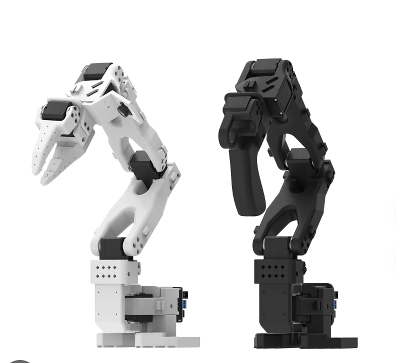
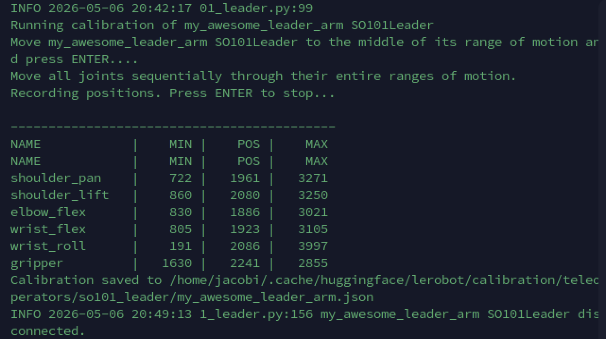
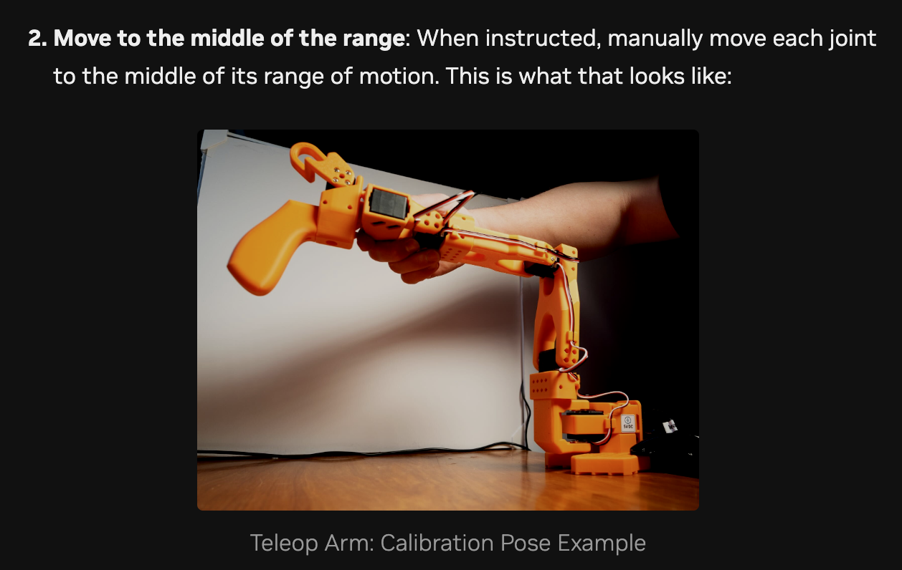
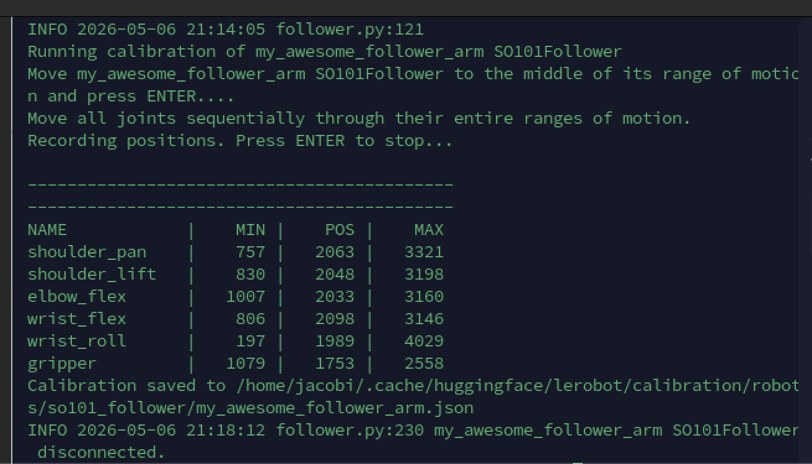
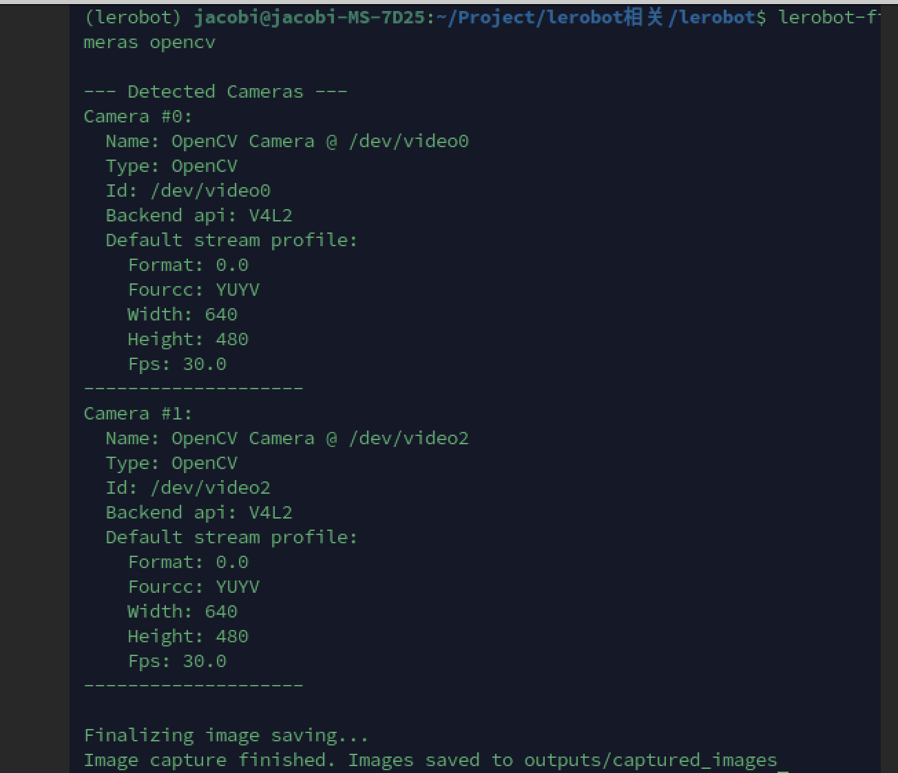
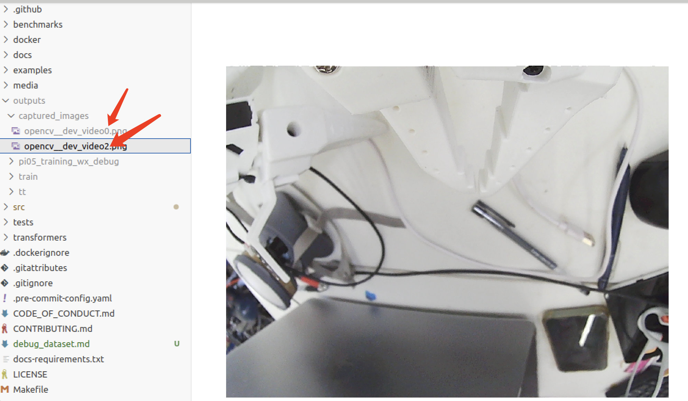
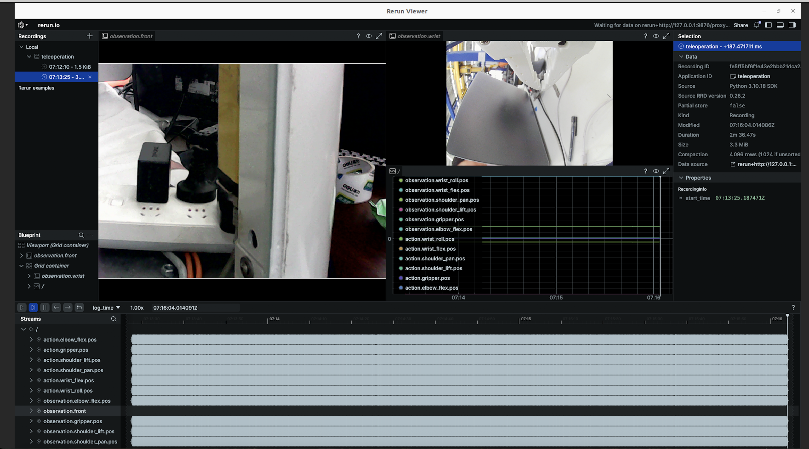

### 一、硬件组装

如图所示，lerobot主要由一个主臂（右边的操作臂）和一个从臂组成（左边的臂）。通过右边的臂进行示教，左边的臂相当于执行示教的动作或者policy的动作。




### 二、lerobot环境安装

用docker或者conda环境都可以，我是安装了一个anaconda环境。


### 三、确定遥控臂（teleop arm）和机械人手臂(robot arm)端口

#### 3.1 识别遥控臂（teleop arm）端口

```shell
lerobot-find-port

## 过程可以参考https://docs.nvidia.com/learning/physical-ai/sim-to-real-so-101/latest/07-calibrating-so101.html

## 你会得到
The port of this MotorsBus is '/dev/ttyACM0'
Reconnect the USB cable.

在本例中， /dev/ttyACM0 是主机分配的端口。
```

#### 3.2 识别机器人手臂端口

```shell
lerobot-find-port

## 相同的操作过程可以得到机器人手臂的端口/dev/ttyACM1
```


#### 3.3(可选) 绑定机器人端口

完成上面的设定可能存在两个问题：

由于 Linux 系统分配 `/dev/ttyACM*` 是按照插拔顺序随机分配的，且默认权限受限：

1.(插拔端口号变化)如果同时重新连接多根 USB 线缆，端口可能会发生变化。需要通过断开其中一根线缆并按 Enter 键重新来确定哪个端口对应哪个机械臂。

2.（插拔权限重置）：每次插拔都要重新CHMOD 666

检查绑定：

```shell
ls -l /dev/master_arm /dev/slave_arm
```

你会看到类似这样的输出，显示它们已经指向了 `ttyACM*`： `lrwxrwxrwx 1 root root 7 Dec 18 10:00 /dev/master_arm -> ttyACM0`

检查权限：

```shell
ls -l /dev/ttyACM*
```

你会发现权限已经是 `crw-rw-rw-` (即 666)，不再需要手动修改。

解决方案参考另外一篇文档：lerobot端口绑定。


### 四、校准

#### 4.1 校准遥控臂（主控臂）#

```shell
lerobot-calibrate \
    --teleop.type=so101_leader \   
    --teleop.port=/dev/master_arm \    ## 刚才绑定的端口
    --teleop.id=my_awesome_leader_arm   #起个unique的名字
```





#### 4.2 校准从臂

```shell
lerobot-calibrate \
    --teleop.type=so101_follower \   
    --teleop.port=/dev/slave_arm \    ## 刚才绑定的端口
    --teleop.id=my_awesome_follower_arm   #起个unique的名字
```



#### 4.3 Teleoperation

```shell
lerobot-teleoperate \
    --robot.type=so101_follower \
    --robot.port=/dev/slave_arm \
    --robot.id=my_awesome_follower_arm \
    --teleop.type=so101_leader \
    --teleop.port=/dev/master_arm \
    --teleop.id=my_awesome_leader_arm
```

参考：

https://docs.nvidia.com/learning/physical-ai/sim-to-real-so-101/latest/08-operating-so101.html


#### 4.4 camera设置

每个机器人workspace配备了两个摄像头：

- Gripper camera：夹爪摄像头，安装在机器人的手腕/夹爪上
- External camera: 外部摄像头，从上方或者侧面观察工作区域

```shell
lerobot-find-cameras opencv
```



> [!CAUTION]
>
> (可能会遇到一个摄像头fail to connect的问题，现象是分别connect一个摄像头没问题,两个摄像头一起连就会这样)
>
> 这种情况非常典型，几乎可以确定是usb总线带宽不足或者是电源供应限制。
>
> 1.分散usb接口：不要把两个摄像头插在相邻的接口上，更不要插在同一个usb hub上。电脑主板上面通常有多个usb控制器，将两个摄像头分别插在电脑的前置和后置面板上。——solved
>
> 2.修改摄像头格式压缩视频或者降低分辨率或者帧率来节省带宽。

会捕捉图像存储到文件夹里。




### 五、利用摄像头来进行远程teleoperation

```shell
lerobot-teleoperate \
  --robot.type=so101_follower \
  --robot.port=/dev/slave_arm \
  --robot.id=my_awesome_follower_arm \
  --teleop.type=so101_leader \
  --teleop.port=/dev/master_arm \
  --teleop.id=my_awesome_leader_arm \
  --display_data=true \
  --robot.cameras='{
    "wrist": {
      "type": "opencv",
      "index_or_path": '2',   #看outputs存入图像的索引
      "width": 640,
      "height": 480,
      "fps": 30
    },
    "front": {
      "type": "opencv",
      "index_or_path": '0',
      "width": 640,
      "height": 480,
      "fps": 30
    }
  }'
```

可以在Rerun viewer这个工具里看到



接下来可以尝试对应的操作。注意：

> [!NOTE]
>
> **尝试****仅通过摄像头画面** （而非肉眼）进行遥操作。

