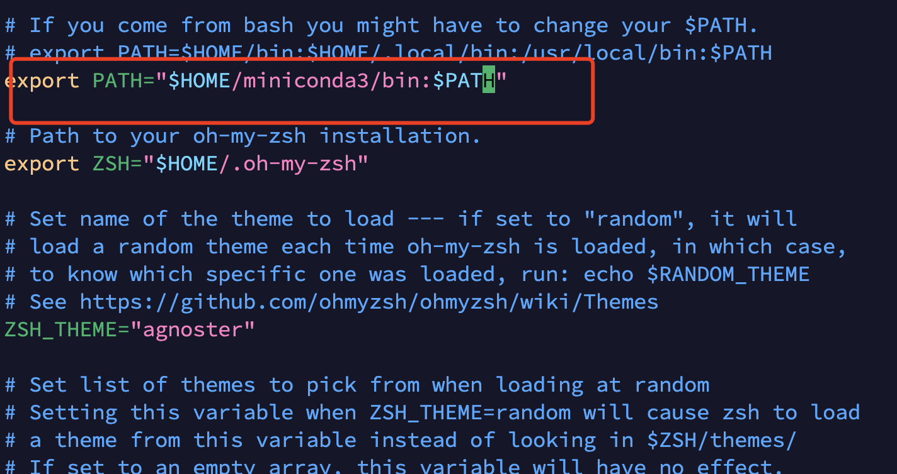
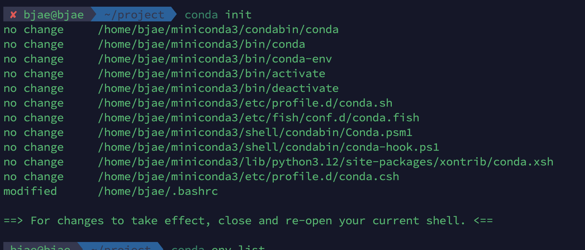
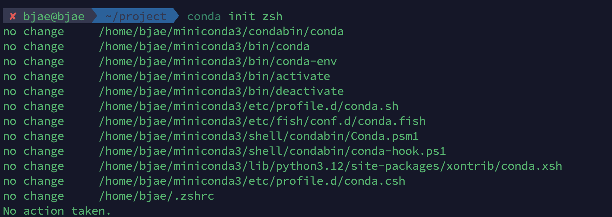

# linux开发环境配置

1.安装ubuntu

2.安装Nvidia driver

3.zerotier用于远程连接(同时安装向日葵以防万一)

4.更换shell为zsh，安装oh-my-zsh,配置高亮、自动补全、autojump等的插件；将主题更改为agnoster;

  https://www.cnblogs.com/chencarl/p/16824387.html

为了展示 **Agnoster** 主题提示符里的三角形，需要 **Powerline** 字体库的支持。

https://zhuanlan.zhihu.com/p/62419420


5.tmux进行管理


6.安装miniconda并把路径加入到zshrc的配置文件里。



https://www.cnblogs.com/xingnie/p/16269190.html

完了要执行conda init，简单的让conda配置在zshrc的方法（有时候conda init默认更新了bashrc，不用拷贝设置到zshrc）



Conda init zsh即可(因为我已经执行过了，所以是no change)




7.远程服务器免密码连接：

7.1 复制本地公钥文件到远程服务器

先看.ssh文件夹下面是否有生成好的密钥文件

ssh-copy-id -i ~/.ssh/id_ed25519.pub username@ip

此时可以通过ssh username@ip直接登陆不需要输入密码。

7.2 通过**`~/.ssh/config`** 简化连接

nano ~/.ssh/config

```shell
Host server1
    HostName 192.168.1.100
    User root
    IdentityFile ~/.ssh/id_ed25519

Host server2
    HostName example.com
    User admin
    IdentityFile ~/.ssh/id_ed25519
    Port 2222  # 如果SSH端口不是默认的22
```

之后就可以直接用别名登录：

```
ssh server1  # 代替 ssh root@192.168.1.100
ssh server2  # 代替 ssh -p 2222 admin@example.com
```

