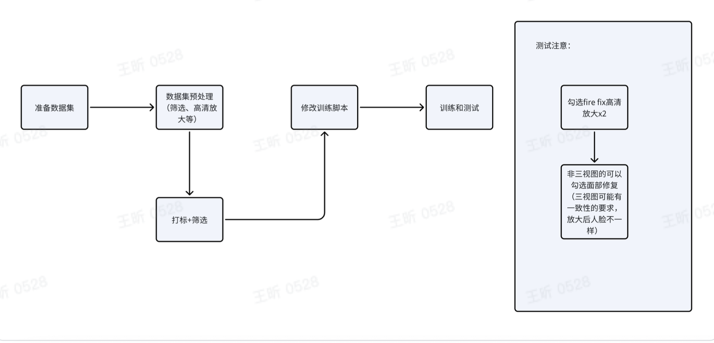
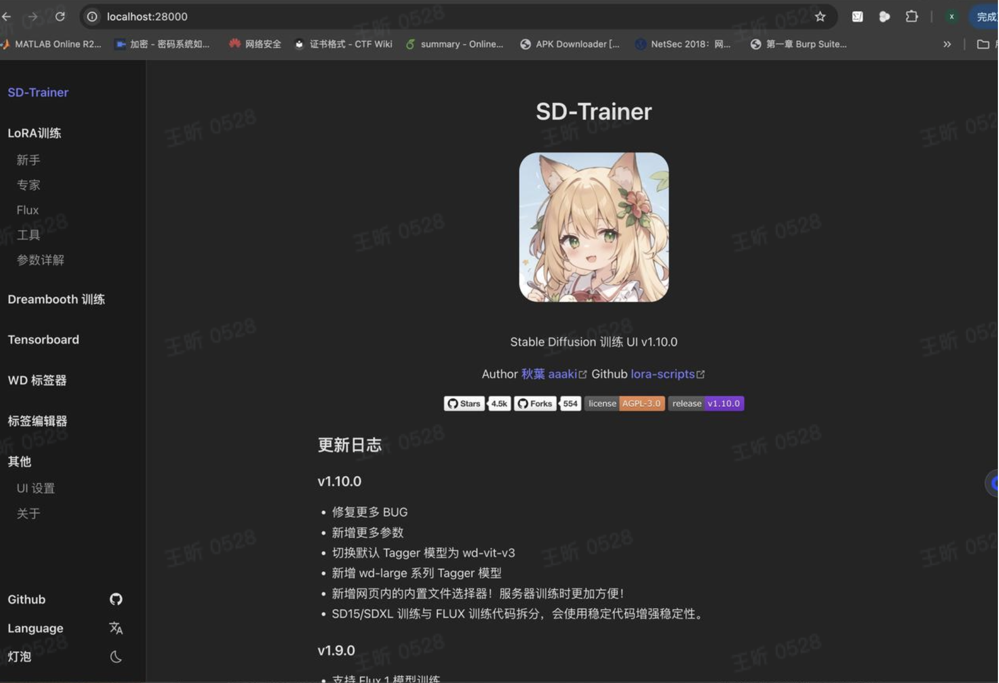
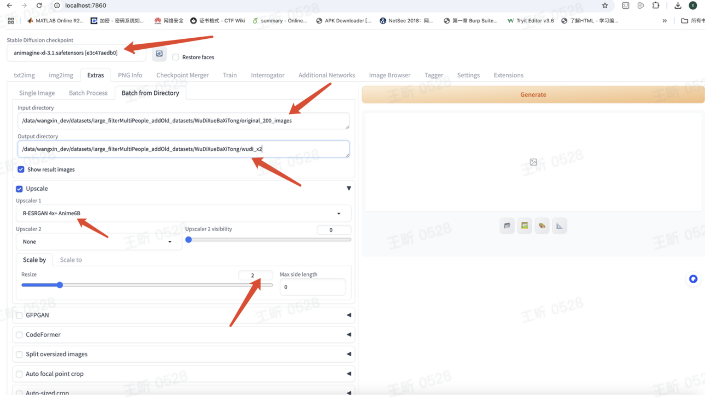
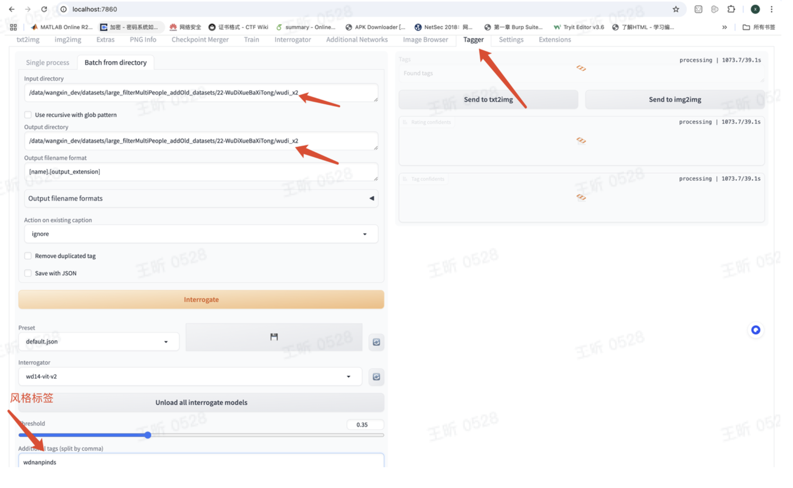
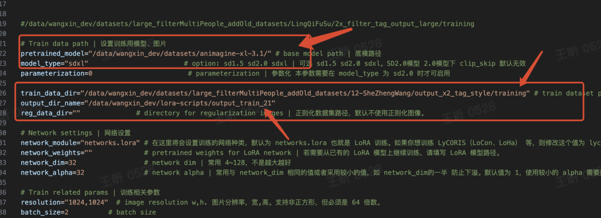
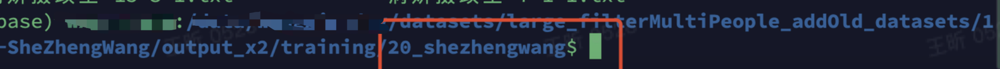
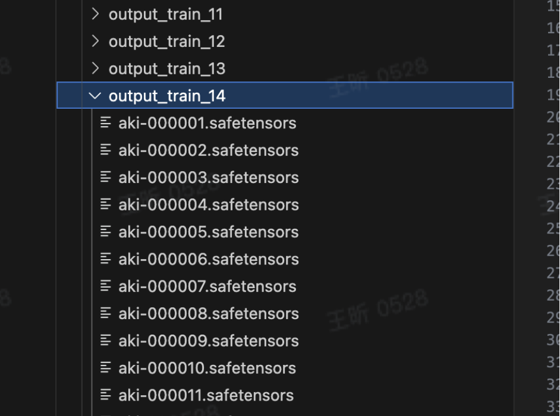
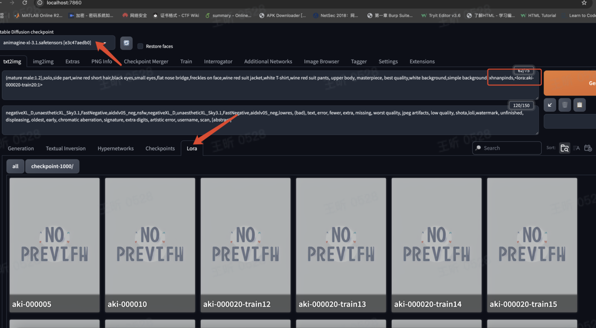
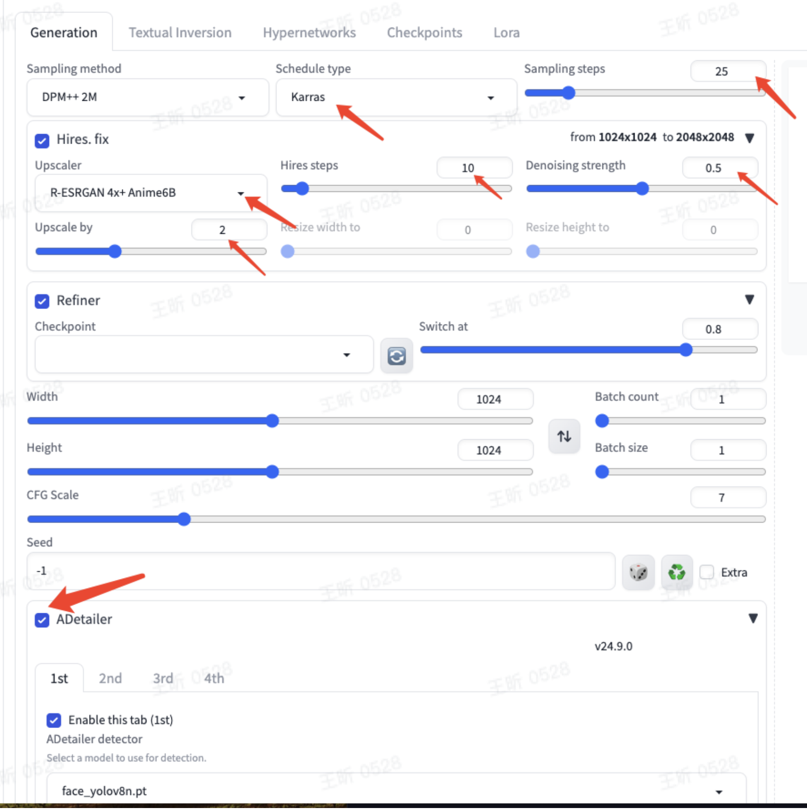

### 1. 准备lora-scripts环境

https://github.com/Akegarasu/lora-scripts

> [!CAUTION]
>
> 需要用python3.9，按照仓库代码指示进行安装，安装成功可以启动ui页面。

### 2. 准备数据集

1. lora训练脚本图片默认大小是1024x1024,如果训练图片大小不够，可以对图片进行高清放大：

### 3. 打标+筛选

打标的基本步骤：用**webui**的**tagger**打标工具自动打标，生成**txt**文件，人工修正标签。

在这个过程里面我用到的一些人工打标的原则：

> [!NOTE]
>
> 1. 过滤多人交互的复杂图片，不确定的可以只留单人图。凑足**100**张图片
> 2. 打标风格标签用简单的无意义的单个词，如sznanpinds。（我一般用小说前两个拼音首字母+nanpinds/nvpinds）
> 3. 筛选标签
>    1. 合并删除重复、矛盾的标签，比如shirt,white shirt->white shirt; gray hair, brown hair -> brown hair
>    2. 删除识别错误的标签

#### 4. 修改训练脚本train.sh

1. 底膜设置、数据集文件夹、输出文件设置

   

2. 训练数据集地址， ，数据集文件夹的命名是**repeat**次数**_**含义，比如我在训练风格**lora**的时候我希望

   每张图片训练的时候**repeat 20**次**,**我的数据集文件夹命名就是**20_xxxStyle**

但是在脚本里填数据集位置的时候不能直接写这里

的**/xxx/datasets/large_filterMultiPeople_addOld_datasets/12-**

**SheZhengWang/output_x2/training/20_shezhengwang**，要写到上一级父目录，因此数据集地址

是**/xxx/datasets/large_filterMultiPeople_addOld_datasets/12-**

**SheZhengWang/output_x2/training**，这个目录下只有**20_xxx**一个文件夹。

3. 模型输出文件夹**output_dir_name**，log目录，避免新run覆盖旧的模型文件。

#### 5. 测试

在输出文件夹会有一些模型文件，可以选择一轮的模型复制到**webui**的**models/LoRA**目录下（或者comfyui相应的目录下面），刷新加载选中之后用提示词**+lora**模型就可以出图了。注意**lora**训练一般都会过拟合，一般**10**～**20**个**epoch**就可以，之后的**epoch**虽然还会损失下降，但是已经过拟合了。

测试图可以勾选Hires.fix高清放大和ADetailer面部修复得到更好的出图效果。如我在训练动漫数据用到的参数如下：

