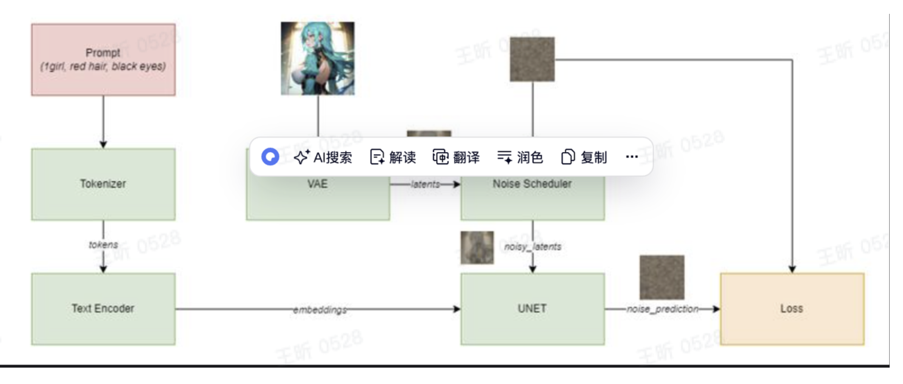

### 1. Understanding stable diffusion models

- Stable diffusion 怎样理解concepts

  - Stable diffusion已经有了大量的知识，如果我们训练lora,非常重要的就是理解和区分"New concepts"和"modified concepts"
  - New concepts:这些是模型之前没遇到的或者是未充分体现
  - Modified concepts:调整或者完善模型的现有理解

- lora种类：只用关注标准的就行。

- 理解sd模型

  - Latent space:一张512x512像素的图片大小是4x512x512，计算很耗费。因此一个解决方法是latent space.将数学上复杂的对象比如image转换为简单压缩的形式。

  - 一个做这种压缩过程的就是VAE,将图像压缩到它的latent space然后将其重建为原来的形式。

    > [!NOTE]
    >
    > In the case of Stable Diffusion,for an image of size 512x512, the VAE compresses it to 64x64x4 =16,384 values, making the process extremely more efficient.

  - Text encoder, tokenizer and Embeddings

    - kenizer将输入分词

    - Text encoder将token编码成数字向量

    - 编码后的向量叫做embedding

      > [!NOTE]
      >
      > Example:"Poiuytrezay",is encoded by the Text Encoder into "po #628","iu#14292","y #88","Tre #975"，“z #89”, "ay</w> #551",where the numbers represent the embedding ids within stable diffusion.

    

  - Unet

    - unet是一个关键部分，它mix embedding和latent-encoded图像into a mathematical soup 输出一个"noise" prediction.然后这个noise prediction会被removed from图像从而"denoise"it.训练lora的时候这也是train的主要部分，因为it is the one making prediction.

      

### 2. 训练的准备

- 数据集

  - “A bad apple spoils the bunch”
  - Activation tags:特殊的触发词， prompt模型产生或者强调相应的视觉元素。
  - The activation tag should be a unique tag that represents your concept/character/style and should be present as the FIRST element in the caption files of your dataset. 

- Training script/UI

  - 各种训练脚本/ui都有相同的参数设置，只是会在部分features上有区别。

  - 理解Lora,Dreambooth和TI(text inversion)

    - sd的模型用传统的fine-tune的技术可能会耗费大量资源，下面是一些替代的技术。
      - DreamBooth:与常规微调没有太大区别，但通常针对单个概念。与常规微调的主要区别在于事先保存。
      - Textual inversion:创新新的嵌入帮助模型学习新关联
      - LoRA:这是一种只修改模型权重的一小部分的技术。
      - Pivotal Tuning:
      - hypernetwork

  - Base model for training

    - 总是用bf16/fp16 pruned模型用于训练
    - 用四种base model：NAI, SD1.5, SD2.1 SDXL
      - 真实性：SD1.5，SD2.1, or SDXL(your choice)
      - Anime/cartoon:NSI,SDXL

  - Dreambooth

    - 简单解释：Dreambooth是一种微调AI模型部分内容（特别是unet和文本编码器）的方法，使用稀有标记和正则化图像来维护模型的现有知识。生成的Dreambooth模型是一个检查点。

    - 详细解释：文本到图像模型（如稳定扩散）最初在大量数据集上进行训练，以学习广泛的概念。这种初始训练形成了模型的“先验”**——**关于各种物体和想法（如不同的动物、车辆等）的基本知识。在这种情况下，引入新概念可能会很棘手。传统的微调（涉及根据新数据调整模型参数）可能会使模型忘记一些原始训练（称为“语言漂移”或“灾难性遗忘”).**Dreambooth** 提供了一种解决方案，可以在添加新概念的同时，使用特定于类的先验保存和稀有标记来减轻模型先验知识的丢失。

    - Regularization images/Class-specific prior preservation

      Dreambooth使用一种特殊方法来保持模型的原始知识不变。它涉及使用与新概念属于同一“类别”但已经是模型知识一部分的图像来训练模型。在这里，“类别”是指实体（如对象、概念或数据点）所属的广泛类别或组。

      例如，如果您正在教它关于特定类型的狗（例如金毛猎犬）的知识，您还包括使用初始模型生成的狗的一般图像。这有助于模型在学习新的特定类型时记住其关于狗的原始训练。

  - Rare tokens

    - 在引入新概念时，**Dreambooth** 建议使用不常见或罕见的标记 **-** 模型不会与已知内容紧密关联的唯一标识符。由于它们先前的关联较弱，它将使语言漂移的影响较小（因为它将失去可能毫无意义的关联） 。这可以防止新训练干扰模型的现有功能。此类标记的示例可能是：“**olis**”、“**bnha**”或“**hta**”。要用罕见标记表示新概念，您可以将罕见标记与类一起使用（例如“一个 **olis** 女孩”，其中 **olis** 可以是您想要训练的任何新角色） 。

  - How Dreambooth apply to lora

    - **LoRA** 需要与现有的微调方法协同工作。最常用的方法是 **Dreambooth** 和文本反转。但是，由于 **LoRA** 与文本反转不兼容，因此它主要与 **Dreambooth** 结合使用。将 **LoRA** 与**Dreambooth** 结合使用的主要区别在于它如何改进模型：**LoRA** 减少了需要调整的参数总数，并专注于微调模型的注意力层。这意味着它不会改变模型的整个单元和文本编码器。实际上，指导 **Dreambooth** 的原则也适用于 **LoRA**。在 **LoRA** 训练中省略罕见的标记或正则化图像可能会导致“语言漂移”**——**模型开始失去其原始的训练准确性。虽然包含这些元素不是强制性的，但在训练期间注意这个潜在问题很重要。

  使用**LoRA** 时的一个关键挑战是有效地整合多个概念。一些 **LoRA** 模型最终会生成类似于其训练数据集中不同元素的拼贴图像（又称“拼贴画”） 。最好的 **LoRA** 不仅会生成高质量的图像，还会保留原始模型的广泛功能。例如，如果您要针对特定名人调整模型，则目标是实现该名人的变化（例如头发颜色变化） ，而不会失去模型准确识别或描绘其他名人的能力。

### Lora

单纯引入模型，很多时候并不会触发LoRA的效果，因为LoRA在训练时基本都会加入若干个特殊的触发词，所以使用时也需要在提示词中输入触发词才能激活LoRA的效果。

> [!IMPORTANT]
>
> 存在一些特殊的Lora不需要触发词，只要引入模型就能生效。

理论上引入的LoRA不限个数（只是插件限制了），但同时引入多个LoRA模型时，同类的LoRA尽量不要重复。例如一个影响服饰、一个影响画风，它们之间是不会冲突的，还能起到很好的互补作用。但是如果两个 **LoRA** 都是影响容貌的，就有可能冲突，这时可以适当调节它们之间的权重，以其中一个为主、另一个则稍微起到调味作用就可以了。

#### lora的应用场景：

1. 描绘特定人物形象

   > [!NOTE]
   >
   > 大部分LoRA为了确保泛用性，训练使用的底膜都是SD大模型，所以一般情况下LoRA不挑模型，尤其是参考图上没有标注模型信息的LoRA,放心切换大模型就好。

   其实除了这些针对“某一个人”的LoRA之外，还有针对“某一类人”的LoRA模型——不局限于某一个人、而是实现了一个大方向的整体美化，例如：

   - Fashion Girl: 使用时尚女性照片训练的模型
   - Cute Girl: 使用可爱女性照片训练的模型
   - AsianMale: 使用亚洲型男面孔训练的模型

   现在追加一个AsianMale的LoRA,权重不需要设置太高（免得喧宾夺主）：<lora:Lora-Custom-ModelLiXian:0.3>,1man

2. 描绘特定画风

3. 描绘特定概念

4. 穿着特定服饰

5. 添加特定元素

   特定元素其实算是服饰类的延伸，只不过它更小、更专。搭配局部重绘使用。

