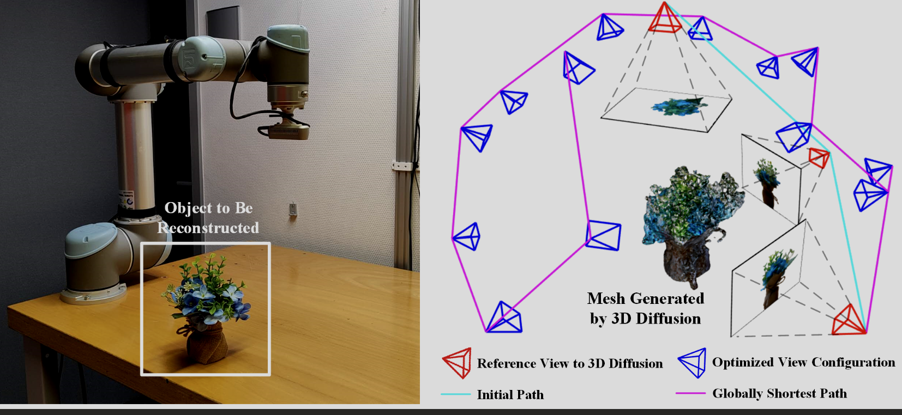
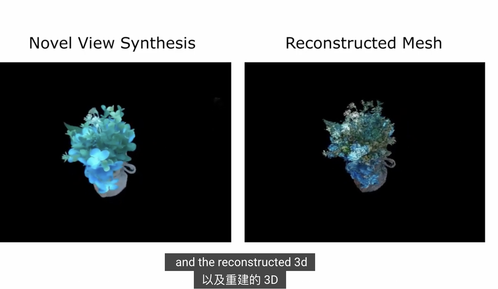
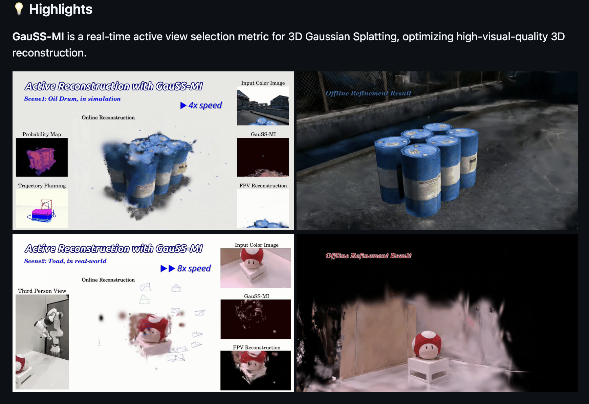

#### 现方向根据下流任务各异

在 Next-Best-View (NBV) 和主动视觉领域，很难定义一个单一的“绝对 SOTA”，因为性能高度依赖于任务目标（如**纯几何重建**、**物体 6D 位姿估计**或**抓取操作**）。

#### sota

根据 2024-2025 年的最前沿进展，以下是各细分方向公认的顶尖（SOTA）算法或框架：

###### 1. 纯物体 3D 重建与视角规划：DM-OSVP++ 

Nerf 2025年4月
 德国波恩大学人形机器人实验室

方法：one-shot view planning
 代码暂时未开源：https://github.com/psc0628/DM-OSVPplusplus
 demo:
 https://www.youtube.com/watch?v=GBBCn28v-lQ

###### 2.实时感知决策：## GauSS-MI

**3D Gaussian Splatting** 与 **香农互信息 (Shannon Mutual Information)** 结合。
 2025年7月
 开源：https://github.com/JohannaXie/GauSS-MI

demo:https://www.bilibili.com/video/BV1rVNUziEFy/?vd_source=db693e375cf7809ea90067d2fd609b51

CUDA模块代码：https://github.com/JohannaXie/diff-gaussian-rasterization-gaussmi

##### 3.针对无纹理物体的 6D 位姿估计

Active 6D Pose 多伦多大学航空航天研究所和机器人研究所
 2025年3月
 未开源

在工业场景或处理反光、无纹理物体（这是位姿估计最难的部分）
 通过 **多视角 RGB 融合** 来消除单视角下的对称性歧义。它通过主动移动相机来寻找能最大程度降低位姿估计熵（Entropy）的视角。
 机械臂在杂乱堆叠（Clutter）中抓取金属零件或塑料制品。

###### 4.任务为导向：AC-NBV

23年11月

- **核心优势**：它是**示能引导（Affordance-driven）**的。它不追求物体表面的 100% 重建，而是优先寻找对“成功抓取”最有帮助的视角（例如物体的边缘、手柄、开口处）。
- **结果**：在抓取成功率（Success Rate）和效率上优于纯几何重建的 NBV。
