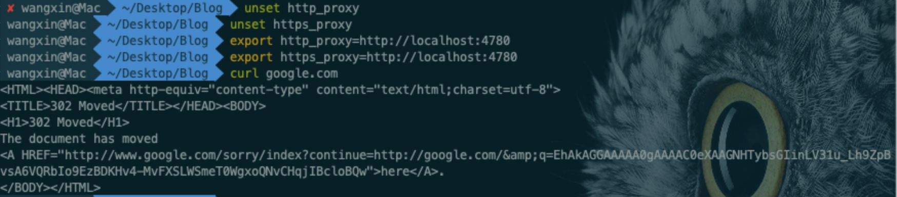
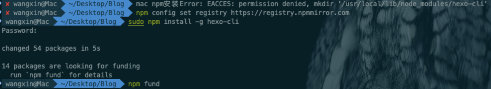

## 对象

Mac pro m4

### 1. 终端配置**iterm2+oh-my-zsh**

要自己安装**command line tools**和home-brew(https://www.jianshu.com/p/e0471aa6672d)

https://github.com/sirius1024/iterm2-with-oh-my-zsh

### 2. Termius

https://termius.com/download/macos

### 3.typora

**https://github.com/shuhongfan/TyporaCrack**

### 4. vpn

可乐云：https://my.coke1.link/

另一个：https://apk.okzapp.app/index.php#/register?code=QIFC23KC （朋友说用了三年多了没有跑路）

我之前用的是DuangCloud，2024下半年华丽嘎了

### 5. 其他问题

#### 5.1 vpn开启全局代理之后终端无法安装包

设置：

现象：终端无法访问国外资源

解决方法：查看vpn代理端口并配置终端的代理端口：

以上参考链接：https://blog.csdn.net/silence_xz/article/details/136669658?spm=1001.2101.3001.6650.5&utm_medium=distribute.pc_relevant.none-task-blog-2%7Edefault%7EBlogCommendFromBaidu%7ERate-5-136669658-blog-133763842.235%5Ev43%5Epc_blog_bottom_relevance_base1&depth_1-utm_source=distribute.pc_relevant.none-task-blog-2%7Edefault%7EBlogCommendFromBaidu%7ERate-5-136669658-blog-133763842.235%5Ev43%5Epc_blog_bottom_relevance_base1&utm_relevant_index=10

#### 5.2 npm安装不动

现象：

解决方法：换源

`npm config set registry http://registry.npmmirror.com`

参考链接：http://liuw.tech/2022/11/05/hexo-%E9%87%8D%E8%A3%85%E7%B3%BB%E7%BB%9F%E5%90%8E%E9%87%8D%E6%96%B0%E9%83%A8%E7%BD%B2hexo/
