学习建议官方的devkit，由于nuscenes按照token索引数据，不建议自己读取jason文件，而是根据官方函数使用其接口。探索数据集用Mini数据集很方便。

### 1.item名词

nuscenes数据集把各个类型的数据分别组织成了一个table.比如scene车移动场景、sample关键帧、instance实例、category类别等等。对于每一个数据都有一个唯一的token来索引到这个数据。所以我们得到数据的过程就是根据官方提供的接口和函数找接口取数据的过程。具体的栏目有：

| Item              | Description                                                  |
| ----------------- | ------------------------------------------------------------ |
| Scene             | 整个数据集一共1000个场景，Mini的有10个。每20s是一个场景      |
| sample            | An annotated snapshot of a scene at a particular timestamp   |
| Sample_data       | Data collected from a particular sensor.                     |
| Instance          | Enumeration of all object instance we observed               |
| Category          | Taxonomy of object categories (e.g. vehicle, human).         |
| Attribute         | Property of an instance that can change while the category remains the same. |
| Visibility        | 可见性                                                       |
| Sensor            | nuscenes有6个camera,1个lidar,5个radar.我们主要做的detection任务只涉及到camera.所以接下来只会涉及到camera. |
| Calibrated sensor | Definition of a particular sensor as calibrated on a particular vehicle.进行坐标转换的时候主要用到的数据，上面的sensor其实只有一些基本信息，没有坐标转换参数。所以要进行坐标转换工作主要使用这类数据 |


### 2. Nuscenes涉及的几个坐标系

- global坐标系：一般的bbox，ego pose都是在全局坐标系下给出的，可以理解为人为设定的一个坐标系，具体也不知道在哪儿。
- ego坐标系：车体坐标系，注意calibrated sensor相机的外参是相对车体给出的。
- 摄像机坐标系


### 3. Scene

`nusc.list_scenes()` 方法列举出所有的scene。

`nusc.scene` 返回列表，可以根据下标去索引具体的scene.

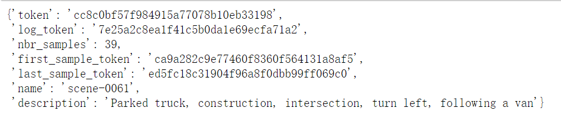

### 4.Sample

在scenes中，每半秒（2 HZ）标注一次数据就是sample。所以sample就是那些有标注的帧。附官方定义：各个传感器有自己的时间线，一致对上的就是关键帧。

•We define sample as an annotated keyframe of a scene at a given timestamp. A keyframe is a frame where the time-stamps of data from all the sensors should be very close to the time-stamp of the sample it points to.

`my_sample = nusc.get('sample',first_sample)`

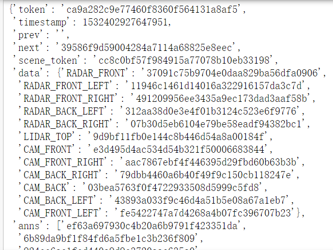

`nusc.list_scene` 列举出所有的场景

`nusc.list_sample(my_sample_token["token"])` 列举出related sample_data keyframes and sample_annotation associated with a sample


### 5. Sample_data

从一个sample中具体取出哪路相机数据。

`my_sample['data']` 列举出12个token,分别是6 camera 5 radar 1 lidar

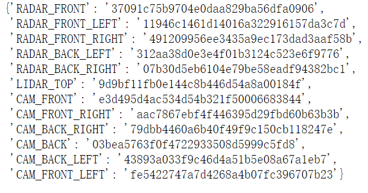

具体取出某个sensor的数据：

```
sensor = 'CAM_FRONT'
Cam_front_data = nusc.get('sample_data',my_sample['data'][sensor])
```

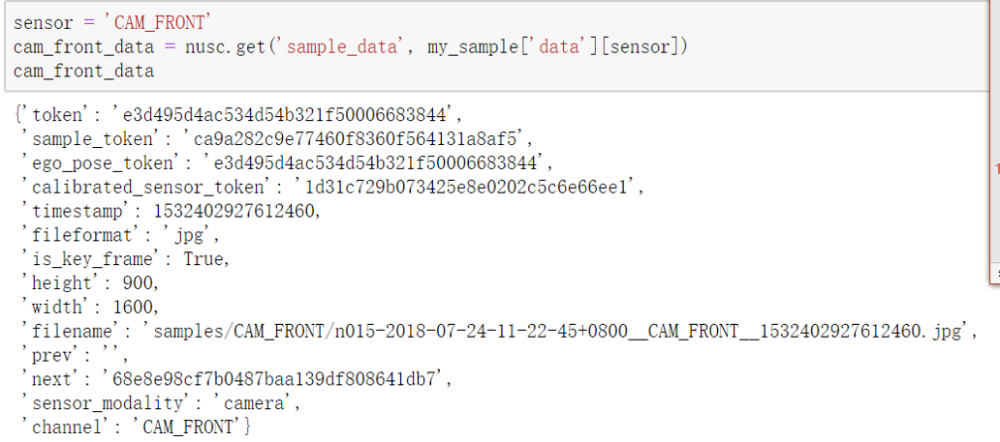

根据sample_data的token取出路径、annotationh和相机内参的接口，检测任务的dataloader很好用.这个函数tutorial没有给，源代码有。传入的第二个可见性的参数是关于bbox的，具体可看源代码。

```
data_path,box_list,cam_intrinsic = nusc.get_sample_data(token,visibility)
```

可视化某一个sample_data:

```
nusc.render_sample_data(cam_front_data['token'])
```

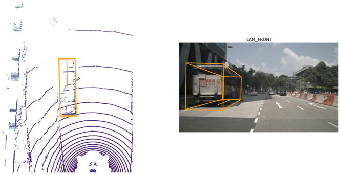

### 6. Sample_annotation

sample_annotation refers to any bounding box defining the position of an object seen in a sample. All location data is given with respect to the global coordinate system.注意注释数据的位置信息都是相对于全局坐标系给出的。

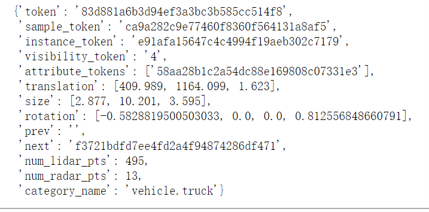

可视化sample_annotation:

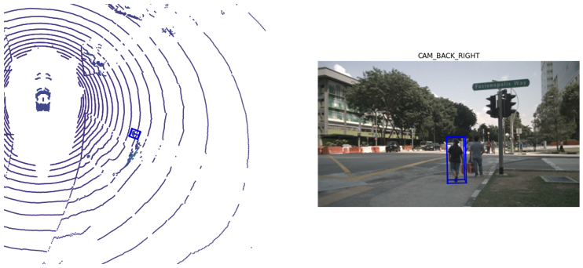


### 7.instance

Object instance are instances that need to be detected or tracked by an AV.

`nusc.instance` 返回instance的列表，可以通过下标索引。

### 8. category

`nusc.list_categories()`

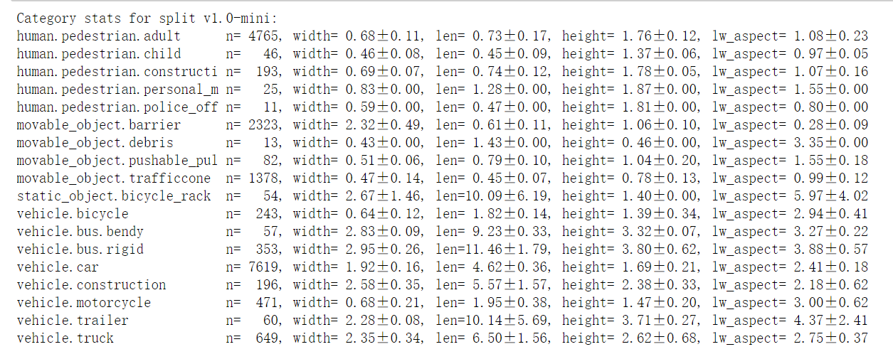


### 9. attribute

An attribute is a property of an instance that may change throughout different parts of a scene while the category remains the same.

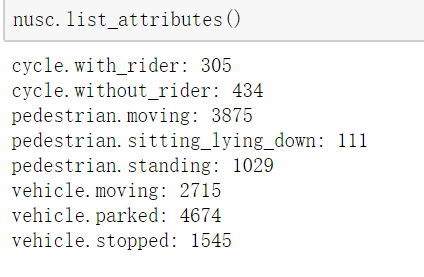


### 10. visibility

visibility可视化及描述：

```python
anntoken='a7d0722bce164f88adf03ada491ea0ba'
visibility_token = nusc.get('sample_annotation',anntoken)['visibility_token']
print("Visibility:{}".format(nusc.get('visibility',visibility_token)))
nusc.render_annotation(anntoken)
```

Visibility: {'description': 'visibility of whole object is between 80 and 100%', 'token': '4', 'level': 'v80-100'}

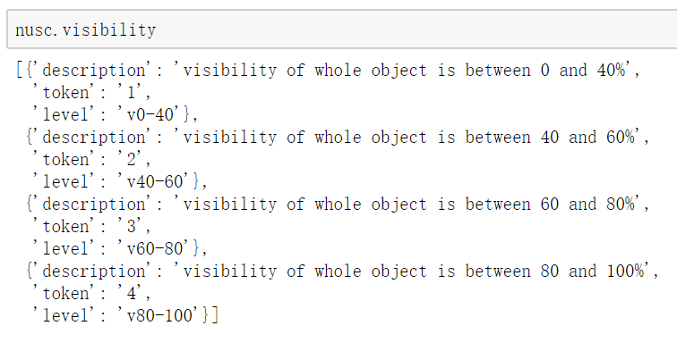


### 11. sensor

1 lidar, 5 radar, 6 cameras


### 12. Calibrated_sensor

calibrated_sensor consists of the definition of a particular sensor (lidar/radar/camera) as calibrated on a particular vehicle. 注意外参是相对**ego vehicle body frame**得到的。

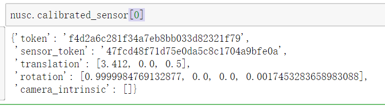

3D bounding box坐标：X points forward, Y to the left, Z up

理解“with respect to ego vehicle body frame”，就是说我相机坐标系中的坐标转换到ego vehicle，就是

$$(\left[ \begin{array}{l} x_{ego}\\\\ y_{ego}\\\\ z_{ego} \end{array} \right] = R\left[ \begin{array}{l} x_{camera}\\\\ y_{camera}\\\\ z_{camera} \end{array} \right] + T)$$

相应的把ego vehicle坐标系下的bbox转换到sensor coord system就是：

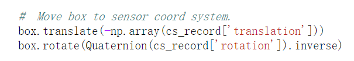

### 13. Ego_pose

go_pose contains information about the location (encoded in translation) and the orientation (encoded in rotation) of the ego vehicle, with respect to the **global coordinate system**.

ego_pose的数量和sample_data是一样的，这两者是一一对应的关系。<u>其实我有点不懂为什么每一个sample_data对应有一个ego_pose，六路相机也就是一个sample不应该对应一个ego pose吗</u>

•描述的是车体自己（x forward,y left,z up）相对于全局坐标系的旋转R和平移T。这个R通过四元数给出。

•理解ego pose的R和T都是相对于（with respect to）全局坐标系这句话;也就是ego坐标系中的一个坐标要变换到全局坐标系中就是

$\left[ \begin{array}{l} x_{global}\\\\ y_{global}\\\\ z_{global} \end{array} \right] = R\left[ \begin{array}{l} x_{ego}\\\\ y_{ego}\\\\ z_{ego} \end{array} \right] + T$

其中公式左边是全局坐标系中的坐标。


### 14.nuscenes评测（只涉及detection方面）

•Nuscenes的评测程序可以在devkit中的eval找到。

•README中规定了相应的sample_result的格式。prediction的结果要按照规定格式组织jason文件。sample_result的表和sample_annotation的表设计为一样的，所以完全可以用sample_annotation的工具和接口去操作sample_result.同时注意生成的结果即使没有识别出框，必须存在相应的token.

•虽然nuscenes训练有23类，但是评测处理similar和rare的类别，考虑到每一类的frequency,最终只归纳了10类，并且每一类有个detection range(meters)。超过这个距离识别出来的框忽略。

 [这个链接可以看到数据集各个类别的频率](https://www.nuscenes.org/nuscenes#data-annotation)

##### 1.预处理

GT和predition bboxes:

 •超过距离的移除；

 •Bikes和motorcycle在bike-rack里面的没有被注释也忽略

GT bboxes:

 •没有Lidar和radar点的被移除，不能确保在当前frame是可见的

##### 2.评测矩阵

mAP: 一般的物体检测选择IOU来做匹配标准和评价阈值，Nuscenes选取的是xy平面bbox距离ego的距离（也就是深度距离）来作为标准，选择最小的距离匹配。选取{0.5,1,2,4}作为距离阈值（相当于原来的IOU@0.3,0.5,0.7），计算AP的时候只选取precision和recall>0.1的点进行计算，当然由于没有计算<0.1的部分会做一个归一化的操作。

TP metircs：其他因素的误差矩阵。Average of translation, velocity, scale, orientation and attribute errors.

NDS(nuscenes detection score): the weighted sum of the above。评价总分，mAP占50%，TP中的五类误差各占权重10%。其中TP metrics统计的是误差值，到衡量得分存在一个转化关系：`TP score = max(1-TP_error,0.0)`

##### 3.True Positive metrics

•TP衡量translation/scale/orientation/velocity/attribute errors

•所以TP矩阵计算匹配时都要满足center distance在2m之类

•最终计算平均在recall>10%，达不到这个阈值某类的TP errors所有都会被设置为1.

•Average Translation error(ATE):bbox的中心到ego原点的L2范数(meters)。即公式

$\sqrt{ {(x1 - x2)^2} + {(y1 - y2)^2} + {(z1 - z2)^2} }$

. 区分于上面计算mAP作为阈值的distance:$\sqrt{(z1-z2)^2}$

•Average Scale Error(ASE): 对齐中心和朝向之后计算1-IOU

•Average Orientation Error(AOE):最小的yaw angle差异（radians）.一般类都是360度衡量，barriers在180度衡量，cones忽略这个指标。

•Average Velocity Error(AVE):absolute velocity error in m/s.barrier和cone忽略这个指标。

•Average Attribute Error(AAE):1-acc.acc是属性分类正确率。Barrier和cone忽略这个指标

•TP矩阵每个类分别计算，对于所有类别取均值得到Map,mASE,mAOE,mAVE,mAAE.
