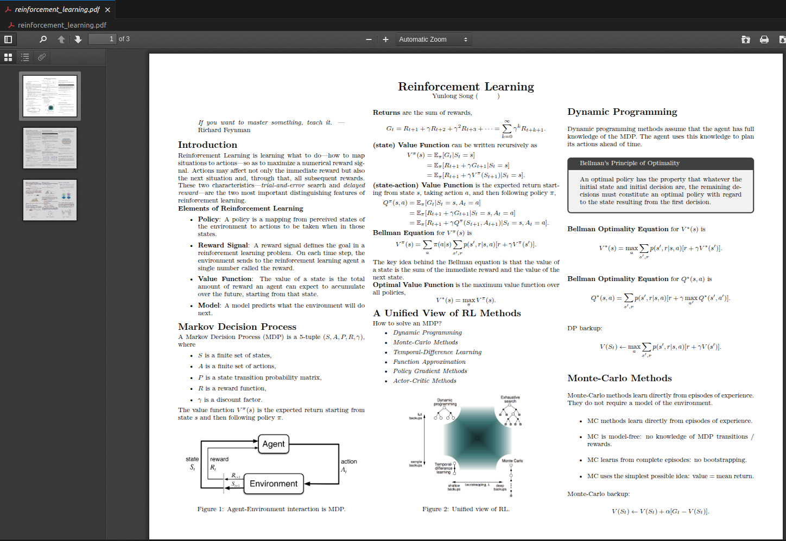
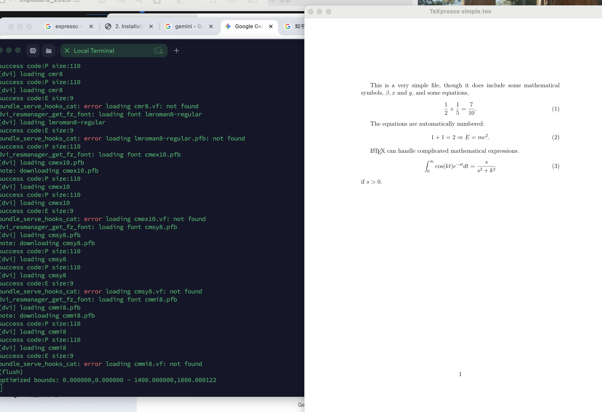

### 源头

一家国外的机器人创业公司创始人之一写的《Foundations of Robotics》，笔记非常漂亮，如图所示。用的笔记框架是latex+neovim+texpresso。想借鉴学习。



### 什么是neovim

是vim的升级版，可以自己在~/.config/下管理自己的配置和插件，类似于item2+oh_my-zsh的配置。也类似于obsidian的这种插件式服务的配置。

### 过程：

##### 1.安装nvim以及进行配置lazyvim和插件安装

[[1\]](#fn-1)
 lazyvim是什么？插件管理器

1.1安装:brew install nvim
 1.2配置：mkdir -p ~/.config/nvim.
 编辑该文件夹下面的init.lua可以设置行号等配置。这里我们用现成的配置框架lazyvim
 安装lazy-starter(https://github.com/LazyVim/LazyVim?tab=readme-ov-file)

```
git clone https://github.com/LazyVim/starter ~/.config/nvim

rm -rf ~/.config/nvim/.git

nvim命令自动下载插件
```

#### 2.texpresso在macos安装(https://gemini.google.com/app/fbdd4d43c011a453)

2.1 安装Xquartz
 textpresso的预览窗口依赖x11协议。macos需要安装xquartz.
 2.2 安装ocaml和依赖

从下面开始我开始走官方github流程（https://github.com/let-def/texpresso/blob/main/INSTALL.md）
 2.3 编译texpresso引擎

```
git clone --recurse-submodules https://github.com/let-def/texpresso.git

（其中子模块安装可能中断**网络连接不稳定** 或 **子模块仓库体积过大**，导致 Git 在下载过程中超时或被服务器主动断开连接。尤其是 `harfbuzz` 这种历史记录密集的仓库，很容易触发 `early EOF`）
https://gemini.google.com/app/72089ff2b67a3d12

cd texpresso
git submodule update --init --recursive --depth 1

然后在texpresso目录下make
失败
提示缺包之后问gemini
brew install jpeg-turbo libpng zlib mupdf harfbuzz freetype

再次make成功

执行验证：
build/texpresso test/simple.tex
```



------

1. lazyvim是什么：插件管理器[↩︎](#fnref-1)
