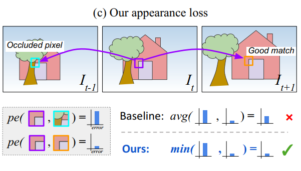

### 《Digging into Self-Supervised Monocular Depth Estimation》论文阅读

##### 目标： self-supervised monoculr depth estimation

##### 摘要：

 1、一个最小重投影损失，解决遮挡问题。

 2、一个全分辨率多尺度取样方法，减少视觉误差。

 3、一个自动遮挡损失，忽视违反相机运动假设的像素，不让其训练。

##### 损失函数

##### 1、重投影损失函数

${L_p} = \sum_{t^{'}}pe(I_{t},I_{t^{'}\rightarrow t})$

其中 ： $pe(I_{a},I_{b})=\frac{\alpha}{2}(1-SSIM(I_{a},I_{b}))+（1-\alpha)||I_{a}-I_{b}|| $ 目标就是相近的fram的appearance应该相同。pe是用来衡量两幅图的差距的。

$L_{s}=|\partial x d^{*}_{t}|e^{-|\partial x I_t|} +|\partial y d^{*}_{t}|e^{-|\partial y I_t|}$

##### 2、edge-aware smoothness

论文给出的解释是we can extract this interpretable depth from the model. This is an ill-posed problem as there is an extremely large number of possible incorrect depths per pixel which can correctly reconstruct the novel view given the relative pose between those two views.传统的双目和multi-view stereo方法通过enforcing smoothness in the depth maps来解决，反正我不是很懂。

$L_{s}=|\partial x d^{*}_{t}|e^{-|\partial x I_t|} +|\partial y d^{*}_{t}|e^{-|\partial y I_t|}$

其中：$d^{*}_{t}=d_{t}/\bar{d_{t}}$ , 这样处理的目的是避免深度消失。

##### 3、对损失函数的提高

###### a、在目标frame和source frame选择误差小的像素匹配，这是为了拒绝被遮挡像素带来的误差增大的训练。

所以：$ L_{p}=min\,pe(I_{t},I_{t^{'}\rightarrow t})$

###### b、Auto-Masking Stationary Pixels

 self-supervised monocular training基于的假设是moving camera和static scene。所以如果camera is static（比如车停下来画面不动）画面有object motion（有其他车辆经过）就会有'holes' of infinite depth in depth maps。针对这个问题作者提出一个mask。\(\mu \in \{0,1\}\)

即reprojection error of the wraped image \(I_{t^{'} \rightarrow t}\) is lower than that of the original, unwraped source image \(I^{'}_{t}\) .

$\mu =[min_{t^{'}}\, pe(I_{t},I_{t^{'}\rightarrow {t}})<min_{t}\, pe(I_{t},I_{t^{'}})]$

原因是基于作者提出的两个分析：

（1）static camera 由same pixels表明。所以这个时候\(pe(I_{t},I_{t^{'}})\) 几乎非常小，所以这种情况下可以把static camera去掉。

（2）一个moving object at equivalent relative translation to the camera，or a low of pixels。

###### c、Multi-scale Estimation

为了解决bininear sampler带来的gradient locality，避免训练stuck in local minima，现有模型通常采用的方法是multi-scale depth prediction和image reconstruction。与其他人将input image 降到resolution of each decoder不同，作者upsample the lower resolution depth maps，然后reproject,resample这样去计算

##### 4、最终Loss

$L=\mu L_{p}+\lambda L_{s}$

##### 5、其他考虑

(1)depthnetwork总体是encoder-decoder结构。encoder是resnet18并且采用Pretrain weights.decoder输出的深度的sigmoid值$$ 处理为depth.\(D=\frac{1}{a\sigma +b}\) .

寻找这样的a,b使得D的范围在0.1~100units.

(2)pose network最后的输出会被scale by 0.01。同时虽然深度网络输入是三个连续的RGB图，pose network的输入被处理为两幅RGB或者6个channel。相应的filter扩展一组，weights除以2.（维持filter的总和为1）.同时对输入图像进行了数据增强。horizontal flips和color argumentation.

(3)输入图像大小为640*192. 损失函数中的\(\lambda\) 取0.001。
