### TL;DR

​	在训练一个通用机器人模型的过程中，分享自己关于vla,rl,机器人操作的观点。

### 关于公司

### website

### Timeline

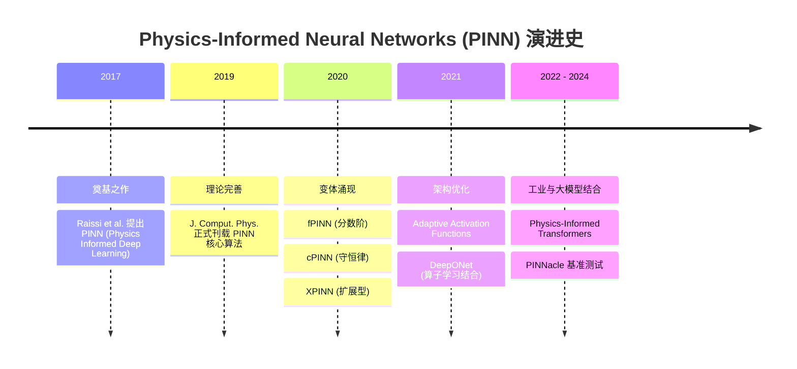
```mermaid
timeline
    title Physics-Informed Neural Networks (PINN) 演进史
    2017 : 奠基之作 : Raissi et al. 提出 PINN (Physics Informed Deep Learning)
    2019 : 理论完善 : J. Comput. Phys. 正式刊载 PINN 核心算法
    2020 : 变体涌现 : fPINN (分数阶) : cPINN (守恒律) : XPINN (扩展型)
    2021 : 架构优化 : Adaptive Activation Functions : DeepONet (算子学习结合)
    2022 - 2024 : 工业与大模型结合 : Physics-Informed Transformers : PINNacle 基准测试
```

##### 1. 2026年4月 观察到涌现

- π 0.7 是一个通用模型，能够以与经过精细调校的专家模型相同的性能执行各种灵巧性任务。重点是通过语言指令执行了训练数据里没有出现的任务。

  - 能够以相同的速度和鲁棒性执行我们之前用强化学习微调的 π * 0.6 [专业模型](https://www.pi.website/blog/pistar06)所展示的灵巧操作技能
  - 能够组合和重组已学习的技能来解决新任务；

- 泛化的原因：使用广泛且多样化的数据

  - 添加*多样化的上下文* ：使用各种多模态提示结构训练模型，这些结构不仅指定机器人应*该做什么* ，还指定它应*该如何做* 。提示信息不仅可以包含任务的文本描述，还可以包含各种其他标注和模态。

  - 整合：

    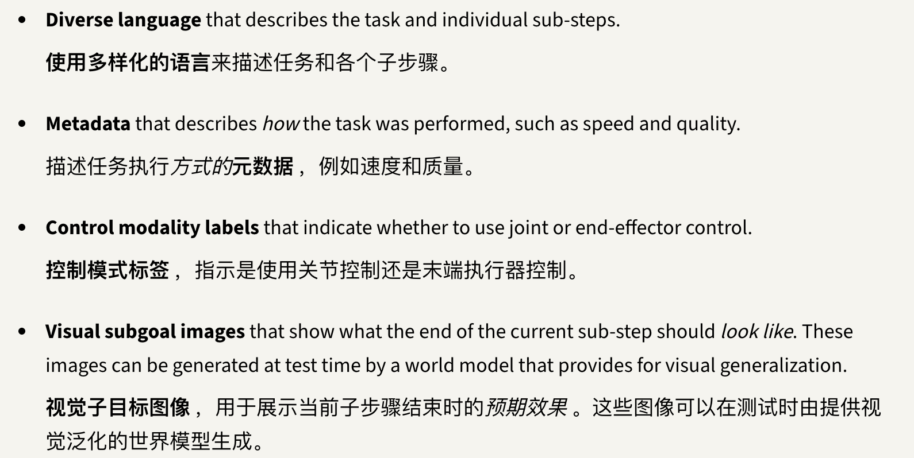

- Methods framework:

  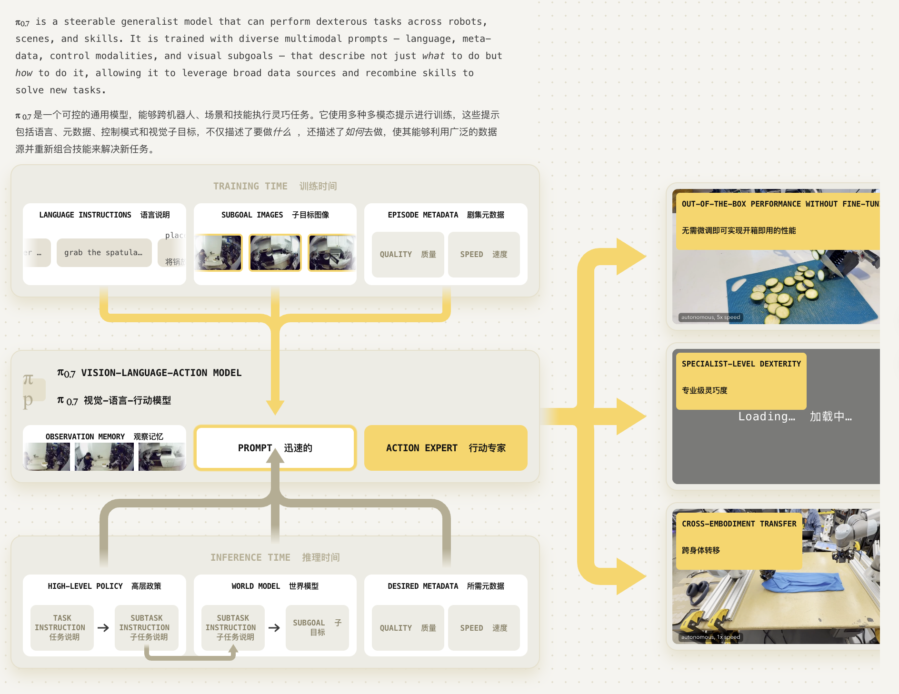

- 新任务，用简单的语言微调可以达到目的；跨本体完成叠衣服的任务。

##### 2.2026年3月： RLT的rl微调方法——精细操作

Precise Manipulation with Efficient Online RL

- 15分钟的在线rl帮助改进最后的高精度阶段

- 背景：精确，灵巧的动作，对准的动作vla还不够：vla可以拿起螺丝刀，对准就差点意思。

  - 提出一种名为 RL tokens ( RLT ) 的新方法，该方法旨在改进需要精细操作的精确且复杂的任务，仅需几分钟或几小时的真实世界经验即可进行学习。

  - 在 VLA 和轻量级强化学习策略之间提供了一个简洁的接口，使机器人能够在短短几个小时内调整自身行为，而无需对整个模型进行微调。

    - 之前（上一篇工作）证明rl可以从经验中学习，提出了recap的方法针对大规模、长周期任务的强化学习，在某些情况我们希望能快速改进特定情况，比微调vla要快。

  - 思路：训练 VLA 生成一个“RL 标记”，该标记可以提供 VLA 内部表征的简洁摘要。然后，我们将此 RL 标记用作一个更小模型的输入，该模型可以实时进行强化学习训练。

  - 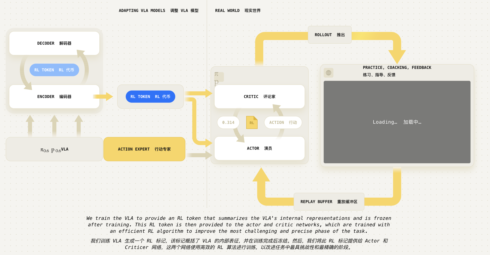

  - Rl-token的生成过程：通过添加一个编码器-解码器转换器来改进 VLA，生成vla的压缩表示

    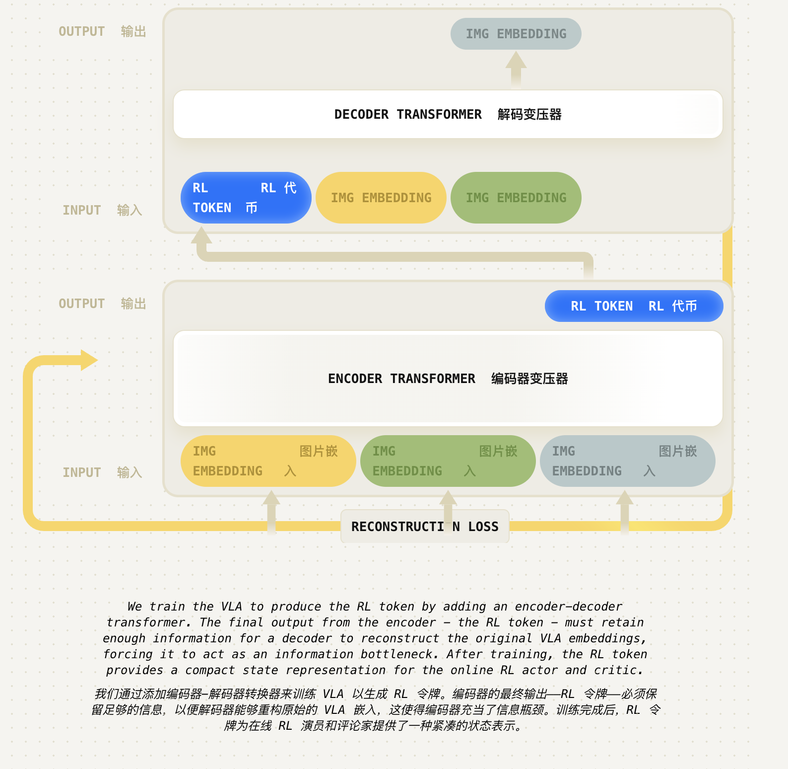

- Results:将一颗微小的 M3 螺丝拧入机械臂、扎带固定、以太网线插入和电源线插入;

  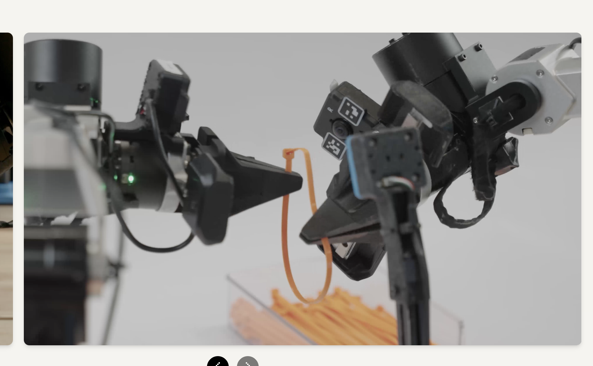

##### 3.2026年3月 长短期记忆的vla

https://www.pi.website/research/memory

- 认识：单一的运动技能不够，机器人需要有记忆：
  - 机器人必须能够清晰地描述自己在任务中所处的位置，即使相关物体不在视野范围内，也能记住它们的位置，并且能够回忆起过去哪些方法有效、哪些无效，从而避免重蹈覆辙。
- Multi-scale Embodied Memory (MEM)，跟踪时长不超过十五分钟的任务，同时保留短期和长期任务。
  - 短期：以原始观察数据的形式保存
  - 长期：以自然语言中的抽象概念形式存储
  - 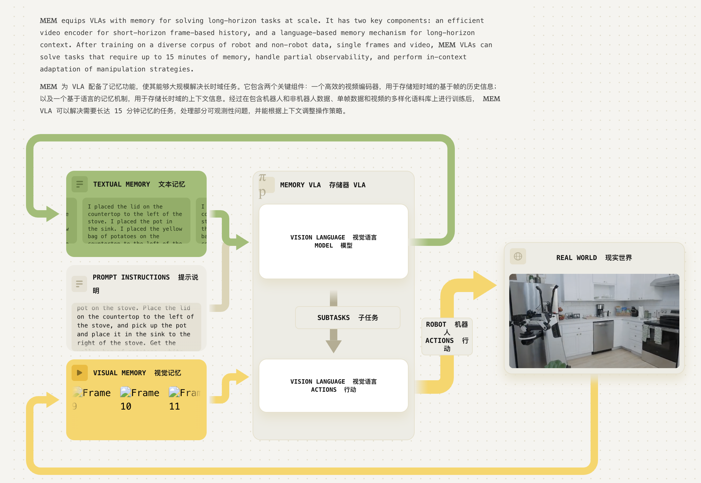
  - 短期记忆的视频编码器进行了设计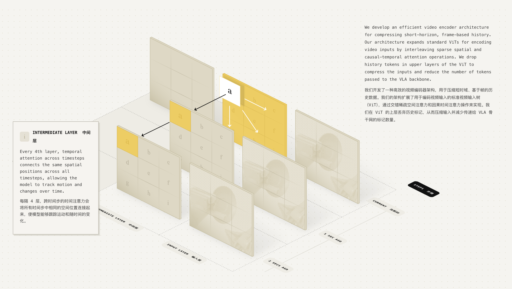
  - 长期记忆由对过去事件的文本描述构成。
- MEM 为我们的模型提供了更强的鲁棒性，使其能够长时间地执行更复杂的指令。我们正朝着更接近真实工作的任务模式迈进，而不再局限于单个的原子动作。未来，用户可能不仅会向机器人发出“帮我叠衣服”这样的简单指令，还会发出完整的家务安排（“我下午 6 点到家，请准备好晚餐，并在周三打扫房子”）。模型需要解析这些指令，将其分解成具体的计划，并在数小时、数天甚至数周内跟踪该计划的执行情况。

##### 4. 2026年2月 物理智能层：调用基础模型api在上面扩展

https://www.pi.website/blog/partner

- 机器人的应用目前不是api访问，调用就可以用。往往自己要从0开始构建整个物理智能栈。我们希望提供一个现成的、易于访问和重用的*物理智能层* 。通用机器人基础模型，例如 [π 0](https://www.pi.website/blog/pi0) 、 [π 0.5](https://www.pi.website/blog/pi05) 、 [π 0.6](https://website.pi-asset.com/pi06star/PI06_model_card.pdf) 或 [π * 0.6](https://www.pi.website/blog/pistar06) ，就提供了这样一个层，能够显著降低构建实用机器人系统的成本和工作量。
- 目前pi06的落地应用场景：
  - 折叠衣物的场景
  - 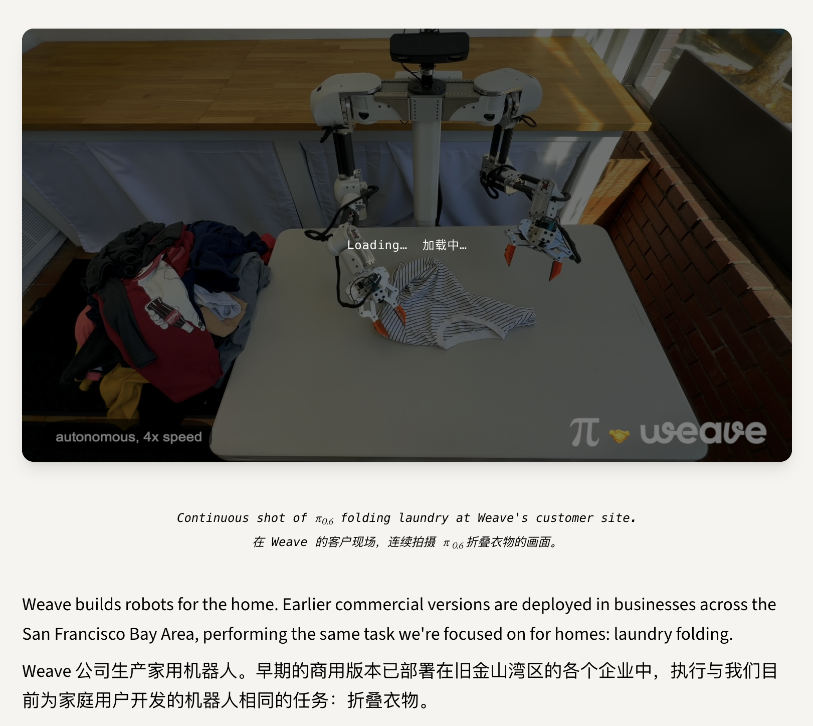

##### 5. 2025年12月 pi06各种莫拉维克悖论任务测试

Moravec's Paradox and the Robot Olympics

https://www.pi.website/blog/olympics

- 开门：

  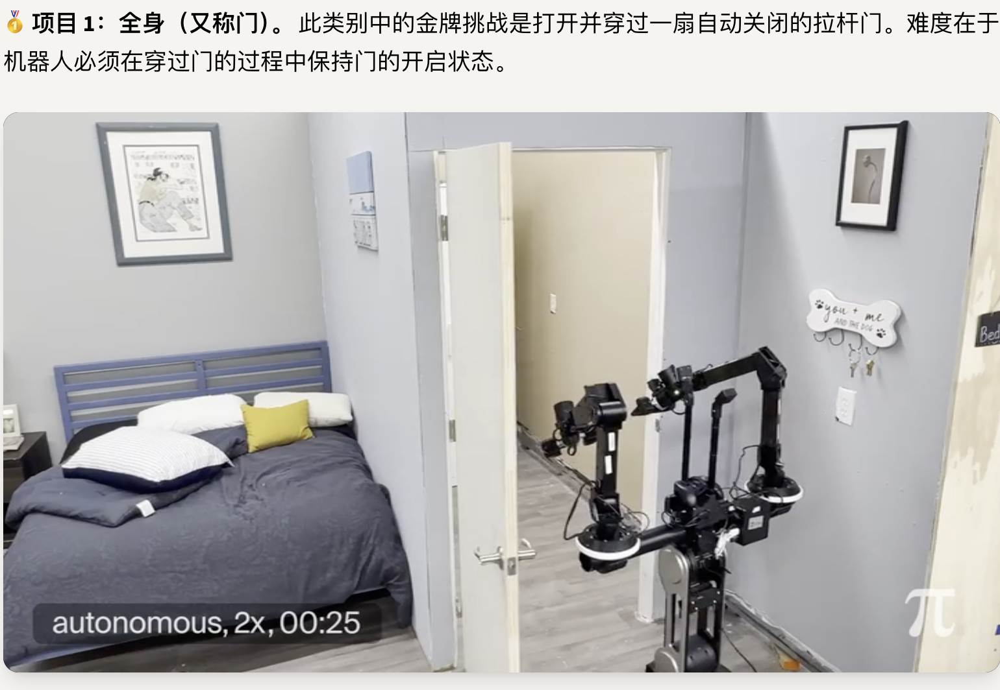

- 洗衣

  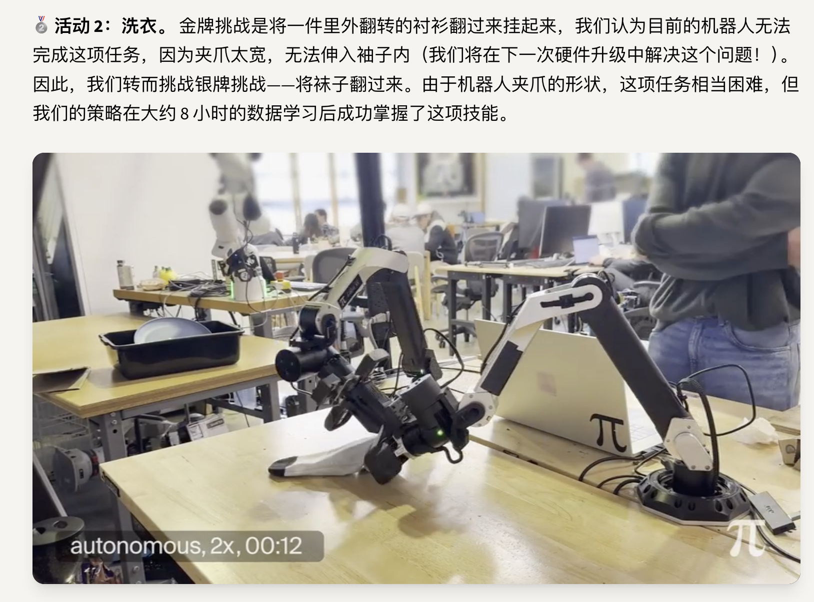

- 基本工具使用：开锁

  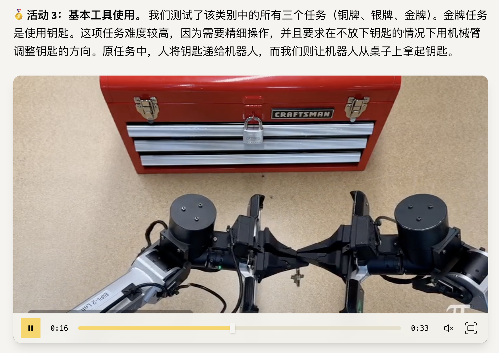

- 三明治涂花生酱

- 清洁窗户、使用狗屎带夹起狗屎

- 金牌项目剥橙子：使用了辅助小道，完成的不好

- 关键在于将多模态逻辑学习模型（LLM）中的先验知识（这些知识可以提供对物理任务的“理论”理解）与多样化且具有代表性的真实物理行为数据相结合。

##### 6.2025年12月 human-to-robot

https://www.pi.website/research/human_to_robot

- 随着机器人训练数据量的增加，机器人基础模型能够实现从人类视频到机器人任务的迁移。

- 我们开发了一种利用人类自我中心数据来改进模型的方法，在机器人数据有限的任务上，模型性能提升了约 2 倍。

  - 将人类视频数据视为我们现有的机器人模型，其动作由 3D 手部位置表示，无需任何特殊的迁移学习方法。我们将人类数据与最相关的机器人数据相结合，并在此混合数据上进行微调，然后在仅在人类演示中展示的特定场景下评估策略。例如，在鸡蛋分类任务中，机器人数据展示了如何将鸡蛋放入纸盒，而人类数据则展示了如何将不同颜色的鸡蛋分类放入多个纸盒中——这是用于评估的场景。

  - 仅仅通过在微调中加入人类视频数据，我们的策略在仅存在于人类数据中的 4 个泛化场景下的性能就提升了约 2 倍。

  - *随着预训练模型规模的扩大，添加人类数据带来的性能提升也随之增加* 。

    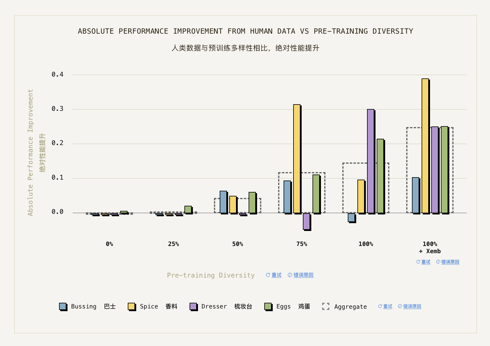

##### 7. 2025年11月 π*0.6: 从经验中学习的vla

https://www.pi.website/blog/pistar06

开发了一种名为 Recap（基于优势条件策略的经验与纠正强化学习）的方法，它实现了所有三个步骤：通过演示训练机器人，通过纠正指导机器人，并使其能够从自主经验中改进。

使用 Recap 改进了最新版本的视觉-语言-动作 (VLA) 模型 π 0.6 ，使其能够稳健高效地执行复杂任务：制作意式浓缩咖啡、组装盒子和折叠各种衣物。模型可靠性得到了很大的提升。（长期执行任务）

- Methods:*一是指导*以提供纠正，即专家向机器人展示如何纠正错误或做得更好；二是*强化学习* 

  - Recap 通过训练一个*价值函数*来应对强化学习中奖励分配的问题：从机器人的经验中学习价值函数，就可以通过观察价值函数的变化来判断哪些行为是好是坏。

    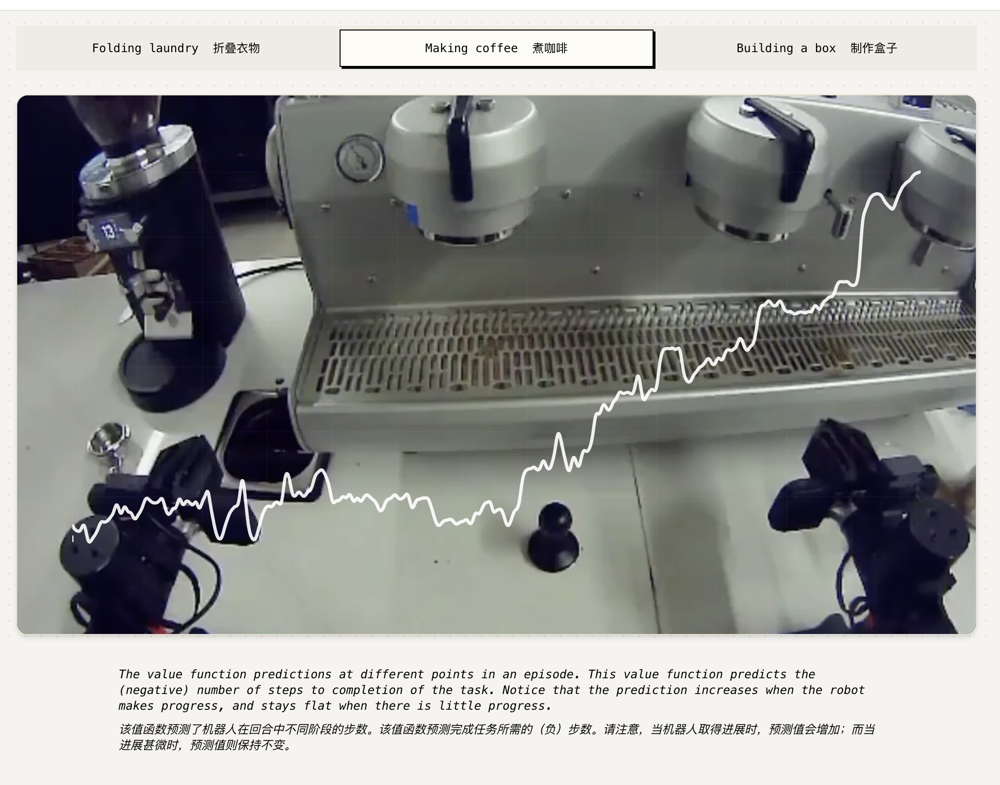

  - 在 Recap 中，我们根据价值变化来*调整*策略（即 VLA），使用所有数据进行训练（包括好动作和坏动作），同时告知 VLA 哪些动作是好动作，哪些动作是坏动作。

  - Recap 的第一阶段是使用离线强化学习 (RL) 对 π * 0.6 模型进行预训练，这与基础 π 0.6 和 π 0.5 VLA 使用的标准监督学习方法不同。之后，我们利用演示数据对 π * 0.6 模型进行微调，使其适应每个任务，然后使用从机器人收集的额外数据，通过强化学习进一步训练该模型。

    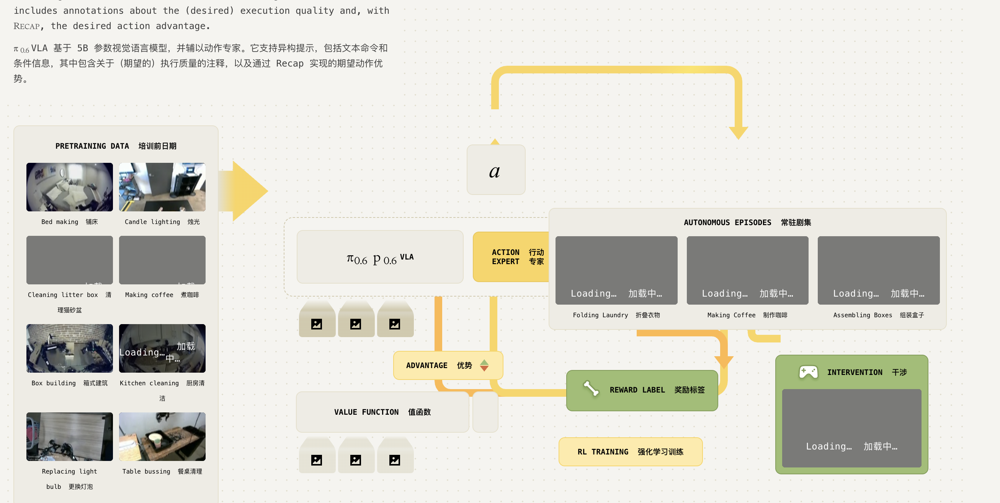

##### 8.2025年6月 实时action chunk

https://www.pi.website/research/real_time_chunking

PI05是同步执行的。推理-》执行-〉下一步；结果就是没有差异但是有停顿。

提出一种RTC的算法，能够实现无间断的实时执行，并且适用于任何基于扩散或流的 VLA（包括 π 0.5 ），无需**任何训练时间的更改** 。

一个优秀的实时算法应该生成一个与上次action chunk重叠动作*一致的*新数据块，同时保持模型对新信息的反应能力和做出智能决策的能力。

把实时分块问题建模为图像修复问题。假设我们的模型在接收到观测数据后，需要 3 个控制器时间步才能生成一个动作块。新动作块的前 3 个动作无法执行，因为在新动作块可用时，这 3 个时间步已经过去。因此，将这些动作“冻结”为已知*会*执行的前一个动作块的值是合理的；我们的目标是填充新动作块的剩余部分，就像修复图像中被移除的部分一样。

效果也非常好。

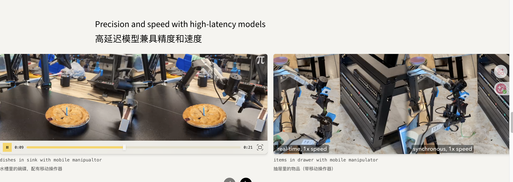

##### 9. 2025年5月 训练一个速度快，泛化好的vla：PI05+KI

https://www.pi.website/research/knowledge_insulation

第一代vla(RT-2， openvla) 把action离散成token,虽然这种方法适用于基本的操作，例如拾取物体，但并不适用于高频、精确或流畅的运动,运行慢。

第二代vla从 [π 0](https://www.pi.website/blog/pi0) 开始）通过在 VLA 训练过程中添加新的神经模块来生成连续输出，通常采用扩散或流匹配等连续生成建模技术。这些新模块以[动作专家](https://www.pi.website/blog/pi0)或[动作头](https://arxiv.org/abs/2503.14734)的形式出现;嫁接到vlm上可能导致遗忘，损害vlm的内部表征。

我们想要：把action expert 嫁接到vlm上，但是不需要丢失预先训练的网络规模只是，称之为“知识隔离vla”:利用 [FAST 标记化的](https://www.pi.website/research/fast)离散化动作来微调 VLM 主干网络，从而快速学习高质量的表示；同时，调整动作专家，使其能够生成连续动作，而无需将其梯度传播回 VLM 主干网络。训练完成后，动作专家可以通过流匹配生成流畅的连续动作，而离散化的动作则被丢弃。

但是直接嫁接会有不利的影响：

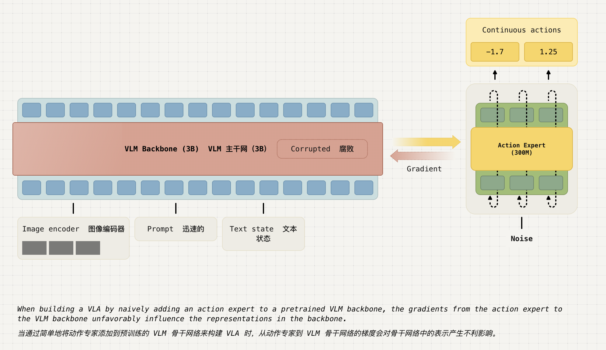

- 自回归的vla算法(比如PI0-fast)不存在这个问题，但是由于自回归的推理很耗时，完成任务非常慢。
- 提出了一种方法：
- 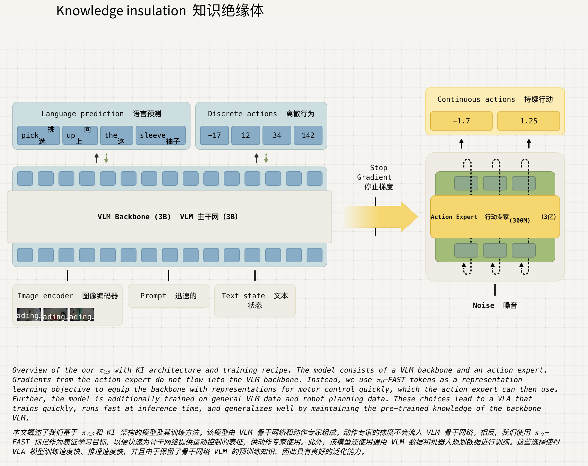

我们用以下方式训练 VLM 骨干网络：

1.阻止动作专家到vlm的梯度流

2.由于vlm不再接受action expert的梯度，表征不再适应机器人控制的要求，使得action expert更难生成正确的运动。用pi0-fast训练vlm骨干网络。

##### 10.2025年4月 PI05

https://www.pi.website/blog/pi05

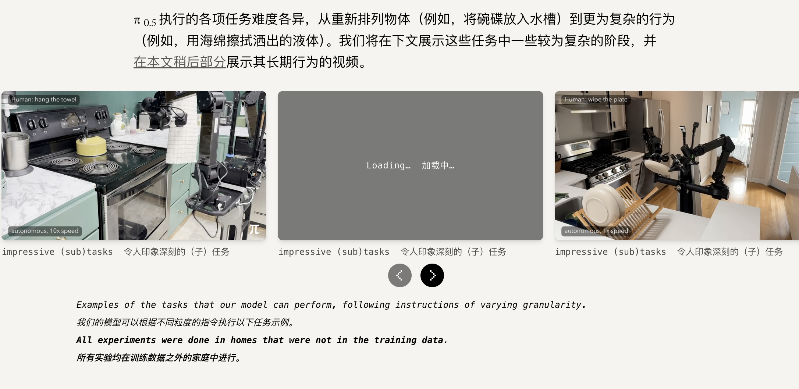

- 如何运作：

  - 异构数据上的协同训练

    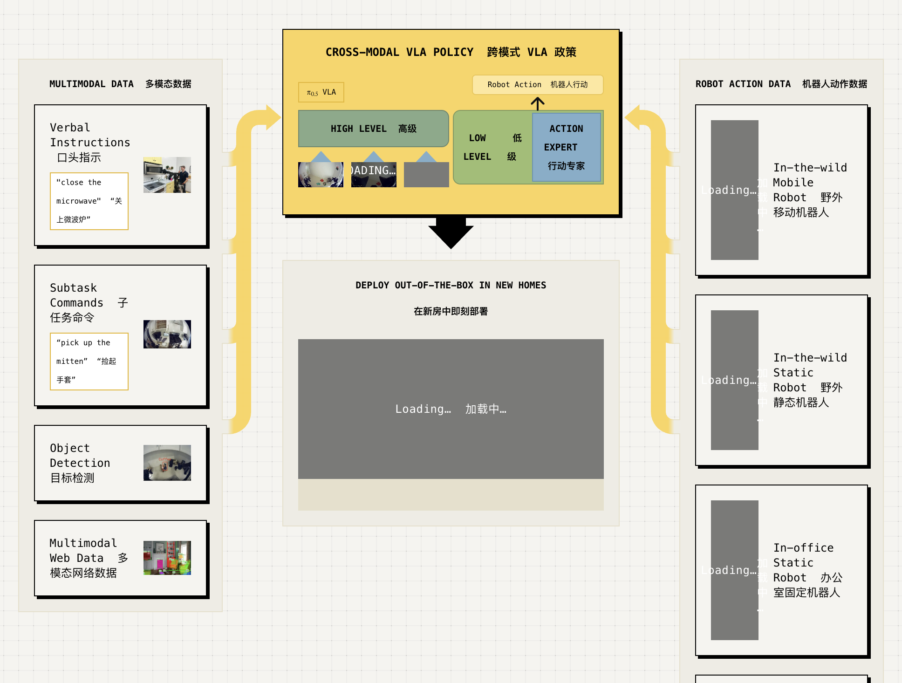

  - 排除web数据，多环境数据进行对比实验发现：π 0.5 的泛化性能随着训练集中不同环境数量的增加而稳步提升，而且在仅约 100 个训练环境后，其性能就已接近直接在测试环境上训练的基线模型。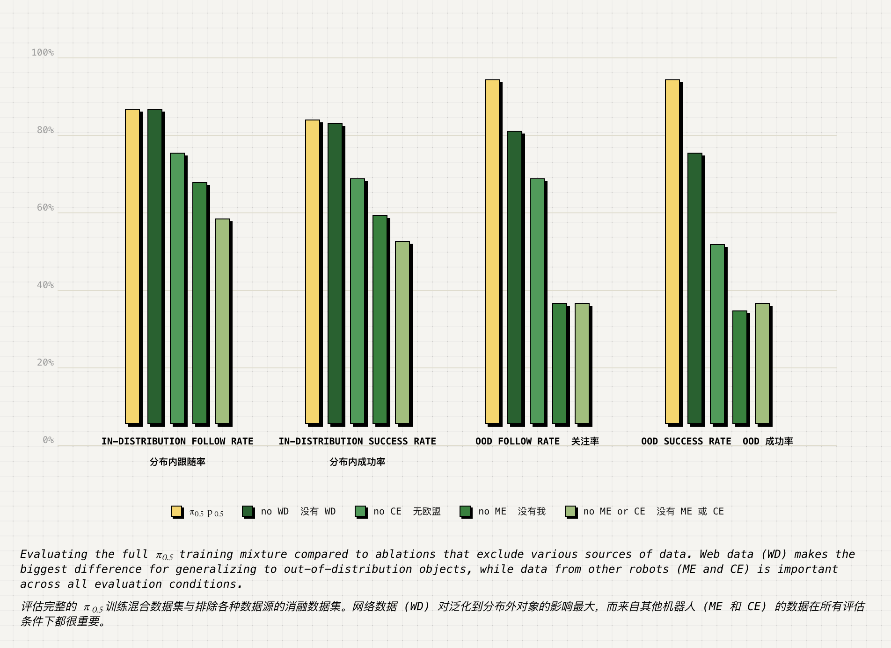

  - 运行的时候，先输出一个以文本形式表达的“高层”动作，后要求它根据这个高层动作选择合适的机器人电机指令，该指令以 50 步（1 秒）的连续低层关节动作“动作块”的形式呈现。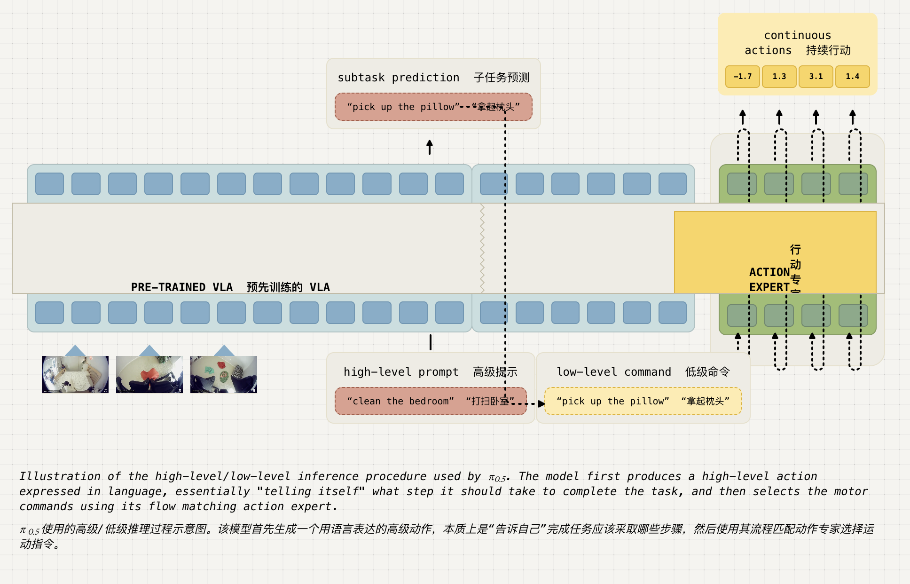

##### 11. 2025年2月 hi robot

https://www.pi.website/research/hirobot

上层vlm思考+下层vla的执行

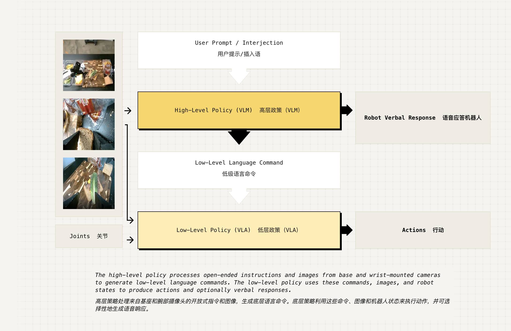

##### 12.开源pi0

https://www.pi.website/blog/openpi

1 到 20 小时的数据足以对各种任务进行微调，但实际情况可能有所不同。

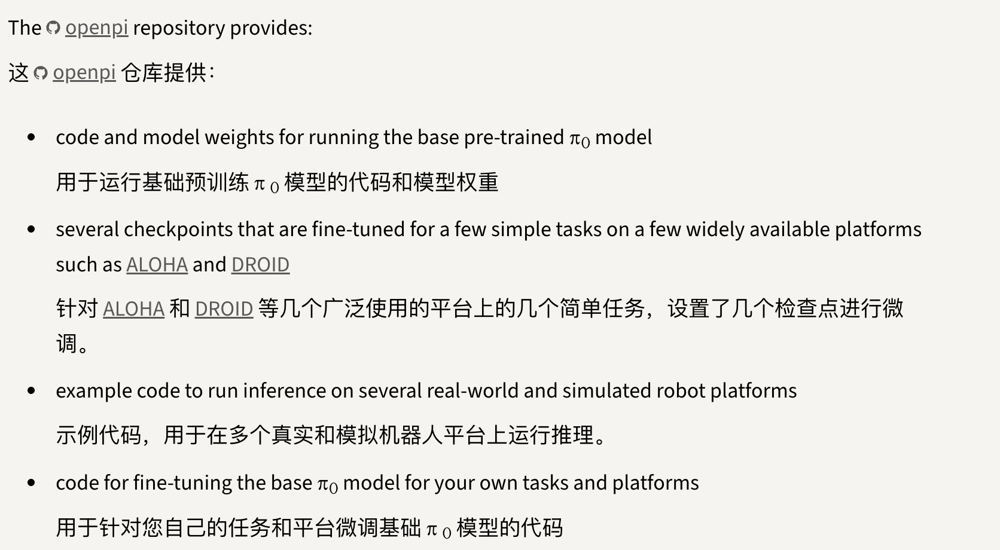

##### 13. FAST: Action Tokenization

https://www.pi.website/research/fast

- Transformer 的discrete bin对精细灵巧控制不够；扩散和流匹配表现更好但是慢。怎么表示动作词元对下游任务很重要；提出了一种针对动作的新型分词器，名为 FAST。

- DCT+编码 (BPE) 相结合,相比以往的把动作压缩了10倍。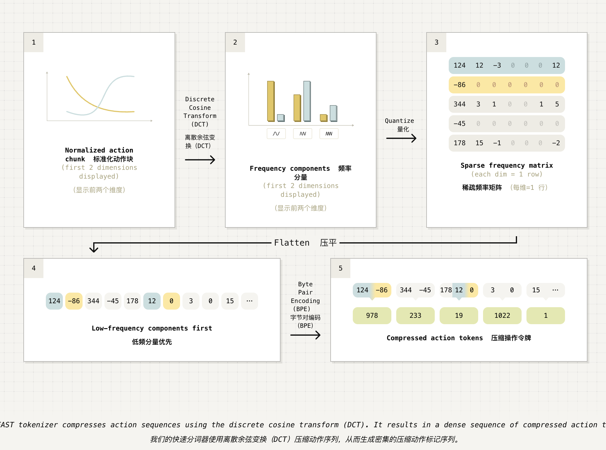

- 训练快5倍，但是推理比flow matching慢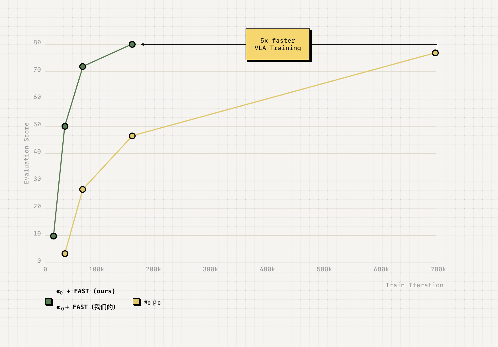

  

##### 14.2024年10月 PI0:第一个通才模型

https://www.pi.website/blog/pi0

从预训练的vlm出发

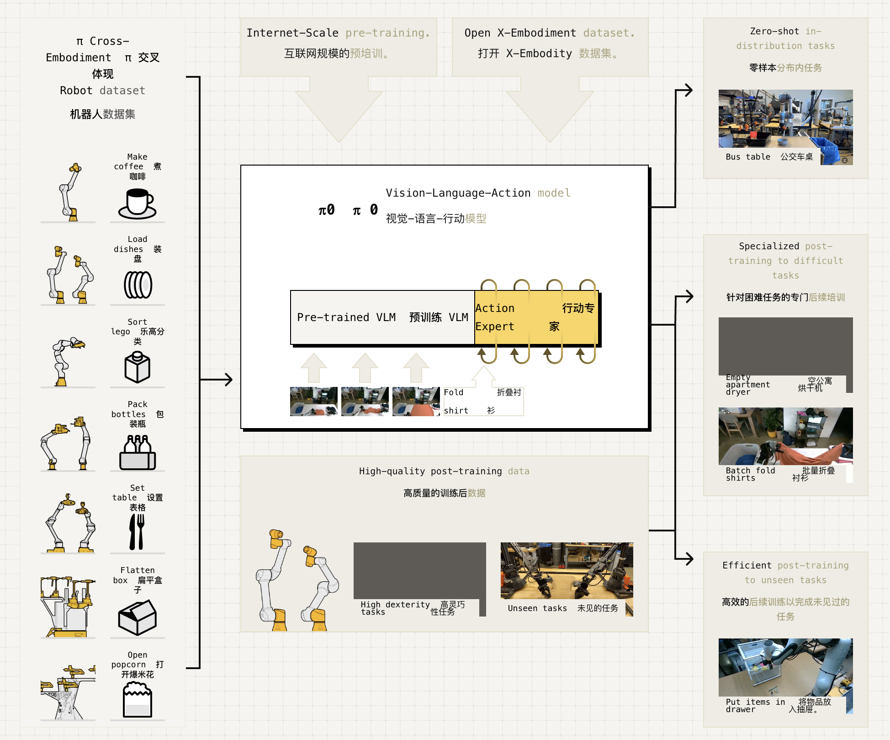
