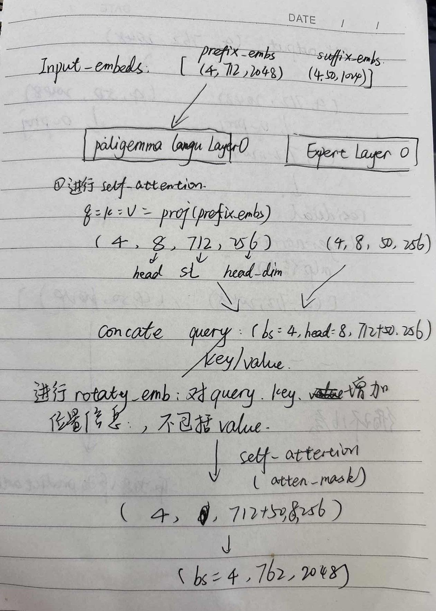
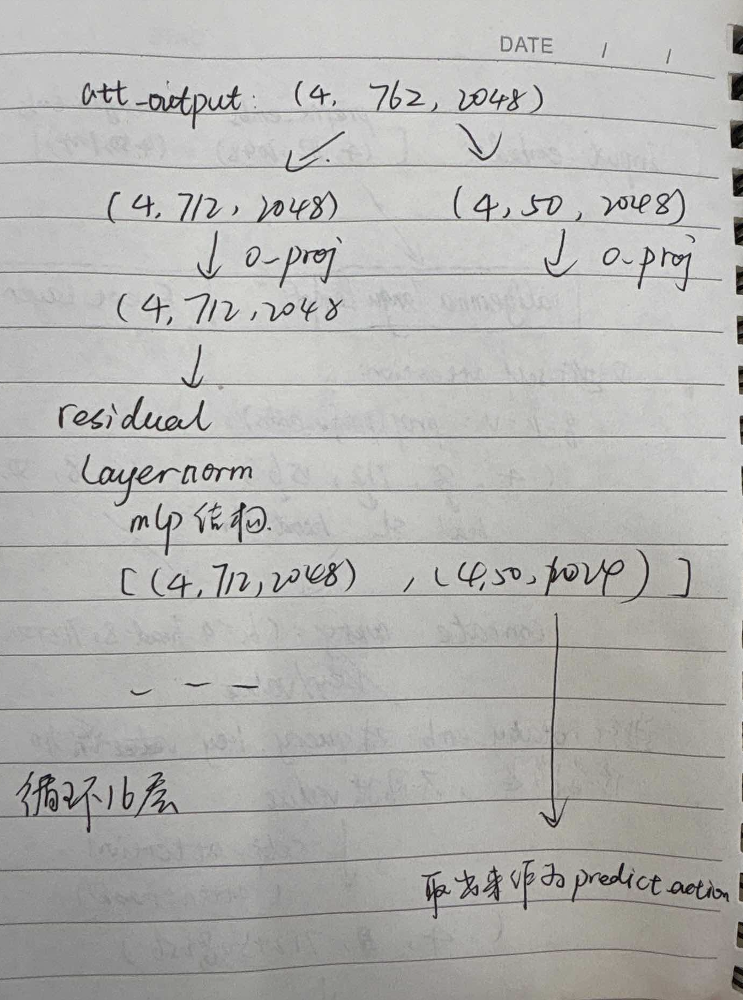

Paper:https://www.alphaxiv.org/zh/overview/2504.16054

类似于smolVLA,对输入pi05也分为两部分，第一部分对图像和语言进行编码，第二部分对动作输入进行加噪。

##### 对输入图像和lang处理

- 对图像处理：

  - (Batch,3,224,224)->image backbone->(Batch, num_img_embeds=256, 2048)
  - 对应的pad masks:(batch=4, 256)
  - Att_masks: [0,0,0...(256个)， 0，0，0，...(256个)]

- 对language处理

  - (Batch, 200) -> (Batch, 200, 2048)
  - Pad_masks:(batch=4,200)
  - Att_masks: [0,0,...,0(200个)]

  ------

  最终输入：

  Ebbs:[img(4,256,2048),       img(4,256,2048),        lang(4,200,2048)]

  Pad_masks:[(4,256),            (4,256),                     (4,200)]

  Att_masks:[0,0,...(256个)，     0,0,...(256个)，     0，0，...(200个)] 

#### 对action处理

- Action：(batch比如=4,    chunk_size=50,    action_dim=32)->nn.Linear()->(batch=4,  50,   1024)
- 对time进行采样：(batch=4)->embedding-> time_embed:(batch=4, 1024)
- 类似于smolvla的操作对action进行加噪，得到noised_actions:(batch=4,50,1024)
- 最后返回：
  - Embs:[action_emb(batch=4,50,1024)]
  - Pad_mask:(batch=4,50). 全1
  - Att_mask: [1,0,0,...0] 后面49个0
  - Adam_cond: (batch=4,1024). 就是time_emb
- 接下来的网络主要对两部分的信息进行融合

### 网络结构

