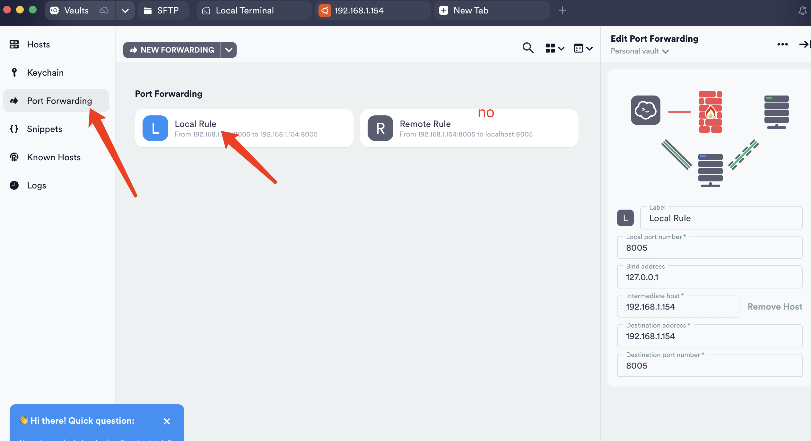
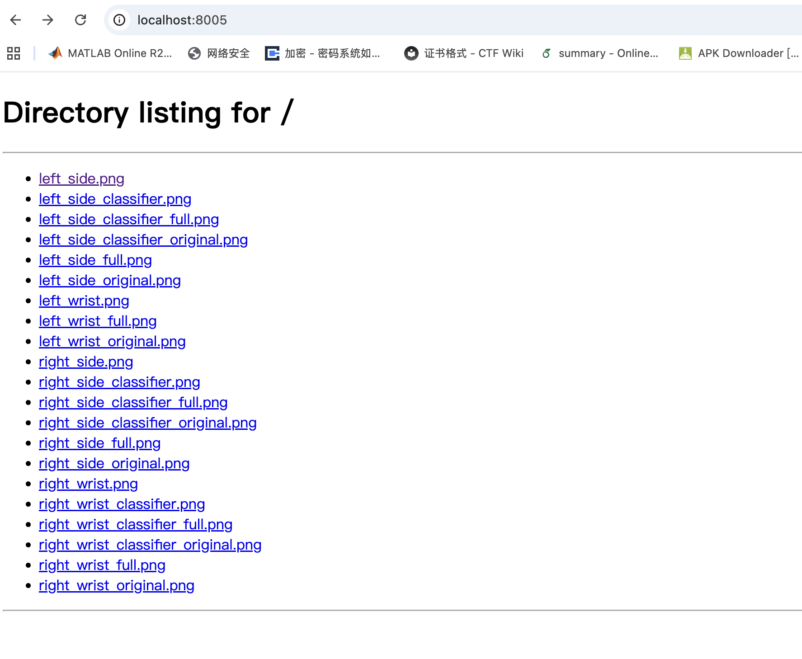
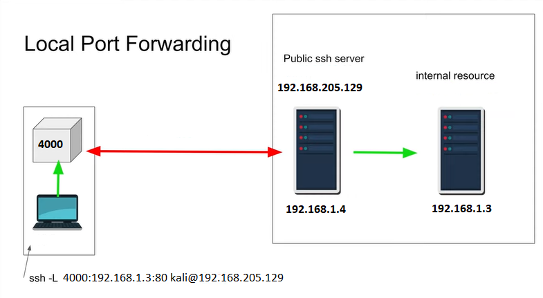
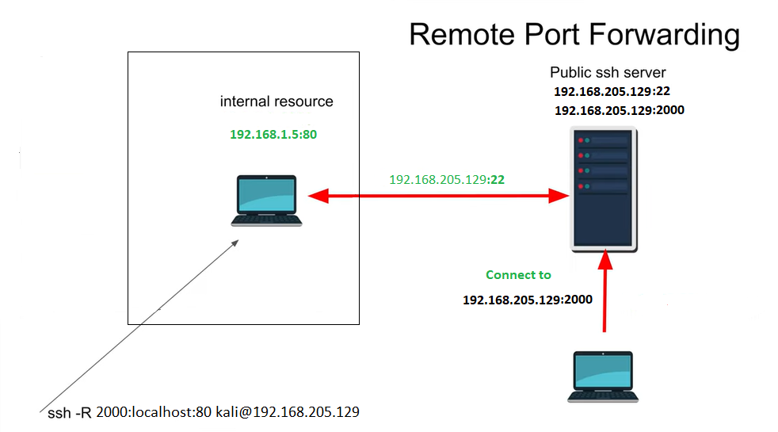
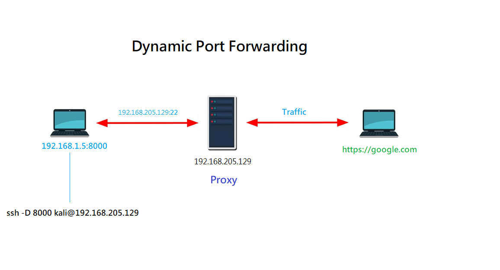

### 场景

在可以连接的远程服务器某图片文件夹下面启用了一个图片服务：

```shell
// cd xxx/image_root/
python -m http.server 8005
```

想在我的本地mac上面直接访问这个端口，看到图片，用termius的端口转发。



发现有local rule和remote rule两种方式。我的理解是“把远程服务器的端口转发到我的电脑/本地上”，所以一开始设置的remote rule,结果应该是local rule.于是去探究了一下端口转发背后的规律。

这里是local rule之后可以在本机访问。（也可以用远程服务器ip:8005,如果防火墙没有限制的话）



参考：https://github.com/mohammedAcheddad/SSH_port_forwarding


### 介绍

Ssh是一种安全连接远程服务器的协议。重要的功能之一就是端口转发，可以绕开远程服务器防火墙的限制进行通信。有三种转发类型：本地转发local forwarding,远程转发remote forwarding,动态转发dynamic forwarding.

> [!NOTE]
>
> 问了一些gpt为什么ssh可以绕开防火墙：
>
> 实际上是把流量包裹在ssh里，而ssh的服务一般是对外开放的，防火墙没有限制。


### 端口转发类型

#### 本地转发local forwarding

意味着将你的ip+port和远端服务的ip+port映射起来。当你访问你本地的ip+port的之后，就会将request重定位到远端的ip+port. 语法如下：（我理解：把xxx和xxx关联起来）

```
ssh -L local_port:remote_host:remote_port user@remote_server
```

比如，你想把本地的8080端口转发到远程server的80端口：

```
ssh -L 8080:remote_server:80 user@remote_server
```

举例应用：

- 由于远程服务器防火墙限制，本地无法访问远程server的web服务
- 想访问运行在remote server的数据库，建立端口转发之后访问数据库可以仿佛就在本地运行一样。
- 绕过某些block某些网页/服务的企业防火墙




#### 远程转发remote forwarding

将remote server的某个端口转发到本地。用于本地机器的一些资源，远程服务器想访问。

（想象一根通信的线路拉到了本地）

```shell
ssh -R remote_port:local_host:local_port user@remote_server
```

比如，如果你想转发远程服务器的80到本地的8080

```
ssh -R 80:localhost:8080 user@remote_server
```

举例子应用：

- 远程user访问本地服务
- 远程服务器管理设置反向隧道（不懂）
- 允许远程机器访问本地开发服务器。




#### 动态转发

将本地机器某端口的所有流量通过ssh转发到远程服务器。用于希望将远程服务器用作所有流量的代理。

```
ssh -D local_port user@remote_server
```

比如将本地访问1080的所有流量转发到远程server:

```
ssh -D 1080 user@remote_server
```

举例子说明：

- 使用远程服务器作为所有流量的代理
- 从远程服务器访问本地网络资源。
- 使用远程服务器作为代理绕开互联网啊或者地理限制。
- 

### 几种转发方式比较

端口转发方面，每种转发类型都有不同的用途，适用于不同的场景。本地转发适用于需要访问本地计算机无法直接访问的远程服务器上的服务的情况。远程转发适用于需要允许远程服务器访问本地计算机上运行的服务的情况。动态转发适用于希望将远程服务器用作所有网络流量的代理的情况。

值得注意的是，以上所有类型的端口转发都可以在同一个 SSH 连接中一起使用。


### 安全

使用 SSH 隧道时，务必注意安全问题，因为黑客可能会利用 SSH 隧道漏洞入侵您的网络。以下是一些确保 SSH 隧道安全的步骤：

1. 所有可以访问远程服务器的账户都应使用强密码。
2. 如果可能，请使用公钥认证而非密码认证。这将防止攻击者猜测您的密码并访问您的帐户。
3. 限制可以访问远程服务器的帐户数量，并严格控制谁可以访问公钥认证所需的私钥。
4. 使用防火墙和其他安全措施来保护远程服务器和本地网络。
5. 监控远程服务器和本地网络是否存在可疑活动，如果发现任何可疑活动，应采取适当措施。
6. 请确保远程服务器和本地网络上的所有软件和操作系统都已安装最新的安全补丁。

按照这些步骤操作，可以帮助确保 SSH 隧道的安全，并保护您的网络免受潜在攻击


### 参考：

https://github.com/mohammedAcheddad/SSH_port_forwarding
