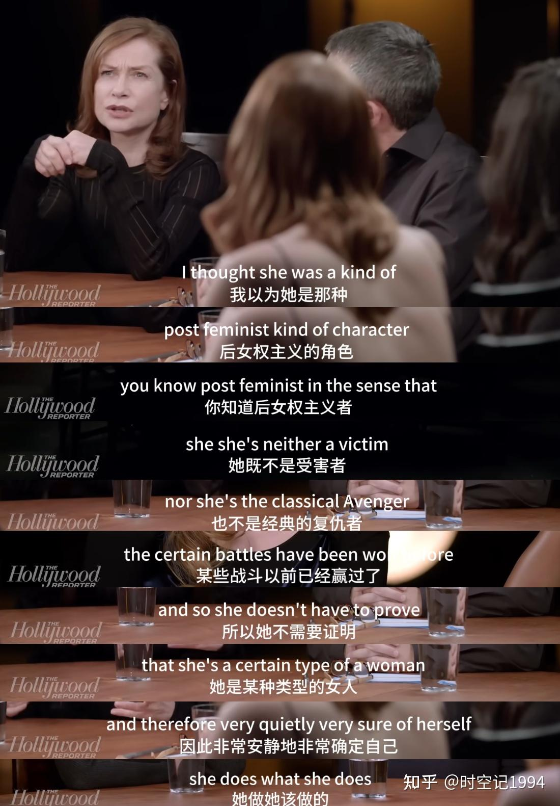
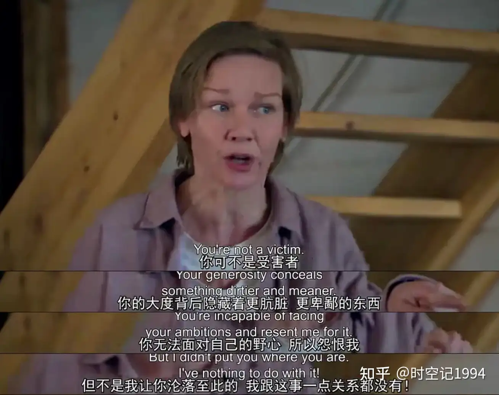

​	我对于现在社交媒体的趋势和现在性别对立的趋势深感忧虑。因为对某一件事情失望，从而走向对立的另一面。西方民粹政治，极端主义分子等这是政客和鼓吹者们惯用的手段，通过对立似乎能让我们的愤怒一下子找到宣泄的出口。我不喜欢这种趋势，即使从一定程度来说我也很长时期处于蒙昧和客体的阶段而不自知，处于长期的自卑和不如男性自我压抑而不知。但是我仍然觉得这个问题的解不应该这样子。

​	就像“希望中国真的支持女足，而不是因为为了嘲讽男足才让女足走到大众眼下”。

知乎：https://www.zhihu.com/question/58291543/answer/1967552114474594565

##### 值得学习的电影作品

《她》《坠落的审判》

#### some words

**于佩尔的那句话：“我演的所有女人，都是直面命运的。她们必须从现状的泥潭中走出，跨越到彼岸。”**

