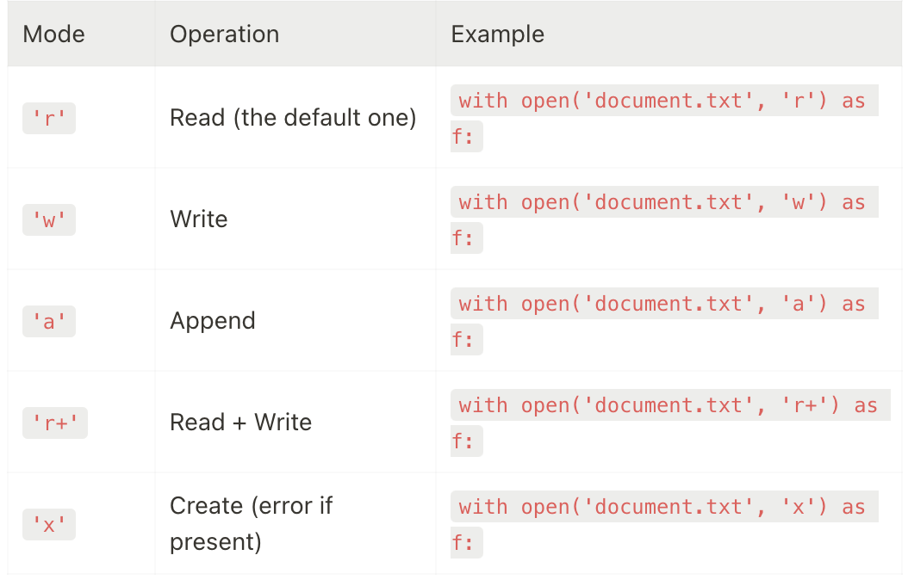
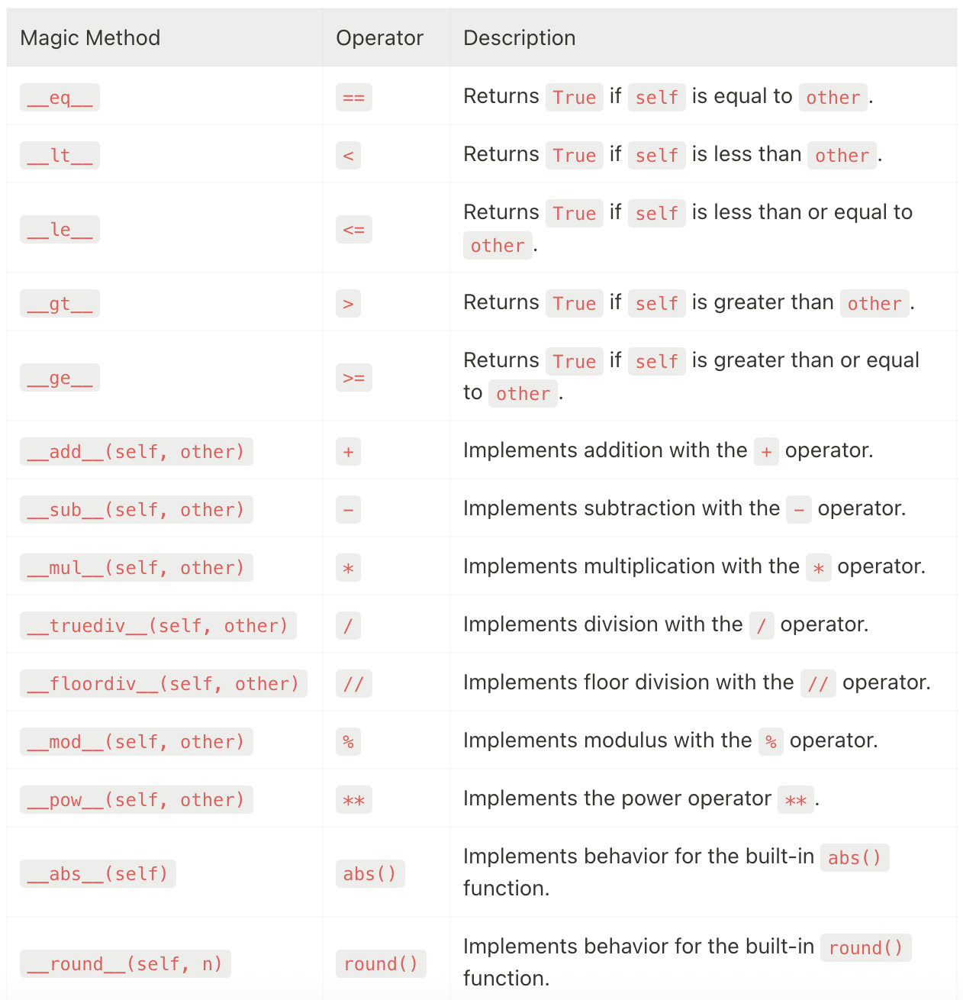
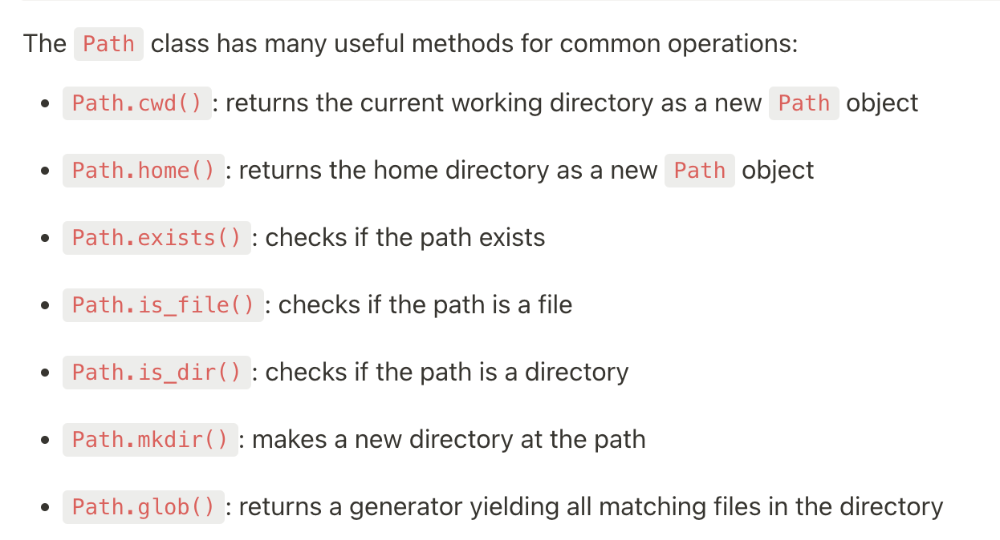

经常有段时间不用python就会忘记一点，所以记录一下基本的下次用之前快速过一下。

source 1: https://martinxpn.medium.com/100-days-of-python-9dd04d0995f1 里面的初级https://profound.academy/python-introduction/advanced-arithmetic-sHlEzpi1Optpv3mdSgKX和中级https://profound.academy/python-mid

source 2:https://labex.io/tutorials/python-how-to-use-init-files-in-python-420195


# **Part 1: 初级**


1. def func(*numbers): *numbers可变参数，作为一个元组传进去。
2. func可以作为参数传给另外一个func
3. d = defaultdict(lambda:[]) defaultdict
4. lambda function, 或者叫匿名函数。 one line a function. a=lambda x: x*x;
5. reduce函数,reduce(f,list,total)


#### **python files:**

```
f = open(xxx)
print(f.read())
f.close()

// python里面用with statement来避免明确指明文件的打开和关闭
with open('document.txt') as f:   # Previously f = open('document.txt')
    print(f.read())
print('Done!')
```




# **Part 2: 进阶**

https://profound.academy/python-mid/positional-and-keyword-arguments-5LvKxDSUICCBH7Z96b1n

## **1.advanced functions**

- positional and keyword arguments. positional要在keyword的前面，

```
# Default values for tax and discount are set to 0
def calculate_total_cost(price, tax=0.0, discount=0.0):
    return price + price * tax - discount

print(calculate_total_cost(100, tax=0.05))                # 105.0
print(calculate_total_cost(100, discount=10))             # 90.0
print(calculate_total_cost(100, tax=0.05, discount=10))   # 95.0
```

- positional only 

```
def add_numbers(a, b, /, c):
    return a + b + c

print(add_numbers(10, 20, 30))         # 60
print(add_numbers(a=10, b=20, c=30))   # TypeError
print(add_numbers(10, 20, c=30))       # 60
```

- keyword-only arguments

```
def rectangle_area(length, width, *, rounded=False):
    area = length * width
    return round(area) if rounded else area


print(rectangle_area(5.3, 4.2))                # Prints 22.26, `rounded` is not provided so it defaults to False
print(rectangle_area(5.3, 4.2, rounded=True))  # Prints 22, `rounded` is provided and set to True
print(rectangle_area(5.3, 4.2, True))          # Error! `rounded` must be provided by keyword.
print(rectangle_area(5.3, 4.2, False))         # Error! `rounded` must be provided by keyword.
print(rectangle_area(length=5.3, width=4.2, rounded=True))  # Prints 22
```

- *args,**kwargs
  - *args传入参数不需要keyword
  - **kwargs是dict的传参形式
  - 两者可以叠加使用

```
def combined_example(*args, **kwargs):
    print(args)    # prints the tuple of arguments
    print(kwargs)  # prints the dictionary of keyword arguments

combined_example(1, 2, 3, Name='Alice', Age=25)  
# (1, 2, 3)
# {'Name': 'Alice', 'Age': 25}

def function_example(a, b, *args, **kwargs):
    print(a)       # print the first standard argument
    print(b)       # print the second standard argument
    print(args)    # print additional non-keyworded arguments
    print(kwargs)  # print keyworded arguments


function_example(1, 2, 3, 4, 5, Name='Alice', Age=25)
# 1
# 2
# (3, 4, 5)
# {'Name': 'Alice', 'Age': 25}
```

- mutable types和immutable types
  - mutable types比如list, immutable types比如tuple,str
  - 如果在函数里my_list.append 这个改动是恒久的, my_list = xxx相当于在func内部新定义了一个局部变量，改动是无效的。

```
def add_item(my_list):
    my_list.append('added item')  # Append a new item to the list

shopping_list = ['apples', 'bananas', 'cherries']
print(shopping_list)  # Prints: ['apples', 'bananas', 'cherries']

# Now we use the function to add an item to our shopping list
add_item(shopping_list)
print(shopping_list)  # Prints: ['apples', 'bananas', 'cherries', 'added item']

def change_list(my_list):
    my_list = ['entirely', 'new', 'list']  # This won't affect the original list

shopping_list = ['apples', 'bananas', 'cherries']
change_list(shopping_list)
print(shopping_list)  # Still prints: ['apples', 'bananas', 'cherries']
```

- 用None为mutable default arguments赋值，然后判断None进行置空赋初值。（https://profound.academy/python-mid/mutable-default-arguments-4ekYwsMn95O8UEi1p8wf 值得好好看一遍）

```
def record_score(new_score, score_list=[]):
    score_list.append(new_score)
    return score_list

print(record_score(95))  # [95]
print(record_score(85))  # [95, 85]

def record_score(new_score, score_list=None):
    if score_list is None:  # If no list was provided,
        score_list = []     # create a new one
    score_list.append(new_score)
    return score_list

print(record_score(95))  # [95]
print(record_score(85))  # [85]
```

简而言之：mutable default arguments可以导致一些unexpected行为，因为python的func只会为default mutable arguments创建一次object,然后每次func called都会用到这一个object;

因此推荐的行为是default值设置为None,然后在每次func内部手动置空。

think:

```
def extend_list(x, lst=[]):
    lst.append(x)
    return lst


list1 = extend_list(1)
list2 = extend_list(2, [])
list3 = extend_list('3')

print(list1)
print(list2)
print(list3)

// answer:
[1,"3"],[2],[1,"3"]
```


## **2.Recursion 递归**

## **4.class**

1. magic method
2. 


## **5.继承**

```
class Animal:                                         # Defining a base class `Animal`
    def __init__(self, name, age):                    # Constructor method with parameters `name` and `age`
        self.name = name                              # Assigning `name` attribute
        self.age = age                                # Assigning `age` attribute

    def eat(self):                                    # Common method `eat`
        return f'{self.name} is eating.'

    def make_sound(self):                             # Common method `make_sound`
        return f'{self.name} makes a sound.'

class Dog(Animal):                                    # Defining `Dog` class that inherits from `Animal`
    def make_sound(self):                             # Overriding the `make_sound` method
        return f'{self.name} barks.'

class Cat(Animal):                                    # Defining `Cat` class that inherits from `Animal`
    def make_sound(self):                             # Overriding the `make_sound` method
        return f'{self.name} meows.'

class Bird(Animal):                                   # Defining `Bird` class that inherits from `Animal`
    def eat(self):                                    # Overriding the `eat` method for `Bird`
        return f'{self.name} is pecking at its food.'

    def make_sound(self):                             # Overriding the `make_sound` method
        return f'{self.name} chirps.'

# The __init__ method is inherited from Animal
# but you can have __init__ for any of the inherited classes as well
dog = Dog('Rex', 5)                                   # Creating an instance of `Dog`
cat = Cat('Whiskers', 3)                              # Creating an instance of `Cat`
bird = Bird('Tweety', 2)                              # Creating an instance of `Bird`

for animal in [dog, cat, bird]:                       # Iterating over instances
    print(animal.eat())                               # Calling the inherited or overridden method `eat`
    print(animal.make_sound())                        # Calling the overridden method `make_sound`
    print('-----')
```

super()

```
class Animal:                       # Define a class named 'Animal'
    def __init__(self, species):
        self.species = species

    def speak(self):
        return 'Sounds...'

class Dog(Animal):                  # Define a subclass named 'Dog' that inherits from 'Animal'
    def __init__(self, name):
        super().__init__('Dog')     # Call the parent's '__init__' method using 'super()'
        self.name = name            # Additional attribute 'name' for 'Dog'
        print(self.species)         # Will print Dog

    def speak(self):
        original = super().speak()  # Call the parent's 'speak' method using 'super()'
        return original + ' Woof!'

class Cat(Animal):                  # Define a subclass named 'Cat' that inherits from 'Animal'
    def __init__(self, name):
        super().__init__('Cat')     # Call the parent's '__init__' method using 'super()'
        self.name = name            # Additional attribute 'name' for 'Cat'

    def speak(self):
        original = super().speak()  # Call the parent's 'speak' method using 'super()'
        return original + ' Meow!'

dog = Dog('Rex')                              # Create an instance of the 'Dog' class
cat = Cat('Fluffy')                           # Create an instance of the 'Cat' class
print(dog.name, dog.species, dog.speak())     # Rex Dog Sounds... Woof!
print(cat.name, cat.species, cat.speak())     # Fluffy Cat Sounds... Meow!
```

#### **multiple inheritance**

```
class Video:                               # Define a class named 'Video'
    def __init__(self):
        self.video_codec = 'H.264'

    def play_video(self):
        return 'Playing video...'

class Audio:                               # Define a class named 'Audio'
    def __init__(self):
        self.audio_codec = 'AAC'

    def play_audio(self):
        return 'Playing audio...'

class Multimedia(Video, Audio):            # Define a subclass named 'Multimedia' that inherits from 'Video' and 'Audio'
    def __init__(self):
        Video.__init__(self)               # Call the parent 'Video' class's '__init__' method
        Audio.__init__(self)               # Call the parent 'Audio' class's '__init__' method

    def play(self):
        return self.play_video() + ' ' + self.play_audio()   # Play both video and audio

multimedia = Multimedia()                  # Create an instance of the 'Multimedia' class
print(multimedia.play())                   # Output: 'Playing video... Playing audio...'
```

method resolution order:

如果继承的父类里面哦有同名的成员变量，python用了一种叫C3的算法来决定最终生效的那个。但是生效的顺序可以直接通过一个mro()方法来获取。

```
class A:                    # Define a class named 'A'
    def process(self):
        return 'A process'

class B(A):                 # Define a class named 'B' that inherits from 'A'
    def process(self):
        return 'B process'

class C(A):                 # Define a class named 'C' that inherits from 'A'
    def process(self):
        return 'C process'

class D(B, C):              # Define a class named 'D' that inherits from 'B' and 'C'
    pass

print(D.mro())              # [<class '__main__.D'>, <class '__main__.B'>, <class '__main__.C'>, <class '__main__.A'>, <class 'object'>]
```

在上面的例子里，调用D的时候，先查D里面有没有定义相关方法，没有再B,然后C,然后A.

如果你想指定调用的方法，可以直接用具体父类.的方式进行访问，比如：

```
class D(B, C):                  # Define a class named 'D' that inherits from 'B' and 'C'
    def process(self):
        return A.process(self)

d = D()                         # Create an instance of the 'D' class
print(d.process())              # A process
```

但是这种可读性不太好。


## **6.封装**

类里的私有变量，在python里面通过变量前面加两个下划线表示。如：

```
class PublicPrivateExample:
    def __init__(self):
        self.public_var = 'I am public!'      # Public variable
        self.__private_var = 'I am private!'  # Private variable

example = PublicPrivateExample()
print(example.public_var)                     # 'I am public!'
print(example.__private_var)                  # Raises AttributeError
```

如果访问私有变量，会报错attributeError。

但是尽管python有私有变量限制访问的机制，但是并不严格，仍然可以通过下面的方式访问_ClassName__private_var：

```
print(example._PublicPrivateExample__private_var)  # I am private!
```

如果要访问私有变量最好的方法还是提供一个方法：

```
class PublicPrivateExample:
    def __init__(self):
        self.__private_var = 'I am private!'

    def get_private_var(self):      # Getter method for private variable
        return self.__private_var   # We can access private fields inside the class

example = PublicPrivateExample()
print(example.get_private_var())    # Will print 'I am private!'
```


## **7.Exceptions**

try...except...

```
try:
    a = int(input())
    b = int(input())
    print(a / b)
except ZeroDivisionError:
    print('Error: Division by zero is not allowed.')
except ValueError:
    print('Error: Input is not a valid integer.')
```

raising exceptions

```
def sqrt(n):
    if n < 0:
        # raise a ValueError if n is negative
        raise ValueError('Square root not defined for negative numbers')
    return n ** 0.5

print(sqrt(4))    # 2.0
print(sqrt(-1))   # ValueError: Square root not defined for negative numbers
```

custom exceptions

python有很多内置的exceptions比如indexError, typeError,但是也可以定义自己的exceptions

```
class TooManyBooksError(Exception):  # Define a new exception class
    pass

def checkout_books(user, num_books):
    if num_books > 5:  
        # Raise an exception if the user tries to check out more than 5 books
        raise TooManyBooksError('You cannot check out more than 5 books at a time.')  # Raise our custom exception
    # Otherwise, add the books to the user's account.
    user.books += num_books


try:
    checkout_books(user, 7)     # Try to check out 7 books.
except TooManyBooksError as e:  # Catch our custom exception
    print(e)                    # Print the error message.
```

像一般类，也可以传入参数

```
class TooManyBooksError(Exception):  
    def __init__(self, attempted, limit=5, checked_out=0):  
        self.attempted = attempted
        self.limit = limit
        self.checked_out = checked_out
        self.message = f'You tried to check out {self.attempted} books, but the limit is {self.limit} books.'
        super().__init__(self.message)
    
    def books_to_return(self):
        return self.checked_out + self.attempted - self.limit


try:
    checkout_books(user, 7)
except TooManyBooksError as e:
    print(e)                                                   # You tried to check out 7 books, but the limit is 5 books.
    print(f'You need to return {e.books_to_return()} books.')  # You need to return 2 books.
```

定义custom exceptions的时候最好将其他相关信息写在变量里，不要统一扔到message里。

```
// bad
class TooManyBooksError(Exception):
    pass

# You are forced to pass the message every time
raise TooManyBooksError('You tried to check out 7 books, but the limit is 5!')

# This is a bad idea in the long term

//good
class TooManyBooksError(Exception):
    def __init__(self, attempted, limit=5):
        self.attempted = attempted
        self.limit = limit
        # Build the error message from the data
        self.message = f'You tried to check out {self.attempted} books, but the limit is {self.limit}.'
        super().__init__(self.message)

# When raising the exception, just pass the relevant data
raise TooManyBooksError(7)
```

python里的exception的层级结构

```
BaseException
 ├── BaseExceptionGroup
 ├── GeneratorExit
 ├── KeyboardInterrupt
 ├── SystemExit
 └── Exception
      ├── ArithmeticError
      │    ├── FloatingPointError
      │    ├── OverflowError
      │    └── ZeroDivisionError
      ├── AssertionError
      ├── AttributeError
      ├── BufferError
      ├── EOFError
      ├── ExceptionGroup [BaseExceptionGroup]
      ├── ImportError
      │    └── ModuleNotFoundError
      ├── LookupError
      │    ├── IndexError
      │    └── KeyError
      ├── MemoryError
      ├── NameError
      │    └── UnboundLocalError
      ├── OSError
      │    ├── BlockingIOError
      │    ├── ChildProcessError
      │    ├── ConnectionError
      │    │    ├── BrokenPipeError
      │    │    ├── ConnectionAbortedError
      │    │    ├── ConnectionRefusedError
      │    │    └── ConnectionResetError
      │    ├── FileExistsError
      │    ├── FileNotFoundError
      │    ├── InterruptedError
      │    ├── IsADirectoryError
      │    ├── NotADirectoryError
      │    ├── PermissionError
      │    ├── ProcessLookupError
      │    └── TimeoutError
      ├── ReferenceError
      ├── RuntimeError
      │    ├── NotImplementedError
      │    └── RecursionError
      ├── StopAsyncIteration
      ├── StopIteration
      ├── SyntaxError
      │    └── IndentationError
      │         └── TabError
      ├── SystemError
      ├── TypeError
      ├── ValueError
      │    └── UnicodeError
      │         ├── UnicodeDecodeError
      │         ├── UnicodeEncodeError
      │         └── UnicodeTranslateError
      └── Warning
           ├── BytesWarning
           ├── DeprecationWarning
           ├── EncodingWarning
           ├── FutureWarning
           ├── ImportWarning
           ├── PendingDeprecationWarning
           ├── ResourceWarning
           ├── RuntimeWarning
           ├── SyntaxWarning
           ├── UnicodeWarning
           └── UserWarning
```


## **8.Modules**

modules里面是一堆相关方法

```
import math as m   # Importing the math module and renaming it as m

print(m.pi)        # Now we can use the short alias
print(m.sqrt(16))  # Using the sqrt function using the alias
```

当你import module的时候它是怎么起作用的：

1. locating the module:

首先检查sys.path里面的内容，它包括当前的directory,内置的python package,包含在PYTHONPATH环境变量里的。如果python没有找到这个module,会抛出ModuleNotFoundError.

2.initialization of the modele

一旦定位到，python新建一个对象types.ModuleType，将module的内容加载到这个对象中，运行所有顶层代码。

3.Caching the Module

初始化完成后，module cached in sys.modules(a dictionary).它保证如果有包在脚本里二次导入，不需要重新定位和初始化。

4.Adding the module to the importer's namespace

将该module的名字加入到import它的脚本或者module的命名空间当中。

```
import sys
import math

print(sys.path)       # The path where Python searches for modules
print(sys.modules)    # The cached modules
print(math.sqrt(16))  # Accessing a function from the math module
```

#### **Nested modules**

modules可以import其他modules，从而形成嵌套modules结构。packages，将相关的modules组织在层级结构里。

```
game/
    sound/                # Subdirectory for the 'sound' module
        __init__.py       # Makes Python treat 'sound' as a package

game/
    sound/
        __init__.py
        effects.py        # The 'effects' submodule
        filters.py        # The 'filters' submodule
        echo.py           # The 'echo' submodule

def echo_filter(soundwave):
    return soundwave + '...'   # Adds echo to the soundwave

def distort_filter(soundwave):
    return soundwave[::-1]     # Reverses the soundwave for distortion


from game.sound.effects import echo_filter, distort_filter   # Importing the functions

soundwave = 'pew pew'
echoed = echo_filter(soundwave)
distorted = distort_filter(soundwave)

print(echoed, type(echoed))         # Prints 'pew pew...', <class 'str'>
print(distorted, type(distorted))   # Prints 'wep wep', <class 'str'>
```

##### **the role of __init__**

表明是一个python package,python3.3后不是必须的，但是现在有别的用法。比如运行初始化代码__all__，或者为了更加方便的import。

```
game/
    __init__.py
    sound/
        __init__.py
        effects.py
        filters.py
        echo.py


// in game/sound/__init__.py我们可以
from .effects import echo_filter
from .filters import distort_filter
from .echo import echo_sound

// 然后在其他文件里：
from game.sound import echo_filter, distort_filter

soundwave = 'pew pew'
echoed = echo_filter(soundwave)
distorted = distort_filter(soundwave)
```


## **glob**

```
import glob

txt_files = glob.glob('*.txt')     # Fetches all .txt files in the current directory
print(txt_files, type(txt_files))  # Prints the list of .txt files and its type

nested_files = glob.glob('**/*.txt', recursive=True)  # Fetches all .txt files recursively
print(nested_files, type(nested_files))               # Prints the list of .txt files and its type
//['file1.txt', 'file2.txt', 'file3.txt', 'folder1/file4.txt', 'folder1/file5.txt'] <class 'list'>
```

### **pathlib**

```
from pathlib import Path

p = Path('.')      # '.' represents the current directory
print(p, type(p))  # <class 'pathlib.PosixPath'> or <class 'pathlib.WindowsPath'> depending on your operating system

file_path = p / 'example.txt'  # constructs a new path
print(file_path)               # example.txt

abs_path = file_path.absolute()  # get the absolute path
print(abs_path)                  # prints the absolute path, like /home/user/example.txt on Unix or C:\\user\\example.txt on Windows
```




# 其他

python代码命名规范

