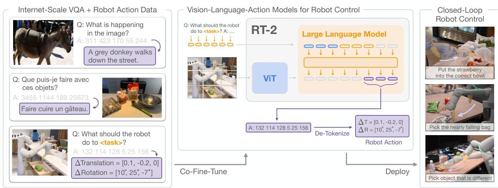

### RT-2 (2023年8月,google mind)

> [!NOTE]
>
> 将大量的网络数据整合到机器人端到端控制中让机器人操作能涌现出泛化能力。

#### URL：

官方project url: https://robotics-transformer2.github.io/

Alphaxiv: https://www.alphaxiv.org/overview/2307.15818

Scholarly: https://library.scholarcy.com/try

#### methods:

- 预训练的vlm + finetune:互联网规模数据(图像-文本对)+机器人演示数据
  - 为什么有了vlm还要用视觉问答损失？防止忘记通用知识
- 直接把机器人动作映射为language的同等地位的token，因此架构基本还是vlm的结构。
- 推理频率： 1-3Hz,更小的vlm模型5hz

> [!NOTE]
>
> 1.推理频率比较低
>
> 2.展示的demo背景还是很干净的，实际操作估计要翻车。

