### 介绍

机器人动力学关注的是作用在机器人上的力与其所产生的加速度之间的关系。

两种：

- Fixed-base

- Floating-base

  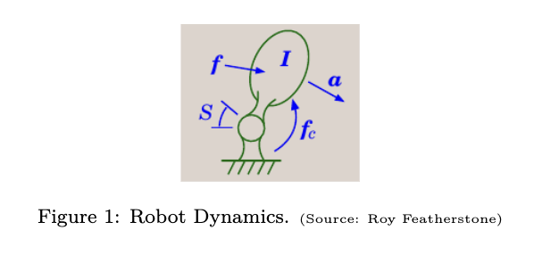

  

  

  ### Kinematics

  运动学只关心“怎样运动”（位置、速度、加速度、旋转角度等几何和时间上的描述），而**不关心**“为什么运动”（即不关心产生运动的力、质量、扭矩等）。

  ##### position

  笛卡尔坐标系、柱坐标系、球坐标系

  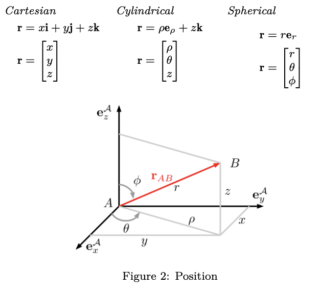

##### velocity:

position相对时间的梯度。

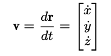

##### rotation

欧拉角，旋转矩阵，或者四元数

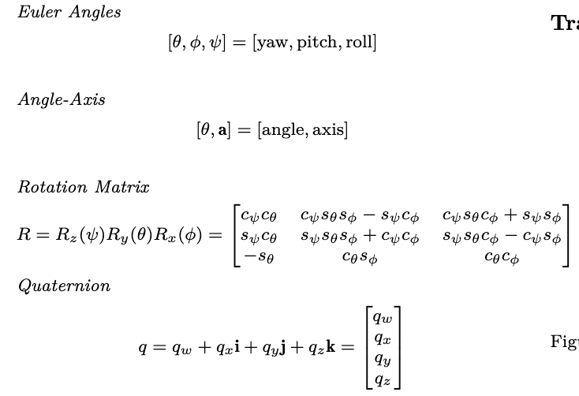

##### 举例子：向量绕轴的旋转可以转换为四元数的乘法

##### 角速度：

- 角速度和线速度的关系：

  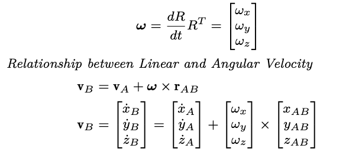

- 角速度和姿态四元数的关系

  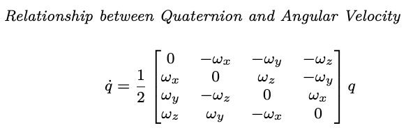

##### Transformation

- 坐标系之间的转换：点P在坐标系A下的坐标=坐标系平移+坐标系旋转*点P在B坐标系下的坐标

  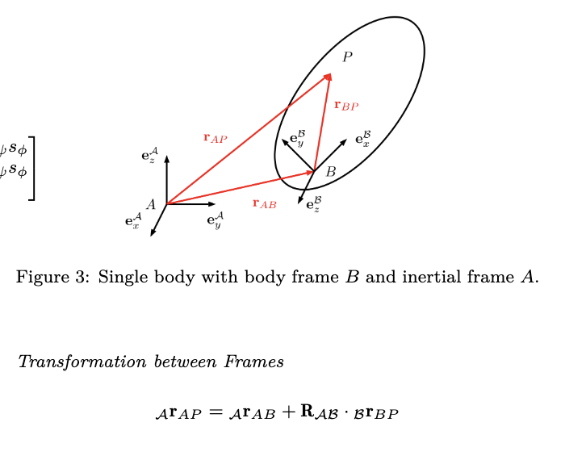

- 坐标系之间的R和T可以通过齐次坐标整合到一个矩阵里

  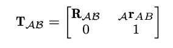

- 刚性body的速度变换

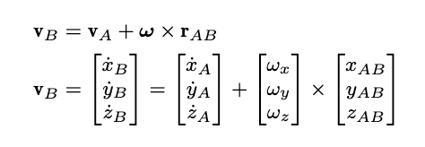

### 多体系统运动学Kinematics of Systems of Bodies

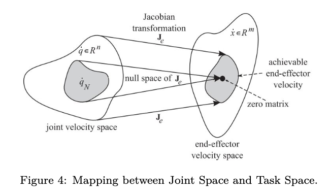

- 广义坐标Generalized Coordinates) q

  - 描述系统配置的一组最小独立变量。
  - 对于一个机器人臂：
    - $q = [q_1, q_2, \dots, q_n]^T$。
    - 通常对应于旋转关节的**角度** ($\theta$) 或移动关节的**位移** ($d$)。
    - **关节空间**：所有可能的 $q$ 构成的向量空间。

- 自由度

- 任务空间坐标

  - 机器人末端执行器（End-effector）工作的物理空间。

  - **组成**：
    $$
    x_e = [r_e, \phi_e]^T
    $$
    

    - $r_e \in \mathbb{R}^3$：末端执行器在基坐标系下的**位置**（x, y, z）。
    - $\phi_e \in SO(3)$：末端执行器的**姿态**（通常用旋转矩阵、欧拉角或四元数表示）。

  - **映射关系**：

    - **正运动学 (Forward Kinematics)**：从关节空间推导任务空间位姿，$x_e = f(q)$。
    - **逆运动学 (Inverse Kinematics)**：已知目标位姿求关节角度，$q = f^{-1}(x_e)$。

- 操作空间坐标

  - 任务空间的一个**最小化子集**，仅包含完成特定任务所需的参数。
    - 任务空间可能描述完整的 6 维位姿（位置+姿态），但某些任务（如平面点焊）可能只需要 3 个参数（x, y 坐标和偏航角）。

- 举例子：4自由度的scara机器人

  - 拥有 4 个自由度（通常是 RRPR 构型，即两个平行旋转副、一个平移副、一个旋转副）。

  - 广义坐标

  - 自由度:4

  - 操作空间坐标

    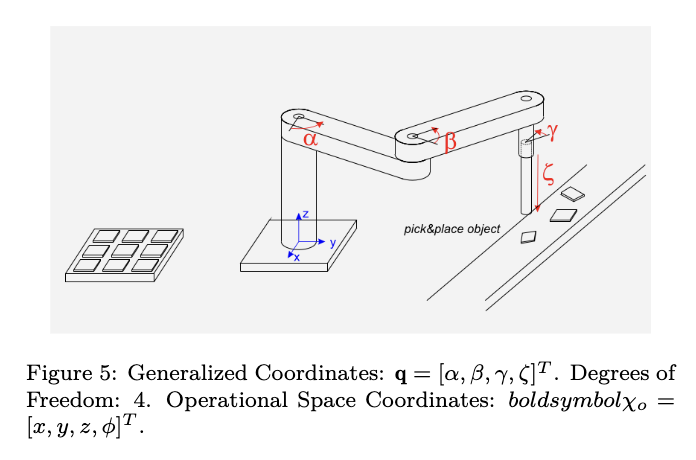

​		

#### 正运动学

- 正运动学解决的是“**如果我知道每个关节转了多少，那么机械臂末端在哪里？**”的问题。

- $$
  \chi_e = \chi_e(q) \\
  q 是关节向量，\chi_e 是末端执行器在笛卡尔空间（或操作空间）中的位姿。
  $$

#### 微分运动学Differential Kinematics

- 微分运动学研究的是**速度**之间的映射，即“**如果关节以某种速度运动，末端执行器的线速度和角速度是多少？**”。

- $$
  \dot{\chi}_e = J_{eA}(q) \dot{q} \\
   \dot{\dot{q}} 是关节速度向量，\dot{\chi}_e 是末端速度向量。
  $$

- **线性映射**：与正运动学的非线性不同，在给定的位形 $q$ 下，末端速度与关节速度之间是**线性映射**关系，这个映射矩阵就是 **雅可比矩阵 (Jacobian Matrix)**。

- 雅可比矩阵 $J_{eA}(q)$ 的维度是 $m \times n$（$m$ 为任务空间维数，$n$ 为关节数）。其每一个元素代表了**第 $j$ 个关节的变化对末端第 $i$ 个坐标分量的偏导数**：
  $$
  J_{eA}(q) = \frac{\partial \chi_e}{\partial q}
  $$
  

- 通常将雅可比矩阵拆分为**线性部分（位置）\**和\**旋转部分（姿态）**：
  $$
  J_{eA} = \begin{bmatrix} J_{eA}^P \\ J_{eA}^R \end{bmatrix} \\
  J_{eA}^P$ (Position Jacobian) :对应末端执行器的线速度 v_e = J_{eA}^P \dot{q}\\
  J_{eA}^R$ (Orientation Jacobian)：对应末端执行器的角速度  \omega_e = J_{eA}^R \dot{q}
  $$

#### 几何雅可比/基础雅可比

- 几何雅可比矩阵 $J_{e0}(q)$ 直接将关节速度 $\dot{q}$ 映射到末端执行器在三维空间中的**物理速度** $w_e$（即线速度 $v_e$ 和角速度 $\omega_e$）

  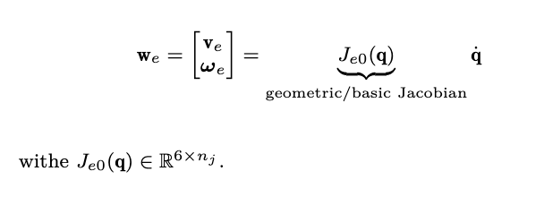

- 几何雅可比和分析雅可比的关系

  - **线速度部分：** 通常情况下，解析雅可比的位置部分 $J_{eAP}$ 和几何雅可比的线速度部分 $v_e$ 是一致的，即 $v_e = \dot{\chi}_{eP}$。
  - **旋转部分（差异所在）：** * **解析雅可比**使用的是姿态表示（如欧拉角）的时间变化率 $\dot{\alpha}$。
    - **几何雅可比**使用的是物理角速度 $\omega_e$。

- 欧拉角变化率和物理角速度不一样https://gemini.google.com/app/1ba1cfb7602fe1fa?is_sa=1&is_sa=1&android-min-version=301356232&ios-min-version=322.0&campaign_id=bkws&utm_source=sem&utm_medium=paid-media&utm_campaign=bkws&pt=9008&mt=8&ct=p-growth-sem-bkws&gclsrc=aw.ds&gad_source=1&gad_campaignid=20357620797&gbraid=0AAAAApk5BhmrfxN96eyL6B8sj__yCdR2J&gclid=CjwKCAjwhe3OBhABEiwA6392zOVa895zqphQ4PnODjDKyLYhYxDXBT0RUd_d982tnMBw4vHrsYmLiRoCEcwQAvD_BwE

- 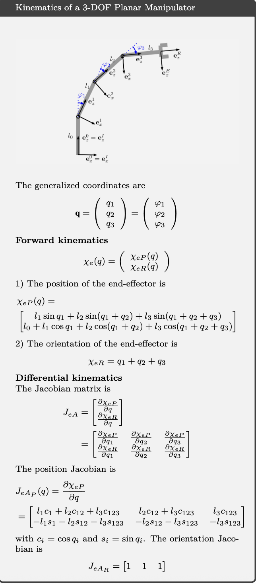

### 运动控制方法

#### 逆微分运动学

在机器人运行过程中，我们通常给末端设定一个期望速度 $\dot{w}_e$。

- **正向微分运动学：** $\dot{w}_e = J \dot{q}$（已知关节动多快，算末端多快）。
- **逆微分运动学：** $\dot{q} = J^{+} \dot{w}_e$（已知末端要多快，反推关节给多少速度）。

这里使用的是**伪逆（Pseudo-inverse）** $J^{+}$，因为雅可比矩阵通常不是方阵。

