### 成像原理

- 小孔成像

  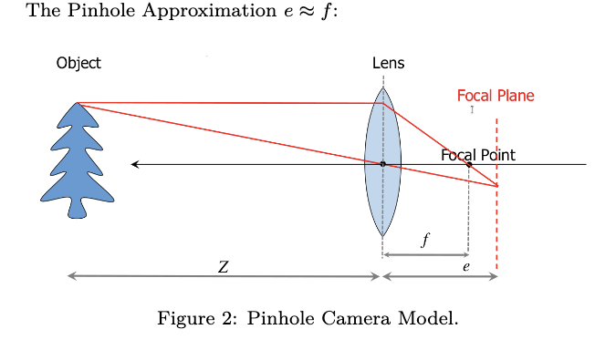

- 透视投影关系

  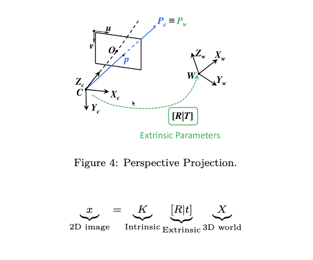


### 相机标定(calibration)

##### 方法1: 3d objects求解上面的透视投影方程

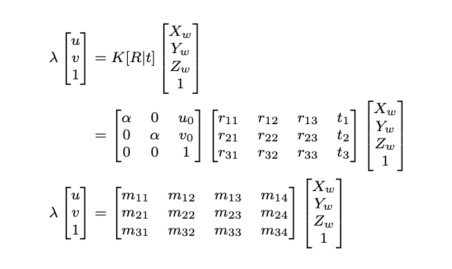

- 3d-2d correspndeces关系求解
  $$
  Q_{2n\times12}\cdot M_{12x1} = 0
  $$
  
- 6points（一个点提供2个方程）, Q矩阵rank=11有唯一解
- Over-determined解： 用svd分解
  - 本质是最小二乘含义下，使得所有点产生的代数误差总和最小
- 非线性calibration refinement: LM算法refine相机的参数，原理是最小化像素空间投影误差
  - LM算法还可以把相机的畸变参数也考虑进去


##### 2.张正友标定

- 上述的方法要求三个点不能共面，比较困难。张正友标定固定到一个平面Zw=0

- 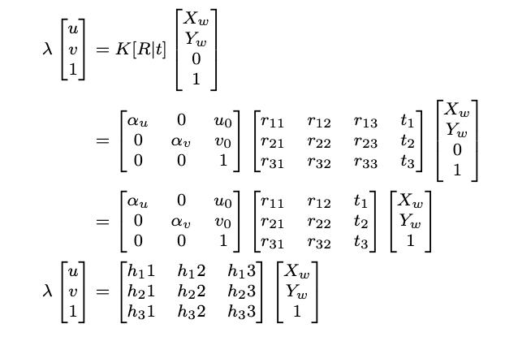

- 2D-2D correspondences
  $$
  Q_{2n\times9\cdot H_{9\times1}} = 0
  $$
  
- 最小解出来需要：4points, rank8

- 求解出H之后，可以分解为K和【R|t]

- H: 单应矩阵

- 过程：拍摄多张不同角度的标定板->svd分解求解得到相机内参K->还原每一张标定板拍摄时候的外参->LM调优

  - svd分解最小化的是代数误差，得到初步的线性解K之后一定会通过非线性优化LM算法来refine所有参数


### Camera Localization(PnP)

定义：给定3d的世界坐标点和相应的2d图像点求解一个标定过的camera的位姿

##### 1.求解PnP问题

- 根据3d-2d投影方程入手
- 多少个点可以用来确定一个camera的位置
  - 三个点：解不唯一(P3P)（投影关系约束有个尺度因子，约束不完整）
    - 四次方程在实数范围有4个根，这代表在空间中可能存在4个不同的相机位姿，使得这三个点在图像上的投影看起来完全一样。
  - 4个点不共线：可以得到唯一解
    - 相比P3P用多一个点来消除歧义
  - 如果4点共面，退化成单应矩阵H,可以求出唯一解
  - 更多点，通过svd处理超定方程，通过冗余抵消噪声，可以获得更精准的值。

##### 2.EPnP算法

- 算法过程：在空间确定三个主轴和一个质心，然后把所有3d点表示成其线性表示；这个线性表示可以迁移到像素空间，从而得到

  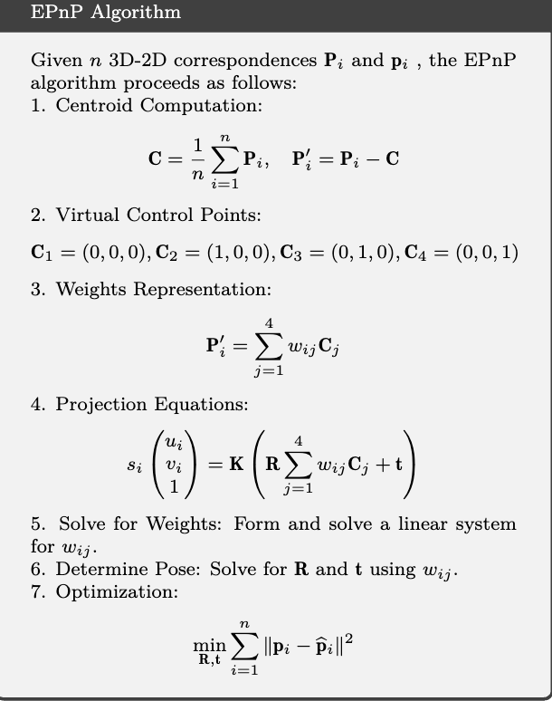

- 本质是找四个控制点在世界坐标系和相机坐标系下的三维坐标，然后解R｜T,就是一个简单的3D点云对齐的问题了。

  - 先定义世界坐标系的重心和三个主轴
  - 所有的世界坐标系的特征点都可以通过上面的控制点线性表示
  - 根据像素坐标=K*(特征点在相机坐标系下的三维坐标)是已知的
    - 把特征点在相机坐标系下的三维坐标-》替换成特征点在控制点下的坐标*【控制点在相机坐标系下的三维坐标】
      - 此时这个特征点在控制点下的坐标就是上面第二步的线性表示的参数
        - 理由：重心不变性
      - 即可以求解出【控制点在相机坐标系下的三维坐标】
  - 已知四个控制点在世界坐标系和相机坐标系下的三维坐标，再求解一个点云对齐问题就可以了

- 最后可以用重投影误差进行优化


### Image Filtering

- 卷积：连续的，离散的，一维的，二维的
- Linear Filter:
  - Mean filter
  - Gaussian Filter
  - Sobel Filter: 单个方向梯度，边缘检测算子
  - Laplacian Filter: 两个方向的边缘检测算子
- 卷积具有可分离性：乘以二维卷积=乘以x和乘以y
- Non-linear Filter:
  - Median: 邻居代替中心
  - Bilateral Filter: weighted neighbors代替center
- Canny边缘检测
  - 对图像计算梯度：图像高斯平滑+x/y梯度<->图像*高斯算子在两个方向的梯度
  - 计算梯度强度和方向
  - 梯度强度Thresholding:小于阈值置为0
  - Thinning:根据梯度方向移除不是局部最大的像素


### Feature Detection

- Cross-correlation

- 相似性度量

  - ssd
  - Acc（normalized了）

- Census Transform和Hamming Distance

- Moravec corner检测： corner是在任意方向图像强度都变化了的

  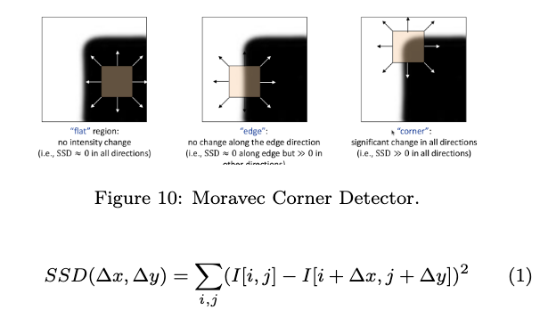

- Harris角点检测

  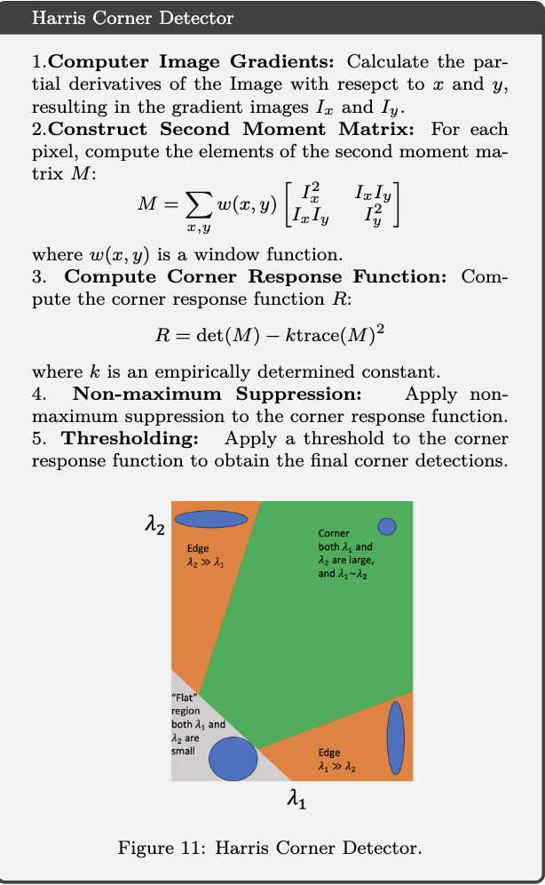

- sift

  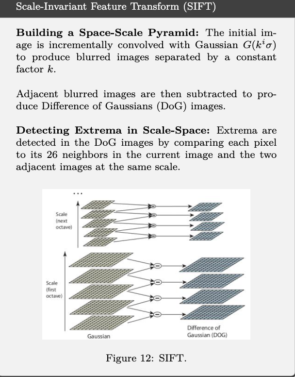


### Multi-View Geometry

#### 1.Depth estimation

###### 1.1. Depth from stereo(simple case)

- 固定多目或者双目，外参已知且静态
- 即时性和近距离高精度：比如机器人避障，工业视觉检测的很高的重复精度
  - 目标距离很远的时候视差几户为0，此时三角测量精度更高

- camera calibrated, baseline B已知

- 同一场景拍两张图，估计深度

  - 如何确定视差：ssd,ncc之类的；工业上还会通过结构光（主动打光斑）来定位。

- 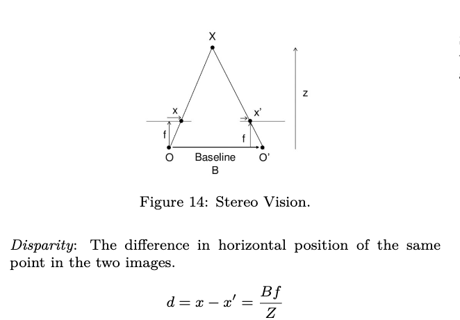

  

###### 1.2. Depth from Stereo(General Case):

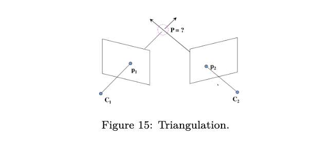

- 大规模三维重建sfm, 单目slam，长距离测距，动态运动位置环境或者大范围场景
- 通过已知的相机位姿（从不同位置拍摄）和对应的像素坐标确定空间点的三维位置
  - 数学本质：求解两条或者多条射线在空间中的交点。由于有噪声，射线通常不相交，因此通常转换成最小二乘法或者对极几何约束下的重投影误差最小化问题。
  - 关键点：基线是变量（通常跟随相机移动变化），位姿通过sfm或者slam估计得出。
- 非线性优化：通过最小化重投影误差refine深度估计。


###### 2.1 Epipolar Geometry

-  对极几何描述的是两台相机在不同位置拍摄同一空间点的时候，图像坐标存在的几何约束关系。

- 一些概念定义：

  - 对极点：一个相机光心在我图像平面的投影（站在我的位置看另一个相机）
  - 对极线：对极平面和图像平面的交线
  - 对级约束：对于空间中一点x，左图对应的像素是xl,其在右图的匹配点一定落在相应的对极线xr上。

  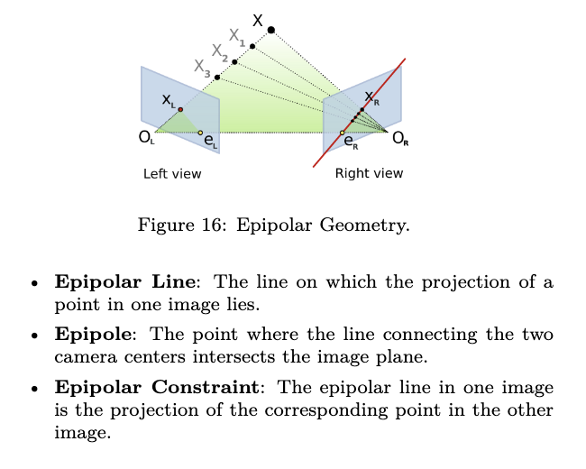

- 为什么要用对极几何：

  - 减少搜索空间；有了对极约束只用沿着对极线进行一维搜索
  - 极线矫正(rectification): 通过算法对图像变换，使得对极线水平平行。这样匹配点y坐标一致，寻找匹配点就变成了简单的行扫描。
    - 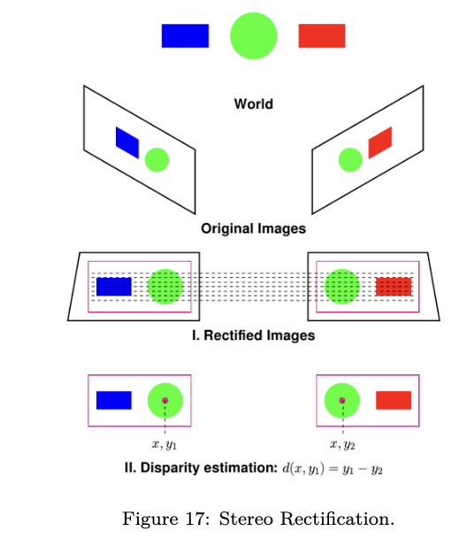
    - 实际工作的时候，算法会计算两个虚拟的成像平面，在数学上共面且平行。
      - 原始图像中的每一个像素点，通过一个单应矩阵重新映射(wraping)到这两个虚拟平面上
      - 矫正之后左图(xl,y)，右图的匹配点一定是(xr,y)，即y坐标一定相等。后续根据视差和标定好的基线长度，就可以还原3d点云。


### Structure from motion(sfm)

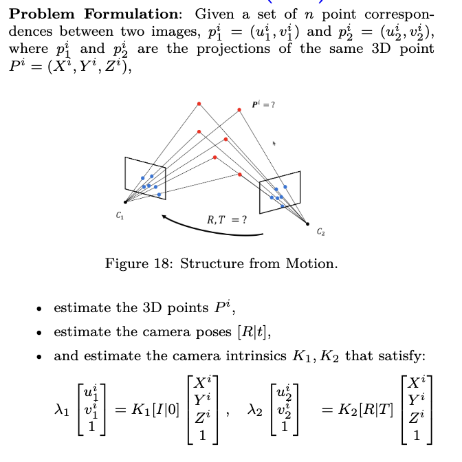


##### case1: 标定后的相机(k1,k2已知)

- 前后图像的4n个点知道，n个对应关系，像素坐标对像素坐标

- 5+3n未知：3n是3d points的坐标， 5是3 rotation + 2 for translation 

  - 为什么T少一个自由度：因为sfm没有绝对尺度，尺度需要结合其他确定性的尺度来确定
    - 用手机拍一个手机模型和真的大楼，如果动作路径一样，照片里特征点运动轨迹也一样；sfm智能告诉你a到b的距离是b到c的两倍，不能告诉你确切的值；双目可以是因为双目相机的baseline是确定的尺度。

- 对级约束：

  - 对极约束描述空间三维点在两张image之间的关系

  - 推导的核心思想就是“光心，图像匹配点，三维点，这三者构成的向量共面”

    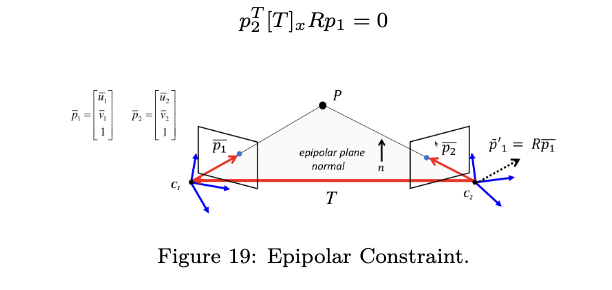

  - 本质矩阵：

    - 就是上面的TxR：描述两个camera之间的相对位姿
      $$
      E = [T]_xR
      $$
    
  - 本质矩阵和基础矩阵的关系：
    
    - 本质矩阵是归一化的图像坐标（去掉了相机内参的影响后的方向），5自由度
      - 基础矩阵直接作用于像素坐标，包含了位姿(R，T)和相机内参，7自由度
  
- 八点算法求解基础矩阵
  
  - 3x3矩阵9个参数未知，因为上面的方程有尺度不确定性（等式右边是0），只需要求解8个独立参数。因此八个点可以求解。
  
  - 有噪声的情况下，选取大于8个点，我们可以对矩阵进行svd分解，取最小奇异值作为f的解。
  
  - 奇异性约束：基础矩阵的秩是2，通过svd分解出来的一般是慢秩。对矩阵再次svd分解，强制最小奇异值为0
  
    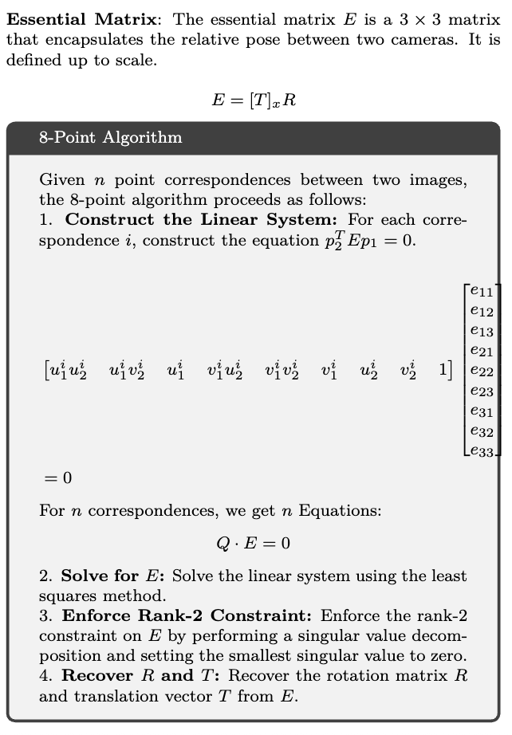
  
  - 注：svd分解
  
    - **零**：齐次方程 Ax=0*A**x*=0 的零空间 → **最小**奇异值。
      - **主**：主成分/低秩近似/最大方差 → **最大**奇异值。
  
  - 注：由于矩阵的病态特性，有时候需要在像素坐标计算以前做归一化

##### case2:  没有标定的camera求解基础矩阵

- 计算过程同上

  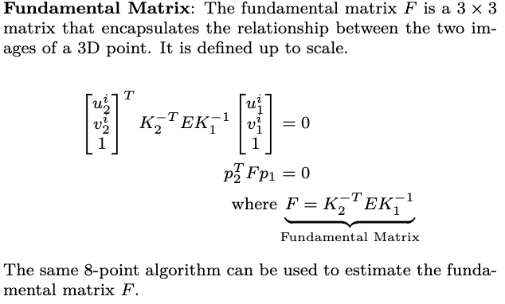


#### robust sfm

- ransac算法：sampling->model fitting->model evaluation ->model refinement ->model selection
- 8-point ransac: 估计基础矩阵
- 5-point ransac:估计本质矩阵
- 2-point ransack: line fitting


#### bundle adjustment

- 综合所有的参数做最后一步优化让重投影误差最小

- 几何解释：

  - 每个相机对每个三维点定义一条**光束**（从光心到点的射线）
  - 理想情况：所有光束精确交会于三维点
  - BA：调整所有光束的起点（相机位姿）和交点（三维点），让它们在**图像平面上的投影**与观测最匹配

- BA在sfm/slam中的角色：

  - 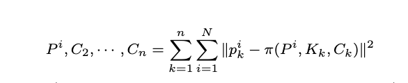

  ```
  图像输入
     ↓
  特征提取 (ORB, SIFT, SuperPoint)
     ↓
  特征匹配 (暴力匹配/FLANN)
     ↓
  几何验证 (RANSAC + 基础矩阵/本质矩阵)
     ↓
  【初始重建】 (增量式/全局式 SFM)
     ↓
  【Bundle Adjustment】 ← 优化所有相机和点
     ↓
  【可选：回环检测 + 全局 BA】
     ↓
  稠密重建 / 纹理贴图 / 导出模型
  ```

  

### Sequential SfM(Visual Odometry)

- Sfm: 多个相机拍摄恢复每次拍摄的外参和空间中的三维点，强调重建的准确度

- Slam:强调实时

- Sequential sfm: 处理连续帧，纯视觉的slam前端，没有后端优化和回环检测； 可以理解为sfm和slam的过渡

  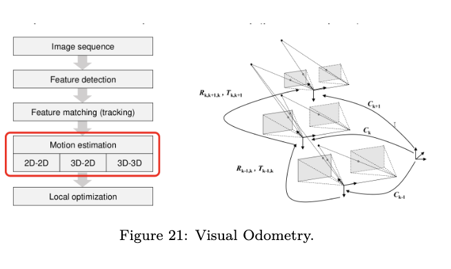

- KLT tracking
  - 计算机视觉中一个经典且高效的特征点追踪算法。
  - **它不是在每一帧中重新检测角点，而是在视频序列中，快速、稳定地“跟随”那些已经在上一帧中选定的特征点，找到它们在下一帧中的精确位置。**
  - 它回答了SLAM/SFM前端的一个核心问题：“**上一帧我看到这个角点在位置 (u,v)(\*u\*,\*v\*)，下一帧它跑到哪里去了？**”
  - 基于光流法的稀疏追踪


### Dense 3D reconstruction

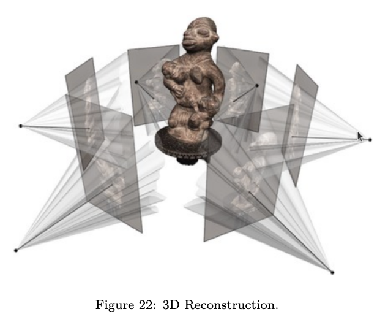


- 定义：给定n张images,估计scene的3d结构和相机位置。
- 聚合光度误差 (Aggregated Photometric Error)
  - **光度一致性假设（Photometric Consistency）**：即同一个空间点在不同视角下的像素亮度（或颜色）应该是接近的。
  - **两幅图像间的误差**：把两张图对齐后，对应像素值相减。
  - **误差聚合**：
    - 为了提高鲁棒性，我们不只看两张图，而是将所有图像对 $(i, j)$ 之间的误差累加起来：
- 视差空间图像 (Disparity Space Image, DSI / Cost Volume)：
  - $$C(u, v, d) = \sum_{k} \rho(I_R(u, v) - I_k(u', v', d))$$
  - 假设一个深度，投影变换到别的帧，计算颜色差异得到的就是dsi
- 深度图估计 (Depth Map Estimation)：
  - 对于参考图像中的每一个像素 $(u, v)$，我们查看它在所有深度假设 $d$ 下的误差，选择那个让误差最小的深度：


### 视觉惯性里程计 (Visual Inertial Odometry, VIO)

- IMU 测量设备**线性加速度**和**角速度**的传感器。它通常由三轴加速度计和三轴陀螺仪组成。

  - 视觉给 IMU **“指路”**（消除漂移），IMU 给视觉 **“提速和补位”**（提供高频和鲁棒性）。

- 由于传感器存在物理缺陷，测得的原始数据 $\hat{\omega}$ 和 $\hat{a}$ 并非真实值

  - #### 角速度模型 (陀螺仪)

    $$\hat{\omega}_B(t) = \omega_B(t) + b_\omega(t) + n_\omega(t)$$

  - #### 线性加速度模型 (加速度计)

    $$\hat{a}_B(t) = R(t)(a_W(t) - g) + b_a(t) + n_a(t)$$

- **松耦合视觉惯性里程计 (Loosely-Coupled VIO)** 

- 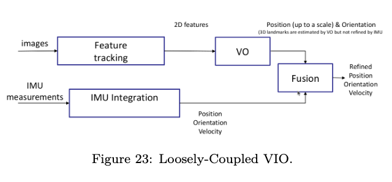

  - 视觉模块和 IMU 模块分别计算位姿，最后再通过一个融合层将结果合并。

- **紧耦合视觉惯性里程计 (Tightly-Coupled VIO)** 

- 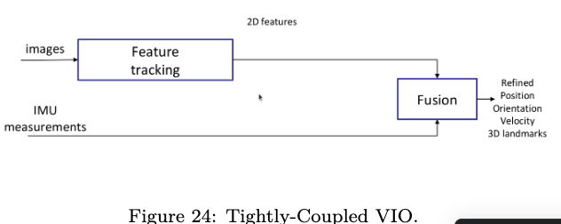

  - 目前 SLAM 和机器人定位领域中最主流、也是精度最高的一种融合方案。
  - 将**视觉的原始观测特征**和 **IMU 的原始测量数据** 放在同一个数学框架下进行联合优化。


### event-based vision

- 不像普通相机那样按照固定频率（如 30fps）拍摄整幅图像，而是模仿生物视网膜的工作原理，只记录光强**发生变化**的时刻。

  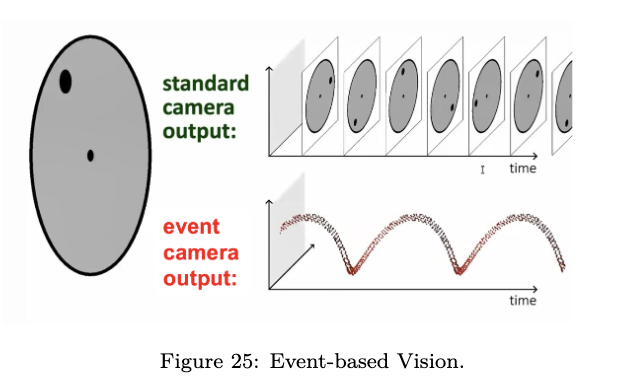

- DAVIS 传感器：全能组合

  - 事件相机只记录“变化”，在完全静止的情况下它会“失明”。为了弥补这一缺陷，**DAVIS (Dynamic and Active-pixel Vision Sensor)** 传感器诞生了。
  - 它在一个芯片上集成了三种数据源：
    1. **Events (事件流)**：负责捕捉高速运动和高动态细节。
    2. **Images (传统图像)**：提供静止状态下的纹理和颜色信息。
    3. **IMU (惯性测量单元)**：提供相机的运动信息。
