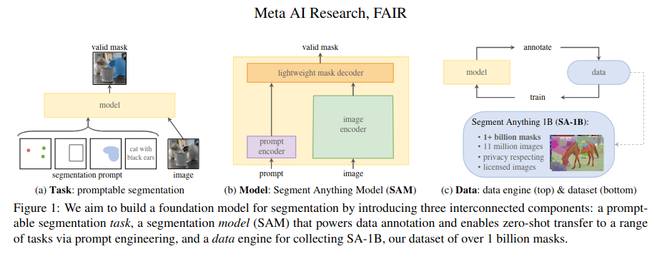
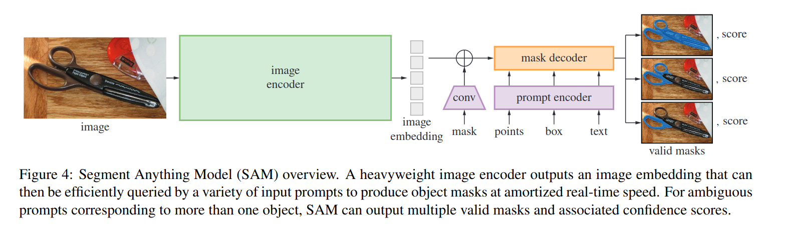
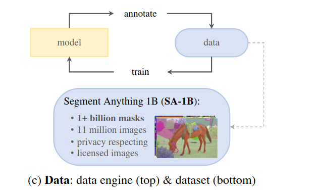
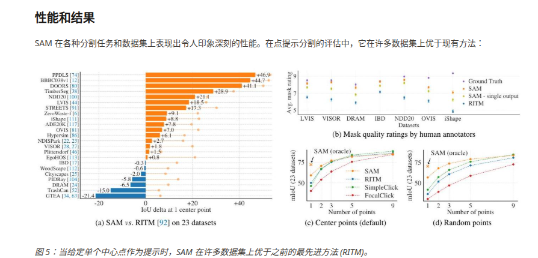
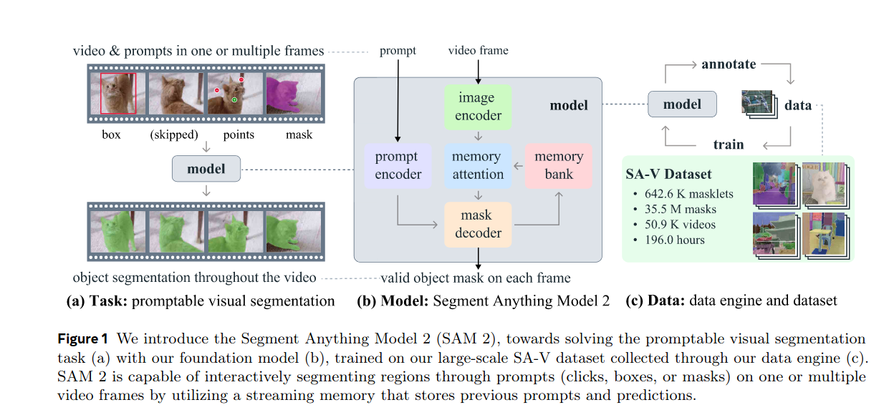
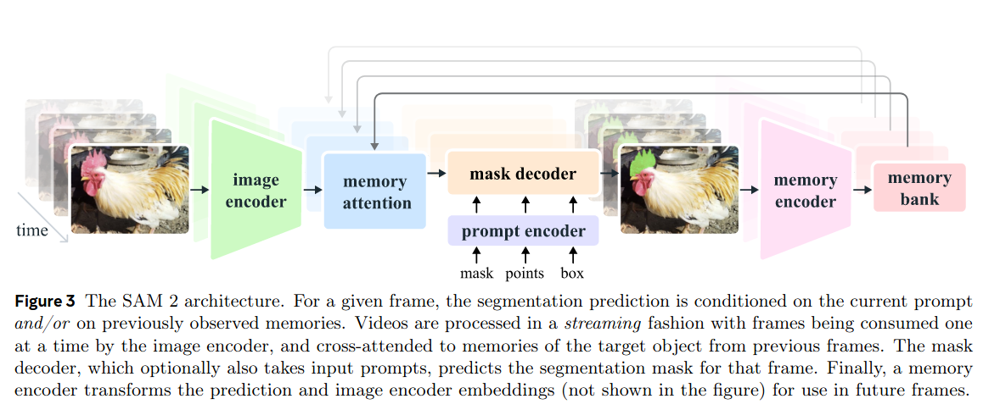

### sam-family

|                                                              |                                                          |                          |                   |            |
| ------------------------------------------------------------ | -------------------------------------------------------- | ------------------------ | ----------------- | ---------- |
| sam                                                          | 针对图像的promptable分割模型                             | prompt:点，框，MASK,文字 | 搭配DINO/CLIP使用 |            |
| SAM2对象选择和调整： SAM 2 扩展了 SAM 基于提示的对象分割功能，使其也能用于跨视频帧的对象跟踪。对陌生视频的鲁棒分割：该模型具备零样本泛化能力。这意味着它可以分割训练过程中未见过的领域中的对象、图像和视频，从而在实际应用场景中具有很强的适应性。实时交互：SAM 2 采用流式内存架构，一次处理一帧视频，从而实现实时交互式应用。 | 针对图像和视频的PROMPTABLE分割模型，可用于实时的TRACKING | 同上，可以在任意一帧选取 |                   | SA-V数据集 |
| grounded sam(2024.1)                                         |                                                          |                          |                   |            |
| Grounded sam2                                                |                                                          |                          |                   |            |
| sam3                                                         |                                                          |                          |                   |            |

## **一.sam <Segment anything> (23年4月 meta)**

**2023.4 META的AI研究部门**

### **url:**https://www.alphaxiv.org/zh/overview/2304.02643v1

官方DEMO：https://sam2.metademolab.com/demo

#### **TL;DR**

Segment Anything 项目引入了一个图像分割的基础模型，能够根据各种提示生成图像中任何对象的分割掩码。这项工作还提出了包含超过 10 亿个掩码的 SA-1B 数据集，使 SAM 能够在各种分割任务中进行零样本迁移并泛化到未见数据。

### **task & method**

- **TASK: 可提示分割任务**

- **METHOD:**

图像用预训练的VIT, 提示编码器分为稀疏的和密集的(mask),有不同的处理方法；mask decoder: 一个Transformer模块，结合图像嵌入和提示嵌入来预测分割掩码。

- 数据飞轮

迭代过程，模型不断帮助注释者创建分割掩码，产生的数据用于改进模型。这种方法产生了SA-1b数据集，其中包含来自1100万张图像10亿个掩码。

### **RESULTS:**

# **二、sam2 (24年8月，meta)**

Demo: [https://sam2.metademolab.com](https://sam2.metademolab.com/)

Code: https://github.com/facebookresearch/sam2

Website: https://ai.meta.com/sam2

### **TL;DR**

SAM 2 通过将原始的 Segment Anything Model (SAM) 的功能从静态图像扩展到动态视频内容，代表了视觉分割领域的一项重大进步。这项来自 Meta FAIR 的工作引入了一个统一的基础模型，该模型能够通过单一架构在图像和视频上执行可提示的视觉分割(图像看成MEMORY是空的视频分割)。

这项研究解决了计算机视觉中的一个基本挑战：尽管原始 SAM 在可提示图像分割方面表现出色，但视频的动态特性带来了额外的复杂性，包括物体运动、变形、遮挡和质量变化。SAM 2 通过三项核心贡献来应对这些挑战：定义了一种新的可提示视觉分割 (PVS) 任务，开发了一个同时处理图像和视频的统一模型架构，并通过创新的数据收集方法创建了迄今为止最大的视频分割数据集。

### **METHODS:**

- 图像编码器使用经过 MAE 预训练的 Hiera（分层视觉变换器），处理每个视频帧以生成无条件特征嵌入。这种分层设计提供了多尺度特征，这对于详细的掩码解码至关重要，同时比原始 SAM 编码器实现了 6 倍的速度提升。
- 一种新颖的**记忆注意力**机制构成了 SAM 2 视频处理能力的核心。该组件由堆叠的变换器块组成，通过对记忆库进行交叉注意力，将当前帧特征与来自过去帧和先前交互的信息进行条件化。记忆库存储了先前观察到的帧的表示，并维护着捕获被跟踪物体高级语义信息的“物体指针”。
- 处理物体消失或者遮挡：掩码解码器在 SAM 的设计基础上进行了关键增强以适应视频：来自分层图像编码器的高分辨率细节整合的跳跃连接，以及一个新的**遮挡预测头**，用于确定每个帧中物体的可见性

##### **内存管理系统：**

记忆编码器通过将预测的掩码与无条件的图像特征融合来生成记忆，并将它们存储在一个 FIFO 队列中，该队列维护固定容量的近期帧信息以及被提示的帧。时间位置编码嵌入到近期帧记忆中以建模短期运动模式，而物体指针则在更长的时间跨度上提供语义连续性。

##### **数据集**

SAM 2 的一项关键创新是开发了一个迭代数据引擎，解决了大规模、多样化视频分割数据集稀缺的问题。Segment Anything Video (SA-V) 数据集中的掩码数量比现有视频分割数据集增加了 53 倍。

### **RESULTS:**

### **交互式视频分割性能**

在 9 个密集标注的零样本视频数据集上进行的模拟交互设置中，SAM 2 显著优于强基线（SAM+XMem++ 和 SAM+Cutie），在实现更高分割精度的同时，用户交互次数减少了 3 倍以上。所需点击次数的显著减少代表了交互式视频标注工作流程中用户体验的巨大提升。

### **半监督视频对象分割**

当仅使用首帧提示在常规半监督 VOS 基准上进行评估时，SAM 2 在 17 个不同的视频数据集上实现了最先进的准确性。即使使用点击或框输入而不是真实掩码，该模型也始终优于 XMem++ 和 Cutie 等专门的 VOS 方法。在最新引入的 SA-V 验证和测试集上，性能提升尤为显著，展示了该模型在具有挑战性的开放世界场景中“分割任何事物”的能力。

### **增强的图像分割**

SAM 2 改进了原始 SAM 的图像分割性能，在 23 个 SA 评估数据集上，其 1 次点击 mIoU 达到 58.9%，而 SAM 为 58.1%，并且运行速度快 6 倍。在混合图像和视频数据上进行训练进一步将性能提升至 61.9% mIoU，尤其在被评估为视频的数据集上取得了显著的增益。

### **实时处理能力**

该模型以实时速度运行，在单个 A100 GPU 上达到 43.8 FPS (Hiera-B+) 和 30.2 FPS (Hiera-L)，使其适用于需要交互式视频处理的实际应用。

# **SAM2.1**

https://encord.com/blog/sam-2.1-explained/

### **TL;DR**

SAM 2在图像分割模型领域已是强有力的竞争者，它能够“分割任何物体”，适用于各种图像类型和领域。然而，任何尖端技术都有其不足之处，SAM 2 也不例外。在处理视觉上相似的物体、小型物体以及遮挡（即物体部分被遮挡）的情况时，SAM 2 会遇到一些挑战。

SAM 2.1 最重要的更新之一是提高了分割 SAM 2 难以分割的对象的能力。

- 处理视觉相似和小尺寸物体：SAM 2.1 集成了额外的数据增强技术来模拟复杂环境。这些技术训练模型识别和区分外观相似或尺寸非常小的物体。实际上，这使得 SAM 2.1 在医学成像或自动驾驶车辆导航等对分割精度要求极高的实际任务中表现更加可靠。
- 遮挡处理：遮挡（即物体部分被遮挡）一直是图像分割的一大挑战。SAM 2.1 通过使用更长的帧序列进行训练来解决这个问题，从而为模型提供更多上下文信息，使其能够理解部分可见的物体。这项更新使得 SAM 2.1 能够更好地重建和预测物体边界，即使物体的部分区域被遮挡。
- 位置编码调整：为了提高对空间关系和物体指针的记忆能力，SAM 2.1 对其[**位置编码系统**](https://www.sciencedirect.com/topics/computer-science/positional-encoding)进行了调整。这项改进有助于模型更有效地跨帧跟踪物体，尤其是在动态或杂乱的场景中。

# **Grounded sam(2024.1)**

IDEA研究院Code & Demo: https://github.com/IDEA-Research/Grounded-Segment-Anything

### **TL；DR**

由国际数字经济研究院（IDEA）研究人员开发的Grounded SAM，将用于开放集对象检测的Grounding DINO与用于可提示分割的SAM集成，从而能够根据自然语言输入检测和分割任意对象。这个组合系统在SGinW零样本基准测试中达到了48.7 mAP，超越了之前的统一模型。

### **METHODS:**

Grounded SAM 基于两个最近开发的基础模型：

1. **Grounding DINO**：一种开放集对象检测器，可以根据自然语言描述在图像中定位对象。它将文本描述转换为视觉特征，以帮助识别图像中相应的区域。
2. **Segment Anything Model (SAM)**：一种可提示分割模型，在大型 SAM-1B 数据集上训练，能够在提供点或边界框等提示时，为任何对象生成精确的掩码注释。

Grounded SAM 的关键创新在于有效地结合这些模型，以利用它们的互补优势。Grounding DINO 擅长查找文本描述的对象，而 SAM 擅长为这些对象生成精确的分割掩码。

### **RESULTS:**

## **开放词汇分割的性能**

Grounded SAM 在先前的统一开放集分割模型上表现出显着的性能提升。在 Segmentation in the Wild (SGinW) 零样本基准上评估时，Grounded SAM 实现了最先进的结果。

研究人员测试了 Grounded SAM 的多种配置，结合了不同版本的 Grounding DINO（B 代表 Base，L 代表 Large）和 SAM（B 代表 Base，H 代表 Huge）。他们表现最佳的模型 Grounded SAM (B+H) 达到了 48.7 的平均精度均值 (mAP)，优于之前的模型，如 UNINEXT 和 OpenSeeD。

这一性能表明，专门模型的组合可以有效地解决开放集分割的挑战，超越了尝试用单个统一模型解决问题的方法。

## **与其他模型的集成**

Grounded SAM 的主要优势之一是它能够与其他开放世界模型集成，以完成更复杂的视觉任务。该论文展示了几个成功的集成案例：

1. **RAM-Grounded-SAM**：将 Recognize Anything Model (RAM) 与 Grounded SAM 集成，以实现自动图像标注。RAM 生成图像标签，然后将其用作 Grounded SAM 的文本提示，以分割相应的对象。
2. **Grounded-SAM-SD**：将 Grounded SAM 与 Stable Diffusion 结合，以实现可控的图像编辑。Grounded SAM 根据文本提示识别和分割区域，而 Stable Diffusion 根据其他指令修改这些区域。
3. **Grounded-SAM-OSX**：将 Grounded SAM 与 OSX（一种 3D 人体重建模型）集成，以进行可提示的人体运动分析。Grounded SAM 根据文本描述检测特定的人，而 OSX 估计这些人的 3D 身体姿势和形状。

这些集成证明了 Grounded SAM 作为更复杂的视觉理解系统基础的多功能性。通过组合专门的模型，生成的管道继承并扩展了各个组件的功能。
