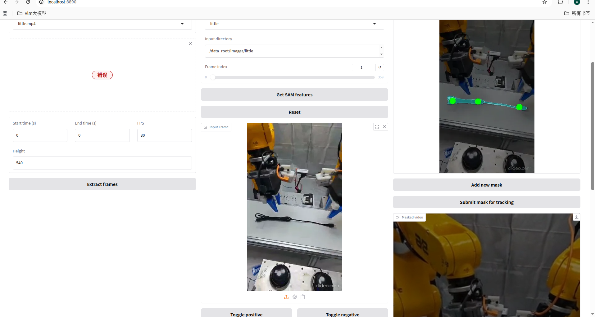
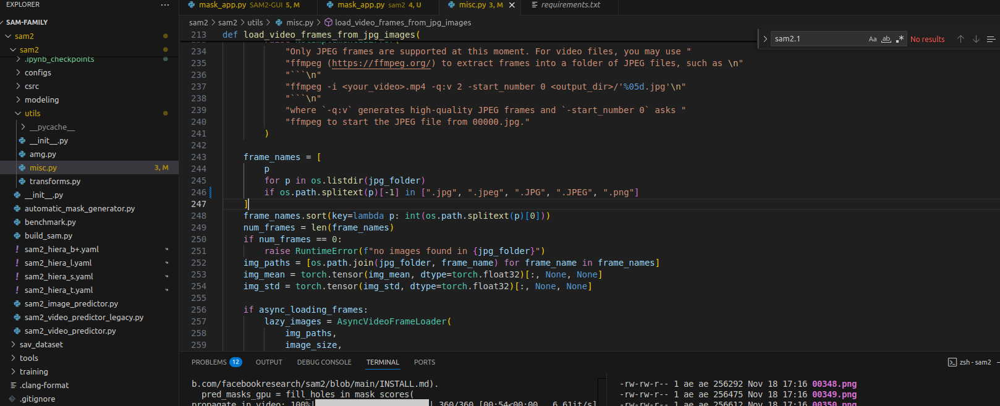

### 1.sam2环境安装

Url: https://github.com/facebookresearch/sam2?tab=readme-ov-file

```
1.conda create -n sam2 python=3.11

2.nvidia-smi //查看最高支持的CUDA 12.8
// 进入pytorch官网查看安装版本：https://pytorch.org/get-started/locally/
pip3 install torch torchvision --index-url https://download.pytorch.org/whl/cu126

pip install -e .
pip install -e ".[notebooks]"


// 下载模型
cd checkpoints && \
./download_ckpts.sh && \
cd ..
```


### 2. Sam2 gui

基于这个仓库进行改造：https://github.com/YunxuanMao/SAM2-GUI

```
在上面的SAM目录下：
将mask_app.py放到根目录下

pip install -r requirements.txt
sam2 gui用的有些库比较老，和SAM2不兼容，因此升级了几个包
pip install --upgrade gradio
pip install --upgrade matplotlib numpy
// pip list | grep gradio
// gradio                               5.49.1
// gradio_client                        1.13.3

mask_app.py设置模型和配置文件，注意SAM2官方用的是2.1
    parser.add_argument("--checkpoint_dir", type=str, default="checkpoints/sam2.1_hiera_large.pt")
    parser.add_argument("--model_cfg", type=str, default="configs/sam2.1/sam2.1_hiera_l.yaml")

python mask_app.py --root_dir ./data_root
```


### 3.GUI执行

a.将视频文件提取帧（这里存入的是PNG）



b.选择初始帧提取SAM特征（这里会报错，定位到SAM2的MISC.PY里面没有支持PNG图片，直接加上就行）



1. 后面依次操作就行


把SAM2和GUI一起的PIPELINE放到了GIT里

https://github.com/77philosophia/sam2#
