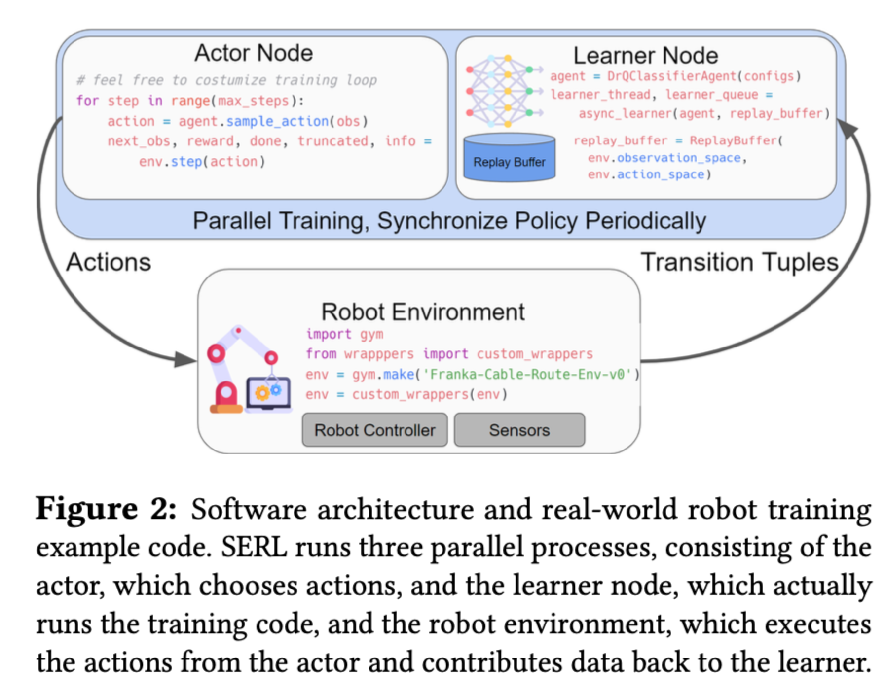

# serl





### 1. Training from state observation example

```python
// learner
// 从 Replay Buffer（经验回放缓冲区） 中采样数据，更新 SAC（Soft Actor-Critic）智能体 的参数，并与 // Actor（执行器） 通信以同步最新策略。
for step in tqdm.tqdm(range(FLAGS.max_steps)):
    # 1. 从 Replay Buffer 采样批次数据
    batch = next(replay_iterator)

    # 2. 更新智能体参数
    agent, update_info = agent.update_high_utd(batch, utd_ratio=1)
    agent = jax.block_until_ready(agent)  # 确保计算完成（JAX异步特性）

    # 3. 发布新参数给 Actor
    server.publish_network(agent.state.params)

    # 4. 记录日志和保存模型
    if update_steps % FLAGS.log_period == 0:
        wandb_logger.log(update_info, step=update_steps)  # 训练指标（如损失）
        wandb_logger.log({"timer": timer.get_average_times()}, step=update_steps)  # 耗时

    if update_steps % FLAGS.checkpoint_period == 0:
        checkpoints.save_checkpoint(...)  # 保存模型检查点
        
        
// actor
or step in tqdm.tqdm(range(FLAGS.max_steps)):
    # 1. 采样动作
    if step < FLAGS.random_steps:
        actions = env.action_space.sample()  # 随机探索
    else:
        sampling_rng, key = jax.random.split(sampling_rng)
        actions = agent.sample_actions(obs, seed=key, deterministic=False)
        actions = np.asarray(jax.device_get(actions))  # JAX → NumPy

    # 2. 与环境交互
    next_obs, reward, done, truncated, info = env.step(actions)
    data_store.insert({
        "observations": obs,
        "actions": actions,
        "next_observations": next_obs,
        "rewards": reward,
        "masks": 1.0 - done,  # 用于折扣计算
        "dones": done or truncated,
    })

    # 3. 更新状态
    obs = next_obs
    if done or truncated:
        obs, _ = env.reset()  # 回合结束，重置环境
```


