# SERL: A Software Suite for Sample-Efficient Robotic Reinforcement Learning

> [!NOTE]
>
> 总结风格：从整体结构有个outline的感觉，每一块涉及到的具体的算法细节和推导看相关论文和代码深入。

## URL

https://arxiv.org/pdf/2401.16013

https://serl-robot.github.io/

https://github.com/rail-berkeley/serl

## TL;DR

2024年1月份的文章，介绍了一个名为SERL的开源软件框架，旨在降低机器人强化学习(Robotic Reinforcement Learning, Robotic RL)在现实世界中的应用门槛。作者指出，尽管Robotic RL在近年来取得了显著进展，但在实际应用中仍然存在许多挑战，特别是算法的实现细节对性能的影响往往非常大，甚至超过算法本身的选择。SERL的目标是提供一个高质量、易于使用的工具，包含样本高效的离线强化学习方法、奖励函数计算方法、环境重置自动化方法、高质量的机器人控制器以及一系列具有挑战性的示例任务。

> [!NOTE]
>
> 1.提供了一个可以用在真实环境的开源的强化学习框架，综合了一套学习策略，算法细节。-》实践落地的work
>
> 2.可扩展性也很好，不跟一个具体的robot硬件平台深绑定，鼓励在此基础上做自己的开发。

## Show case

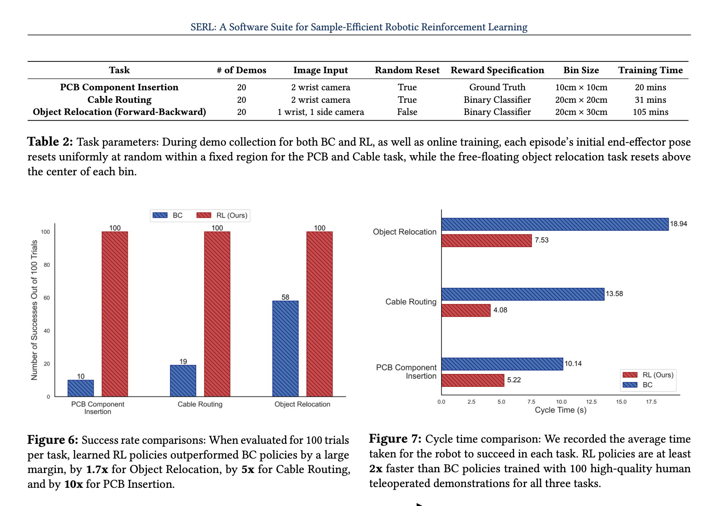

#### pcb:

在 PCB 板上装配穿孔元件是一项常见却又充满挑战的机器人任务。电子元件的引脚极易弯曲，而孔位与引脚之间的公差非常小，要求机器人在装配时既要精准又要轻柔。通过仅仅 21 分钟的自主学习，SERL 使机器人达到了 100% 的任务完成率。即便面临如电路板位置移动或视线部分被遮挡等未知的干扰，机器人也能稳定完成装配工作。(在执行电路板元件安装任务时，机器人能够应对在训练阶段未曾遇到的各种干扰，顺利完成任务。)

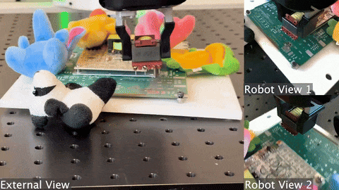

#### 电缆布线

在许多机械和电子设备的组装过程中，我们需要将电缆沿着特定的路径精确地安装到位，这一任务对精度和适应性提出了很高的要求。由于柔性电缆在布线过程中容易产生形变，而且布线过程可能会受到各种干扰，比如电缆被意外移动或者夹持器位置的变化，这导致使用传统的非学习型方法难以应对。SERL 能够在短短 30 分钟内实现 100% 的成功率。即便是在夹持器位置与训练期间不同时，机器人也能够泛化其学习到的技能，适应新的布线挑战，确保布线工作的正确执行。(机器人无需更多的专项训练也能直接把线缆穿过与训练时位置不一样的夹子里。)

#### 物体抓取：

在仓库管理或零售业中，机器人经常需要将物品从一个地方移动到另一个地方，这要求机器人能够识别并搬运特定的物品。强化学习的训练过程中，很难对欠驱动的物体进行自动的归位重置。利用 SERL 的无重置强化学习功能，机器人在 1 小时 45 分钟内同时学习两个 100/100 成功率的策略。用前向策略把物体从 A 箱放到 B 箱，再用后向策略把物体从 B 箱归为回 A 箱。(SERL 训练了两套策略，一个把物体从右边搬运到左边，一个从左边放回右边。机器人不仅在训练物体上达到 100% 成功率，就连没见过的物体也能智能搬运。)

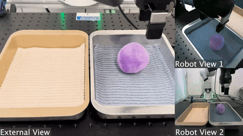

## Model&Method

#### 1. 问题定义和拆解

机器人的强化学习任务可以定义为一个马尔可夫决策过程：

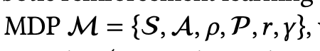

> [!TIP]
>
> 几个字母的代表含义

难点要考虑：

1. sample efficiency

2. 实际场景中为了进行策略学习可能有一些难以定义的场景，比如reward function可能依赖于视觉的观察。每次episodic task需要自动化重置。

3. Controller：一个是要精准了（从仿真->实际环境），一个是要安全

   

#### 2.核心的算法

##### 2.1 RLPD算法

定义了强化学习策略的损失函数、采样过程、用了layer normalization

##### 2.2 reward function

用了分类器判断任务是否成功（论文提到有很多种训练方法，训练一个分类器，训练gan等等，可以自由地做一些探索）

##### 2.3 reset free

简而言之，省去人工重置，设计了一个forward agent执行任务，还有一个backward agent重置任务。

#### 3. 软件结构

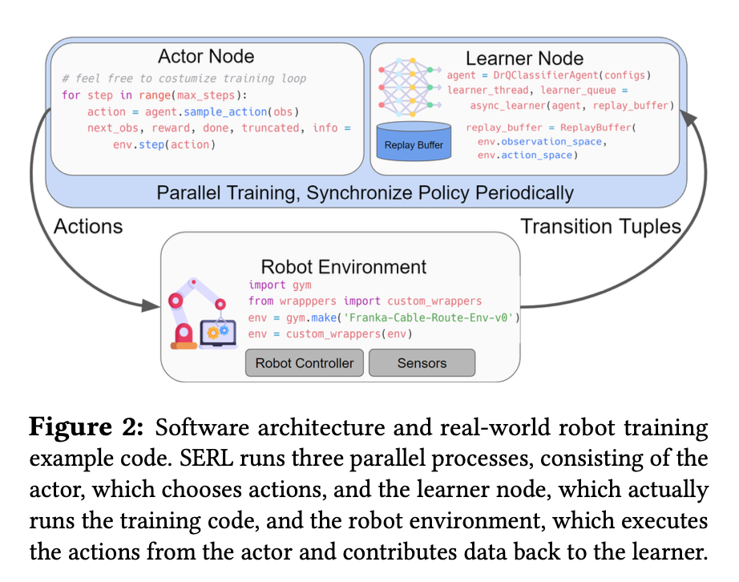

#### 4. 其他

##### 4.1 控制器的设计

简而言之：末端控制器对任务成功率的影响很大，paper里面用了分层结构，两层控制器。不用的频率。

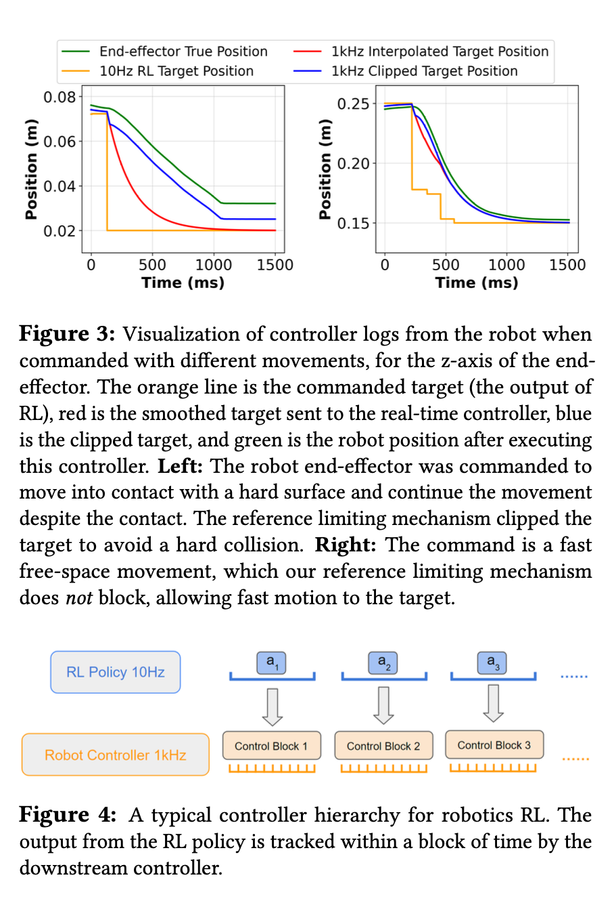

##### 4.2 相对坐标系作observation和action

免去定义世界坐标系，以末端夹具作为起点，描述下一帧相对上一帧的相对坐标。

> [!TODO]
>
> 整体性的框架的一个自上而下的俯视。但是要了解具体的：
>
> Todo:  1. 各个环节算法   2.代码 
>
> 可以放到后面的分享当中。

# hil-serl 

## URL

项目主页：https://hil-serl.github.io/

Paper:https://hil-serl.github.io/static/hil-serl-paper.pdf

Code: https://github.com/rail-berkeley/hil-serl

## TL；DR

验证了经过精细的系统设计，RL算法可以解决一系列灵巧复杂的基于视觉的manipulation任务；

第一个实现双臂的、image inputs、RL在真实世界处理类似组装timing belt的任务。

> [!NOTE]
>
> 和serl不同的：
>
> 1.加入了人类的修正（learn form mistakes）
>
> 2.serl关注简单的任务，也没有涉及双臂的操作。hil-serl聚焦基于视觉的更复杂的manipulation.

## Methods

### 1.问题拆解和定义

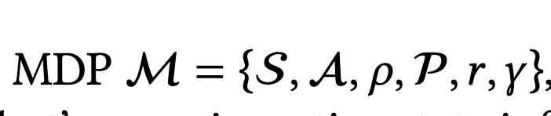

涉及到的关键点是observation space S和action space的选择，比如cameras的组合，本体的状态，相应的robot底层控制器的选择。

针对paper里面的任务：

1.作者的reward function选择了一种稀疏的function：二分类，决定任务是否成功；

2.RLPD算法（sample effenciency和整合先验数据进行训练的能力）：每次训练从prior data和on-policy data各采一半数据。

### 2.系统结构

- Actor process：在robot上执行policy,把数据发送给replay buffer

- learner process:

- Replay buffers（2）: demo buffer存储离线的人类演示；RL buffer存储on-policy data

- environment:处理各种环境输入：cameras,鼠标操作、各种控制器。

  Learner process从两个buffers里面采样，通过RLPD算法更新策略，阶段性将策略发送给actor process去执行。

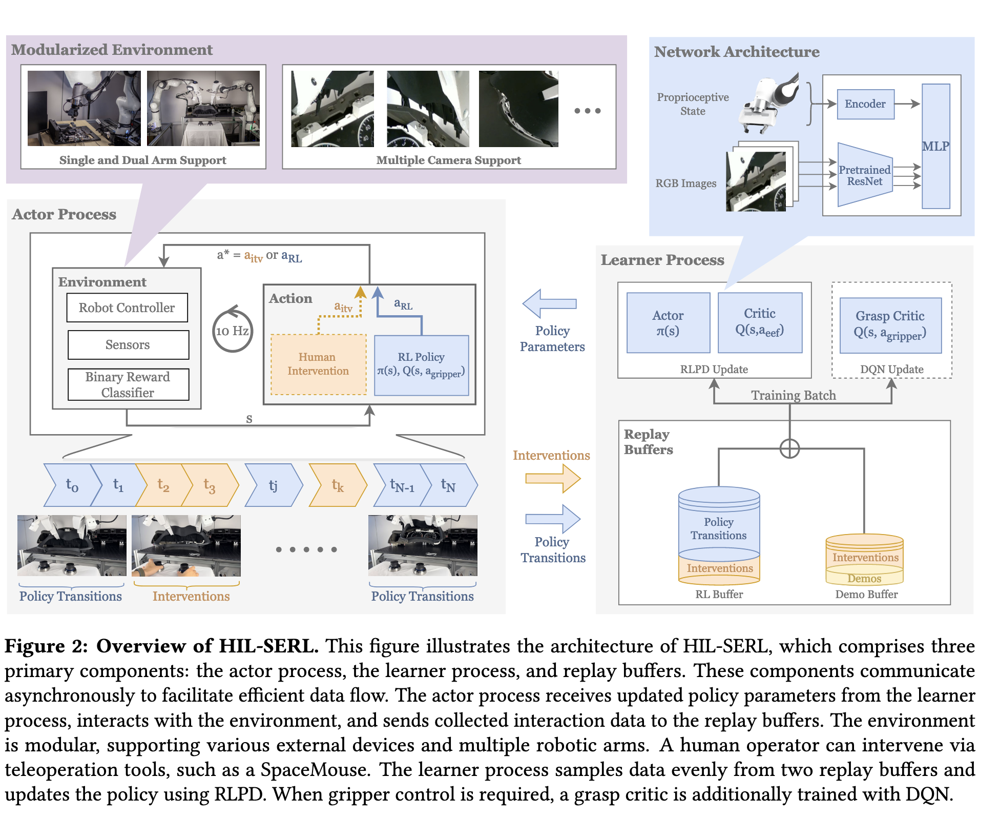

### 3. 系统设计

- pretrained vision backbones: 对输入的图像进行encode
- reward function: 训练了一个二分类的分类器,任务完成给奖励1，其它step奖励为0。
- 下游的robotic system: 一个是用ego-centric的坐标系描述；另外安全性方面控制器阻抗控制 + 限幅，开环控制已经足够。
- Gripper control: 增加了一个critic network对夹爪的动作进行离散化（open, close, stay）.简而言之，训练两个MDP task，一个action空间用连续的action space, 一个用离散化的action space。根据训练方法（DQN），推理的时候从M1中取出连续的actions描述，然后从critic network里面查询离散化的M2的action.

### 4. 人在回路的强化学习

#### 1.**RL的样本复杂度（Sample Complexity）**

- **定义**：学习最优策略所需的环境交互样本量，受以下因素影响：
  1. **状态/动作空间的维度**（Cardinality of state/action spaces）：
     - 高维空间（如机械臂的连续状态+多传感器输入）需要更多样本覆盖。
  2. **任务时间跨度**（Task horizon）：
     - 长周期任务（如多步骤装配）需更长的轨迹探索。
  3. **探索策略**（Exploration policy）：
     - 不充分的探索会导致策略陷入局部最优。

#### 2.解决方案：Human-in-the-Loop (HITL)**

核心思想

- **人类干预加速学习**：
  通过人类提供实时反馈（如动作修正、奖励调整、示范数据），**直接引导探索方向**，减少无效样本。
- **理论依据**：
  人类先验知识可缩小策略搜索空间，降低样本复杂度。

3. 在看一次这张图，人可以在t0到tN的中间时刻干预，用人类干预的action替换robot policy的action.把数据同时存储在两个buffers中，但是策略转换只存储在RL buffers中。

   简而言之：robot表现差的时候人工就干预；

   实验发现，开始阶段人工频繁干预，后面可以干预的越来越少。

#### 5. 训练过程

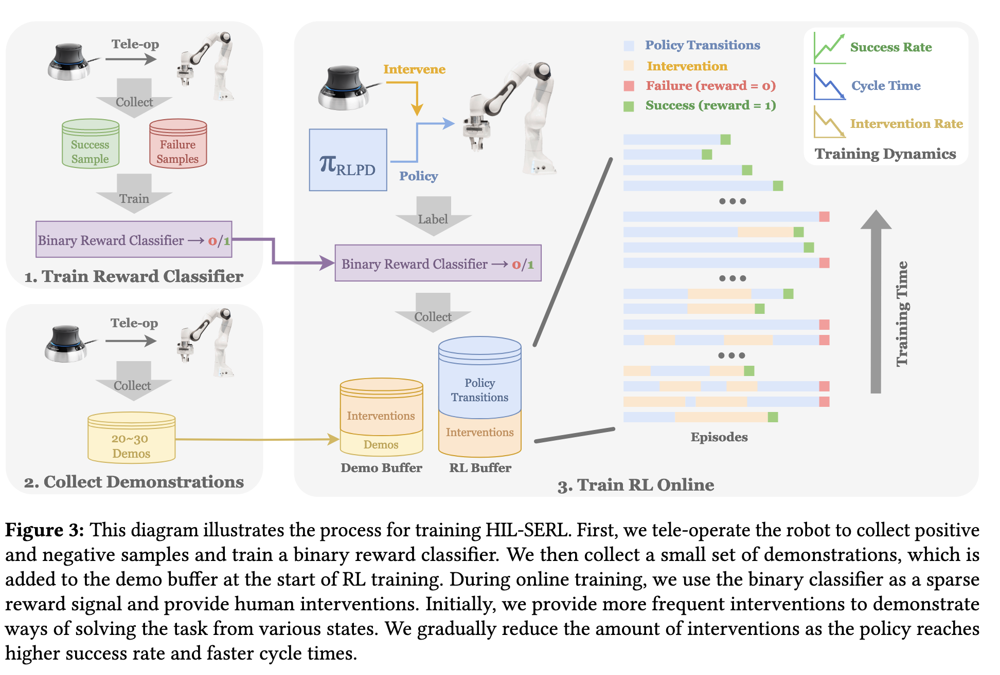

- 相机的选择：wrist cameras(基于ego-centric views的选择)+side cameras(拍摄到整个ROI)
- 训练reward classifier: 10 trajectories x 10s/条
- 准备offline demo replay buffer： 20～30trajectories
- 训练中注意人工干预不要过度，避免过拟合

## Results

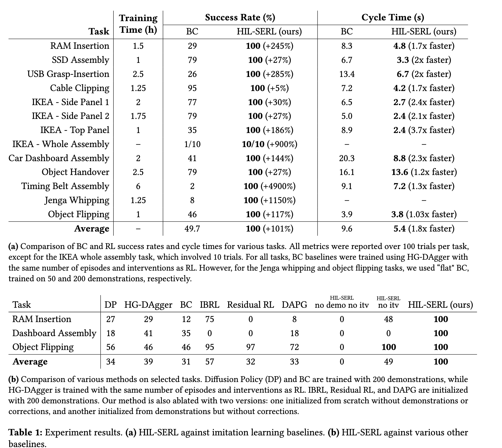

##### 1. 任务

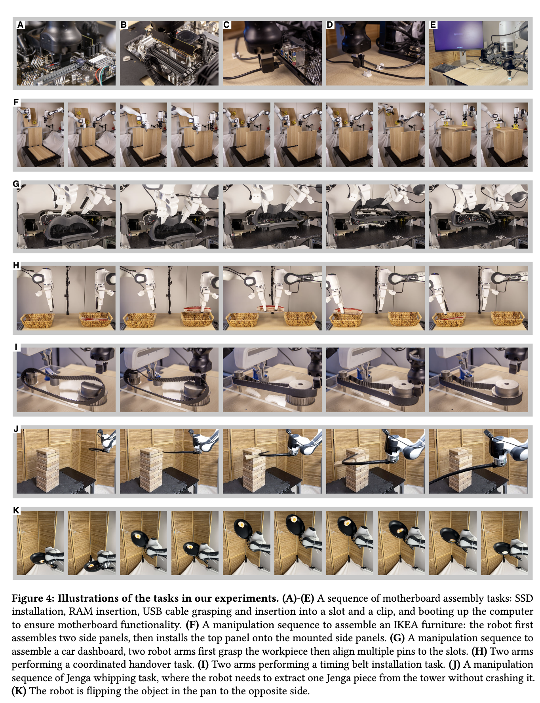

- 主板组装任务：内存插入、SSD组装、USB插入、电缆夹紧
- 宜家组装任务：侧面板组装、上面板组装
- 汽车仪表器组装、物体传递、履带组装、叠叠乐抽取、物体翻转

##### 2. findings

- HIL-SERL在几乎所有任务中，在1到2.5小时的真实世界训练中实现了100%的成功率，完成任务时间也更短。

- 从零开始的RL，没有任何演示或纠正，在所有任务上成功率为0%
- 为了验证在线人类纠正的重要性，作者将SERL的离线缓冲区中的演示数量增加了十倍，从通常的20增加到200 (HIL-SERL no itv)。然而，没有任何在线纠正，这种方法的成功率显著低于HIL-SERL，包括在复杂任务如汽车仪表板组装中的完全失败（0%成功率）。这证实了在线纠正在促进策略学习中的关键作用。这些结果证实了离线演示和策略学习指导中在策略学习中的关键作用，尤其是对于需要持续反应行为的复杂操作任务。

Todo:

1. 从hil-serl迁移到配天机器人上的总结工作
2. 中间具体的算法细节
